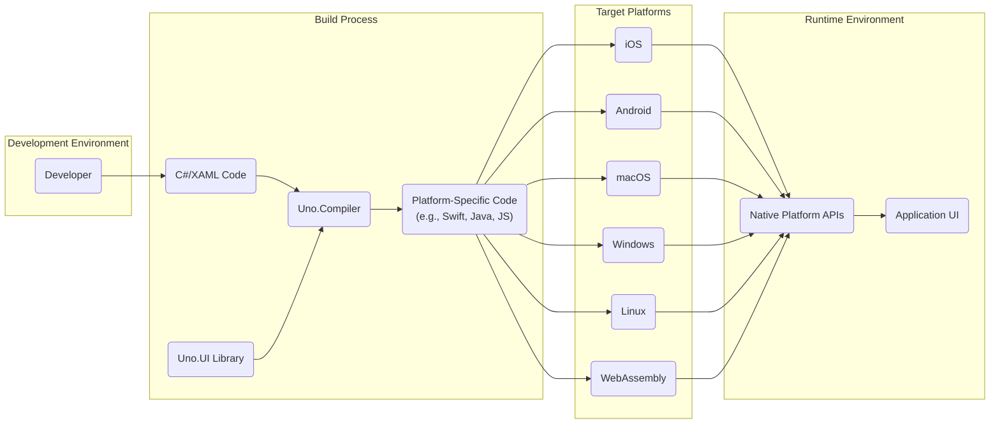
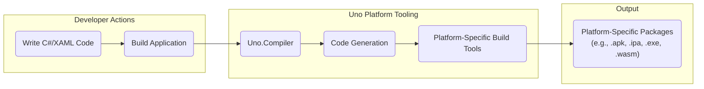
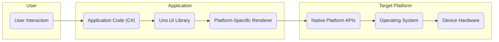

# Project Design Document: Uno Platform

**Version:** 1.1
**Date:** October 26, 2023
**Author:** AI Software Architect

## 1. Introduction

This document provides a detailed design overview of the Uno Platform project. It outlines the architecture, key components, data flows, and security considerations. This document will serve as the foundation for subsequent threat modeling activities, providing a clear understanding of the system's structure and potential attack surfaces.

## 2. Project Overview

The Uno Platform is an open-source framework enabling developers to build native mobile, desktop, and WebAssembly applications from a single codebase using C# and XAML. It promotes code reuse and accelerates cross-platform development while aiming for a consistent user experience across diverse operating systems and browsers.

## 3. Goals

* **Cross-Platform Development:** Enable developers to write application logic and UI definitions once and deploy them on various platforms (iOS, Android, macOS, Windows, Linux, WebAssembly).
* **UI Consistency:** Provide a framework for achieving a consistent UI and user experience across different target platforms, minimizing platform-specific UI adjustments.
* **Leverage .NET Skills:** Allow developers to utilize their existing .NET and C# skills for building cross-platform applications, reducing the learning curve.
* **Rich UI Framework:** Offer a comprehensive set of UI controls and APIs, mirroring the functionality of native platform UI frameworks.
* **Performance and Native Experience:**  Maintain high performance and strive for a native look-and-feel on each target platform by utilizing platform-specific rendering techniques.

## 4. Target Audience

This document is intended for:

* Security engineers responsible for conducting threat modeling and security assessments of systems built with or interacting with the Uno Platform.
* Software architects and developers involved in the design, development, and maintenance of Uno Platform applications or the platform itself.
* DevOps engineers responsible for the deployment, management, and infrastructure supporting Uno Platform applications.

## 5. Scope

This document focuses on the core architectural elements of the Uno Platform and the typical lifecycle of developing and deploying applications built using it. The scope includes the framework's internal structure, the build process, and the runtime behavior of generated applications. It primarily addresses the Uno Platform framework itself and the general characteristics of applications built with it, rather than the specifics of individual end-user applications.

## 6. High-Level Architecture

The Uno Platform's operation can be conceptually divided into these key stages:

* **Development Phase:** Developers create application logic and UI using C# and XAML within a supported development environment.
* **Compilation and Code Generation Phase:** The Uno Platform tooling processes the developer's code, leveraging the Uno.UI library and compiler to generate platform-specific code.
* **Platform-Specific Rendering Phase:**  At runtime, native platform renderers interpret the generated code and draw the user interface using the underlying platform's UI components.
* **Runtime Environment Phase:** The compiled application executes within the target platform's operating system environment, interacting with native platform APIs.

## 7. Key Components

* **Uno.UI Library:** The foundational library providing cross-platform UI controls, layout mechanisms, and APIs. It implements a subset of the Universal Windows Platform (UWP) API surface, enabling code sharing across platforms.
* **Uno.Compiler:** The core tooling responsible for compiling C# and XAML code and generating platform-specific source code or intermediate representations for each target platform. This involves tasks like XAML parsing, code generation, and resource management.
* **Platform-Specific Renderers:**  These components bridge the gap between the platform-agnostic UI definitions and the native UI elements of each target platform. Examples include:
    * **Uno.iOS:**  The renderer responsible for translating Uno UI elements into native iOS UIKit components.
    * **Uno.Droid:** The renderer responsible for translating Uno UI elements into native Android View components.
    * **Uno.macOS:** The renderer responsible for translating Uno UI elements into native macOS AppKit components.
    * **Uno.Wasm.Bootstrap:** The renderer and associated infrastructure for running Uno applications within a web browser using WebAssembly.
    * **Uno.WinUI:** The renderer leveraging the WinUI 3 framework for building native Windows applications.
    * **Uno.Skia.Gtk:** A renderer utilizing the SkiaSharp graphics library and GTK for creating applications on Linux.
* **Application Code:** The custom C# and XAML code written by developers to define the specific logic, UI, and behavior of their application. This code interacts with the Uno.UI library.
* **Native Platform SDKs:** The software development kits provided by each target platform vendor (e.g., iOS SDK from Apple, Android SDK from Google). The Uno Platform relies on these SDKs during the build process and at runtime.
* **Build Tools:**  A suite of tools used to compile, link, and package Uno Platform applications for each target platform. This includes tools like MSBuild, the .NET CLI, and platform-specific build systems (e.g., Xcodebuild for iOS, Gradle for Android).

## 8. Data Flow Diagrams

### 8.1. Development and Build Process

**Description:**

* Developers create the application's source code using C# and XAML within their development environment.
* The developer initiates the build process, typically through an IDE or command-line interface.
* The Uno.Compiler is invoked, which parses the C# and XAML code and performs necessary transformations.
* The code generation phase produces platform-specific source code or intermediate representations tailored for each target.
* Platform-specific build tools (provided by the respective platform vendors) are used to compile and package the generated code and associated resources into deployable application packages.

### 8.2. Application Runtime

**Description:**

* The user interacts with the application through the user interface.
* User interactions trigger events and logic within the application's C# code.
* The application code utilizes the Uno.UI library for managing UI elements, handling events, and accessing platform features in an abstract way.
* The platform-specific renderer interprets the UI instructions from Uno.UI and makes calls to the native platform APIs to draw and manage UI elements.
* The native platform APIs interact directly with the underlying operating system and device hardware to render the UI, handle input, and access device resources.

## 9. Security Considerations

This section outlines potential security considerations relevant to the Uno Platform and applications built with it. These points will be crucial for detailed threat modeling exercises.

* **Dependency Vulnerabilities:** Uno Platform projects rely on NuGet packages and native platform SDKs. Vulnerabilities in these external dependencies could be exploited in applications.
* **Code Generation Flaws:**  Security vulnerabilities in the Uno.Compiler or code generation logic could lead to the injection of malicious code into the generated platform-specific applications.
* **Platform Security Model Compliance:** Developers must understand and adhere to the security models of each target platform (e.g., permission handling on Android and iOS, sandboxing on WebAssembly) to avoid security misconfigurations.
* **WebAssembly Security Boundaries:** When targeting WebAssembly, developers must be aware of the security boundaries of the web browser environment and implement appropriate security measures (e.g., Content Security Policy, secure communication protocols).
* **Secure Data Storage:** Applications may need to store sensitive data locally. Developers should utilize secure storage mechanisms provided by the platform or employ encryption techniques.
* **Authentication and Authorization Weaknesses:**  Improperly implemented authentication and authorization mechanisms can expose application data and functionality to unauthorized access.
* **Input Validation Failures:**  Insufficient input validation can lead to various injection attacks (e.g., cross-site scripting in WebAssembly, SQL injection if backend services are involved).
* **Third-Party Library Risks:**  Integrating third-party libraries without careful vetting can introduce security vulnerabilities if those libraries contain flaws.
* **Insecure Update Mechanisms:**  Vulnerable update mechanisms can be exploited to distribute malicious updates to applications.
* **Reverse Engineering Potential:** Compiled applications can be reverse-engineered to some extent, potentially exposing sensitive logic or data. Code obfuscation techniques might be considered for sensitive applications.
* **Insecure Communication:**  Failure to use secure communication protocols (e.g., HTTPS) for network requests can expose data in transit.
* **JavaScript Interoperability (WebAssembly):** When interacting with JavaScript code in WebAssembly applications, developers must be cautious of potential security risks arising from the JavaScript environment.
* **Native Code Interoperability:**  Interoperability with native platform code (e.g., through platform channels) requires careful security considerations to prevent vulnerabilities in the native code from being exploited.

## 10. Technologies Used

* **Primary Programming Languages:** C#, XAML.
* **Secondary Programming Languages (Platform-Specific):** Swift (iOS), Kotlin/Java (Android), Objective-C (macOS), JavaScript/TypeScript (WebAssembly).
* **Core Frameworks/Libraries:** .NET, Uno.UI, platform-specific UI frameworks (UIKit, Android SDK, AppKit, WinUI).
* **Build Tools and Environments:** MSBuild, .NET CLI, Xcode, Gradle, Emscripten (for WebAssembly).
* **Integrated Development Environments (IDEs):** Visual Studio, Visual Studio Code.
* **Package Management:** NuGet.

## 11. Deployment Model

Uno Platform applications can be deployed through various channels depending on the target platform:

* **Mobile Platforms (iOS, Android):** Distribution via official app stores (Apple App Store, Google Play Store), enterprise app distribution platforms, or sideloading (for development and testing).
* **Desktop Platforms (macOS, Windows, Linux):** Deployment as standalone executable files, through platform-specific package managers (e.g., MSIX for Windows, DMG for macOS, DEB/RPM for Linux), or via application installers.
* **WebAssembly Platform:** Hosting on standard web servers and accessed through modern web browsers.

## 12. Future Considerations

* **Enhanced Built-in Security Features:**  Exploring the integration of more built-in security features or providing standardized libraries and guidance for common security tasks (e.g., secure storage, authentication helpers).
* **Improved Tooling for Security Analysis:**  Developing or integrating with static analysis tools and security scanners to help developers identify potential security vulnerabilities in their Uno Platform applications during the development lifecycle.
* **Comprehensive Security Best Practices Documentation:**  Providing more detailed and readily accessible documentation and guidelines on secure development practices specifically tailored for Uno Platform development.
* **Regular Security Audits:** Conducting regular security audits of the Uno Platform codebase itself to identify and address potential vulnerabilities within the framework.

This document provides a more detailed and refined overview of the Uno Platform architecture, intended to serve as a robust foundation for subsequent threat modeling activities. The expanded security considerations section highlights key areas that require careful attention during the threat modeling process.