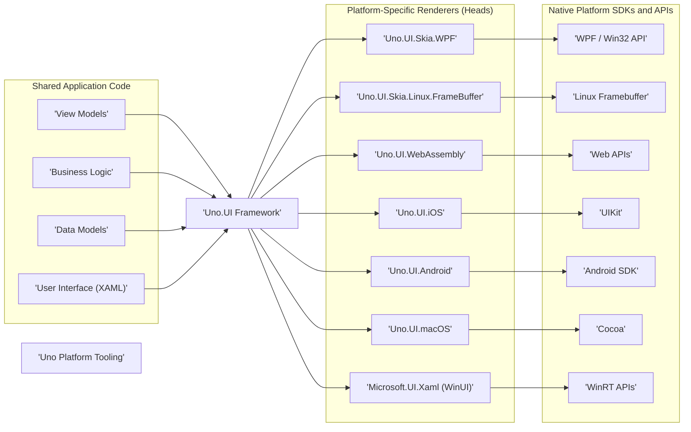

# Project Design Document: Uno Platform

**Version:** 1.1
**Date:** October 26, 2023
**Prepared By:** Gemini (AI Language Model)

## 1. Introduction

This document provides an enhanced architectural overview of the Uno Platform project, intended to serve as a solid foundation for subsequent threat modeling activities. It details the key components, their interactions, and the overall system design with a focus on aspects relevant to security analysis. This document aims for clarity and precision to facilitate effective threat identification and mitigation strategies.

## 2. Project Overview

The Uno Platform is an open-source framework enabling developers to create applications using C# and XAML that can run across a diverse range of platforms from a single codebase. This significantly reduces development time and effort for multi-platform deployments. Supported platforms include:

*   Web browsers via WebAssembly
*   Apple's iOS
*   Google's Android
*   Apple's macOS
*   Linux distributions (utilizing SkiaSharp for rendering)
*   Microsoft Windows (targeting both Universal Windows Platform (UWP) and Windows UI Library (WinUI))

The core objective of the Uno Platform is to maximize code sharing and minimize platform-specific development by providing a unified application programming interface (API) based on the familiar UWP and WinUI standards.

## 3. System Architecture

The Uno Platform's architecture is structured around distinct layers and components that work together to deliver cross-platform functionality. The primary components are:

*   **Shared Application Code (C# and XAML):** This layer contains the core application logic and the declarative UI definitions. It's written once and intended to be platform-agnostic. This includes:
    *   View Models: Responsible for managing and exposing data for the UI.
    *   Business Logic: Encapsulates the application's core functionality and rules.
    *   Data Models: Define the structure and representation of application data.
    *   User Interface (XAML): Describes the layout, structure, and appearance of the application's UI.
*   **Uno.UI Framework:** This is the central library of the Uno Platform. It provides the implementations of the UWP/WinUI APIs on platforms where these APIs are not natively present. Uno.UI acts as an abstraction layer, translating the shared code's instructions into platform-specific actions.
*   **Platform-Specific Renderers (Heads):** These are platform-specific implementations responsible for the actual rendering of the UI elements defined in XAML. Each target platform has its own renderer that utilizes the native UI framework of that platform. Examples include:
    *   `Uno.UI.Skia.WPF`:  For rendering on Windows Presentation Foundation (WPF).
    *   `Uno.UI.Skia.Linux.FrameBuffer`: For rendering directly to the Linux framebuffer.
    *   `Uno.UI.WebAssembly`: For execution within web browsers using WebAssembly.
    *   `Uno.UI.iOS`: For applications running on iOS devices.
    *   `Uno.UI.Android`: For applications running on Android devices.
    *   `Uno.UI.macOS`: For applications running on macOS.
    *   `Microsoft.UI.Xaml (WinUI):`  Used directly when targeting WinUI on Windows, leveraging the native framework.
*   **Native Platform SDKs and APIs:** These are the underlying platform-provided tools and libraries that the renderers utilize to create and manage the user interface and access system resources. Examples include:
    *   UIKit (iOS)
    *   Android SDK
    *   Web APIs (for WebAssembly)
    *   Cocoa (macOS)
    *   Win32 API (for WPF)
    *   WinRT APIs (for WinUI)
*   **Uno Platform Tooling:**  These are the development tools and extensions that streamline the process of building, debugging, and deploying Uno Platform applications. This includes:
    *   Visual Studio Extension: Provides project templates, debugging support, and XAML design tools.
    *   .NET SDK Integration: Leverages the standard .NET build system and command-line interface (CLI).
    *   Build Tasks and Targets: Automate the compilation, packaging, and deployment processes.
    *   Project Templates: Provide pre-configured project structures for different target platforms.



## 4. Data Flow within an Uno Platform Application

The flow of data within an Uno Platform application generally follows these steps:

1. **User Interaction:** The user interacts with the application's UI elements, which are rendered by the platform-specific renderer.
2. **Event Triggering:** User interactions trigger events within the native UI framework.
3. **Event Handling in Uno.UI:** These native events are intercepted and handled by the Uno.UI framework.
4. **Dispatch to Shared Code:** Uno.UI dispatches these events to the corresponding handlers within the shared application code (typically in View Models or code-behind).
5. **Business Logic Execution:** The event handlers in the shared code invoke the application's business logic to process the user interaction.
6. **Data Access and Manipulation:** Business logic may interact with data sources, such as local storage, databases, or external web services, to retrieve or modify data.
7. **Data Binding and Updates:** Changes in the data models are automatically propagated to the UI through the data binding mechanisms provided by Uno.UI.
8. **UI Rendering:** Uno.UI instructs the platform-specific renderer to update the native UI elements to reflect the changes in the data.

When interacting with external services:

1. **API Request Initiation:** Shared code initiates requests to external APIs (e.g., RESTful APIs, GraphQL endpoints).
2. **Platform Network Communication:** The underlying platform's networking capabilities are used to send the API request.
3. **External API Processing:** The external API processes the request and generates a response.
4. **Response Reception:** The platform receives the response from the external API.
5. **Response Handling in Shared Code:** The shared code parses and processes the API response.
6. **Data Model Update:** The application's data models are updated based on the information received from the external API.
7. **UI Refresh:** The UI is updated to reflect the changes in the data models.

```mermaid
graph LR
    subgraph "User Interaction Flow"
        A1["'User Interaction'"]
        B1["'Platform Renderer'"]
        C1["'Uno.UI Framework'"]
        D1["'Shared Application Code'"]
        E1["'Business Logic'"]
        F1["'Data Models'"]
        G1["'Data Source'"]

        A1 --> B1
        B1 --> C1
        C1 --> D1
        D1 --> E1
        E1 --> F1
        F1 --> G1
        G1 --> F1
        F1 --> C1
        C1 --> B1
    end

    subgraph "External API Interaction Flow"
        H1["'Shared Application Code'"]
        I1["'Platform Network Layer'"]
        J1["'External API'"]

        H1 --> I1
        I1 --> J1
        J1 --> I1
        I1 --> H1
        H1 --> F1  :::linkStyle default fill:#ccf,stroke:#333,stroke-width:2px
    end

    linkStyle default fill:#fff,stroke:#333,stroke-width:2px
```

## 5. Key Technologies Employed

The Uno Platform relies on a combination of established and emerging technologies:

*   **C#:** The primary programming language for developing application logic.
*   **XAML (Extensible Application Markup Language):** Used for declaratively defining the user interface.
*   **.NET (.NET Framework and .NET):** The underlying runtime environment for executing C# code.
*   **WebAssembly (Wasm):** Enables running .NET code within modern web browsers.
*   **SkiaSharp:** A cross-platform 2D graphics library used for rendering on platforms like Linux where native UI frameworks are less readily available or suitable.
*   **Native Platform UI Frameworks:**  UIKit (iOS), Android SDK, Cocoa (macOS), WinUI, WPF, providing the native building blocks for the user interface.
*   **NuGet:** The package manager for .NET, used to manage dependencies and libraries.
*   **MSBuild and .NET CLI:** The build tools used for compiling and packaging Uno Platform applications.

## 6. Deployment Strategies

Applications built with the Uno Platform offer flexible deployment options based on the target platform:

*   **Web Deployment:** As standard web applications hosted on web servers, leveraging WebAssembly for client-side execution.
*   **Mobile App Stores:** Packaged and distributed through the Apple App Store (iOS) and Google Play Store (Android).
*   **Desktop Application Deployment:** Installed directly on user machines for Windows, Linux, and macOS. This can involve platform-specific installers or package managers.

## 7. Security Considerations

Considering the cross-platform nature of Uno Platform applications, a range of security considerations are relevant:

*   **Cross-Site Scripting (XSS) Vulnerabilities (WebAssembly):**  Care must be taken to sanitize user-provided input to prevent the execution of malicious scripts within the browser context.
*   **Insecure Local Data Storage:**  Sensitive data stored locally on the device or in the browser should be encrypted to protect confidentiality.
*   **Insecure Network Communication:**  All communication with external services should utilize HTTPS to ensure data is encrypted in transit. Proper authentication and authorization mechanisms are crucial.
*   **Platform-Specific Security Measures:**  Developers must adhere to the security best practices and guidelines for each target platform (e.g., iOS sandboxing, Android permissions model).
*   **Dependency Vulnerabilities:** Regularly auditing and updating NuGet package dependencies is essential to mitigate risks associated with known vulnerabilities in third-party libraries.
*   **Code Injection Risks:** While less common in typical Uno Platform development, dynamic code execution should be carefully scrutinized for potential injection vulnerabilities.
*   **Reverse Engineering Concerns:**  .NET assemblies can be decompiled, potentially exposing application logic. Obfuscation techniques can be considered to make reverse engineering more difficult.
*   **Data Privacy Compliance:**  Applications must handle user data in accordance with relevant privacy regulations (e.g., GDPR, CCPA).
*   **Authentication and Authorization Implementation:** Secure and robust mechanisms for verifying user identities and controlling access to resources are critical.

## 8. Scope for Threat Modeling

The subsequent threat modeling exercise should specifically focus on:

*   **Detailed Data Flow Analysis:**  Identifying potential vulnerabilities at each stage of data processing and transmission within the application.
*   **Security of External Interactions:**  Thoroughly assessing the security of all communication channels and protocols used to interact with external services and APIs, including authentication, authorization, and data validation.
*   **Platform-Specific Security Boundaries:**  Understanding and evaluating the security mechanisms and potential weaknesses inherent to each target platform's runtime environment and APIs.
*   **Security of Shared Code Components:**  Analyzing the shared application logic for common vulnerabilities that could impact all platforms.
*   **Third-Party Dependency Risks:**  Evaluating the potential attack surface introduced by external libraries and frameworks used within the application.
*   **Security of the Deployment Pipeline and Environment:**  Considering the security implications of how the application is built, packaged, and deployed to different environments.
*   **User Input Validation and Sanitization:** Assessing how the application handles and processes user-provided data to prevent injection attacks.

## 9. Glossary of Terms

*   **Head:**  Refers to a specific platform target or "front-end" of an Uno Platform application. For example, the "iOS Head" refers to the portion of the application specifically compiled and deployed for iOS.
*   **Renderer:** The platform-specific component within Uno.UI that is responsible for translating the abstract UI definitions into the native UI elements of the target platform.
*   **Uno.UI Framework:** The core library of the Uno Platform that provides the cross-platform implementations of the UWP and WinUI APIs.
*   **XAML (Extensible Application Markup Language):** A declarative XML-based language used to define the user interface of Uno Platform applications.

This enhanced design document provides a more comprehensive and detailed understanding of the Uno Platform architecture, serving as a valuable resource for conducting thorough and effective threat modeling activities.
