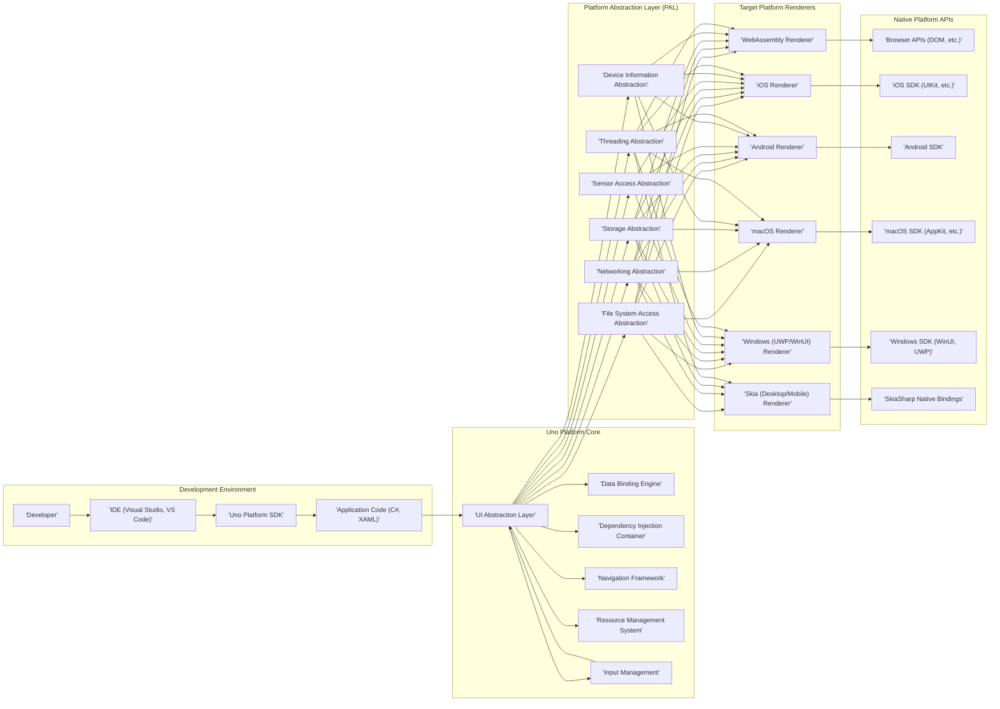

## Project Design Document: Uno Platform (Improved)

**1. Introduction**

This document provides a detailed architectural design of the Uno Platform project. It elaborates on the key components, their interactions, and the overall structure of the platform. This document serves as a comprehensive foundation for subsequent threat modeling activities, enabling a thorough understanding of potential security vulnerabilities and attack surfaces.

**2. Project Overview**

The Uno Platform is an open-source framework designed to streamline the creation of native mobile, desktop, and WebAssembly applications from a single codebase using C# and XAML. Its primary objective is to offer a consistent development experience across diverse target platforms, leveraging the capabilities of the .NET ecosystem.

**3. Goals**

* To enable efficient cross-platform user interface (UI) development utilizing C# and XAML.
* To provide a unified and consistent Application Programming Interface (API) surface across all supported target platforms.
* To facilitate maximum code sharing and reuse across different platform implementations.
* To support access to native platform features and maintain optimal performance characteristics.
* To offer a robust and extensible framework suitable for building complex and feature-rich applications.

**4. Non-Goals**

* To achieve pixel-perfect UI parity across all platforms due to inherent differences in native platform UI rendering and conventions.
* To completely abstract away the underlying native platform Software Development Kits (SDKs). Developers may still need to interact with platform-specific APIs for advanced features.
* To guarantee identical performance to native platform-specific development in all possible scenarios. Overhead from the cross-platform abstraction layer may exist.

**5. Architectural Design**

The Uno Platform architecture is structured into distinct layers and components, each with specific responsibilities:

* **Development Environment:** The environment where developers create, build, and debug Uno Platform applications.
* **Uno Platform Core:** The central part of the framework, providing core abstractions, services, and the foundation for cross-platform development.
* **Platform Abstraction Layer (PAL):** A crucial layer that provides platform-specific implementations of core functionalities, bridging the gap between the Uno Platform Core and the underlying native platforms.
* **Target Platform Renderers:** Components responsible for translating the platform-agnostic UI definitions into the native UI elements of each target platform.
* **Native Platform APIs:** The underlying platform-specific APIs and services provided by the operating systems and browsers.

**6. Architectural Diagram**

**7. Component Descriptions**

* **Developer:** The software engineer or team responsible for designing, coding, testing, and maintaining the Uno Platform application.
* **IDE (Visual Studio, VS Code):** The primary Integrated Development Environment used for writing, debugging, and building Uno Platform applications. These IDEs provide tools and extensions specific to Uno Platform development.
* **Uno Platform SDK:** The Software Development Kit containing the necessary libraries, compilers, build tools, and templates required for developing Uno Platform applications.
* **Application Code (C#, XAML):** The source code written by the developer, defining the application's business logic (in C#) and user interface structure and presentation (in XAML).
* **UI Abstraction Layer:** This core component provides a set of platform-agnostic UI controls and APIs. Developers interact with these abstractions, and the Uno Platform handles the translation to native UI elements.
* **Data Binding Engine:** A crucial component that facilitates the synchronization of data between the application's data models (business logic) and the user interface elements. It enables reactive UI updates based on data changes.
* **Dependency Injection Container:** Manages the dependencies between different components within the application, promoting loose coupling and testability.
* **Navigation Framework:** Handles the navigation flow between different views or pages within the application, providing mechanisms for managing the application's user interface flow.
* **Resource Management System:** Manages application resources such as images, strings, localization files, and styles, ensuring they are accessible and properly utilized across platforms.
* **Input Management:** Handles user input events (e.g., mouse clicks, touch events, keyboard input) and routes them to the appropriate UI elements, abstracting away platform-specific input mechanisms.
* **File System Access Abstraction:** Provides a consistent way to interact with the file system on different platforms, abstracting away platform-specific file access APIs.
* **Networking Abstraction:** Offers a unified interface for performing network operations (e.g., HTTP requests, web socket communication) across different platforms.
* **Storage Abstraction:** Provides mechanisms for storing and retrieving application data locally, abstracting away platform-specific storage solutions (e.g., local storage, shared preferences).
* **Sensor Access Abstraction:** Enables access to device sensors (e.g., GPS, accelerometer, gyroscope) in a platform-agnostic manner.
* **Device Information Abstraction:** Provides access to information about the device the application is running on (e.g., operating system version, device model).
* **Threading Abstraction:** Offers a way to manage and utilize threads in a cross-platform manner, handling differences in platform-specific threading models.
* **WebAssembly Renderer:** Responsible for rendering the application's UI within a web browser using WebAssembly technology. It translates the UI definitions into DOM elements and utilizes browser APIs.
* **iOS Renderer:** Responsible for rendering the UI on iOS devices by utilizing native iOS UI elements provided by the UIKit framework.
* **Android Renderer:** Responsible for rendering the UI on Android devices using native Android UI elements provided by the Android SDK.
* **macOS Renderer:** Responsible for rendering the UI on macOS devices using native macOS UI elements provided by the AppKit framework.
* **Windows (UWP/WinUI) Renderer:** Responsible for rendering the UI on Windows using either the Universal Windows Platform (UWP) or the more modern Windows UI Library (WinUI).
* **Skia (Desktop/Mobile) Renderer:** Utilizes the Skia graphics library to render the UI. This provides a consistent rendering experience across platforms where native renderers might have limitations or inconsistencies.
* **Browser APIs (DOM, etc.):** The set of APIs provided by web browsers for interacting with the browser environment, including the Document Object Model (DOM).
* **iOS SDK (UIKit, etc.):** The Software Development Kit provided by Apple for developing iOS applications, including frameworks like UIKit for building user interfaces.
* **Android SDK:** The Software Development Kit provided by Google for developing Android applications.
* **macOS SDK (AppKit, etc.):** The Software Development Kit provided by Apple for developing macOS applications, including frameworks like AppKit for building user interfaces.
* **Windows SDK (WinUI, UWP):** The Software Development Kit provided by Microsoft for developing Windows applications, encompassing both UWP and WinUI.
* **SkiaSharp Native Bindings:** The .NET bindings that allow the Uno Platform to interact with the native Skia graphics library.

**8. Data Flow**

The typical data flow within an Uno Platform application involves the following stages:

* **Development Phase:** Developers write application logic and UI definitions using C# and XAML within the chosen IDE.
* **Compilation and Build Process:** The Uno Platform SDK compiles the C# and XAML code. This process involves:
    * Compiling C# code into .NET assemblies.
    * Processing XAML to generate platform-specific UI representations or intermediate code.
    * Linking necessary Uno Platform libraries and dependencies.
    * Packaging the application for each target platform.
* **UI Rendering at Runtime:** When the application runs on a specific platform:
    * The Uno Platform Core initializes and loads the application.
    * The appropriate Target Platform Renderer is selected based on the current operating system or environment.
    * The Renderer interprets the UI definitions and utilizes the Platform Abstraction Layer to interact with native platform UI elements or the Skia library for rendering.
* **Data Binding and UI Updates:**
    * Changes in the application's data models trigger updates in the UI through the Data Binding Engine.
    * User interactions within the UI (e.g., button clicks, text input) update the underlying data models.
* **Interaction with Native APIs:**
    * When the application needs to access platform-specific features (e.g., camera, location services), it utilizes the Platform Abstraction Layer.
    * The PAL provides a platform-agnostic interface, and its implementations call the corresponding Native Platform APIs.

**9. Security Considerations (Detailed for Threat Modeling)**

This section outlines potential security considerations, categorized for clarity during threat modeling:

* **Cross-Platform Vulnerabilities:**
    * **PAL Implementation Flaws:** Vulnerabilities in the Platform Abstraction Layer implementations that could be exploited on specific platforms.
    * **Inconsistent Security Practices:** Differences in security handling across various platform renderers.
    * **Shared Code Vulnerabilities:** Bugs in the shared C# codebase that could affect all platforms.
* **Data Storage Security:**
    * **Insecure Local Storage:** Sensitive data stored without proper encryption on the device's file system or in platform-specific storage mechanisms.
    * **Insufficient Data Protection:** Lack of data protection mechanisms when the application is backgrounded or the device is locked.
    * **Exposure through Backup:** Sensitive data included in device backups without proper encryption.
* **Network Communication Security:**
    * **Man-in-the-Middle Attacks:** Lack of HTTPS or improper certificate validation when communicating with remote servers.
    * **Insecure API Key Handling:** Hardcoding or insecure storage of API keys or authentication tokens.
    * **Data Exfiltration:** Vulnerabilities allowing unauthorized access to network communication and sensitive data transmission.
* **Input Validation:**
    * **Injection Attacks (SQL, XSS, etc.):** Failure to properly sanitize user input, leading to potential injection vulnerabilities.
    * **Buffer Overflows:** Improper handling of input data leading to memory corruption.
    * **Format String Bugs:** Vulnerabilities arising from using user-controlled strings in formatting functions.
* **Dependency Management:**
    * **Vulnerable Third-Party Libraries:** Using outdated or vulnerable third-party libraries with known security flaws.
    * **Supply Chain Attacks:** Compromised dependencies introducing malicious code into the application.
* **Platform-Specific Security Features:**
    * **Permission Misconfigurations:** Incorrectly configured or overly broad permissions requested on mobile platforms.
    * **Insecure Inter-Process Communication (IPC):** Vulnerabilities in how the application communicates with other processes on the device.
    * **Bypassing Security Sandboxes:** Potential for escaping the application's security sandbox on certain platforms.
* **WebAssembly Security:**
    * **JavaScript Interoperability Risks:** Security vulnerabilities arising from the interaction between WebAssembly code and JavaScript.
    * **Cross-Site Scripting (XSS) in Web Context:** Potential for XSS vulnerabilities if the application renders untrusted content.
    * **Browser Security Policy Violations:** Issues related to Content Security Policy (CSP) and other browser security mechanisms.
* **Build and Deployment Pipeline Security:**
    * **Compromised Build Environment:** Malicious code injected during the build process.
    * **Insecure Distribution Channels:** Distributing the application through unofficial or compromised channels.
    * **Lack of Code Signing:** Failure to properly sign the application, making it susceptible to tampering.

**10. Deployment**

The deployment process for Uno Platform applications varies depending on the target platform:

* **WebAssembly:** The application is typically deployed as a set of static files (HTML, CSS, JavaScript, WebAssembly binaries) to a standard web server or a Content Delivery Network (CDN).
* **iOS:** Deployment involves packaging the application as an IPA file and distributing it through the Apple App Store after a review process, or through enterprise distribution mechanisms. Code signing with an Apple Developer certificate is mandatory.
* **Android:** The application is packaged as an APK or AAB file and distributed through the Google Play Store or third-party app stores. Sideloading is also possible, but requires user configuration. Code signing with a valid key is required.
* **macOS:** Deployment typically involves packaging the application as a `.app` bundle. Distribution can be through the Mac App Store (requiring notarization by Apple) or direct distribution (which may require users to adjust security settings).
* **Windows:** Applications can be deployed as MSIX packages (the recommended modern approach) or as traditional executable installers. Distribution can be through the Microsoft Store or direct download. Code signing is highly recommended.

**11. Technologies Used**

* **Primary Programming Languages:** C#, XAML
* **Core Framework:** .NET (including .NET Standard for cross-platform compatibility)
* **UI Frameworks:** WinUI, UIKit, Android SDK, AppKit, HTML/CSS/JavaScript (depending on the target platform's renderer)
* **Graphics Library (Optional but often used):** SkiaSharp
* **Build Tools:** MSBuild, .NET CLI
* **Integrated Development Environments (IDEs):** Visual Studio, Visual Studio Code (with relevant extensions)

**12. Future Considerations**

* **Expanding Platform Support:** Adding support for new and emerging platforms.
* **Performance Optimization:** Continuously improving the performance and efficiency of Uno Platform applications across all target platforms.
* **Enhanced UI Controls and Features:** Expanding the set of available UI controls and features to provide richer development capabilities.
* **Improved Developer Tooling:** Enhancing the developer experience through better tooling, debugging capabilities, and hot reload functionality.
* **Strengthening Security Features:** Implementing new security features and addressing emerging threats proactively.
* **Accessibility Improvements:** Enhancing accessibility features to ensure applications are usable by individuals with disabilities.

This improved document provides a more detailed and structured overview of the Uno Platform architecture, offering a stronger foundation for identifying and mitigating potential security risks during the threat modeling process. The enhanced component descriptions, elaborated data flow, and categorized security considerations aim to facilitate a more comprehensive and effective threat analysis.