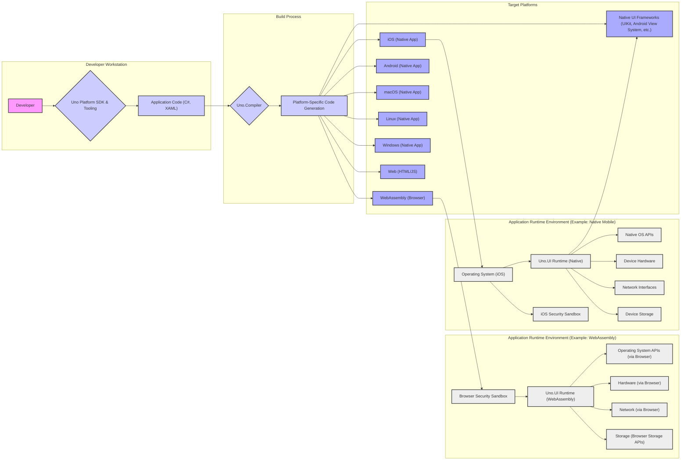
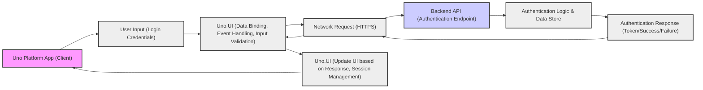

## Project Design Document: Uno Platform Application Framework (Improved)

### 1. Project Overview

**1.1. Project Name:** Uno Platform

**1.2. Project Description:**

The Uno Platform is an open-source framework designed to streamline cross-platform application development. It empowers developers to create applications with a single codebase in C# and XAML, targeting a wide range of platforms including Windows, macOS, Linux, iOS, Android, WebAssembly (browsers), and Web (HTML/JS). By leveraging the .NET ecosystem and modern web technologies, Uno Platform aims to provide a consistent development experience and maximize code reuse across diverse environments. This design document focuses on the architectural blueprint of the Uno Platform framework itself and the typical structure of applications built using it. The primary purpose of this document is to serve as a foundation for threat modeling activities, specifically examining the core components of the framework and the common architectural patterns of Uno Platform applications.

**1.3. Project Goals:**

*   **Cross-Platform Development Efficiency:** Enable developers to write applications once and deploy them across multiple platforms, reducing development time and costs.
*   **UI and API Consistency:** Provide a unified user interface and application programming interface (API) across all supported platforms, ensuring a consistent user experience and simplifying development.
*   **.NET Ecosystem Leverage:**  Utilize existing .NET developer skills, libraries, and tools to facilitate cross-platform development and accelerate adoption.
*   **Performance and Robustness:** Offer a high-performance and reliable framework suitable for building complex and demanding applications.
*   **Open Source and Community Driven:** Foster an open and collaborative development environment through an open-source model, encouraging community contributions and ensuring long-term sustainability.

**1.4. Target Audience:**

*   **Software Developers:** Developers seeking efficient cross-platform application development solutions.
*   **Organizations:** Businesses aiming to minimize development expenses and accelerate time-to-market for applications targeting multiple platforms.
*   **.NET Developers:** Developers looking to expand their skillset into mobile and web development using their existing .NET knowledge.
*   **Cybersecurity Professionals:** Security architects, penetration testers, and security analysts responsible for threat modeling and security assessments of Uno Platform applications and the framework itself.

### 2. Architecture Overview

**2.1. High-Level Architecture Diagram:**

**2.2. Detailed Architecture Description:**

The Uno Platform architecture is structured around distinct phases and components, facilitating the development and deployment of cross-platform applications:

1.  **Development Phase:**
    *   **Developer Workstation:** Developers utilize their workstations equipped with the Uno Platform SDK. This SDK provides the necessary tools, including project templates, build utilities, and libraries, for creating Uno Platform applications.
    *   **Uno Platform SDK & Tooling:** This encompasses a suite of tools and resources, such as Uno Platform NuGet packages, project templates for popular Integrated Development Environments (IDEs) like Visual Studio, and command-line interface (CLI) tools for project management and building.
    *   **Application Code (C#, XAML):** Developers write the core application logic using C# and define the user interface using XAML (Extensible Application Markup Language). The goal is to write platform-agnostic code to maximize code reuse across all target platforms.

2.  **Build Process:**
    *   **Uno.Compiler:** This is a central component of the Uno Platform build process. It acts as a translator, taking the platform-agnostic C# and XAML application code and transforming it into platform-specific code. This process involves:
        *   **XAML Parsing and Processing:** The XAML markup is parsed and converted into platform-specific UI representations. This might involve generating native UI element definitions or instructions for rendering UI using platform graphics APIs.
        *   **C# Compilation:** The C# code is compiled using the standard .NET compiler, producing intermediate language (IL) code.
        *   **Platform-Specific Code Generation:** The compiler generates the final platform-specific output, tailored for each target environment:
            *   **WebAssembly (for browsers):** C# IL code is compiled to WebAssembly bytecode, and XAML is translated into HTML, CSS, and JavaScript, or instructions for rendering using WebGL.
            *   **Native Code (for iOS, Android, macOS, Linux, Windows):** C# code is compiled to native machine code (e.g., ARM64, x64) using platform-specific .NET runtimes. XAML is translated into native UI elements or rendering instructions for platform-specific graphics APIs (like UIKit on iOS, or Android View System).
    *   **Platform-Specific Project Generation:** The Uno.Compiler outputs platform-specific project files and build artifacts. These are ready to be further built and deployed using the native toolchains of each target platform (e.g., Xcode for iOS, Android Studio for Android).

3.  **Runtime Environment:**
    *   **Uno.UI Runtime:** This is the core runtime library that powers Uno Platform applications on each target platform. It is responsible for:
        *   **UI Rendering:**  Rendering the user interface based on the platform-specific representation generated from XAML. This involves drawing UI elements, managing layouts, and handling visual updates.
        *   **API Abstraction:** Providing a consistent API surface for application code to interact with platform-specific features. This abstraction layer hides the complexities and differences of underlying platform APIs, allowing developers to write code that works across platforms without significant modifications.
        *   **Event Handling:** Managing user interactions (like clicks, taps, keyboard input) and events within the application. It routes events to the appropriate application code for processing.
        *   **Data Binding:** Implementing data binding mechanisms, allowing UI elements to be dynamically linked to application data. Changes in data automatically update the UI, and vice versa.
    *   **Native UI Frameworks (UIKit, Android View System, etc.):** On native platforms, Uno.UI often leverages the underlying native UI frameworks provided by the operating system (e.g., UIKit on iOS, Android View System on Android, AppKit on macOS, WPF/UWP on Windows). This allows for a more native look and feel and better performance by utilizing platform-optimized UI components.
    *   **Operating System APIs:** The Uno.UI Runtime interacts with the underlying operating system APIs of each platform to access device functionalities, manage system resources, and handle platform-specific operations.
    *   **Hardware:** Applications ultimately execute on the hardware of the target device, utilizing hardware resources (CPU, memory, GPU, sensors) through the OS and runtime.
    *   **Network:** Applications can access network resources through platform-specific network APIs, typically accessed via .NET networking libraries and abstracted by Uno.UI.
    *   **Storage:** Applications can utilize various storage mechanisms provided by the platform, including local storage, file system access (subject to platform-specific permissions), and cloud storage services.
    *   **Security Sandbox:** On platforms like web browsers and mobile operating systems, applications operate within a security sandbox. This sandbox restricts access to system resources and enforces security policies to protect the user and the device. Uno Platform applications are subject to these platform-specific security sandboxes, which limit potential damage from vulnerabilities.

### 3. Key Components

**3.1. Uno.UI:**

*   **Description:** The foundational UI framework library of Uno Platform. It provides implementations for UI controls (buttons, text boxes, lists, etc.), layout systems (grids, stacks), data binding infrastructure, styling, and other UI-related functionalities. It is designed to be platform-agnostic, offering a consistent API for UI development across all supported platforms.
*   **Security Relevance:**
    *   **User Input Handling:** Uno.UI is responsible for processing user input. Vulnerabilities in input handling could lead to injection attacks (if input is not properly sanitized before being used in code or displayed in the UI).
    *   **UI Rendering Logic:** Bugs in UI rendering logic could potentially lead to denial-of-service (DoS) conditions or unexpected behavior that could be exploited.
    *   **Platform API Interactions:** Uno.UI interacts with platform-specific APIs. Improper or insecure use of these APIs could introduce vulnerabilities, such as privilege escalation or data leaks.
    *   **Data Binding Security:** If data binding is not implemented securely, it could potentially expose sensitive data or allow unintended data manipulation.

**3.2. Uno.Compiler (and Tooling):**

*   **Description:** The compiler and associated tooling are responsible for the crucial transformation of C# and XAML source code into platform-specific application packages. This includes code generation, XAML processing, asset management, and packaging for each target platform.
*   **Security Relevance:**
    *   **Code Generation Integrity:**  A compromised compiler could be manipulated to inject malicious code into the generated applications during the compilation process, potentially leading to widespread distribution of malware.
    *   **Build Process Security:** Vulnerabilities in the build process or tooling could be exploited to tamper with the application build artifacts, leading to compromised applications.
    *   **Dependency Management Security:** The compiler and tooling rely on external dependencies (NuGet packages, platform SDKs). Vulnerabilities in these dependencies could be inherited by the compiled applications. Secure dependency management and regular updates are crucial.
    *   **Denial of Service (Build Process):**  Compiler vulnerabilities could be exploited to cause denial of service during the build process, disrupting development workflows.

**3.3. Runtime Environments (WebAssembly, Native Mobile, Desktop, Web):**

*   **Description:** These are the diverse environments where Uno Platform applications are executed. They include:
    *   **WebAssembly (Browsers):** Applications run within modern web browsers using WebAssembly, leveraging browser APIs for functionalities.
    *   **Native Mobile (iOS, Android):** Applications run as native mobile applications on iOS and Android, utilizing platform-specific SDKs and APIs through Uno.UI.
    *   **Native Desktop (macOS, Linux, Windows):** Applications run as native desktop applications on macOS, Linux, and Windows, utilizing platform-specific desktop frameworks and OS APIs.
    *   **Web (HTML/JS):** Applications can also be deployed as traditional web applications using HTML, JavaScript, and CSS, with Uno.UI providing the UI rendering and application logic.
*   **Security Relevance:**
    *   **WebAssembly (Browser):**
        *   **Browser Security Sandbox:** Applications are confined by the browser's security sandbox, limiting access to system resources. However, vulnerabilities within the sandbox or in browser APIs could still be exploited.
        *   **Cross-Site Scripting (XSS):** If UI rendering or JavaScript interop is not handled carefully, XSS vulnerabilities could arise, especially when displaying dynamic content or interacting with external web resources.
    *   **Native Mobile/Desktop:**
        *   **OS-Level Vulnerabilities:** Applications are susceptible to vulnerabilities in the underlying operating system.
        *   **Permission Model:**  Properly managing platform permissions (e.g., camera access, location access) is crucial to prevent unauthorized access to sensitive device features.
        *   **Privilege Escalation:** Vulnerabilities in Uno.UI's interaction with native APIs or in the generated native code could potentially lead to privilege escalation, allowing an attacker to gain elevated access.
        *   **Native API Misuse:** Improper handling of native API calls from Uno.UI could introduce vulnerabilities like buffer overflows, memory corruption, or insecure data handling.

**3.4. Application Code (Developed using Uno Platform):**

*   **Description:** This is the custom code written by developers using the Uno Platform framework. It encompasses C# business logic, XAML UI definitions, and potentially platform-specific code (though minimized by Uno Platform's design) for accessing native features when absolutely necessary.
*   **Security Relevance:**
    *   **Common Application Vulnerabilities:**  Applications are vulnerable to standard application-level security flaws, regardless of the framework used. These include:
        *   **Input Validation Issues:** Leading to injection attacks (SQL injection, command injection, XSS if backend is involved in rendering web content).
        *   **Authentication and Authorization Flaws:** Weak or missing authentication and authorization mechanisms allowing unauthorized access to application features and data.
        *   **Data Storage and Handling Issues:** Insecure storage of sensitive data (passwords, API keys, personal information), improper encryption, or data leaks through logging or insecure communication.
        *   **Business Logic Vulnerabilities:** Flaws in the application's business logic that can be exploited to manipulate application behavior or access data improperly.
        *   **Dependency Vulnerabilities:** Using vulnerable third-party libraries or NuGet packages in the application code.

**3.5. Backend Services (Optional, but often used):**

*   **Description:** Uno Platform applications frequently interact with backend services to handle data persistence, complex business logic, user authentication, and other functionalities. These backend services can be implemented using various technologies (e.g., REST APIs, GraphQL, gRPC, serverless functions) and hosted on cloud platforms or on-premises infrastructure.
*   **Security Relevance:**
    *   **API Security:**
        *   **Authentication and Authorization:** Securely authenticate and authorize requests to backend APIs to prevent unauthorized access.
        *   **Input Validation:** Thoroughly validate all data received from Uno Platform applications to prevent injection attacks and data corruption.
        *   **Rate Limiting and DoS Protection:** Implement rate limiting and other measures to protect against denial-of-service attacks targeting backend APIs.
        *   **API Security Best Practices:** Adhere to API security best practices (e.g., OWASP API Security Top 10) to mitigate common API vulnerabilities.
    *   **Server-Side Vulnerabilities:**
        *   **Infrastructure Security:** Secure the backend server infrastructure, including operating systems, web servers, databases, and networks.
        *   **Application Code Security:** Secure the backend application code against vulnerabilities like injection flaws, authentication bypasses, and business logic errors.
    *   **Data Security:**
        *   **Data Encryption:** Encrypt sensitive data at rest and in transit within the backend.
        *   **Access Control:** Implement strict access control policies to limit access to backend data and resources to authorized users and services.
    *   **Communication Security:**
        *   **HTTPS Enforcement:** Ensure all communication between Uno Platform applications and backend services occurs over HTTPS to protect data confidentiality and integrity during transmission.

### 4. Data Flow

**4.1. Data Flow Diagram (Simplified Example - User Login):**

**4.2. Description of Data Flow (User Login Example):**

1.  **User Input (Login Credentials):** The user provides their login credentials (username and password) through the Uno Platform application's user interface.
2.  **Uno.UI (Data Binding, Event Handling, Input Validation):**
    *   Uno.UI manages data binding to capture user input from UI elements.
    *   Event handling triggers the login process when the user submits the credentials.
    *   **Client-Side Input Validation:** Basic input validation (e.g., format checks, required fields) may be performed in Uno.UI to improve user experience and prevent obvious errors before sending data to the backend. *However, client-side validation should not be relied upon as the primary security measure.*
3.  **Network Request (HTTPS):** The application, using .NET networking libraries (available through Uno.UI), initiates an HTTPS request to the backend API's dedicated authentication endpoint. The user's credentials are securely transmitted within the HTTPS request (typically in the request body using a secure format like JSON, not in the URL).
4.  **Backend API (Authentication Endpoint):** The backend API receives the authentication request over HTTPS.
5.  **Authentication Logic & Data Store:** The backend API executes authentication logic, which typically involves:
    *   Retrieving stored user credentials from a secure data store (database, directory service, etc.).
    *   Verifying the provided credentials against the stored credentials. This usually involves comparing password hashes (never storing or transmitting passwords in plain text).
6.  **Authentication Response (Token/Success/Failure):** The backend API generates an authentication response:
    *   **Success:** Upon successful authentication, the response typically includes an authentication token (e.g., JWT - JSON Web Token) that the client application will use for subsequent authorized API requests.
    *   **Failure:** If authentication fails (invalid credentials), the response indicates the failure, often with an error message.
7.  **Response Transmission (HTTPS):** The backend API securely transmits the authentication response back to the Uno Platform application over HTTPS.
8.  **Uno.UI (Update UI based on Response, Session Management):**
    *   Uno.UI receives the authentication response and updates the application's UI accordingly.
    *   **Successful Authentication:** The application navigates to the main application screens, stores the received authentication token securely (e.g., in secure storage provided by the platform), and potentially establishes a user session.
    *   **Authentication Failure:** The application displays an appropriate error message to the user, prompting them to retry or take other actions.

**General Data Flow Considerations:**

*   **Data Origin Points:** Data originates from various sources: user input, device sensors, local storage, network sources (backend APIs, external services), and platform APIs.
*   **Data Processing Locations:** Data is processed within the Uno Platform application (client-side) using C# code and Uno.UI components, and potentially also in backend services (server-side). Processing includes data validation, transformation, business logic execution, and UI rendering.
*   **Data Storage Locations:** Data can be stored locally on the device (using platform-specific storage mechanisms like local storage, application data folders, databases) or remotely in backend databases, cloud storage, or external services.
*   **Data Transmission Methods:** Data is transmitted over the network primarily when interacting with backend services or external APIs. Secure communication protocols (HTTPS) are essential for sensitive data. Platform-specific communication mechanisms may also be used for local inter-process communication or interaction with device hardware.
*   **Sensitive Data Identification:**  Carefully identify sensitive data (e.g., user credentials, personal identifiable information (PII), financial data, health information, API keys, secrets). Implement robust security measures to protect sensitive data throughout its lifecycle, including encryption in transit and at rest, strict access control, data masking/redaction where appropriate, and secure disposal.

### 5. Technology Stack

*   **Programming Languages:** C#, XAML, (JavaScript/HTML/CSS for Web target - primarily generated, but developers might interact with it for advanced web scenarios)
*   **Frameworks/Libraries:** .NET (.NET Standard/.NET), Uno.UI, WebAssembly, Native Platform SDKs (iOS SDK, Android SDK, macOS SDK, etc.), .NET Networking Libraries (e.g., `HttpClient`), potentially numerous third-party NuGet packages for various functionalities.
*   **Platforms:**
    *   **Target Platforms:** Windows, macOS, Linux, iOS, Android, WebAssembly (Browsers: Chrome, Firefox, Safari, Edge, etc.), Web (HTML/JS).
    *   **Development Platforms:** Windows (primary development platform), macOS, Linux (with .NET SDK and compatible IDEs).
    *   **Build Tools:** .NET SDK, Platform-specific build tools (e.g., Xcode for iOS, Android SDK and Gradle for Android, platform-specific compilers and linkers for native targets).
*   **Communication Protocols:** HTTPS (strongly recommended and often mandatory for network communication, especially with backend services), platform-specific communication mechanisms (e.g., platform-specific sockets, inter-process communication).
*   **Data Storage Technologies:** Platform-specific storage APIs (local storage, application settings, file system access with permissions), backend databases (SQL databases like PostgreSQL, MySQL, SQL Server; NoSQL databases like MongoDB, Cosmos DB), cloud storage services (e.g., Azure Blob Storage, AWS S3, Google Cloud Storage).

### 6. Security Considerations (Detailed)

This section expands on the initial security considerations, providing more specific examples and categorizing concerns for clarity.

**6.1. Client-Side Security:**

*   **Input Validation & Sanitization (Confidentiality, Integrity, Availability):**
    *   **Threat:** Injection attacks (XSS, Command Injection if interacting with local processes), data corruption, application crashes due to malformed input.
    *   **Mitigation:** Implement comprehensive input validation on the client-side. Validate data from user input fields, URL parameters, query strings, and data received from backend APIs. Sanitize input before displaying it in the UI to prevent XSS. Use parameterized queries or ORMs to prevent SQL injection if client-side database interactions are present (less common in typical Uno apps, but possible).
*   **Data Storage Security (Confidentiality, Integrity):**
    *   **Threat:** Unauthorized access to sensitive data stored locally on the device, data breaches if device is compromised.
    *   **Mitigation:** Securely store sensitive data using platform-provided secure storage mechanisms (e.g., Keychain/Credential Manager on iOS/macOS, Keystore on Android, Data Protection API on Windows). Encrypt sensitive data at rest if platform storage doesn't provide encryption by default. Avoid storing highly sensitive data locally if possible; consider backend storage instead.
*   **UI Security (XSS Prevention) (Confidentiality, Integrity):**
    *   **Threat:** Cross-site scripting (XSS) vulnerabilities, especially in WebAssembly and Web targets, leading to malicious scripts executing in the user's browser context, potentially stealing cookies, session tokens, or redirecting users to malicious sites.
    *   **Mitigation:**  Properly encode and sanitize user-generated content before displaying it in the UI. Use Content Security Policy (CSP) headers in web targets to mitigate XSS risks. Be cautious when integrating with external web components or iframes.
*   **Dependency Management (Confidentiality, Integrity, Availability):**
    *   **Threat:** Vulnerabilities in third-party NuGet packages or libraries used by the application, potentially leading to various security issues, including code execution, data breaches, and DoS.
    *   **Mitigation:** Regularly update NuGet packages and third-party libraries to the latest versions to patch known vulnerabilities. Use dependency scanning tools (e.g., OWASP Dependency-Check, Snyk) to identify and monitor vulnerabilities in project dependencies. Implement a secure software supply chain process.
*   **Secure Communication (Confidentiality, Integrity):**
    *   **Threat:** Man-in-the-middle (MITM) attacks, eavesdropping, data tampering during network communication with backend services or external APIs if communication is not encrypted.
    *   **Mitigation:** Enforce HTTPS for all network communication. Implement certificate pinning for critical backend APIs to prevent MITM attacks by rogue certificates.
*   **Platform Security Features (Confidentiality, Integrity, Availability):**
    *   **Threat:** Failure to leverage platform security features, leading to weaker security posture.
    *   **Mitigation:** Utilize platform-specific security features like secure enclaves (if available), keychain/credential managers, permission models, and OS-level security controls to enhance application security.
*   **Code Obfuscation/Protection (Native Targets) (Confidentiality, Integrity):**
    *   **Threat:** Reverse engineering of native application code to extract sensitive information, understand business logic, or find vulnerabilities.
    *   **Mitigation:** For native mobile and desktop targets, consider code obfuscation and other code protection techniques to make reverse engineering more difficult. *Note: Obfuscation is not a foolproof security measure but can raise the bar for attackers.*

**6.2. Backend Security (if applicable):** (Refer to section 3.5 for detailed backend security considerations)

**6.3. Cross-Platform Specific Security Considerations:**

*   **Platform API Differences (Confidentiality, Integrity, Availability):**
    *   **Threat:** Security vulnerabilities arising from inconsistent behavior or security implementations across different platform APIs used by Uno.UI.
    *   **Mitigation:** Thoroughly test security features and functionalities on each target platform. Be aware of platform-specific security nuances and limitations. Implement platform-specific security adaptations where necessary.
*   **Code Reusability vs. Platform-Specific Security (Confidentiality, Integrity, Availability):**
    *   **Threat:** Over-reliance on code reuse without considering platform-specific security requirements, leading to security gaps on certain platforms.
    *   **Mitigation:** While maximizing code reuse, ensure that security implementations are tailored to the specific security requirements and capabilities of each target platform. Avoid assuming that a security measure effective on one platform will be equally effective on another. Use conditional compilation or platform-specific code when necessary for security-critical functionalities.
*   **WebAssembly Security Model (Confidentiality, Integrity, Availability):**
    *   **Threat:** Misunderstanding or misconfiguration of the browser security sandbox for WebAssembly applications, leading to vulnerabilities or unintended access to browser resources.
    *   **Mitigation:** Thoroughly understand the browser security sandbox model for WebAssembly. Be aware of limitations and capabilities related to JavaScript interop, browser API usage, and resource access. Adhere to web security best practices when developing WebAssembly-based Uno Platform applications.

### 7. Use for Threat Modeling

This design document is specifically created to facilitate threat modeling for Uno Platform applications and the framework itself. It provides a structured overview of the architecture, key components, data flow, and security considerations.

**How to use this document for threat modeling:**

1.  **Asset Identification:** Utilize Section 3 (Key Components) and Section 4 (Data Flow) to identify critical assets within the Uno Platform application and its environment. Assets include:
    *   User data (credentials, PII, application data)
    *   Application code (C#, XAML, platform-specific code)
    *   Uno.UI Runtime
    *   Uno.Compiler and tooling
    *   Backend APIs and services (if applicable)
    *   Device hardware and OS resources
    *   Communication channels (network connections)

2.  **Threat Identification:** For each asset and data flow path identified, brainstorm potential threats using methodologies like STRIDE or attack trees. Consider threat categories outlined in Section 6 (Security Considerations) and common attack vectors for each component and platform. Example threat questions:
    *   *Spoofing:* Can an attacker impersonate a legitimate user or component? (e.g., session hijacking, fake backend API)
    *   *Tampering:* Can an attacker modify data or code? (e.g., data manipulation in transit, code injection, UI tampering)
    *   *Repudiation:* Can a user deny performing an action? (e.g., lack of audit logging)
    *   *Information Disclosure:* Can an attacker gain unauthorized access to sensitive information? (e.g., data leaks, insecure storage, XSS)
    *   *Denial of Service:* Can an attacker disrupt application availability? (e.g., DoS attacks on backend, resource exhaustion on client, compiler DoS)
    *   *Elevation of Privilege:* Can an attacker gain higher privileges than intended? (e.g., exploiting OS vulnerabilities, insecure API interactions)

3.  **Vulnerability Analysis:** Analyze potential vulnerabilities that could enable the identified threats. Consider:
    *   Known vulnerabilities in Uno.UI, .NET runtime, platform SDKs, and dependencies.
    *   Potential weaknesses in application code (input validation flaws, authentication weaknesses, etc.).
    *   Misconfigurations in the application or backend infrastructure.
    *   Platform-specific security weaknesses.

4.  **Risk Assessment:** Evaluate the risk associated with each threat and vulnerability by considering:
    *   *Likelihood:* How likely is the threat to be exploited? (Consider attacker motivation, skill level, and attack surface)
    *   *Impact:* What would be the business impact if the threat is realized? (Consider confidentiality, integrity, availability, financial impact, reputational damage, compliance violations)
    *   Prioritize risks based on their severity (e.g., using a risk matrix).

5.  **Mitigation Strategies:** Develop and document mitigation strategies for high-priority risks. These strategies may include:
    *   **Security Controls:** Implementing technical and organizational security controls (e.g., input validation, authentication, authorization, encryption, security testing, security training).
    *   **Secure Coding Practices:** Adopting secure coding guidelines and best practices during application development.
    *   **Architectural Changes:** Modifying the application architecture to reduce attack surface or improve security.
    *   **Security Testing:** Conducting various security tests (penetration testing, vulnerability scanning, code reviews) to validate security controls and identify residual vulnerabilities.

6.  **Documentation and Iteration:** Document the threat model, including identified assets, threats, vulnerabilities, risks, and mitigation strategies. Treat threat modeling as an iterative process. Revisit and update the threat model regularly as the application evolves, new threats emerge, or vulnerabilities are discovered.

This design document provides a solid starting point for your threat modeling efforts. Remember to tailor the threat modeling process to the specific context of your Uno Platform application and its environment.