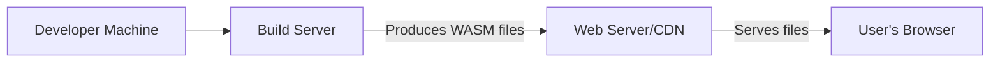

Okay, let's create a design document for the Uno Platform project, focusing on aspects relevant to threat modeling.

# BUSINESS POSTURE

Uno Platform is a cross-platform UI framework that allows developers to build native applications for multiple platforms (Windows, Web/WebAssembly, iOS, Android, macOS, and Linux) using a single codebase written in C# and XAML.  The business priorities likely revolve around:

*   Rapid Development: Enabling developers to build applications faster by leveraging a single codebase.
*   Broad Reach: Targeting as many platforms as possible to maximize potential user base.
*   Native Performance: Providing a user experience that feels native on each platform.
*   Developer Adoption: Attracting and retaining developers to the platform.
*   Ecosystem Growth: Fostering a vibrant community and a rich ecosystem of libraries and tools.
*   Maintainability: Ensuring the platform is maintainable and evolvable over time.

Based on these priorities, some key business risks include:

*   Security Vulnerabilities: Vulnerabilities in the platform could lead to compromised applications, data breaches, and reputational damage. This is a critical risk given the platform's role in building applications that may handle sensitive data.
*   Platform Compatibility Issues: Inconsistencies in behavior across different platforms could lead to application instability, developer frustration, and increased support costs.
*   Performance Bottlenecks: Poor performance on specific platforms could limit adoption and user satisfaction.
*   Supply Chain Attacks: Compromised dependencies or build tools could introduce vulnerabilities into the platform and the applications built with it.
*   Lack of Security Features: Absence of built-in security features or guidance could lead to developers building insecure applications.

# SECURITY POSTURE

Based on the GitHub repository and general knowledge of cross-platform development, here's a likely security posture:

*   security control: Secure Development Practices: The Uno Platform team likely follows secure coding practices, including code reviews, static analysis, and vulnerability scanning. (Evidence: General best practices for open-source projects, presence of code analysis tools in the repository.)
*   security control: Dependency Management: The project uses package managers (NuGet) to manage dependencies. (Evidence: .csproj files in the repository)
*   security control: Open Source: Being open source allows for community scrutiny and contributions, potentially leading to faster identification and resolution of security issues. (Evidence: Public GitHub repository)
*   accepted risk: Platform-Specific Vulnerabilities: Uno Platform relies on the underlying native platforms for certain functionalities. Vulnerabilities in these platforms could impact Uno Platform applications.
*   accepted risk: Third-Party Library Vulnerabilities: Applications built with Uno Platform may use third-party libraries, which could introduce their own security risks.
*   security control: Input validation: Uno Platform likely performs input validation at different levels, including XAML parsing and data binding. (Evidence: General best practices for UI frameworks)
*   security control: Regular Updates: The Uno Platform team likely releases regular updates to address security vulnerabilities and bug fixes. (Evidence: Release history on GitHub)

Recommended Security Controls (High Priority):

*   Implement a comprehensive Software Bill of Materials (SBOM) generation process for all releases.
*   Integrate Software Composition Analysis (SCA) tools into the build pipeline to identify and manage vulnerabilities in third-party dependencies.
*   Perform regular penetration testing and security audits of the platform.
*   Provide clear security documentation and guidance for developers building applications with Uno Platform.
*   Establish a vulnerability disclosure program to encourage responsible reporting of security issues.
*   Implement code signing for all released artifacts.

Security Requirements:

*   Authentication:
    *   Uno Platform itself does not directly handle user authentication. It relies on the application developer to implement authentication mechanisms using platform-specific APIs or third-party libraries.
    *   Requirement: Provide clear guidance and examples for developers on how to securely implement authentication in Uno Platform applications, covering various scenarios (e.g., local authentication, OAuth 2.0, OpenID Connect).
*   Authorization:
    *   Similar to authentication, authorization is the responsibility of the application developer.
    *   Requirement: Provide guidance and best practices for implementing role-based access control (RBAC) and other authorization models within Uno Platform applications.
*   Input Validation:
    *   Uno Platform should perform basic input validation to prevent common vulnerabilities like XAML injection.
    *   Requirement: Ensure that all input from external sources (e.g., user input, network data) is properly validated and sanitized before being used.
    *   Requirement: Provide mechanisms for developers to easily implement custom input validation logic.
*   Cryptography:
    *   Uno Platform should leverage the cryptographic capabilities of the underlying platforms.
    *   Requirement: Provide clear guidance on how to use platform-specific cryptographic APIs securely.
    *   Requirement: Avoid implementing custom cryptographic algorithms.
    *   Requirement: Ensure secure storage of sensitive data (e.g., encryption keys, passwords) using platform-specific secure storage mechanisms.

# DESIGN

## C4 CONTEXT

```mermaid
graph LR
    subgraph Uno Platform Application
        direction LR
        UnoApp["Uno Platform App"]
    end
    User(User) --> UnoApp
    UnoApp -- "Uses" --> OS[Operating System APIs]
    UnoApp -- "Uses" --> ThirdPartyLibs[Third-Party Libraries]
    UnoApp -- "Uses" --> BackendServices[Backend Services (Optional)]

```

Element Descriptions:

*   Element:
    *   Name: User
    *   Type: Person
    *   Description: A user interacting with the Uno Platform application.
    *   Responsibilities: Interacting with the application's UI, providing input, and receiving output.
    *   Security controls: N/A (External to the system)

*   Element:
    *   Name: Uno Platform App
    *   Type: Software System
    *   Description: An application built using the Uno Platform.
    *   Responsibilities: Providing application functionality, rendering UI, handling user input, communicating with backend services (if any).
    *   Security controls: Input validation, output encoding, secure communication (if applicable), adherence to platform-specific security guidelines.

*   Element:
    *   Name: Operating System APIs
    *   Type: Software System
    *   Description: The underlying operating system APIs (Windows, WebAssembly, iOS, Android, macOS, Linux).
    *   Responsibilities: Providing low-level system services, including UI rendering, networking, file access, and security features.
    *   Security controls: OS-level security features (e.g., sandboxing, permissions), secure storage, cryptographic APIs.

*   Element:
    *   Name: Third-Party Libraries
    *   Type: Software System
    *   Description: Third-party libraries used by the Uno Platform application.
    *   Responsibilities: Providing specific functionalities not covered by the Uno Platform or the OS.
    *   Security controls: Dependent on the specific library; developers should choose libraries with a good security track record and keep them updated.

*   Element:
    *   Name: Backend Services (Optional)
    *   Type: Software System
    *   Description: Backend services (e.g., APIs, databases) that the Uno Platform application interacts with.
    *   Responsibilities: Providing data and business logic to the application.
    *   Security controls: Authentication, authorization, input validation, secure communication (e.g., HTTPS), data encryption.

## C4 CONTAINER

```mermaid
graph LR
    subgraph Uno Platform Application
        direction TB
        Presentation[Presentation Layer (XAML, C#)]
        BusinessLogic[Business Logic Layer (C#)]
        DataAccess[Data Access Layer (C#)]

        Presentation -- "Uses" --> BusinessLogic
        BusinessLogic -- "Uses" --> DataAccess
        DataAccess -- "Uses" --> OS[Operating System APIs]
        DataAccess -- "Uses" --> ThirdPartyLibs[Third-Party Libraries]
        DataAccess -- "Uses" --> BackendServices[Backend Services (Optional)]
    end
```

Element Descriptions:

*   Element:
    *   Name: Presentation Layer (XAML, C#)
    *   Type: Container
    *   Description: Handles UI rendering and user interaction.
    *   Responsibilities: Displaying data, handling user input, navigating between views.
    *   Security controls: Input validation, output encoding, prevention of XAML injection.

*   Element:
    *   Name: Business Logic Layer (C#)
    *   Type: Container
    *   Description: Implements the application's core business logic.
    *   Responsibilities: Processing data, enforcing business rules, coordinating with the data access layer.
    *   Security controls: Input validation, authorization checks, secure handling of sensitive data.

*   Element:
    *   Name: Data Access Layer (C#)
    *   Type: Container
    *   Description: Handles data access and persistence.
    *   Responsibilities: Interacting with databases, file systems, and backend services.
    *   Security controls: Secure communication (e.g., HTTPS), parameterized queries (to prevent SQL injection), data encryption, secure storage of credentials.

*   Element:
    *   Name: Operating System APIs
    *   Type: Software System
    *   Description: The underlying operating system APIs.
    *   Responsibilities: Providing low-level system services.
    *   Security controls: OS-level security features.

*   Element:
    *   Name: Third-Party Libraries
    *   Type: Software System
    *   Description: Third-party libraries used by the application.
    *   Responsibilities: Providing specific functionalities.
    *   Security controls: Dependent on the specific library.

*   Element:
    *   Name: Backend Services (Optional)
    *   Type: Software System
    *   Description: Backend services that the application interacts with.
    *   Responsibilities: Providing data and business logic.
    *   Security controls: Authentication, authorization, input validation, secure communication, data encryption.

## DEPLOYMENT

Possible deployment solutions:

1.  **Mobile (iOS/Android):** Deployed via respective app stores (Apple App Store, Google Play Store).
2.  **Web (WebAssembly):** Deployed as static files to a web server or CDN.
3.  **Windows:** Deployed as an MSIX package or a traditional installer.
4.  **macOS:** Deployed via the Apple App Store or as a standalone application package.
5.  **Linux:** Deployed via various package managers (e.g., apt, yum, snap).

Chosen solution for detailed description: **Web (WebAssembly)**



Element Descriptions:

*   Element:
    *   Name: Developer Machine
    *   Type: Infrastructure Node
    *   Description: The developer's workstation where code is written and compiled.
    *   Responsibilities: Code development, local testing.
    *   Security controls: Secure coding practices, local security tools (e.g., antivirus).

*   Element:
    *   Name: Build Server
    *   Type: Infrastructure Node
    *   Description: A server that builds the WebAssembly application.
    *   Responsibilities: Compiling code, running tests, packaging the application.
    *   Security controls: Secure build environment, dependency scanning, static analysis.

*   Element:
    *   Name: Web Server/CDN
    *   Type: Infrastructure Node
    *   Description: A web server or CDN that hosts the WebAssembly application files.
    *   Responsibilities: Serving static files to users' browsers.
    *   Security controls: HTTPS, secure configuration, web application firewall (WAF).

*   Element:
    *   Name: User's Browser
    *   Type: Infrastructure Node
    *   Description: The user's web browser that runs the WebAssembly application.
    *   Responsibilities: Downloading and executing the application code.
    *   Security controls: Browser security features (e.g., sandboxing, same-origin policy).

## BUILD

The build process for Uno Platform applications typically involves the following steps:

1.  **Code Development:** Developers write code (C#, XAML) on their local machines.
2.  **Source Control:** Code is committed to a source control repository (e.g., Git).
3.  **Build Trigger:** A build is triggered (e.g., manually, on commit, on a schedule).
4.  **Dependency Resolution:** Dependencies are resolved and downloaded (e.g., NuGet packages).
5.  **Compilation:** The code is compiled into platform-specific assemblies.
6.  **Testing:** Unit tests and UI tests are executed.
7.  **Packaging:** The application is packaged into the appropriate format for each target platform (e.g., .apk, .ipa, .msix, WebAssembly files).
8.  **Artifact Storage:** The build artifacts are stored (e.g., in a package repository, on a file server).

Security Controls in the Build Process:

*   security control: Source Control Security: Access control to the source code repository.
*   security control: Dependency Management: Using package managers with signed packages and vulnerability scanning.
*   security control: Static Analysis: Using static analysis tools to identify potential security vulnerabilities in the code.
*   security control: Software Composition Analysis (SCA): Using SCA tools to identify vulnerabilities in third-party dependencies.
*   security control: Secure Build Environment: Ensuring the build server is secure and protected from unauthorized access.
*   security control: Code Signing: Signing the build artifacts to ensure their integrity and authenticity.

```mermaid
graph LR
    Developer[Developer] --> Git[Source Control (Git)]
    Git -- "Push" --> BuildServer[Build Server (e.g., GitHub Actions, Azure DevOps)]
    BuildServer -- "NuGet Restore" --> NuGet[NuGet Server]
    BuildServer -- "Compile & Test" --> BuildServer
    BuildServer -- "SAST/SCA" --> BuildServer
    BuildServer -- "Package" --> BuildServer
    BuildServer -- "Publish Artifacts" --> ArtifactRepo[Artifact Repository]
```

# RISK ASSESSMENT

*   **Critical Business Processes:**
    *   Rapid application development and deployment.
    *   Maintaining a secure and stable platform for building cross-platform applications.
    *   Protecting the reputation of the Uno Platform and the applications built with it.

*   **Data Sensitivity:**
    *   Uno Platform itself does not handle sensitive data directly. However, applications built with Uno Platform *may* handle sensitive data, depending on their purpose. The sensitivity of this data will vary greatly depending on the application. Examples include:
        *   **Low Sensitivity:** Publicly available information, non-personal data.
        *   **Medium Sensitivity:** User preferences, application usage data.
        *   **High Sensitivity:** Personally identifiable information (PII), financial data, health data, authentication credentials.
    *   The primary data to protect within the Uno Platform project itself are:
        *   Source code: Protecting against unauthorized modification or theft.
        *   Build artifacts: Ensuring the integrity and authenticity of released builds.
        *   Developer credentials: Protecting access to source control, build servers, and artifact repositories.

# QUESTIONS & ASSUMPTIONS

*   **Questions:**
    *   What specific security certifications or compliance requirements (if any) are targeted by Uno Platform or applications built using it (e.g., HIPAA, PCI DSS)?
    *   What is the current process for handling security vulnerabilities reported by external researchers?
    *   Are there any specific threat models already in place for Uno Platform or its components?
    *   What level of support is provided to developers for implementing security best practices in their applications?

*   **Assumptions:**
    *   BUSINESS POSTURE: Assumed that rapid development, broad reach, and developer adoption are key priorities.
    *   SECURITY POSTURE: Assumed that basic secure development practices are followed. Assumed that platform-specific vulnerabilities are an accepted risk.
    *   DESIGN: Assumed a standard layered architecture for Uno Platform applications. Assumed a typical build process involving source control, dependency management, compilation, testing, and packaging. Assumed WebAssembly deployment for the detailed deployment description.