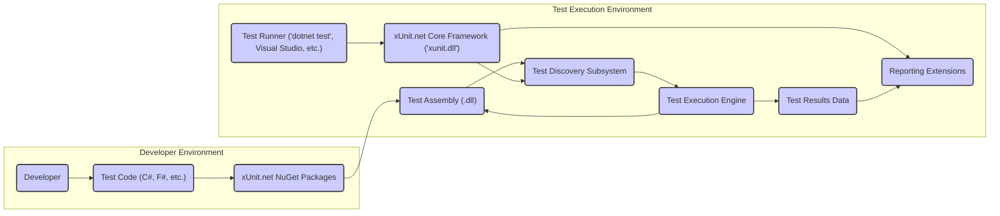

# Project Design Document: xUnit.net Testing Framework

**Version:** 1.1
**Date:** October 26, 2023
**Author:** AI Software Architect

## 1. Introduction

This document provides an enhanced design overview of the xUnit.net testing framework, building upon the previous version. It further details the architecture, key components, data flow, and deployment model with a stronger focus on aspects relevant to threat modeling. This document serves as a refined foundation for subsequent threat modeling activities.

## 2. Project Overview

xUnit.net remains a free, open-source, community-focused unit testing tool for the .NET platform. Written in C#, xUnit.net is a leading technology for unit testing C#, F#, VB.NET, and other .NET languages. Its integration with ReSharper, CodeRush, TestDriven.NET, and Xamarin underscores its widespread adoption.

## 3. Goals and Objectives

* Provide a highly robust and extensible framework for authoring and executing unit tests within the .NET ecosystem.
* Maintain a clear, consistent, and developer-friendly API for test definition, lifecycle management, and execution control.
* Offer comprehensive support for diverse test runners, facilitating seamless integration with various development environments and CI/CD pipelines.
* Emphasize extensibility through well-defined mechanisms for custom attributes, sophisticated test discovery strategies, and flexible reporting options.

## 4. Target Audience

This document is primarily intended for:

* Security engineers tasked with performing thorough threat modeling of systems utilizing xUnit.net.
* Developers actively contributing to the xUnit.net project or developing extensions for it.
* DevOps engineers responsible for deploying and managing systems that incorporate and rely on xUnit.net for testing.

## 5. Architectural Overview

The xUnit.net framework can be conceptually divided into the following interacting components:

## 6. Component Details

* **Developer:** The individual responsible for writing, maintaining, and executing unit tests. This actor interacts directly with the framework through code.
* **Test Code (C#, F#, etc.):** The source code files containing the unit tests, authored using specific xUnit.net attributes (e.g., `[Fact]`, `[Theory]`) and assertion methods. This represents the primary input to the testing process.
* **xUnit.net NuGet Packages:** The packaged and distributable units of the xUnit.net framework. These packages contain the core libraries (`xunit.dll`) and various runner implementations and extensions. They are typically added as project dependencies.
* **Test Runner ('dotnet test', Visual Studio, etc.):** An executable application or integrated IDE feature that orchestrates the test execution process. It discovers tests, invokes the xUnit.net framework, and displays results. Different runners may have varying security contexts and capabilities.
* **xUnit.net Core Framework ('xunit.dll'):** The foundational library providing the core abstractions and interfaces for defining tests, test fixtures (setup/teardown), and assertion methods. This library is the heart of the framework.
* **Test Assembly (.dll):** The compiled .NET dynamic-link library containing the test code. This assembly is the artifact targeted by the test runner for discovery and execution.
* **Test Discovery Subsystem:** The part of the framework responsible for identifying and enumerating the available tests within a given test assembly. This typically involves inspecting the assembly's metadata for xUnit.net specific attributes.
* **Test Execution Engine:** The component that manages the lifecycle of individual tests. It instantiates test classes, executes test methods, and handles setup and teardown logic. This is where the actual test code is run.
* **Test Results Data:** The structured information generated during test execution. This includes the status of each test (pass/fail), execution time, any output written to the console or logs, and details of any exceptions encountered.
* **Reporting Extensions:** Optional plugins or libraries that consume the raw test results and format them into various reports (e.g., XML, HTML, JSON). These extensions can vary in their security posture and data handling practices.

## 7. Data Flow

The primary data flow within the xUnit.net ecosystem can be described as follows:

* **Test Code Authoring:** Developers create test code, embedding xUnit.net attributes and assertions. This represents the initial input of potentially untrusted code.
* **Compilation and Packaging:** The test code is compiled into a test assembly (`.dll`). This assembly now contains the executable representation of the tests.
* **Test Discovery Initiation:** The test runner initiates the test discovery process, targeting the test assembly. This involves reading metadata from the assembly.
* **Metadata Extraction:** The xUnit.net core framework examines the test assembly's metadata to identify test classes and methods marked with xUnit.net attributes.
* **Test Execution Request:** The test runner selects tests to execute and instructs the execution engine. This might involve filtering or specific test selections.
* **Test Instance Creation and Setup:** The execution engine instantiates the test class and executes any setup methods (e.g., constructors, methods marked with `[Fact]` or `[Theory]`).
* **Test Method Invocation:** The execution engine invokes the individual test methods within the test class. This is where the core logic of the test is executed.
* **Assertion Evaluation:** Assertions within the test methods are evaluated. The outcome of these evaluations determines the pass/fail status of the test.
* **Result Generation and Aggregation:** The execution engine generates detailed test results, including pass/fail status, execution time, and any output or error messages. These results are aggregated.
* **Result Reporting:** The aggregated test results are passed to configured reporting extensions for formatting and output. This output might be persisted or transmitted.

## 8. Technology Stack

* **Primary Programming Language:** C#. The xUnit.net framework itself is written in C#.
* **Target .NET Platform:** Supports various .NET implementations, including .NET Framework, .NET Core, and modern .NET.
* **Package Management:** NuGet is the primary mechanism for distributing and consuming xUnit.net libraries.
* **Assembly Metadata:**  Crucially relies on .NET assembly metadata for test discovery and reflection.
* **Common Language Runtime (CLR) / CoreCLR:** The runtime environment where the test code and the xUnit.net framework execute.

## 9. Deployment Model

xUnit.net is typically deployed and utilized in the following ways:

* **As NuGet Package Dependencies:** Integrated directly into .NET projects as package references. This is the most common deployment method for developers.
* **Through Standalone Test Runners:** Executed via command-line interfaces (e.g., `dotnet test`) or as part of IDE integrations (e.g., Visual Studio Test Explorer). These runners are often separate executables.
* **Integrated into CI/CD Pipelines:** Used within automated build and deployment pipelines to ensure code quality through automated testing. This often involves invoking test runners in a non-interactive environment.

## 10. Security Considerations (Actionable for Threat Modeling)

This section outlines potential security concerns, categorized for clarity during threat modeling:

* **Code Execution Risks:**
    * **Malicious Test Code:** Developers could intentionally write malicious test code that attempts to access unauthorized resources, exfiltrate data, or cause denial-of-service.
    * **Vulnerabilities in Test Code:**  Poorly written test code might inadvertently create security vulnerabilities during its execution, especially if it interacts with external systems.
* **Framework Vulnerabilities:**
    * **Bugs in Core Libraries:**  Security flaws within `xunit.dll` could be exploited by malicious test code or attackers controlling the test execution environment.
    * **Runner Vulnerabilities:**  Vulnerabilities in specific test runner implementations (e.g., command-line runner, IDE integrations) could be exploited.
* **Information Disclosure:**
    * **Sensitive Data in Test Results:** Test results might inadvertently contain sensitive information (e.g., connection strings, API keys) if not handled carefully.
    * **Verbose Error Messages:**  Detailed error messages during test execution could reveal internal system details to attackers.
* **Tampering and Integrity:**
    * **Compromised Test Assemblies:** If test assemblies are tampered with, malicious tests could be injected or existing tests altered to hide failures.
    * **Manipulation of Test Configuration:**  Attackers might try to modify test configuration files to disable tests or alter their behavior.
* **Extensibility and Third-Party Risks:**
    * **Malicious Reporting Extensions:**  Third-party reporting extensions could contain vulnerabilities or be designed to exfiltrate test results or other sensitive data.
    * **Dependency Chain Vulnerabilities:**  Vulnerabilities in the dependencies of xUnit.net or its extensions could indirectly impact its security.
* **Execution Environment Security:**
    * **Insufficient Permissions:** Test runners executed with overly broad permissions could pose a greater security risk if compromised.
    * **Lack of Isolation:**  Insufficient isolation between test executions could allow tests to interfere with each other or the host system.

## 11. Assumptions and Constraints

* We assume that developers using xUnit.net have the necessary and appropriate permissions within their development and testing environments.
* The security of the underlying operating system, .NET platform, and build infrastructure is considered a separate but related concern.
* This document primarily focuses on the core xUnit.net framework and common usage patterns. Specific integrations with other tools or custom extensions might introduce additional security considerations not explicitly covered here.

## 12. Future Considerations

* A more in-depth analysis of the security implications of different test runner implementations and their execution contexts.
* A detailed examination of the test discovery mechanism and potential vulnerabilities related to assembly loading and metadata parsing.
* A thorough review of the security model for extensibility, particularly concerning reporting extensions and custom test attributes.
* Investigation into potential mechanisms for sandboxing or isolating test execution to mitigate the risks of malicious test code.

This improved design document provides a more detailed and structured understanding of the xUnit.net project, specifically tailored to facilitate effective threat modeling. The categorized security considerations offer a clear starting point for identifying potential vulnerabilities and developing appropriate mitigation strategies.
