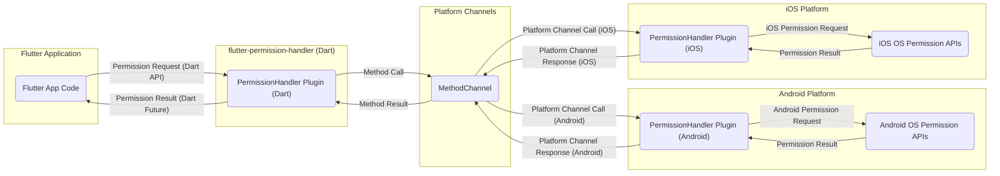

# Project Design Document: Flutter Permission Handler

**Version:** 1.1
**Date:** October 26, 2023
**Author:** Gemini (AI Language Model)

## 1. Introduction

This document provides a detailed design overview of the `flutter-permission-handler` library. This document aims to clearly articulate the library's architecture, components, and data flow, serving as a foundation for subsequent threat modeling activities. Understanding the internal workings of this library is crucial for identifying potential security vulnerabilities and designing appropriate mitigations. This revision incorporates improvements for clarity and detail based on the initial version.

## 2. Goals

*   Provide a comprehensive architectural overview of the `flutter-permission-handler` library.
*   Clearly define the components and their interactions within the library.
*   Illustrate the data flow involved in requesting and receiving permission status with enhanced detail.
*   Serve as a foundational document for threat modeling exercises.
*   Facilitate understanding of the library's security posture.
*   Improve clarity and accuracy of the design description.

## 3. Overview

The `flutter-permission-handler` library simplifies the process of requesting and managing platform-specific permissions within Flutter applications. It provides a unified API to access various permissions on both Android and iOS platforms, abstracting away the complexities of the native platform implementations. The library acts as a bridge between the Flutter application code and the underlying operating system's permission management system, ensuring a consistent developer experience across platforms.

## 4. Architecture

The library follows a plugin architecture, common in Flutter, to interact with platform-specific code. The core components are:

*   **Flutter Application:** The application code written in Dart that utilizes the `flutter-permission-handler` library to request and handle permissions.
*   **PermissionHandler Plugin (Dart):** The core Dart code of the library, providing the public API for Flutter developers. This component manages the communication with the native platform implementations.
*   **Platform Channels:** The asynchronous communication mechanism provided by Flutter to exchange data and invoke methods between the Dart code and the native platform code (Android and iOS). Specifically, `MethodChannel` is used for invoking methods, and `EventChannel` could potentially be used for streaming permission status changes in the future (though not currently implemented in this library).
*   **PermissionHandler Plugin (Android):** The native Android implementation of the plugin, typically written in Kotlin or Java. This component interacts directly with the Android operating system's permission APIs.
*   **PermissionHandler Plugin (iOS):** The native iOS implementation of the plugin, typically written in Swift or Objective-C. This component interacts directly with the iOS operating system's permission APIs.
*   **Operating System Permission APIs (Android & iOS):** The underlying platform APIs responsible for managing and granting permissions, including displaying permission dialogs to the user and returning the user's decision.

## 5. Data Flow

The typical flow for requesting a permission using the `flutter-permission-handler` library is as follows:

1. The Flutter application code initiates a permission request by calling a method from the `PermissionHandler Plugin (Dart)`. This typically involves specifying the desired permission using an enumeration (e.g., `Permission.camera.request()`).
2. The Dart plugin code receives the request and determines the target platform. It then uses a `MethodChannel` to send a message to the appropriate native platform (Android or iOS). This message includes the identifier of the requested permission.
3. On the native platform side:
    *   **Android:** The `PermissionHandler Plugin (Android)` receives the method call via the `MethodChannel`. It translates the permission identifier into the corresponding Android permission string (e.g., `android.permission.CAMERA`). It then interacts with the Android OS permission APIs, primarily using `ActivityCompat.requestPermissions()` to request the permission from the user if it hasn't been granted yet. The system displays a permission dialog to the user. The result of the user's interaction (granted or denied) is captured by the Android plugin.
    *   **iOS:** The `PermissionHandler Plugin (iOS)` receives the method call via the `MethodChannel`. It translates the permission identifier into the corresponding iOS permission key (e.g., `NSCameraUsageDescription` in `Info.plist` and the associated request methods). It interacts with the appropriate iOS frameworks (like `AVFoundation` for camera, `CoreLocation` for location) to check the current authorization status and, if necessary, request authorization from the user. The system presents a permission prompt to the user. The user's response (allow or deny) is captured by the iOS plugin.
4. The native platform plugin sends the resulting permission status (e.g., `granted`, `denied`, `permanentlyDenied`) back to the Dart side via the `MethodChannel`. This status indicates whether the permission was granted, denied, or permanently denied by the user.
5. The `PermissionHandler Plugin (Dart)` receives the result from the `MethodChannel`. It then completes the `Future` that was initially returned by the permission request method in the Flutter application code, providing the final permission status to the application.

## 6. Key Components and their Responsibilities

*   **Flutter App Code:**
    *   Initiates permission requests using the simplified API provided by the `flutter-permission-handler`.
    *   Handles the asynchronous results of permission requests, updating the application's UI or logic accordingly.
    *   Implements application-specific logic based on the granted or denied status of permissions.
*   **PermissionHandler Plugin (Dart):**
    *   Provides a developer-friendly, platform-agnostic API for requesting and querying permission status.
    *   Acts as an intermediary, translating Dart API calls into platform-specific method channel invocations.
    *   Manages the asynchronous communication flow with the native platform plugins.
    *   Handles responses from the native platforms and provides the results back to the Flutter application via `Future` completion.
*   **Platform Channels:**
    *   Establishes a communication bridge between the Dart VM and the native platform code.
    *   Serializes Dart data structures into a format suitable for native code and deserializes native responses back into Dart objects.
    *   Ensures asynchronous communication, preventing blocking of the UI thread.
*   **PermissionHandler Plugin (Android):**
    *   Receives permission request method calls from the Dart side via the `MethodChannel`.
    *   Maps the generic permission identifiers to specific Android permission strings.
    *   Utilizes Android's `ContextCompat.checkSelfPermission()` to check the current permission state.
    *   Uses `ActivityCompat.requestPermissions()` to request permissions from the user at runtime.
    *   Handles the results of the permission request callback from the Android OS.
    *   Sends the permission status back to the Dart side via the `MethodChannel`.
*   **PermissionHandler Plugin (iOS):**
    *   Receives permission request method calls from the Dart side via the `MethodChannel`.
    *   Maps the generic permission identifiers to the appropriate iOS authorization request methods (e.g., `requestAccessForMediaType:` for camera, `requestWhenInUseAuthorization` for location).
    *   Interacts with iOS frameworks like `AVFoundation`, `CoreLocation`, `Contacts`, etc., to request permissions.
    *   Handles user responses to permission prompts and retrieves the authorization status.
    *   Sends the permission status back to the Dart side via the `MethodChannel`.
*   **Operating System Permission APIs (Android & iOS):**
    *   The fundamental system components responsible for managing user permissions and enforcing privacy.
    *   Control access to sensitive device resources and user data.
    *   Present permission dialogs to the user, allowing them to grant or deny access.
    *   Maintain the current permission state for each application.

## 7. Security Considerations (For Threat Modeling)

This section outlines security considerations that should be explored further during threat modeling exercises:

*   **Input Validation on Permission Names:** The library should rigorously validate the permission names passed from the Flutter application to the Dart plugin. This prevents malicious actors from attempting to request arbitrary or non-existent permissions, potentially leading to unexpected behavior or errors.
*   **Secure Communication over Platform Channels:** While `MethodChannel` communication is generally within the application's process, understanding the serialization and deserialization process is important. Ensure that no sensitive information related to permission handling is inadvertently exposed or logged during this process.
*   **Handling of Sensitive Permission Data:** The library inherently deals with sensitive user permissions. Ensure that this information (e.g., the fact that a permission is granted or denied) is handled securely within the plugin and not inadvertently logged to persistent storage or exposed through other means.
*   **Platform-Specific Vulnerabilities:**  Keep abreast of potential vulnerabilities in the underlying Android and iOS permission handling mechanisms. Security updates from Google and Apple should be monitored, and the library should be updated to address any relevant issues.
*   **Bypassing Permission Checks:** Threat modeling should consider scenarios where an attacker might attempt to bypass the permission checks enforced by the library or the operating system. This could involve exploiting vulnerabilities in the native platform implementations or manipulating the application's state.
*   **User Privacy and Rationale:** Ensure that the library encourages developers to provide clear and informative rationales for requesting permissions. Misleading or unclear permission requests can erode user trust. While the library itself doesn't directly control the rationale, its design should facilitate best practices.
*   **Error Handling and Exception Management:** Robust error handling is crucial. The library should gracefully handle scenarios where permission requests fail or encounter unexpected errors, preventing potential crashes or security vulnerabilities due to unhandled exceptions.
*   **Protection Against Method Channel Hijacking (Though unlikely in this context):** While less likely for a permission handler, consider the theoretical possibility of malicious code within the application attempting to intercept or manipulate `MethodChannel` calls. Proper scoping and security best practices in the Flutter application itself are important here.
*   **Information Disclosure through Permission Status:** Consider if the detailed permission status returned by the library could inadvertently leak sensitive information if not handled carefully by the application.

## 8. Dependencies

The `flutter-permission-handler` library has the following dependencies:

*   **Flutter SDK:** The core Flutter framework is a fundamental dependency.
*   **`plugin_platform_interface` package:** This package is part of the Flutter plugin infrastructure and is used to define the platform interface for the plugin.
*   **Android SDK:** Required for building and running the Android platform implementation of the plugin.
*   **iOS SDK (Xcode):** Required for building and running the iOS platform implementation of the plugin.

## 9. Deployment

The `flutter-permission-handler` library is deployed as a standard Flutter plugin via pub.dev. Developers integrate it into their Flutter projects by adding it as a dependency in their `pubspec.yaml` file and then importing the necessary classes in their Dart code. When the Flutter application is built for Android or iOS, the corresponding native platform code of the plugin is automatically included in the application bundle.

## 10. Future Considerations

Potential future enhancements to the library that might impact its design and security include:

*   **Granular Permission Status:** Providing more detailed information about the permission status, such as temporary denial or restrictions imposed by parental controls or enterprise policies.
*   **Grouped Permission Requests:**  Allowing developers to request multiple related permissions in a single operation, potentially improving the user experience by reducing the number of permission prompts.
*   **Customizable Permission Rationale UI:** While the system provides the default UI, exploring ways to allow developers more control over the presentation of the permission rationale (within platform limitations) could be considered.
*   **Reactive Permission Status Streams:**  Instead of just returning a `Future`, providing a stream of permission status changes could allow applications to react dynamically to changes in permission grants. This would likely involve using `EventChannel` for communication.
*   **Integration with App Tracking Transparency (ATT) on iOS:** Ensuring seamless integration with and handling of ATT status on iOS.

This revised document provides a more detailed and comprehensive design overview of the `flutter-permission-handler` library, incorporating improvements for clarity and accuracy. This information will be valuable for conducting thorough threat modeling and identifying potential security risks.
