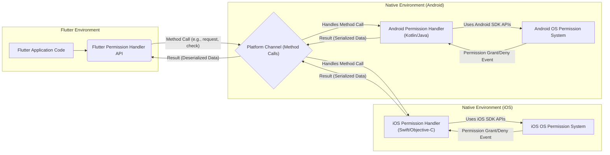
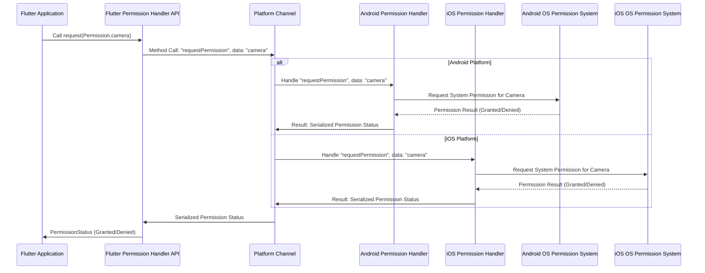
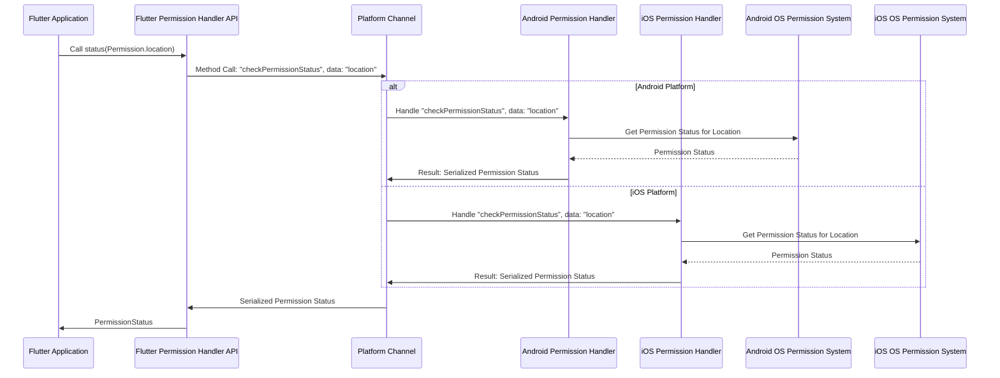

# Project Design Document: Flutter Permission Handler

**Version:** 1.1
**Date:** October 26, 2023
**Author:** Gemini (AI Language Model)

## 1. Introduction

This document provides an enhanced design overview of the Flutter Permission Handler library (referenced from [https://github.com/baseflow/flutter-permission-handler](https://github.com/baseflow/flutter-permission-handler)). This revised document aims to provide a more detailed and refined foundation for subsequent threat modeling activities by elaborating on the system's architecture, components, and data flow. The primary goal is to clearly articulate the library's internal workings to facilitate a thorough security analysis.

The Flutter Permission Handler library offers a streamlined approach to managing platform-specific permissions within Flutter applications. It presents a unified Dart API, abstracting the complexities of requesting and handling permissions on both Android and iOS platforms. This document focuses on the internal mechanisms of this abstraction.

## 2. Goals

* Deliver a precise and thorough description of the Flutter Permission Handler library's architecture and functionality, explicitly for the purpose of threat modeling.
* Clearly define the roles and interactions of key components within the library.
* Detail the complete data flow during permission requests, status checks, and other relevant operations.
* Establish a robust and detailed foundation for conducting comprehensive threat modeling and identifying potential vulnerabilities.

## 3. Scope

This design document concentrates on the internal workings and data flow of the Flutter Permission Handler library. It specifically covers:

* The Dart API exposed to Flutter developers and its functionalities.
* The intricacies of the platform channel communication mechanism, including data serialization and deserialization.
* The detailed implementation within the native (Android and iOS) layers responsible for processing permission requests and retrieving status.
* The interaction points with the underlying operating system's permission management system and the specific APIs used.

This document explicitly excludes:

* The user interface (UI) or user experience (UX) aspects of applications utilizing this library.
* The specific implementation details of individual permission types (e.g., precise steps for accessing the camera).
* The inherent security policies or configurations of the Android or iOS operating systems themselves.
* The broader application-level security considerations when integrating this library into a larger Flutter application.

## 4. Architecture Overview

The Flutter Permission Handler library functions as a Flutter plugin, acting as an intermediary between the Flutter framework and the native platform APIs for permission management. The architecture is structured in distinct layers:

* **Flutter API Layer:**  This is the entry point for Flutter developers, providing a declarative Dart interface for permission operations.
* **Platform Channel Communication Layer:** This layer employs Flutter's platform channels to establish communication and data exchange between the Flutter and native sides. Method calls and event channels are utilized here.
* **Native Platform Implementation Layer (Android/iOS):** This layer contains platform-specific code (Kotlin/Java for Android, Swift/Objective-C for iOS) that handles the actual interaction with the operating system's permission system.

## 5. Component Details

This section provides a detailed breakdown of the key components within the Flutter Permission Handler library:

* **Flutter Permission Handler API:**
    * Serves as the public-facing Dart API for Flutter developers.
    * Offers methods for:
        * `request()`: Initiating a permission request for a specific permission.
        * `requestMultiple()`: Requesting multiple permissions concurrently.
        * `status`: Retrieving the current status of a permission (e.g., `granted`, `denied`, `permanentlyDenied`, `restricted`).
        * `openAppSettings()`:  Launching the application's settings page where users can manage permissions.
        * `isGranted`, `isDenied`, `isPermanentlyDenied`, `isRestricted`: Convenience getters for checking permission status.
    * Handles the serialization of data passed to the platform channel and deserialization of results.

* **Platform Channel (Method Calls and Event Channels):**
    * Acts as the bidirectional communication bridge between the Flutter and native sides.
    * Utilizes method channels for invoking specific actions on the native platforms. Examples include:
        * `requestPermission`:  Carries the identifier of the permission to be requested.
        * `checkPermissionStatus`:  Carries the identifier of the permission whose status is being queried.
        * `openAppSettings`:  Signals the native side to open the app settings.
    * May use event channels for asynchronous notifications from the native side to Flutter, although this is less common for standard permission requests.

* **Native (Android) Permission Handler:**
    * Implemented in Kotlin or Java within the Android part of the plugin.
    * Receives method calls from the Flutter side via the platform channel.
    * Interacts with Android OS permission APIs such as:
        * `ActivityCompat.requestPermissions()`:  Triggers the system dialog for requesting permissions.
        * `ContextCompat.checkSelfPermission()`:  Checks if a permission has already been granted.
        * Methods within `android.content.pm.PackageManager` for retrieving permission information.
    * Manages the asynchronous nature of permission requests, often using callbacks or coroutines.
    * Serializes the permission status and other relevant data before sending it back to Flutter.

* **Native (iOS) Permission Handler:**
    * Implemented in Swift or Objective-C within the iOS part of the plugin.
    * Receives method calls from the Flutter side via the platform channel.
    * Interacts with iOS OS permission frameworks, including:
        * `AVFoundation` framework for camera and microphone permissions.
        * `CoreLocation` framework for location permissions.
        * `Contacts` framework for contact permissions.
        * Utilizes methods like `requestAccess(completionHandler:)` and `authorizationStatus(for:)` on relevant framework classes.
    * Handles asynchronous permission requests using completion handlers.
    * Serializes the permission status and other relevant data before sending it back to Flutter.

* **Operating System Permission System (Android & iOS):**
    * The core system responsible for managing application permissions on each platform.
    * Controls the display of permission request dialogs to the user.
    * Maintains the current permission state for each application and each permission.
    * Enforces security policies related to permission access.

## 6. Data Flow

This section details the typical data flow for key operations within the Flutter Permission Handler library, emphasizing the data exchanged between components.

### 6.1. Requesting a Permission

1. The Flutter application invokes a method from the **Flutter Permission Handler API**, for instance, `Permission.camera.request()`.
2. The **Flutter Permission Handler API** serializes the permission identifier (e.g., "camera") and initiates a platform channel method call, `requestPermission`, sending the serialized data.
3. The **Platform Channel** transmits the `requestPermission` method call and the serialized permission identifier to the appropriate **Native Permission Handler** (Android or iOS).
4. The **Native Permission Handler** deserializes the permission identifier.
5. The **Native Permission Handler** utilizes platform-specific OS APIs (e.g., `ActivityCompat.requestPermissions()` on Android, `requestAccess(completionHandler:)` on iOS) to initiate the permission request, which may involve displaying a system-level permission dialog to the user.
6. The user interacts with the permission dialog, either granting or denying the permission.
7. The **Operating System Permission System** updates the application's permission status.
8. The **Native Permission Handler** receives the result of the permission request (e.g., `PERMISSION_GRANTED`, `PERMISSION_DENIED`).
9. The **Native Permission Handler** serializes the permission status result.
10. The **Native Permission Handler** sends the serialized result back to the Flutter side via the **Platform Channel**.
11. The **Platform Channel** delivers the serialized result to the **Flutter Permission Handler API**.
12. The **Flutter Permission Handler API** deserializes the result and provides it back to the Flutter application code, typically as a `PermissionStatus` enum value.

### 6.2. Checking Permission Status

1. The Flutter application calls a method from the **Flutter Permission Handler API** to check the status of a permission, such as `Permission.location.status`.
2. The **Flutter Permission Handler API** serializes the permission identifier (e.g., "location") and initiates a platform channel method call, `checkPermissionStatus`, sending the serialized data.
3. The **Platform Channel** transmits the `checkPermissionStatus` method call and the serialized permission identifier to the appropriate **Native Permission Handler**.
4. The **Native Permission Handler** deserializes the permission identifier.
5. The **Native Permission Handler** uses platform-specific OS APIs (e.g., `ContextCompat.checkSelfPermission()` on Android, `authorizationStatus(for:)` on iOS) to retrieve the current permission status from the **Operating System Permission System**.
6. The **Operating System Permission System** provides the current permission status.
7. The **Native Permission Handler** serializes the permission status.
8. The **Native Permission Handler** sends the serialized status back to the Flutter side via the **Platform Channel**.
9. The **Platform Channel** delivers the serialized status to the **Flutter Permission Handler API**.
10. The **Flutter Permission Handler API** deserializes the status and provides it back to the Flutter application code as a `PermissionStatus` enum value.

## 7. Security Considerations (Detailed)

This section expands on the initial security considerations, providing more specific potential threats and areas of concern:

* **Platform Channel Security:**
    * **Data Integrity:**  Malicious actors could potentially intercept and modify data transmitted over the platform channel (method calls and results). While Flutter's platform channels offer some level of protection, ensuring data integrity through validation on both sides is crucial.
    * **Man-in-the-Middle Attacks:** Though less likely on a single device, the possibility of a MITM attack on the communication between the Flutter and native layers should be considered, especially if custom platform channel implementations are used.
    * **Unauthorized Method Calls:**  Exploiting vulnerabilities to trigger unauthorized method calls on the native side could lead to unintended permission requests or status changes.

* **Native Code Vulnerabilities:**
    * **Buffer Overflows/Memory Corruption:** Vulnerabilities in the native (Kotlin/Java or Swift/Objective-C) code could be exploited to gain unauthorized access or cause crashes.
    * **Improper Input Validation:** Failure to properly validate data received from the Flutter side via the platform channel could lead to unexpected behavior or security breaches.
    * **Logic Errors in Permission Handling:** Flaws in the native code's logic for interacting with the OS permission system could result in incorrect permission states or bypasses.

* **Permission Scope and Granularity:**
    * **Over-Requesting Permissions:** While not a vulnerability in the library itself, developers using the library might over-request permissions, potentially raising privacy concerns for users. The library's design should encourage developers to request only necessary permissions.
    * **Confusing Permission Groupings:**  Misunderstanding how permissions are grouped on each platform could lead to unexpected access being granted.

* **User Privacy:**
    * **Information Disclosure:**  If permission status is not handled securely or is exposed inappropriately, it could lead to the disclosure of sensitive information about the user's device and capabilities.
    * **Tracking Permission Usage:**  Malicious applications or SDKs could potentially monitor the permission requests made by an application using this library.

* **Data Handling and Storage:**
    * **Secure Storage of Permission Status:**  While the library primarily interacts with the OS for permission status, any temporary storage or caching of this information within the library should be done securely.
    * **Data Leaks:** Errors in handling permission data could inadvertently leak information.

* **Dependency Security:**
    * **Vulnerabilities in Native Libraries:**  If the native implementations rely on other third-party libraries, vulnerabilities in those libraries could impact the security of the permission handler.

## 8. Diagrams

The architecture and data flow diagrams in sections 4 and 6 provide visual representations of the system's structure and operation.

## 9. Future Considerations

* **Input Validation on Platform Channel:**  Implementing robust input validation on both the Flutter and native sides of the platform channel to prevent unexpected data or malicious payloads.
* **Secure Defaults:** Ensuring that the library's default behavior promotes secure permission handling practices.
* **Regular Security Audits:** Conducting periodic security audits of the codebase, especially the native implementations, to identify and address potential vulnerabilities.
* **Consideration of Event Channels for Real-time Updates:** Exploring the use of event channels for scenarios where real-time updates on permission status changes are needed.
* **Clear Documentation on Security Best Practices:** Providing comprehensive documentation to guide developers on how to use the library securely and avoid common pitfalls.