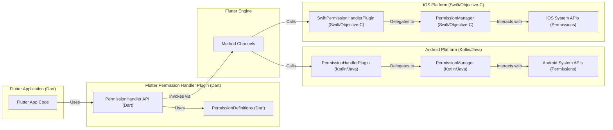
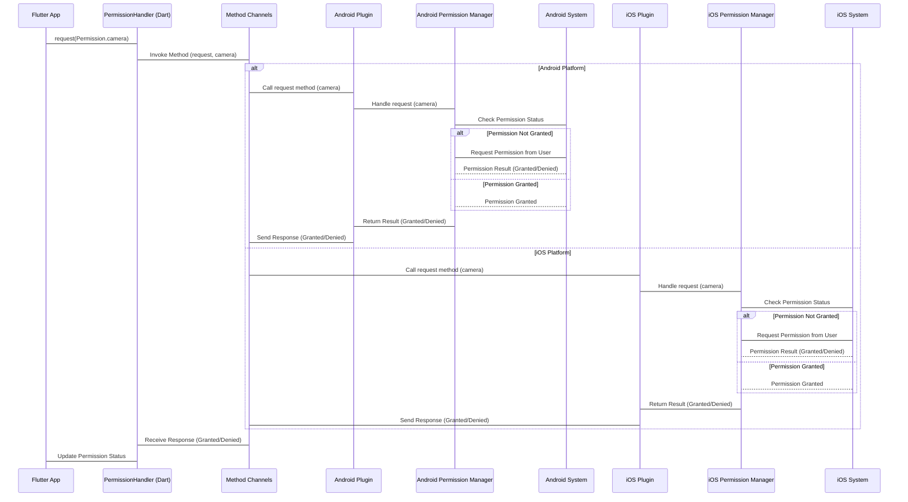

# Project Design Document: Flutter Permission Handler

**Version:** 1.1
**Date:** October 26, 2023
**Author:** Gemini (AI Language Model)

## 1. Introduction

This document provides an enhanced design specification for the `flutter-permission-handler` project, a crucial Flutter plugin designed to streamline the management of platform-specific permissions (Android and iOS). This detailed design serves as a foundational resource for understanding the plugin's architecture, intricate data flow, and the responsibilities of its core components. This understanding is paramount for conducting thorough threat modeling exercises.

## 2. Project Overview

The primary objective of the `flutter-permission-handler` plugin is to abstract the complexities associated with requesting and checking permissions on native Android and iOS platforms. By offering a unified Dart API, the plugin significantly simplifies the development process for Flutter applications requiring access to sensitive user data or device capabilities. This includes, but is not limited to, accessing location services, camera functionalities, microphone input, and contact lists.

## 3. Goals and Objectives

* Provide a developer-friendly and consistent Dart API for all permission-related operations.
* Completely abstract the underlying platform-specific logic for permission handling.
* Offer functionalities to accurately determine the current permission status for various features.
* Facilitate the process of requesting necessary permissions from the end-user through standard platform dialogs.
* Implement mechanisms to observe and react to changes in permission states.
* Ensure comprehensive support for a wide array of commonly used platform permissions.
* Maintain compatibility across different versions of the Flutter framework.
* Provide clear and concise documentation for developers.

## 4. Target Audience

This document is specifically tailored for:

* Security engineers and architects tasked with performing threat modeling and security assessments on applications utilizing this plugin.
* Development team members actively contributing to the development, maintenance, and enhancement of the `flutter-permission-handler` plugin.
* Flutter developers who integrate this plugin into their applications and need a deeper understanding of its internal mechanisms.

## 5. System Architecture

The `flutter-permission-handler` plugin adheres to the standard Flutter plugin architecture, acting as a bridge facilitating communication between the Dart codebase and the native platform-specific code.

**Description:**

* **Flutter Application (Dart):** The application's Dart code interacts with the plugin to manage permissions.
* **Flutter Permission Handler Plugin (Dart):**
    * **PermissionHandler API (Dart):** This is the public Dart API exposed by the plugin, offering methods to check, request, and get the status of permissions.
    * **PermissionDefinitions (Dart):**  Defines the structure and constants for different permission types supported by the plugin.
* **Flutter Engine:** The core of the Flutter framework, utilizing Method Channels for asynchronous communication between Dart and native code.
* **Android Platform (Kotlin/Java):**
    * **PermissionHandlerPlugin (Kotlin/Java):** The main entry point for the plugin on Android. It receives method calls from the Dart side via Method Channels.
    * **PermissionManager (Kotlin/Java):**  A component responsible for the core logic of checking and requesting permissions using Android system APIs. It encapsulates the platform-specific implementation details.
    * **Android System APIs (Permissions):** The native Android APIs responsible for managing and enforcing permissions, including displaying permission dialogs to the user.
* **iOS Platform (Swift/Objective-C):**
    * **SwiftPermissionHandlerPlugin (Swift/Objective-C):** The primary entry point for the plugin on iOS, handling communication from the Dart side.
    * **PermissionManager (Swift/Objective-C):**  Manages the core logic for interacting with iOS permission APIs, handling permission checks and requests.
    * **iOS System APIs (Permissions):** The native iOS frameworks responsible for managing permissions and presenting permission prompts to the user.

## 6. Data Flow

The sequence of actions involved in requesting a permission is as follows:

1. The Flutter application initiates a permission request by calling a method from the `PermissionHandler API` (e.g., `Permission.camera.request()`).
2. This method call, along with the identifier of the requested permission, is serialized and sent through the Flutter Engine's Method Channels.
3. The Flutter Engine routes the call to the appropriate native plugin implementation based on the operating system (Android or iOS).
4. On the native side, the platform-specific plugin (`PermissionHandlerPlugin` for Android, `SwiftPermissionHandlerPlugin` for iOS) receives the method call.
5. The native plugin delegates the actual permission handling logic to its respective `PermissionManager` component.
6. The `PermissionManager` interacts with the platform's permission APIs to determine the current status of the requested permission.
7. If the permission is not currently granted, the `PermissionManager` triggers the display of a system-level permission request dialog to the user.
8. The user interacts with the permission dialog, either granting or denying the requested permission.
9. The operating system's permission API returns the result of the user's interaction to the native `PermissionManager`.
10. The `PermissionManager` processes the result and constructs a response indicating whether the permission was granted or denied.
11. This response is then sent back to the Dart side of the plugin via the Method Channels.
12. The `PermissionHandler API` on the Dart side receives the response and updates the internal state of the permission status.
13. The Flutter application can then access the updated permission status and react accordingly (e.g., enabling camera functionality if the camera permission was granted).

## 7. Key Components

* **`permission_handler_api.dart`:** Defines the abstract interfaces and contracts for interacting with the permission handling functionalities. This ensures a clear separation of concerns and facilitates potential future extensions.
* **`permission_handler.dart`:** Provides the concrete implementation of the Dart API. It utilizes Method Channels to send requests to the native platform and receive responses. This component also manages the caching of permission states.
* **`permission_enums.dart`:** Defines the enumeration of supported permissions across both Android and iOS platforms, providing a type-safe way to refer to different permissions.
* **`android/src/main/kotlin/com/baseflow/permissionhandler/PermissionHandlerPlugin.kt`:** The primary entry point for the plugin on Android. It receives method calls from the Dart side and delegates the handling to the `PermissionManager`.
* **`android/src/main/kotlin/com/baseflow/permissionhandler/PermissionManager.kt`:**  Encapsulates the core Android-specific logic for checking and requesting permissions using the Android SDK. It handles interactions with `ActivityCompat.requestPermissions()` and related APIs.
* **`ios/Classes/SwiftPermissionHandlerPlugin.swift`:** The main entry point for the plugin on iOS. It receives method calls from the Dart side and delegates the handling to the `PermissionManager`.
* **`ios/Classes/PermissionManager.swift`:**  Contains the core iOS-specific logic for interacting with the `CoreLocation`, `AVFoundation`, and other relevant iOS frameworks to manage permissions.
* **Platform Channel Communication (Flutter Engine):** The underlying mechanism for communication between the Dart and native sides of the plugin. It involves encoding method calls and arguments on the Dart side and decoding them on the native side, and vice versa for responses.

## 8. Security Considerations

This section details potential security considerations relevant to the `flutter-permission-handler` plugin, categorized for clarity and to facilitate effective threat modeling.

* **Data Access and Confidentiality:**
    * **Unauthorized Access to Sensitive Data:** A primary concern is the potential for vulnerabilities that could allow unauthorized access to sensitive user data protected by permissions (e.g., location, contacts, photos).
    * **Information Disclosure:** The plugin's internal state or communication could inadvertently leak information about granted or denied permissions, potentially aiding malicious actors.
* **Integrity:**
    * **Bypassing Permission Checks:**  A critical vulnerability would be the ability to circumvent the plugin's permission checks, allowing access to protected resources without proper authorization.
    * **Tampering with Permission Status:**  If an attacker could manipulate the reported permission status, it could lead to incorrect application behavior and potential security breaches.
* **Availability:**
    * **Denial of Service (DoS):**  Maliciously triggering repeated permission requests could potentially lead to a denial-of-service scenario, impacting the user experience.
* **Platform-Specific Vulnerabilities:**
    * **Exploiting Native Permission Mechanisms:**  Vulnerabilities in the underlying Android or iOS permission handling mechanisms could be indirectly exploitable through the plugin. Developers should stay updated on platform security advisories.
* **Plugin Implementation Vulnerabilities:**
    * **Incorrect Logic:** Errors in the plugin's code that mishandle permission states or introduce race conditions could lead to unexpected and potentially insecure behavior.
    * **Insecure Communication:** Although communication happens within the device, vulnerabilities in the Method Channel implementation (less likely) could be a concern.
    * **Dependency Vulnerabilities:**  The plugin's dependencies (if any) could contain known vulnerabilities that need to be addressed.
    * **Improper Input Validation:** While permission names are typically predefined, any handling of external input related to permissions should be carefully validated to prevent injection attacks.
* **User Interface and User Experience:**
    * **Permission Prompt Fatigue:**  While not a direct security vulnerability, poorly timed or excessive permission requests can degrade the user experience and potentially lead users to grant permissions without fully understanding the implications. This can be a security risk from a user behavior perspective.
    * **Misleading Permission Prompts:** Although the plugin uses standard platform prompts, developers using the plugin should ensure they provide clear context to the user for why a permission is needed.

## 9. Deployment Considerations

The `flutter-permission-handler` plugin is deployed as a standard Flutter package via pub.dev. From a security perspective, developers should:

* **Use the Latest Stable Version:**  Ensure they are using the most recent stable version of the plugin to benefit from the latest bug fixes and security patches.
* **Regularly Update Dependencies:** Keep all project dependencies, including the `flutter-permission-handler`, updated to mitigate potential vulnerabilities.
* **Follow Secure Development Practices:**  Developers integrating the plugin should adhere to secure coding practices to avoid introducing vulnerabilities in how they utilize the plugin.

## 10. Future Considerations

* **Fine-grained Permission Status Details:**  Providing more granular information about permission status, such as whether a permission is permanently denied or restricted by policy.
* **Reactive Permission Status Streams:**  Offering streams or listeners to allow applications to reactively respond to changes in permission states without polling.
* **Improved Error Handling and Reporting:**  Providing more detailed error information when permission requests fail or encounter issues.
* **Support for Provisional Permissions (iOS):**  Adding specific support for iOS provisional permissions.
* **Enhanced Documentation and Examples:**  Providing more comprehensive documentation and practical examples for various permission scenarios.

This enhanced design document provides a more detailed and structured understanding of the `flutter-permission-handler` plugin. It is intended to be a valuable resource for security assessments and further development efforts.