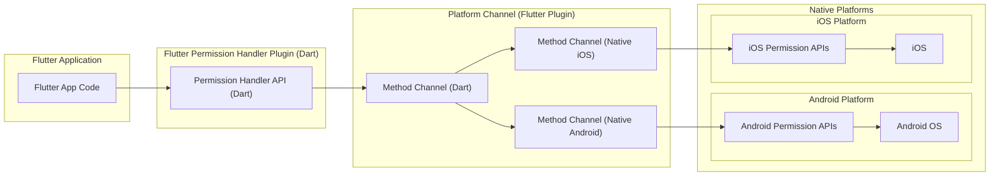
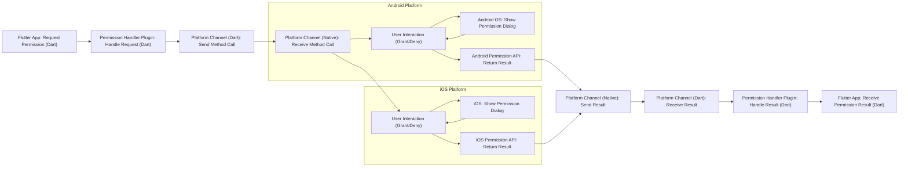

# Project Design Document: Flutter Permission Handler Plugin

**Project Name:** Flutter Permission Handler Plugin

**Project Repository:** [https://github.com/baseflow/flutter-permission-handler](https://github.com/baseflow/flutter-permission-handler)

**Version:** 1.1 (Improved Design Document)

**Date:** 2023-10-27

**Author:** Gemini (AI Expert in Software, Cloud and Cybersecurity Architecture)

## 1. Introduction

This document details the design of the Flutter Permission Handler plugin. This plugin provides a streamlined and consistent way for Flutter applications to manage platform permissions across Android and iOS. It abstracts the complexities of native permission handling, offering a unified Dart API. This document outlines the plugin's architecture, components, and data flow, serving as a basis for subsequent threat modeling and security analysis.

## 2. Project Overview

The Flutter Permission Handler plugin simplifies permission management in Flutter apps. It addresses the platform-specific nature of permission models in Android and iOS by providing a single Dart interface for common permission operations. Key functionalities include:

*   **Permission Requesting:**  Initiating user prompts to grant access to device resources (e.g., camera, location).
*   **Permission Status Checking:**  Determining the current permission state (granted, denied, restricted, etc.).
*   **App Settings Navigation:**  Providing a mechanism to open the application's settings page for manual permission adjustments by the user.
*   **Permission Group Management:** Handling permission groups as defined by the operating system.

The plugin is architected with a platform-agnostic Dart API that communicates with native Android and iOS permission APIs via Flutter Platform Channels. This ensures a consistent developer experience while leveraging platform-specific best practices.

## 3. System Architecture

The following diagram illustrates the system architecture of the Flutter Permission Handler plugin, highlighting the interaction between Flutter, the plugin, and native platform components. Flutter Platform Channels facilitate communication using binary serialization for method calls and responses, operating asynchronously.

**Components Description:**

*   **"Flutter App Code"**: The Flutter application code that utilizes the plugin's Dart API to manage permissions.
*   **"Permission Handler API (Dart)"**: The Dart API exposed by the plugin, providing methods for permission requests, status checks, and settings navigation. This is the primary developer interface.
*   **"Method Channel (Dart)"**: The Dart-side implementation of Flutter Platform Channels within the plugin. It handles serialization of method calls and arguments for transmission to native platforms.
*   **"Method Channel (Native Android)"**: The Android (Java/Kotlin) implementation of the Platform Channel within the plugin. It receives method calls from Dart, interacts with Android permission APIs, and sends serialized responses back.
*   **"Method Channel (Native iOS)"**: The iOS (Objective-C/Swift) implementation of the Platform Channel within the plugin. It receives method calls from Dart, interacts with iOS permission APIs, and sends serialized responses back.
*   **"Android Permission APIs"**: Native Android SDK APIs for permission management (e.g., `ActivityCompat.requestPermissions`, `ContextCompat.checkSelfPermission`).
*   **"iOS Permission APIs"**: Native iOS SDK APIs for permission management (e.g., `AVCaptureDevice.requestAccessForMediaType`, `CLLocationManager requestWhenInUseAuthorization`).
*   **"Android OS"**: The Android Operating System, responsible for enforcing permission policies and displaying permission dialogs.
*   **"iOS"**: The iOS Operating System, responsible for enforcing permission policies and displaying permission dialogs.

**Interaction Flow:**

1.  Flutter application code invokes a permission management function from the **"Permission Handler API (Dart)"**.
2.  The Dart API translates the request into a platform-specific method call and parameters.
3.  The **"Method Channel (Dart)"** serializes the method call and arguments into a binary format and sends it asynchronously over the Platform Channel.
4.  The appropriate native platform **"Method Channel (Native Android)"** or **"Method Channel (Native iOS)"** receives the serialized method call.
5.  The native channel code deserializes the call and interacts with the **"Android Permission APIs"** or **"iOS Permission APIs"** to perform the requested permission operation. This may involve displaying system permission dialogs managed by **"Android OS"** or **"iOS"**.
6.  The native platform APIs return the result of the permission operation.
7.  The native platform **"Method Channel"** serializes the result and sends it back asynchronously over the Platform Channel.
8.  The **"Method Channel (Dart)"** receives and deserializes the result.
9.  The **"Permission Handler API (Dart)"** processes the result and returns it to the **"Flutter App Code"**.

## 4. Data Flow Diagram - Permission Request

This diagram details the data flow specifically for a permission request initiated by the Flutter application, illustrating the synchronous user interaction with the permission dialog and the asynchronous nature of the platform channel communication.

**Data Flow Description:**

1.  **"Flutter App: Request Permission (Dart)"**: Flutter app initiates a permission request via the plugin's Dart API (e.g., `Permission.camera.request()`).
2.  **"Permission Handler Plugin: Handle Request (Dart)"**: The plugin's Dart code processes the request and prepares a platform channel method call.
3.  **"Platform Channel (Dart): Send Method Call"**: The Dart platform channel serializes and sends the request to the native side.
4.  **"Platform Channel (Native): Receive Method Call"**: The native platform channel receives the serialized request.
5.  **"Android/iOS Permission API: Request Permission"**: Native code invokes platform-specific permission APIs (e.g., `requestPermissions` on Android, `requestAccessForMediaType` on iOS).
6.  **"Android OS/iOS: Show Permission Dialog"**: The OS displays a permission dialog to the user.
7.  **"User Interaction (Grant/Deny)"**: User interacts with the dialog, granting or denying permission. This is a synchronous user interaction from the OS perspective.
8.  **"Android/iOS Permission API: Return Result"**: Native permission APIs return the user's decision (granted, denied, etc.).
9.  **"Platform Channel (Native): Send Result"**: Native platform channel serializes and sends the permission result back to Dart.
10. **"Platform Channel (Dart): Receive Result"**: Dart platform channel receives the serialized result.
11. **"Permission Handler Plugin: Handle Result (Dart)"**: Plugin's Dart code processes the received result.
12. **"Flutter App: Receive Permission Result (Dart)"**: The permission result is returned to the Flutter application code.

## 5. Security Considerations

This section outlines potential security considerations for the Flutter Permission Handler plugin, categorized for clarity and focusing on potential threats.

*   **Platform Channel Vulnerabilities (Tampering, Information Disclosure):**
    *   **Threat:** Malicious code or a compromised Flutter framework could potentially intercept or tamper with messages exchanged over the Platform Channel. This could lead to unauthorized permission grants, denial of legitimate permission requests, or information disclosure of permission states.
    *   **Mitigation:** Rely on the inherent security of Flutter's Platform Channel implementation. Regularly update Flutter SDK to benefit from security patches. Ensure plugin code minimizes sensitive data transmission over the channel beyond necessary permission information.

*   **Native API Misuse (Elevation of Privilege, Denial of Service):**
    *   **Threat:** Incorrect or insecure usage of native Android/iOS permission APIs within the plugin's native code. For example, improper error handling, race conditions in asynchronous API calls, or logic flaws could lead to unexpected permission behavior, potential elevation of privilege (granting permissions that shouldn't be granted), or denial of service (crashing the plugin or app due to API misuse).
    *   **Mitigation:** Thoroughly review and test native code for correct API usage, robust error handling, and secure coding practices. Follow platform-specific security guidelines for permission handling. Implement comprehensive unit and integration tests for native code.

*   **Permission Logic Bugs (Information Disclosure, Unauthorized Access):**
    *   **Threat:** Flaws in the plugin's Dart or native code logic for managing permission states, handling permission groups, or processing API responses. This could result in incorrect permission status reporting to the Flutter app, leading to unauthorized access to protected resources or information disclosure if the app relies on incorrect permission status.
    *   **Mitigation:** Implement rigorous unit and integration tests for all permission-related logic in both Dart and native code. Conduct code reviews to identify potential logic flaws. Follow a principle of least privilege in the plugin's internal operations.

*   **Information Disclosure through Logging/Debugging (Information Disclosure):**
    *   **Threat:** Accidental logging or exposure of sensitive permission-related information (e.g., permission names, status, user decisions, internal API calls) in debug builds or production logs. This could be exploited by malicious actors to gain insights into app behavior or user permissions.
    *   **Mitigation:** Implement secure logging practices. Avoid logging sensitive permission data, especially in production builds. Use conditional logging (e.g., only in debug builds). Review logging configurations to ensure no unintentional information leakage.

*   **Dependency Vulnerabilities (Various STRIDE threats):**
    *   **Threat:** Security vulnerabilities in the Flutter SDK, Android SDK, iOS SDK, or any other third-party libraries used by the plugin. These vulnerabilities could be indirectly exploited through the plugin.
    *   **Mitigation:** Regularly update Flutter SDK and platform SDKs to the latest stable versions to patch known vulnerabilities. Perform dependency analysis to identify and mitigate risks from third-party libraries. Monitor security advisories for dependencies.

*   **Bypass Mechanisms (Elevation of Privilege):**
    *   **Threat:** Although less likely in the plugin itself, vulnerabilities in the underlying operating system or Flutter framework could theoretically be exploited to bypass permission checks enforced by the plugin or grant permissions without user consent.
    *   **Mitigation:** Rely on the security mechanisms provided by the operating systems and Flutter framework. Stay updated with security patches for these platforms.  Report any suspected bypass vulnerabilities to the respective platform maintainers.

## 6. Assumptions and Dependencies

*   **Secure Flutter Framework:** Assumes a secure and correctly functioning Flutter framework, including the Platform Channel mechanism.
*   **Secure Platform SDKs:** Relies on the security and correct operation of Android SDK and iOS SDK.
*   **Underlying OS Security:** Depends on the security of the user's device operating system for permission enforcement and dialog presentation.
*   **Correct Plugin Installation:** Assumes the plugin is correctly installed and integrated into the Flutter application project without modification by malicious actors.
*   **Platform Compliance:** The plugin is designed and intended to be used in compliance with Android and iOS permission guidelines and best practices.

## 7. Deployment Model

The Flutter Permission Handler plugin follows the standard Flutter plugin deployment model:

1.  **Package Creation & Publication:** The plugin is packaged as a Flutter plugin and published to pub.dev or a private package repository.
2.  **Dependency Declaration:** Flutter app developers declare the `permission_handler` plugin as a dependency in their `pubspec.yaml` file.
3.  **Build Integration:** During the Flutter build process, the plugin's Dart code is compiled, and native Android/iOS components are integrated into the respective platform application bundles. Flutter tooling handles this integration automatically.
4.  **Application Distribution:** The Flutter application, now including the plugin, is distributed via app stores (Google Play Store, Apple App Store) or other distribution methods.
5.  **Runtime Execution:** When the Flutter application runs on a device, the plugin's code is loaded and executed within the application's process, enabling permission management functionality.

## 8. Threat Modeling Focus Areas

Based on the security considerations, threat modeling efforts for the Flutter Permission Handler plugin should prioritize the following areas, focusing on identifying potential vulnerabilities and mitigation strategies:

*   **Platform Channel Security Analysis:**
    *   **Focus:** Examine the security of data serialization and deserialization, message integrity, and potential for interception or manipulation of Platform Channel communication.
    *   **Threats to Consider:** Tampering, Information Disclosure.

*   **Native Permission API Integration Review:**
    *   **Focus:**  In-depth review of native Android and iOS code to ensure correct, secure, and robust usage of platform permission APIs. Analyze error handling, asynchronous operations, and adherence to platform security best practices.
    *   **Threats to Consider:** Elevation of Privilege, Denial of Service, Logic Bugs.

*   **Plugin Logic and State Management Testing:**
    *   **Focus:** Rigorous testing of the plugin's Dart and native code logic for permission requests, status checks, and permission group handling. Focus on edge cases, race conditions, and potential logic flaws that could lead to incorrect permission states.
    *   **Threats to Consider:** Information Disclosure, Unauthorized Access, Logic Bugs.

*   **Logging and Data Handling Audit:**
    *   **Focus:** Audit the plugin's codebase for any logging practices or data handling that could unintentionally expose sensitive permission-related information.
    *   **Threats to Consider:** Information Disclosure.

*   **Dependency Security Assessment:**
    *   **Focus:** Regularly assess the security posture of the plugin's dependencies (Flutter SDK, platform SDKs, any third-party libraries). Monitor for and address known vulnerabilities in dependencies.
    *   **Threats to Consider:** Various STRIDE threats depending on the specific dependency vulnerability.

*   **Permission Bypass Vulnerability Exploration (Broader Scope):**
    *   **Focus:** While less likely within the plugin's code itself, consider broader system-level vulnerabilities that could potentially bypass permission mechanisms. This might involve researching known platform vulnerabilities or considering theoretical bypass scenarios.
    *   **Threats to Consider:** Elevation of Privilege.

By focusing threat modeling efforts on these specific areas, a comprehensive security assessment of the Flutter Permission Handler plugin can be achieved, leading to a more secure and reliable permission management solution for Flutter applications.