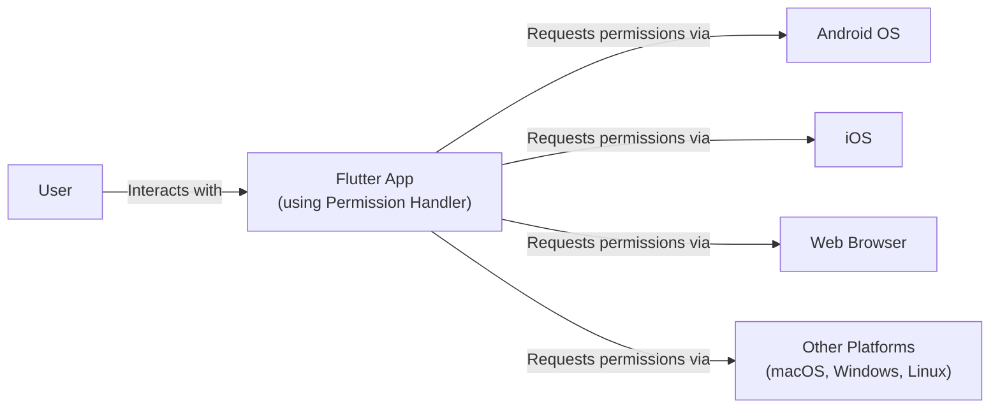
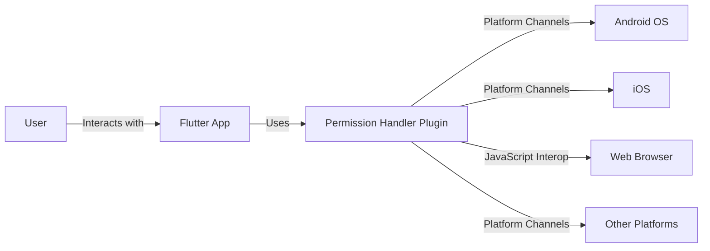
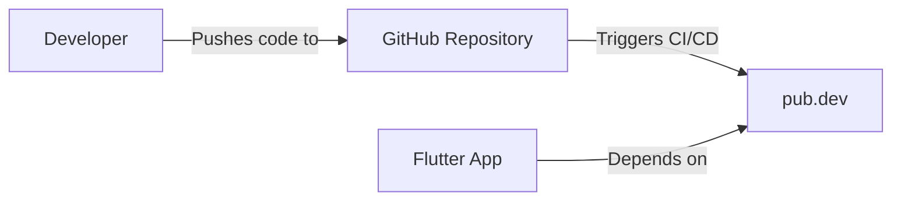
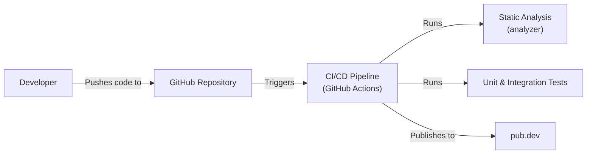

Okay, let's create a design document for the Flutter Permission Handler project.

# BUSINESS POSTURE

Business Priorities and Goals:

*   Provide a simple, unified way for Flutter developers to request and manage permissions across different platforms (Android, iOS, web, etc.).
*   Reduce boilerplate code and complexity for developers when dealing with permissions.
*   Improve the user experience by making permission requests more consistent and reliable.
*   Maintain a high level of compatibility with different Flutter versions and platform-specific permission models.
*   Provide a well-documented and easy-to-use API.
*   Ensure the library is lightweight and doesn't significantly impact app performance.
*   Foster a community around the project to encourage contributions and address user needs.

Most Important Business Risks:

*   Incorrect permission handling leading to application crashes or unexpected behavior.
*   Security vulnerabilities due to improper permission management, potentially exposing user data or device functionality.
*   Compatibility issues with future Flutter or platform updates, breaking existing implementations.
*   Negative user reviews and decreased adoption due to poor usability or performance.
*   Lack of community support and maintenance, leading to the project becoming outdated or abandoned.
*   Legal or compliance issues related to privacy regulations if permissions are not handled correctly.

# SECURITY POSTURE

Existing Security Controls:

*   security control: The library itself acts as a security control by abstracting the complexities of platform-specific permission APIs, reducing the risk of developer error. (Described in the project's README and documentation).
*   security control: Follows best practices for Flutter development, including using official platform channels for communication. (Implicit in the codebase and Flutter's architecture).
*   security control: The project uses static analysis tools (analyzer package) to identify potential code quality and security issues. (Visible in the project's pubspec.yaml and analysis options).
*   security control: Unit and integration tests are used to verify the functionality and correctness of the permission handling logic. (Present in the project's test directory).
*   security control: The library is open-source, allowing for community review and contributions, which can help identify and address security vulnerabilities. (GitHub repository).

Accepted Risks:

*   accepted risk: The library relies on the underlying platform's permission system, so any vulnerabilities or limitations in those systems are inherited.
*   accepted risk: The library may not cover every possible permission or edge case, requiring developers to handle some scenarios manually.
*   accepted risk: Future platform updates may introduce breaking changes that require updates to the library.

Recommended Security Controls:

*   security control: Implement a comprehensive security review process, including regular code audits and penetration testing.
*   security control: Add more robust error handling and input validation to prevent unexpected behavior or crashes.
*   security control: Provide clear security guidelines and best practices in the documentation, including how to handle sensitive permissions and data.
*   security control: Consider adding support for runtime permission monitoring or auditing to detect any unauthorized permission usage.

Security Requirements:

*   Authentication: Not directly applicable, as the library deals with device permissions, not user authentication.
*   Authorization: The library's primary function is to facilitate authorization by requesting and checking permissions granted by the user/operating system. The library should accurately reflect the permission status.
*   Input Validation: The library should validate inputs to its API methods to prevent unexpected behavior or crashes. For example, it should handle invalid permission names or unsupported platforms gracefully.
*   Cryptography: Not directly applicable, as the library doesn't handle encryption or cryptographic operations. However, if the library were to handle sensitive data related to permissions, encryption at rest and in transit should be considered.

# DESIGN

## C4 CONTEXT

Context Diagram Element List:

*   Element:
    *   Name: User
    *   Type: Person
    *   Description: The end-user of the Flutter application.
    *   Responsibilities: Interacts with the Flutter application, grants or denies permission requests.
    *   Security controls: Relies on the operating system's permission model and user interface for managing permissions.

*   Element:
    *   Name: Flutter App (using Permission Handler)
    *   Type: Software System
    *   Description: A Flutter application that uses the Permission Handler library to manage permissions.
    *   Responsibilities: Requests permissions from the user, handles permission responses, provides functionality based on granted permissions.
    *   Security controls: Uses the Permission Handler library, implements input validation, follows secure coding practices.

*   Element:
    *   Name: Android OS
    *   Type: Software System
    *   Description: The Android operating system.
    *   Responsibilities: Manages application permissions, presents permission dialogs to the user, enforces permission restrictions.
    *   Security controls: Android's built-in permission system, sandboxing, app signing.

*   Element:
    *   Name: iOS
    *   Type: Software System
    *   Description: The iOS operating system.
    *   Responsibilities: Manages application permissions, presents permission dialogs to the user, enforces permission restrictions.
    *   Security controls: iOS's built-in permission system, sandboxing, app signing.

*   Element:
    *   Name: Web Browser
    *   Type: Software System
    *   Description: A web browser (e.g., Chrome, Safari, Firefox).
    *   Responsibilities: Manages web application permissions, presents permission prompts to the user, enforces permission restrictions.
    *   Security controls: Browser's built-in permission model, sandboxing, site isolation.

*   Element:
    *   Name: Other Platforms (macOS, Windows, Linux)
    *   Type: Software System
    *   Description: Other operating systems supported by Flutter.
    *   Responsibilities: Manage application permissions, present permission dialogs/prompts to the user, enforce permission restrictions.
    *   Security controls: Each platform's respective built-in permission system, sandboxing, and other security mechanisms.

## C4 CONTAINER

Container Diagram Element List:

*   Element:
    *   Name: User
    *   Type: Person
    *   Description: The end-user of the Flutter application.
    *   Responsibilities: Interacts with the Flutter application, grants or denies permission requests.
    *   Security controls: Relies on the operating system's permission model and user interface.

*   Element:
    *   Name: Flutter App
    *   Type: Mobile App
    *   Description: A Flutter application that uses the Permission Handler library.
    *   Responsibilities: Requests permissions, handles responses, provides functionality.
    *   Security controls: Uses the Permission Handler library, implements input validation.

*   Element:
    *   Name: Permission Handler Plugin
    *   Type: Library
    *   Description: The Permission Handler library code.
    *   Responsibilities: Provides a unified API for requesting and managing permissions, abstracts platform-specific details.
    *   Security controls: Input validation, error handling, follows secure coding practices.

*   Element:
    *   Name: Android OS
    *   Type: Software System
    *   Description: The Android operating system.
    *   Responsibilities: Manages permissions, presents dialogs, enforces restrictions.
    *   Security controls: Android's built-in permission system.

*   Element:
    *   Name: iOS
    *   Type: Software System
    *   Description: The iOS operating system.
    *   Responsibilities: Manages permissions, presents dialogs, enforces restrictions.
    *   Security controls: iOS's built-in permission system.

*   Element:
    *   Name: Web Browser
    *   Type: Software System
    *   Description: A web browser.
    *   Responsibilities: Manages web app permissions, presents prompts, enforces restrictions.
    *   Security controls: Browser's built-in permission model.

*   Element:
    *   Name: Other Platforms
    *   Type: Software System
    *   Description: Other operating systems supported by Flutter.
    *   Responsibilities: Manage application permissions.
    *   Security controls: Each platform's respective built-in permission system.

## DEPLOYMENT

Possible Deployment Solutions:

1.  **As a Flutter Package:** The primary deployment method is as a Flutter package hosted on pub.dev. Developers add the package as a dependency in their pubspec.yaml file.
2.  **Direct GitHub Integration:** Developers can also directly integrate the library from the GitHub repository, although this is less common.

Chosen Solution (Detailed Description): **As a Flutter Package**

Deployment Diagram Element List:

*   Element:
    *   Name: Developer
    *   Type: Person
    *   Description: The developer of the Permission Handler library.
    *   Responsibilities: Writes code, tests, publishes the package.
    *   Security controls: Uses secure coding practices, strong authentication for GitHub and pub.dev.

*   Element:
    *   Name: GitHub Repository
    *   Type: Code Repository
    *   Description: The source code repository for the Permission Handler library.
    *   Responsibilities: Stores the code, manages versions, triggers CI/CD pipelines.
    *   Security controls: Access controls, branch protection rules, code review processes.

*   Element:
    *   Name: pub.dev
    *   Type: Package Repository
    *   Description: The official package repository for Flutter and Dart.
    *   Responsibilities: Hosts the Permission Handler package, makes it available to developers.
    *   Security controls: Package signing, integrity checks, vulnerability scanning.

*   Element:
    *   Name: Flutter App
    *   Type: Mobile App
    *   Description: A Flutter application that uses the Permission Handler library.
    *   Responsibilities: Includes the Permission Handler package as a dependency.
    *   Security controls: Relies on pub.dev for secure package delivery.

## BUILD

The build process for the Permission Handler library involves several steps, automated through CI/CD pipelines (likely GitHub Actions, based on the repository).

Build Process Description:

1.  **Code Push:** A developer pushes code changes to the GitHub repository.
2.  **CI/CD Trigger:** The push triggers a CI/CD pipeline (GitHub Actions).
3.  **Static Analysis:** The pipeline runs static analysis tools (analyzer) to check for code quality and potential security issues.
4.  **Testing:** The pipeline runs unit and integration tests to verify the functionality and correctness of the code.
5.  **Publishing (Conditional):** If the changes are on a specific branch (e.g., main or a release branch) and all checks pass, the pipeline publishes the package to pub.dev.

Security Controls in Build Process:

*   security control: **Static Analysis:** The analyzer helps identify potential vulnerabilities and coding errors early in the development process.
*   security control: **Automated Testing:** Unit and integration tests ensure that the code behaves as expected and that security-related functionality is working correctly.
*   security control: **CI/CD Pipeline:** Automating the build and deployment process reduces the risk of manual errors and ensures consistency.
*   security control: **Dependency Management:** pub.dev provides a secure way to manage dependencies and ensure that the Flutter app is using the correct version of the Permission Handler library.
*   security control: **Code Review:** GitHub's pull request system facilitates code review, allowing other developers to examine the code for security vulnerabilities before it is merged.

# RISK ASSESSMENT

Critical Business Processes to Protect:

*   **Application Functionality:** Ensuring the application functions correctly and provides the intended features to the user.
*   **User Experience:** Maintaining a positive user experience by handling permissions gracefully and avoiding crashes or unexpected behavior.
*   **Reputation:** Protecting the reputation of the application and the developer by avoiding security incidents and negative reviews.

Data to Protect and Sensitivity:

*   **Permission Status:** The library handles information about which permissions have been granted or denied. While not directly sensitive personal data, this information is crucial for the application's functionality and could be misused if accessed or modified maliciously. Sensitivity: Low-Medium.
*   **Potentially Sensitive Data Accessed via Permissions:** The library itself doesn't directly handle sensitive data, but it enables access to features that might handle such data (e.g., camera, microphone, contacts, location). The sensitivity of this data depends on the specific application and the permissions it requests. Sensitivity: Varies (potentially High).

# QUESTIONS & ASSUMPTIONS

Questions:

*   Are there any specific compliance requirements (e.g., GDPR, CCPA) that the library needs to consider?
*   Are there any plans to support additional platforms beyond the currently supported ones?
*   What is the expected frequency of updates and releases for the library?
*   What is the process for reporting and addressing security vulnerabilities in the library?

Assumptions:

*   BUSINESS POSTURE: The primary goal is to provide a reliable and easy-to-use permission handling solution for Flutter developers.
*   SECURITY POSTURE: The library relies on the underlying platform's security mechanisms for enforcing permissions.
*   DESIGN: The library's design prioritizes simplicity and ease of use, abstracting away platform-specific complexities.
*   DESIGN: Developers using the library are responsible for handling the data accessed through granted permissions securely.
*   DESIGN: The CI/CD pipeline is configured to run static analysis and tests on every code push.
*   DESIGN: The library is published to pub.dev as the primary distribution method.