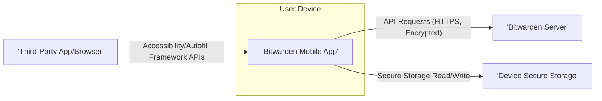
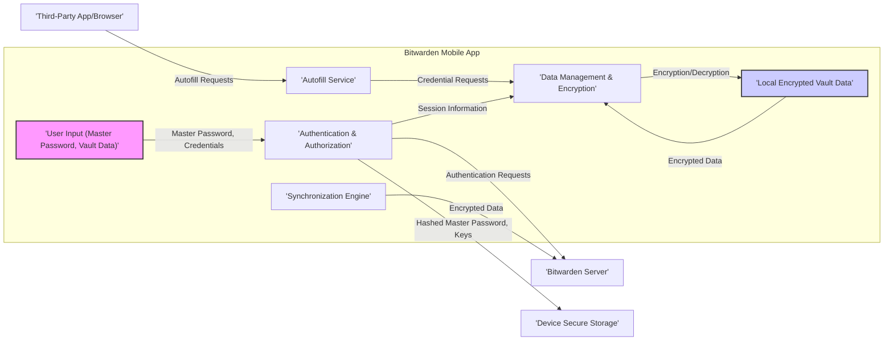

# Project Design Document: Bitwarden Mobile Application

**Version:** 1.1
**Date:** October 26, 2023
**Author:** AI Software Architect

## 1. Introduction

This document provides a detailed design of the Bitwarden mobile application, focusing on its architectural components, their interactions, and the flow of data. This document is intended to serve as a comprehensive reference for understanding the system's structure and will be a key input for subsequent threat modeling exercises. The design is based on the publicly available codebase at [https://github.com/bitwarden/mobile](https://github.com/bitwarden/mobile). This revision aims to provide greater clarity and detail compared to the previous version.

## 2. Goals and Objectives

The primary goals of the Bitwarden mobile application are:

*   To provide users with secure and reliable access to their Bitwarden vault from their mobile devices.
*   To enable users to easily generate strong and unique passwords for various online accounts.
*   To seamlessly facilitate the automatic filling of usernames and passwords within other mobile applications and web browsers accessed on the device.
*   To allow users to efficiently manage their stored vault items, including passwords, secure notes, credit card details, and identities.
*   To ensure secure and reliable synchronization of vault data between the mobile application and the Bitwarden server.
*   To offer convenient and secure access to the application through biometric authentication methods.
*   To maintain a robust security posture and protect sensitive user data against unauthorized access and breaches.

## 3. High-Level Architecture

The Bitwarden mobile application interacts with the following core components within its ecosystem:

*   **Bitwarden Mobile Application:** The client-side application installed on the user's mobile device (e.g., iOS or Android). This is the primary interface for user interaction.
*   **Bitwarden Server Infrastructure:** The backend infrastructure hosted by Bitwarden, responsible for the persistent storage and secure synchronization of encrypted user vault data. This includes authentication services.
*   **Device Secure Storage Mechanisms:** The operating system's built-in secure storage facilities (e.g., iOS Keychain, Android Keystore). These are used to securely store sensitive local data, such as the hashed master password and encryption keys.
*   **Target Applications and Browsers:** The third-party applications and mobile web browsers where the Bitwarden mobile application provides autofill functionality.

## 4. Detailed Component Design

The Bitwarden mobile application is composed of several key modules, each with specific responsibilities:

*   **User Interface (UI) Layer:**
    *   **Purpose:**  Responsible for rendering the application's visual elements and handling user interactions.
    *   **Components:** Includes screens for user login, vault item listing and management, password generation, application settings, and prompts for autofill suggestions.
    *   **Technology:**  Utilizes platform-specific UI components or cross-platform frameworks (e.g., Flutter widgets) to create the user interface.
*   **Authentication and Authorization Module:**
    *   **Purpose:** Manages user login and logout procedures, verifying user identity.
    *   **Functions:** Handles the secure storage and retrieval of the hashed master password from the device's secure storage. Implements biometric authentication flows (e.g., fingerprint, facial recognition) using platform APIs. Communicates with the Bitwarden server for initial authentication and session management.
*   **Data Management and Encryption Module:**
    *   **Purpose:** Responsible for the local management and secure handling of the user's encrypted vault data.
    *   **Functions:**  Handles the encryption and decryption of vault items using the encryption key derived from the master password. Provides functionalities for creating, reading, updating, and deleting vault items. Manages the local storage of the encrypted vault data.
*   **Synchronization Engine:**
    *   **Purpose:** Manages the secure synchronization of the local encrypted vault data with the Bitwarden server.
    *   **Functions:** Establishes and maintains secure HTTPS connections with the Bitwarden server. Implements the logic for uploading local changes to the server and downloading remote changes. Handles potential synchronization conflicts. May perform background synchronization tasks.
*   **Autofill Service Implementation:**
    *   **Purpose:** Provides the core functionality for automatically filling login credentials and other data within other applications and browsers.
    *   **Functions:**  Utilizes platform-specific accessibility or autofill APIs (e.g., `AccessibilityService` on Android, AutoFill framework on iOS) to detect login fields. Securely retrieves relevant credentials from the locally decrypted vault. Presents autofill suggestions to the user.
*   **Password Generator Component:**
    *   **Purpose:** Allows users to generate strong, cryptographically secure random passwords.
    *   **Functions:** Provides options for customizing password length, character sets (uppercase, lowercase, numbers, symbols), and other criteria.
*   **Settings and Configuration Manager:**
    *   **Purpose:**  Provides users with options to configure the application's behavior and preferences.
    *   **Functions:** Manages settings such as auto-lock timers, biometric authentication preferences, server URL configuration (for self-hosted instances), and other application-specific settings.
*   **Secure Storage Abstraction Layer:**
    *   **Purpose:** Provides an abstraction layer for interacting with the underlying device's secure storage mechanisms.
    *   **Functions:**  Handles the secure storage and retrieval of sensitive data, such as the hashed master password, encryption keys, and potentially API tokens. Isolates the application logic from platform-specific secure storage implementations.
*   **Networking and API Client:**
    *   **Purpose:** Manages all network communication between the mobile application and the Bitwarden server.
    *   **Functions:**  Establishes secure HTTPS connections. Handles API request construction, sending, and response processing. Implements error handling and retry mechanisms for network requests. May include certificate pinning for enhanced security.

## 5. Data Flow

The following outlines the typical flow of data within the Bitwarden mobile application during key operations:

*   **User Login Process:**
    *   The user enters their master password into the application's login screen.
    *   The application hashes the master password using a secure hashing algorithm (e.g., Argon2).
    *   The hashed master password is used to derive the encryption key for the user's vault.
    *   The hashed master password is securely stored in the device's secure storage.
    *   The application authenticates with the Bitwarden server using the user's email address and either the master password directly (during initial setup) or a derived authentication key.
*   **Vault Data Synchronization:**
    *   The application initiates a synchronization request to the Bitwarden server.
    *   The server responds with the latest encrypted vault data for the user.
    *   The mobile application decrypts the received vault data using the derived encryption key.
    *   The decrypted vault data is stored locally in memory and potentially in an encrypted local database or file.
    *   Local changes made by the user are encrypted and sent to the server for synchronization.
*   **Adding a New Vault Item:**
    *   The user enters the details of the new vault item (e.g., website URL, username, password, notes).
    *   The application encrypts the item's details using the derived encryption key.
    *   The encrypted vault item is stored locally.
    *   The encrypted vault item is then sent to the Bitwarden server for synchronization.
*   **Autofill Operation:**
    *   The user navigates to a login screen within another application or a web browser.
    *   The operating system's autofill framework detects the login fields and triggers the Bitwarden mobile application's autofill service.
    *   The Bitwarden application identifies matching credentials based on the URL or application identifier.
    *   The application decrypts the relevant credentials from the local vault.
    *   The decrypted credentials are securely passed back to the operating system's autofill framework, which then populates the login fields.
*   **User Logout Process:**
    *   The application clears the decrypted vault data from memory.
    *   The encryption key is discarded from memory.
    *   The user may be required to re-authenticate with their master password or biometric authentication upon the next application launch.

## 6. Security Considerations

Security is of paramount importance for the Bitwarden mobile application. Key security considerations include:

*   **Master Password Strength and Security:** The security of the entire vault hinges on the strength and secrecy of the user's master password. The application should enforce strong password policies and guide users in creating robust passwords.
*   **End-to-End Encryption:** All vault data is encrypted on the user's device before being transmitted to the server and remains encrypted at rest on the server. Strong encryption algorithms (e.g., AES-256 in GCM mode) should be employed.
*   **Secure Local Storage:** Sensitive information, such as the hashed master password and encryption keys, must be stored securely using platform-provided secure storage mechanisms (Keychain/Keystore) to prevent unauthorized access even if the device is compromised.
*   **Biometric Authentication Security:** Biometric authentication should be implemented securely, leveraging platform APIs and adhering to best practices to prevent bypasses or unauthorized access. Sensitive biometric data should not be directly accessible to the application.
*   **Secure Network Communication:** All communication with the Bitwarden server must be conducted over HTTPS with proper TLS configuration, including certificate validation and ideally certificate pinning, to prevent man-in-the-middle attacks.
*   **Code Security Practices:** The application code should be developed following secure coding principles to mitigate vulnerabilities such as injection flaws, buffer overflows, and data leaks. Regular static and dynamic code analysis should be performed.
*   **Autofill Service Security:** The autofill mechanism must be implemented securely to prevent malicious applications from intercepting or manipulating credentials. Platform-provided APIs should be used correctly and with appropriate security configurations.
*   **Protection Against Key Derivation Attacks:**  Strong key derivation functions (e.g., Argon2) with appropriate salt and iteration counts should be used to derive encryption keys from the master password, making brute-force attacks more difficult.
*   **Regular Security Audits and Penetration Testing:** Independent security audits and penetration testing should be conducted regularly to identify and address potential vulnerabilities in the application.
*   **Software Updates and Patching:** A robust mechanism for delivering and applying security updates is crucial to address newly discovered vulnerabilities promptly.

## 7. Dependencies

The Bitwarden mobile application relies on various external components and services:

*   **Operating System APIs:** Platform-specific APIs provided by iOS and Android for UI rendering, secure storage access (Keychain/Keystore), networking, background tasks, and accessibility/autofill functionalities.
*   **Third-Party Libraries and SDKs:**
    *   **Networking Libraries:** For handling HTTP requests and responses (e.g., `Dio`, `okhttp`).
    *   **Cryptography Libraries:** For implementing encryption, decryption, hashing, and key derivation algorithms (e.g., platform-provided crypto libraries or dedicated crypto libraries).
    *   **Data Parsing and Serialization Libraries:** For handling data formats like JSON (e.g., `dart:convert`, `Gson`).
    *   **UI Framework Libraries:** If using a cross-platform framework like Flutter, it depends on the Flutter SDK and various Flutter packages.
    *   **Biometric Authentication Libraries:** Wrappers or direct use of platform biometric APIs.
*   **Bitwarden Server API:** The specific API endpoints and data formats defined by the Bitwarden server for authentication, synchronization, and other client-server interactions.

## 8. Future Considerations

Potential future enhancements and considerations for the Bitwarden mobile application include:

*   **Enhanced Offline Functionality:** Improving the application's ability to access and manage vault data when a network connection is unavailable, potentially through more robust local caching mechanisms.
*   **Hardware Security Key Support:** Integrating support for hardware security keys (e.g., FIDO2) for multi-factor authentication.
*   **Integration with Other Security Tools:** Exploring integrations with other security applications or services for enhanced security posture.
*   **Improved User Experience for Complex Items:** Refining the UI/UX for managing more complex vault item types or custom fields.
*   **WatchOS and WearOS Companion Applications:** Developing companion applications for smartwatches to provide quick access to frequently used credentials or generate TOTP codes.
*   **Advanced Search Capabilities:** Implementing more sophisticated search functionalities within the vault.
*   **Account Recovery Enhancements:** Exploring more secure and user-friendly account recovery options.

This revised document provides a more detailed and comprehensive design overview of the Bitwarden mobile application, offering a stronger foundation for understanding its architecture and facilitating thorough threat modeling activities.
