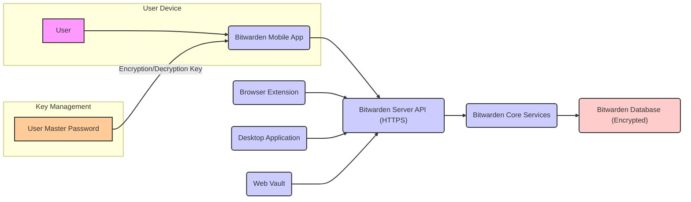

# Project Design Document: Bitwarden Mobile Application

**Version:** 1.1
**Date:** October 26, 2023
**Author:** AI Software Architect

## 1. Introduction

This document provides an enhanced architectural design of the Bitwarden mobile application, based on the codebase available at [https://github.com/bitwarden/mobile](https://github.com/bitwarden/mobile). This revised document aims to provide an even clearer and more detailed understanding of the application's structure, components, and data flow, specifically tailored for effective threat modeling exercises.

## 2. Goals and Scope

The primary goal of this document remains to clearly articulate the design of the Bitwarden mobile application to facilitate thorough security analysis and threat identification. The scope of this document includes:

*   A refined high-level architecture of the application and its interactions with other Bitwarden ecosystem components.
*   A more detailed breakdown of key components within the mobile application, including their responsibilities.
*   Enhanced data flow diagrams illustrating the movement and transformation of sensitive information, emphasizing security boundaries.
*   Identification of key technologies and frameworks used, with considerations for their security implications.
*   An overview of deployment considerations relevant to security.

This document continues to exclude:

*   Specific lines of code or detailed implementation choices.
*   In-depth analysis of the Bitwarden server-side architecture beyond its interaction with the mobile app.
*   Granular details of the user interface and user experience design.
*   Detailed performance metrics and optimization strategies.

## 3. High-Level Architecture

The Bitwarden mobile application acts as a secure client within the broader Bitwarden ecosystem. It relies on the Bitwarden server for core functionalities like account management and data synchronization. The user's master password is the central key for encrypting and decrypting their vault data.

**Key Interactions:**

*   **User Interaction:** The user interacts directly with the mobile application to perform actions such as viewing, adding, editing, and deleting vault items, as well as managing settings.
*   **Secure API Communication:** The mobile application communicates with the Bitwarden Server API using HTTPS, ensuring encrypted communication for sensitive data exchange. This includes authentication, synchronization, and other backend operations.
*   **Data Storage (Local & Remote):** Encrypted vault data is stored both locally on the user's device for offline access and on the Bitwarden database for synchronization and backup. The encryption key is derived from the user's master password.
*   **Cross-Platform Synchronization:** The Bitwarden Server acts as the central point for synchronizing encrypted vault data across all of the user's Bitwarden clients.
*   **Master Password Dependency:** The security of the locally stored and transmitted data is fundamentally dependent on the strength and confidentiality of the user's master password.

## 4. Detailed Component Design

The Bitwarden mobile application comprises several key components, each with specific responsibilities:

*   **User Interface (UI) Layer:**
    *   Renders application screens and handles user interactions.
    *   Examples of screens include: Login/Unlock, Vault View (list of items), Item Detail View, Add/Edit Item, Settings, Password Generator, Auto-Fill settings.
    *   Responsible for presenting information to the user and capturing user input.
    *   May utilize platform-specific UI elements or a cross-platform framework's UI components.
*   **Core Logic Layer (Business Logic):**
    *   Implements the core functionality of the application.
    *   Handles encryption and decryption of vault data using the key derived from the master password.
    *   Manages local database operations (read, write, update, delete).
    *   Orchestrates API calls to the Bitwarden Server for synchronization, account management, etc.
    *   Implements password generation logic based on user-defined criteria.
    *   Manages the application's state and data flow.
*   **Data Storage Layer (Local):**
    *   Responsible for the persistent storage of encrypted vault data on the device.
    *   Utilizes secure platform-specific storage mechanisms such as:
        *   iOS: Keychain
        *   Android: Keystore/Keymaster
    *   May involve caching mechanisms for performance, ensuring sensitive data is not cached insecurely.
*   **Networking Layer:**
    *   Handles all communication with the Bitwarden Server API.
    *   Implements secure HTTPS communication, including certificate validation.
    *   Manages API request construction, sending, and response processing.
    *   Handles authentication headers and token management.
*   **Authentication and Authorization Layer (Client-Side):**
    *   Handles user authentication against the Bitwarden Server during login.
    *   Manages the secure storage and retrieval of authentication tokens (e.g., refresh tokens).
    *   Integrates with device biometric authentication (e.g., Face ID, Touch ID, Fingerprint) for unlocking the application after the initial login.
    *   Manages the application's lock state and timeout mechanisms.
*   **Auto-Fill Service:**
    *   Provides the capability to automatically fill usernames and passwords in other apps and web browsers.
    *   Leverages platform-specific accessibility APIs or auto-fill frameworks.
    *   Requires secure communication with the main application process to retrieve decrypted credentials.
    *   Context awareness is crucial to ensure credentials are only filled in the correct context.
*   **Background Synchronization Service:**
    *   Periodically synchronizes the local vault data with the Bitwarden Server in the background.
    *   Handles potential synchronization conflicts and ensures data consistency across devices.
    *   Needs to manage network connectivity and battery usage efficiently.
*   **Settings and Configuration Management:**
    *   Allows users to configure application settings such as:
        *   Auto-lock timer
        *   Biometric unlock preference
        *   Theme selection
        *   Server URL (for self-hosted instances)
        *   Notification settings
    *   Stores these settings securely.

## 5. Data Flow

The following diagram illustrates the data flow for a common scenario: logging into a website using the Bitwarden mobile app's auto-fill feature.

```mermaid
graph LR
    subgraph "User Interaction"
        A["User Navigates to Login Page"] --> B("Auto-Fill Request Triggered");
    end
    subgraph "Mobile App (Auto-Fill Service)"
        B --> C("Identify Matching Credentials");
        C --> D("Request Decrypted Credentials from Main App");
    end
    subgraph "Mobile App (Main Application)"
        D --> E("Retrieve Encrypted Data from Local Storage");
        E --> F("Decrypt Data using Master Password Key");
        F --> G("Send Decrypted Credentials to Auto-Fill Service");
    end
    subgraph "Target Application/Browser"
        G --> H("Fill Username and Password Fields");
    end

    style A fill:#e0e0ff,stroke:#333,stroke-width:1px
    style B fill:#e0ffe0,stroke:#333,stroke-width:1px
    style C fill:#ffe0e0,stroke:#333,stroke-width:1px
    style D fill:#e0e0ff,stroke:#333,stroke-width:1px
    style E fill:#ffe0e0,stroke:#333,stroke-width:1px
    style F fill:#e0ffe0,stroke:#333,stroke-width:1px
    style G fill:#e0e0ff,stroke:#333,stroke-width:1px
    style H fill:#ffe0ff,stroke:#333,stroke-width:1px

    linkStyle 0,1,2,3,4,5,6 stroke:#333, stroke-width: 2px;
```

**Data Flow Description (Auto-Fill Scenario):**

1. **User Interaction:** The user navigates to a login page in another application or a web browser on their mobile device.
2. **Auto-Fill Trigger:** The Bitwarden auto-fill service detects the login context (e.g., by analyzing the URL or application package name).
3. **Credential Matching:** The auto-fill service attempts to identify matching credentials stored in the local vault.
4. **Decryption Request:** The auto-fill service requests the decrypted credentials from the main Bitwarden application process.
5. **Data Retrieval:** The main application retrieves the relevant encrypted credential data from secure local storage.
6. **Decryption:** The main application decrypts the data using the key derived from the user's master password (which is held in memory or securely accessed).
7. **Credential Transmission:** The decrypted credentials are securely transmitted back to the auto-fill service.
8. **Credential Filling:** The auto-fill service fills the username and password fields in the target application or browser.

## 6. Security Considerations (Focus for Threat Modeling)

The following security considerations are crucial for threat modeling the Bitwarden mobile application:

*   **Master Password as a Single Point of Failure:**  A weak or compromised master password undermines the entire security model.
*   **Secure Storage of Encrypted Data:** Vulnerabilities in the platform's secure storage mechanisms could expose encrypted vault data.
*   **Memory Security:**  Sensitive data, including the decrypted vault and master password (or derived key), exists in memory and could be vulnerable to memory scraping attacks.
*   **Inter-Process Communication (IPC) Security:** The communication between the main application and the auto-fill service needs to be secure to prevent unauthorized access to decrypted credentials.
*   **Auto-Fill Context Spoofing:**  Potential for malicious applications to trick the auto-fill service into filling credentials in unintended contexts.
*   **Side-Channel Attacks:**  Consideration of potential side-channel attacks on encryption and decryption processes.
*   **Key Derivation Function (KDF) Strength:** The strength of the KDF used to derive encryption keys from the master password is critical.
*   **Software Supply Chain Security:**  Risks associated with third-party libraries and dependencies.
*   **Reverse Engineering and Code Tampering:**  Protection against reverse engineering and attempts to tamper with the application's code.
*   **Data Leakage through Logs or Caches:**  Ensuring sensitive data is not inadvertently logged or cached insecurely.
*   **Biometric Authentication Security:**  The security of the biometric authentication mechanisms used to unlock the application.

## 7. Technology Stack

Based on common mobile development practices and the nature of the application, the Bitwarden mobile application likely utilizes the following technologies:

*   **Cross-Platform Framework:**  Likely **Flutter** or **React Native**, allowing for a single codebase to target both iOS and Android. This choice impacts security considerations related to the framework's security model and potential vulnerabilities.
*   **Programming Language:**  Corresponding to the framework: **Dart** (Flutter) or **JavaScript/TypeScript** (React Native).
*   **Networking Library:**
    *   Flutter: `dio`, `http`
    *   React Native: `axios`, `fetch`
    *   Security considerations include proper TLS/SSL implementation and certificate validation.
*   **Encryption Library:**  Platform-specific or cross-platform libraries for cryptographic operations:
    *   Examples: `libsodium`, `flutter_sodium`, platform-provided crypto APIs (e.g., `CryptoKit` on iOS, `java.security` on Android).
    *   Crucial for secure encryption and decryption of vault data.
*   **Local Storage:** Secure storage mechanisms provided by the operating system:
    *   iOS: `Keychain` (for sensitive data like encryption keys), `UserDefaults` (for non-sensitive settings).
    *   Android: `Keystore` (for cryptographic keys), `SharedPreferences` (for settings).
*   **State Management:** Libraries for managing application state:
    *   Flutter: `Provider`, `BLoC/Cubit`, `Riverpod`
    *   React Native: `Redux`, `Context API`, `Recoil`
    *   Important for managing the flow of sensitive data within the application.
*   **UI Framework:**  UI components provided by the chosen framework (e.g., Material Design widgets in Flutter, native components or UI libraries in React Native).
*   **Biometric Authentication API:** Platform-specific APIs for biometric authentication:
    *   iOS: `LocalAuthentication` framework
    *   Android: `BiometricPrompt` API
*   **Auto-Fill API:** Platform-specific APIs for implementing the auto-fill functionality:
    *   iOS: AutoFill framework
    *   Android: Autofill framework

## 8. Deployment

The Bitwarden mobile application is deployed through the official app stores, which have their own security review processes:

*   **Apple App Store (iOS):** Requires adherence to Apple's security guidelines and code signing.
*   **Google Play Store (Android):**  Utilizes Google Play Protect for malware scanning and security checks.

Deployment considerations relevant to security include:

*   **Code Signing:** Ensuring the application is signed with valid developer certificates to prevent tampering.
*   **App Store Security Scans:**  Understanding the limitations and effectiveness of app store security reviews.
*   **Distribution Channels:**  Focus on official app stores to minimize the risk of users installing compromised versions.

## 9. Future Considerations

Future design enhancements and security considerations might involve:

*   **Hardware Security Key Integration:**  Adding support for hardware security keys as a second factor for unlocking the vault.
*   **Advanced Threat Detection:** Implementing mechanisms to detect and respond to potential security threats.
*   **Improved Key Management:** Exploring more advanced key management strategies.
*   **Regular Security Audits:**  Conducting regular third-party security audits and penetration testing.

This improved design document provides a more detailed and security-focused overview of the Bitwarden mobile application's architecture. It aims to be a valuable resource for conducting thorough threat modeling and identifying potential security vulnerabilities.