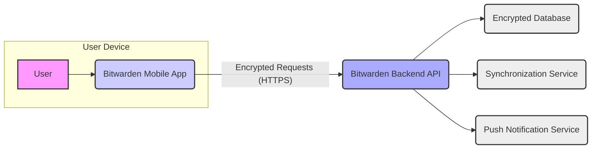

# Project Design Document: Bitwarden Mobile Application

**Version:** 1.1
**Date:** October 26, 2023
**Author:** AI Cloud & Security Architect

## 1. Introduction

This document provides an enhanced design overview of the Bitwarden mobile application, an open-source password manager designed for secure storage and management of sensitive credentials and private information. This iteration builds upon the previous version, offering more granular detail and clarity, specifically tailored for effective threat modeling. The focus remains on core functionalities and architectural elements pertinent to security analysis.

## 2. Goals and Objectives

The primary goals of the Bitwarden mobile application are:

*   Provide a highly secure and intuitive user interface for accessing and managing encrypted user vaults.
*   Ensure seamless and secure synchronization of encrypted vault data across a user's authorized devices.
*   Offer essential features such as secure auto-fill capabilities, robust password generation, and encrypted secure notes.
*   Maintain a strong commitment to user security and privacy through robust cryptographic practices and secure development methodologies.
*   Integrate seamlessly within the broader Bitwarden ecosystem, encompassing the web vault, browser extensions, and desktop applications.

## 3. High-Level Architecture

The Bitwarden mobile application functions as a client-side application that securely interacts with the Bitwarden backend services. All communication is encrypted.



**Components:**

*   **User:** The individual directly interacting with the Bitwarden mobile application on their device.
*   **Bitwarden Mobile App:** The native application installed on the user's mobile device (typically iOS or Android). This handles local encryption/decryption and UI.
*   **Bitwarden Backend API:** A secure API endpoint responsible for user authentication, authorization, encrypted data retrieval, and modification requests. All communication is strictly over HTTPS.
*   **Encrypted Database:** The persistent storage on the Bitwarden servers where user vault data is stored in an encrypted format. The encryption keys are not stored with the data.
*   **Synchronization Service:**  Manages the secure and consistent synchronization of encrypted vault data between the mobile application and the backend, handling potential conflicts.
*   **Push Notification Service:** Facilitates the delivery of push notifications to the mobile application for events like login approvals and other account-related alerts.

## 4. Detailed Component Architecture (Mobile Application)

The Bitwarden mobile application is composed of several key logical components, each with specific responsibilities:

*   **User Interface (UI) Layer:**
    *   Presents the application's visual interface to the user, handling user input and displaying information.
    *   Includes screens for login/registration, vault item management (viewing, creating, editing), application settings, and password generation.
    *   Leverages native UI frameworks (e.g., SwiftUI/UIKit for iOS, Jetpack Compose/Android Views for Android) for optimal platform integration.
*   **Authentication and Authorization Module:**
    *   Manages the user login and registration flows, securely handling credentials.
    *   Stores authentication tokens securely after successful login.
    *   Implements biometric authentication integration (e.g., Face ID, Touch ID, Fingerprint) for convenient and secure access.
    *   Communicates with the Bitwarden Backend API for authentication and session management, likely using protocols like OAuth 2.0.
*   **Vault Management Module:**
    *   Provides core functionality for interacting with the user's encrypted vault data.
    *   Handles the local decryption of vault data upon successful authentication using the user's master password or a derived key.
    *   Manages the encryption of vault data before storing it locally or transmitting it to the backend.
    *   Supports operations like creating, reading, updating, and deleting vault items (logins, secure notes, credit cards, identities).
*   **Synchronization Module:**
    *   Orchestrates the secure synchronization of encrypted vault data between the local device and the Bitwarden backend.
    *   Implements logic for detecting and resolving synchronization conflicts.
    *   Utilizes the Bitwarden Backend API for initiating and managing synchronization processes.
    *   May employ techniques like differential synchronization to minimize data transfer.
*   **Auto-fill Service:**
    *   Enables the automatic filling of usernames and passwords into other applications and web browsers.
    *   Leverages platform-specific accessibility APIs (e.g., AccessibilityService on Android, AutoFill framework on iOS) with appropriate user permissions.
    *   Requires careful security considerations to prevent unauthorized access to credentials.
*   **Password Generator:**
    *   Generates strong, cryptographically random passwords based on user-defined criteria (length, character types).
    *   Operates entirely locally on the device, ensuring no generated passwords are transmitted externally until saved by the user.
*   **Secure Storage Module:**
    *   Responsible for the secure storage of sensitive data locally on the device.
    *   Utilizes platform-provided secure storage mechanisms:
        *   **iOS:** Keychain Services for storing the master password hash, authentication tokens, and potentially cached encrypted vault data.
        *   **Android:** Android Keystore System for storing cryptographic keys and sensitive information.
    *   Employs encryption at rest for locally stored sensitive data.
*   **Network Communication Layer:**
    *   Handles all network communication between the mobile application and the Bitwarden Backend API.
    *   Enforces the use of HTTPS for all API requests, ensuring data confidentiality and integrity during transit.
    *   Manages API request construction, response parsing, and error handling.
*   **Settings and Configuration Module:**
    *   Allows users to customize application behavior and security settings.
    *   Includes options for configuring auto-fill behavior, biometric authentication, security timeout settings, and notification preferences.
*   **Background Services/Tasks:**
    *   May include background processes for periodic synchronization, monitoring for auto-fill requests, or handling push notifications.
    *   Operates within the constraints and lifecycle management of the mobile operating system.

## 5. Data Flow

Here are detailed data flow scenarios illustrating key interactions:

*   **User Login:**
    *   The user enters their registered email address and master password into the mobile application's UI.
    *   The application locally hashes the master password using a strong key derivation function (e.g., PBKDF2 with a salt).
    *   The application sends the email address and the hashed master password to the Bitwarden Backend API over an HTTPS connection.
    *   The backend retrieves the stored salted hash of the user's master password.
    *   The backend performs the same hashing algorithm on the received password and compares it to the stored hash.
    *   Upon successful verification, the backend generates and returns an authentication token (e.g., a JWT) to the mobile application over HTTPS.
    *   The mobile application securely stores the authentication token using the platform's secure storage mechanisms.

    ```mermaid
    graph LR
        A["User"] --> B("Mobile App UI");
        B --> C("Authentication Module");
        C -- "Email, Hashed Master Password (HTTPS)" --> D("Bitwarden Backend API");
        D -- "Authentication Token (HTTPS)" --> C;
        C --> E("Secure Storage");
        style A fill:#f9f,stroke:#333,stroke-width:2px
        style B fill:#ccf,stroke:#333,stroke-width:2px
        style C fill:#ccf,stroke:#333,stroke-width:2px
        style D fill:#aaf,stroke:#333,stroke-width:2px
        style E fill:#eee,stroke:#333,stroke-width:2px
    ```

*   **Retrieving and Decrypting Vault Items:**
    *   The user successfully authenticates to the mobile application (either via master password or biometric authentication).
    *   The application checks for locally cached encrypted vault data. If not present or outdated, it requests the encrypted vault data from the Bitwarden Backend API over HTTPS, including the authentication token.
    *   The backend retrieves the user's encrypted vault data from the database and sends it to the mobile application over HTTPS.
    *   The mobile application decrypts the received vault data locally using the user's master password (or a key derived from it). This decryption happens within the Vault Management Module.
    *   The decrypted vault items are then securely stored in memory for display to the user.

    ```mermaid
    graph LR
        A["User"] --> B("Mobile App UI");
        B --> C("Vault Management Module");
        C -- "Request Encrypted Vault Data (HTTPS)" --> D("Bitwarden Backend API");
        D -- "Encrypted Vault Data Payload (HTTPS)" --> C;
        C -- "Decrypt with Master Password" --> E("Decrypted Vault Data");
        style A fill:#f9f,stroke:#333,stroke-width:2px
        style B fill:#ccf,stroke:#333,stroke-width:2px
        style C fill:#ccf,stroke:#333,stroke-width:2px
        style D fill:#aaf,stroke:#333,stroke-width:2px
        style E fill:#eee,stroke:#333,stroke-width:2px
    ```

*   **Saving a New Vault Item:**
    *   The user enters the details of a new vault item through the mobile application's UI.
    *   The Vault Management Module encrypts the vault item data locally using the user's master password (or a derived key) before it is stored or transmitted.
    *   The encrypted vault item is sent to the Bitwarden Backend API over HTTPS, along with the authentication token.
    *   The backend stores the encrypted vault item in the database.
    *   The mobile application also stores the encrypted vault item locally in its secure storage.

    ```mermaid
    graph LR
        A["User"] --> B("Mobile App UI");
        B --> C("Vault Management Module");
        C -- "Encrypt Vault Item" --> D("Encrypted Vault Item Data");
        D -- "Send Encrypted Data (HTTPS)" --> E("Bitwarden Backend API");
        E -- "Store Encrypted Data" --> F("Encrypted Database");
        C -- "Store Encrypted Data Locally" --> G("Secure Storage");
        style A fill:#f9f,stroke:#333,stroke-width:2px
        style B fill:#ccf,stroke:#333,stroke-width:2px
        style C fill:#ccf,stroke:#333,stroke-width:2px
        style D fill:#eee,stroke:#333,stroke-width:2px
        style E fill:#aaf,stroke:#333,stroke-width:2px
        style F fill:#eee,stroke:#333,stroke-width:2px
        style G fill:#eee,stroke:#333,stroke-width:2px
    ```

*   **Synchronization Process:**
    *   The Synchronization Module initiates a synchronization process, either periodically in the background or upon user request.
    *   The mobile application sends any local changes (additions, modifications, deletions of encrypted vault items) to the Bitwarden Backend API over HTTPS, including the authentication token.
    *   The backend processes these changes and sends back any updates from other devices or the web vault to the mobile application, also over HTTPS.
    *   The Synchronization Module merges these updates with the local vault data, handling potential conflicts based on timestamps or other conflict resolution strategies.

    ```mermaid
    graph LR
        A["Mobile App"] --> B("Synchronization Module");
        B -- "Send Local Encrypted Changes (HTTPS)" --> C("Bitwarden Backend API");
        C -- "Receive Backend Encrypted Updates (HTTPS)" --> B;
        B -- "Merge Updates" --> A;
        style A fill:#ccf,stroke:#333,stroke-width:2px
        style B fill:#ccf,stroke:#333,stroke-width:2px
        style C fill:#aaf,stroke:#333,stroke-width:2px
    ```

## 6. Security Considerations

The Bitwarden mobile application incorporates several critical security measures:

*   **End-to-End Encryption:** User vault data is encrypted on the user's device before being transmitted to the server and remains encrypted at rest on the server. Decryption only occurs on the user's authorized devices using their master password or a derived key. The encryption algorithm used is typically AES-256.
*   **Master Password as Key:** The user's master password is the primary key for encrypting and decrypting their vault data. Its strength and secrecy are paramount. The application enforces password complexity requirements and may offer password strength assessments.
*   **Secure Key Derivation:** The master password is not used directly for encryption. Instead, a strong key derivation function (e.g., PBKDF2 with a salt) is used to generate encryption keys, making brute-force attacks more difficult.
*   **Secure Local Storage:** Sensitive information, such as the hashed master password and authentication tokens, are stored using platform-specific secure storage mechanisms (Keychain on iOS, Keystore on Android), which provide hardware-backed encryption and protection against unauthorized access.
*   **HTTPS for All Communication:** All communication between the mobile application and the Bitwarden Backend API is conducted over HTTPS, ensuring encryption of data in transit and protecting against eavesdropping and man-in-the-middle attacks.
*   **Biometric Authentication Security:** Biometric authentication provides a convenient and secure alternative to entering the master password. The application leverages the device's secure enclave or TrustZone for biometric data storage and matching.
*   **Auto-fill Security Measures:** The auto-fill functionality is designed with security in mind, typically requiring user confirmation or interaction before filling credentials. Platform-level security features and permissions are utilized to restrict access and prevent malicious applications from intercepting credentials.
*   **Protection Against Replay Attacks:** Measures are likely in place to prevent replay attacks on API requests, such as using nonces or timestamps in authentication protocols.
*   **Regular Security Audits:** As an open-source project, Bitwarden benefits from community scrutiny and undergoes regular security audits to identify and address potential vulnerabilities.
*   **Two-Factor Authentication (2FA) Support:** The application supports and encourages the use of two-factor authentication for an added layer of security, protecting against password compromise.

## 7. Deployment

The Bitwarden mobile application is primarily deployed through the official application stores:

*   **Apple App Store:** For iOS devices.
*   **Google Play Store:** For Android devices.
*   Potentially through direct APK download for advanced users or specific build channels (though this is less common for general distribution).

## 8. Future Considerations

Potential future enhancements and considerations include:

*   **Enhanced Offline Capabilities:** Further improving the ability to access and manage vault data when the device is completely offline, potentially through more sophisticated local caching mechanisms.
*   **Integration with Hardware Security Keys:** Exploring deeper integration with hardware security keys for enhanced authentication and encryption key management.
*   **Advanced Security Analytics:** Implementing features to detect and alert users about potential security threats or suspicious activity related to their accounts.
*   **Platform-Specific Security Enhancements:** Continuously leveraging new security features and APIs offered by iOS and Android to further strengthen the application's security posture.
*   **Improved Error Handling and Logging:** Implementing more robust error handling and logging mechanisms for debugging and security auditing purposes, while ensuring no sensitive information is logged.

This revised document provides a more detailed and comprehensive design overview of the Bitwarden mobile application, specifically focusing on aspects relevant to security and threat modeling. This enhanced information will be valuable for identifying potential attack vectors and designing appropriate security mitigations.