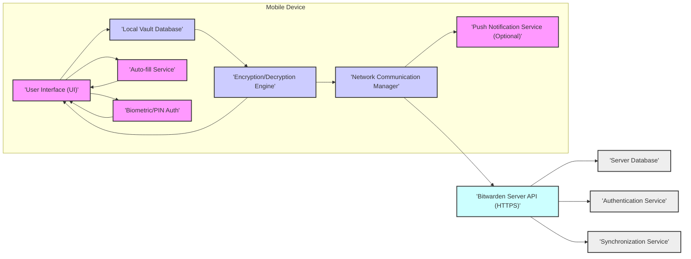
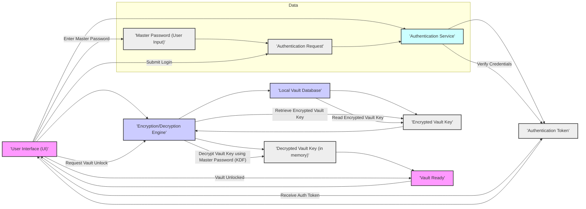
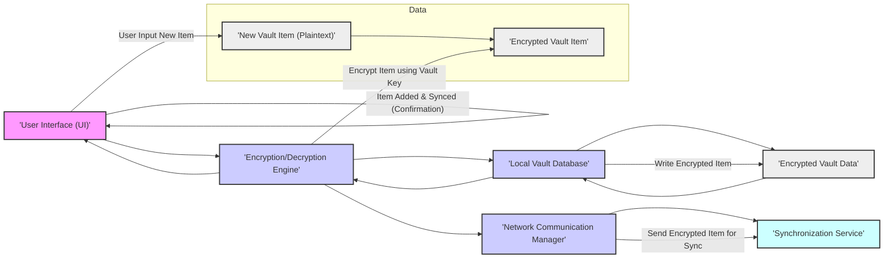

# Project Design Document: Bitwarden Mobile Application

**Version:** 1.1
**Date:** October 26, 2023
**Author:** Gemini (AI Expert in Software, Cloud and Cybersecurity Architecture)
**Project:** Bitwarden Mobile Application (Based on [https://github.com/bitwarden/mobile](https://github.com/bitwarden/mobile))

## 1. Introduction

This document provides a detailed design overview of the Bitwarden mobile application, focusing on architectural components, data flows, and security considerations. It is intended to serve as a foundation for threat modeling, security assessments, and ongoing development. This document outlines the key functionalities, interactions, and security principles of the application, drawing upon publicly available information and general knowledge of password manager applications, with the provided GitHub repository ([https://github.com/bitwarden/mobile](https://github.com/bitwarden/mobile)) as a primary reference for understanding the project's scope and nature.

## 2. Goals and Objectives

The primary goals of the Bitwarden mobile application are:

* **Robust Secure Password Management:** Offer a highly secure and intuitive platform for users to store, organize, and manage their passwords, credentials, and other sensitive digital information.
* **Universal Cross-Platform Accessibility:** Provide seamless access to the Bitwarden vault from various mobile devices operating on both iOS and Android platforms, ensuring a consistent user experience.
* **Real-time Data Synchronization:** Implement efficient and reliable synchronization of vault data across all Bitwarden applications and clients (desktop, browser extensions, web vault, etc.), maintaining data consistency.
* **Convenient Auto-fill Functionality:** Deliver seamless and secure auto-fill capabilities for usernames, passwords, and other credentials within mobile browsers and native applications, enhancing user convenience and security.
* **Reliable Offline Access:** Enable users to access and utilize their vault data even in the absence of an active internet connection, ensuring continuous password management capabilities.
* **Uncompromising Security and Privacy:** Uphold the highest standards of security and user privacy through the implementation of robust end-to-end encryption, secure design principles, and adherence to privacy best practices.
* **User-Friendly Experience:** Design an intuitive and easy-to-use mobile application that simplifies password management for users of all technical levels.

## 3. Target Audience

This document is intended for:

* **Security Engineers and Security Auditors:** To gain a comprehensive understanding of the application's architecture for conducting thorough threat modeling, vulnerability assessments, and security audits.
* **Software Development Team:** To serve as a detailed design specification and reference point for development, testing, maintenance, and future feature implementation.
* **Product Owners and Project Managers:** To understand the technical design, its alignment with product vision and goals, and to facilitate informed decision-making regarding development priorities and resource allocation.
* **DevOps and Infrastructure Teams:** To understand the application's interaction with the server infrastructure and to plan for deployment, monitoring, and maintenance.

## 4. System Architecture

The Bitwarden mobile application employs a client-server architecture, relying on the Bitwarden server infrastructure for account management, synchronization, and optional features. However, core security functionalities, including vault data encryption and decryption, are executed locally on the mobile device, emphasizing client-side security and control.

### 4.1. High-Level Architecture Diagram

### 4.2. Component Description

* **"'User Interface (UI)'"**: This component is responsible for all user interactions with the application. It renders screens, handles user input (touch, gestures, keyboard), and displays vault data in a user-friendly manner. It encompasses screens for login/registration, vault item listing and management, item creation/editing, search, settings, account management, and onboarding flows. It interacts with other local components to retrieve, process, and display information, and to initiate actions based on user input.  It is designed for accessibility and responsiveness across different mobile screen sizes and orientations.
* **"'Local Vault Database'"**: This component provides persistent, encrypted storage for all vault data on the mobile device. It is likely implemented using a robust and performant mobile database solution like SQLite, leveraging platform-specific features for security and efficiency. It stores encrypted vault items (logins, notes, cards, identities, secure notes), folder structures, user settings, application preferences, and potentially cached data for offline access. Data at rest is encrypted, and access is controlled by the application.
* **"'Encryption/Decryption Engine'"**: This is the core security component responsible for all cryptographic operations within the application. It implements the end-to-end encryption scheme, utilizing strong and industry-standard algorithms such as AES-256 for symmetric encryption and robust key derivation functions like PBKDF2-HMAC-SHA256 to derive encryption keys from the user's master password. This component handles:
    * **Encryption of vault data before storage in the local database.**
    * **Decryption of vault data upon retrieval for display or auto-fill.**
    * **Generation and secure management of encryption keys.**
    * **Potentially, implementation of zero-knowledge proof principles to ensure server-side knowledge of user data is minimized.**
* **"'Auto-fill Service'"**: This component enables the seamless auto-filling of usernames, passwords, and other credentials within mobile browsers and other applications. It leverages platform-specific auto-fill APIs (e.g., Android Autofill Framework, iOS AutoFill) to integrate with the operating system's input methods. It securely retrieves decrypted credentials from the local vault and injects them into the relevant fields of web pages or application forms, enhancing user convenience and security by reducing the need for manual password entry. It must adhere to strict security guidelines to prevent unauthorized access or injection into malicious applications.
* **"'Biometric/PIN Auth'"**: This component provides convenient and secure access to the vault after the initial master password login using biometric authentication (fingerprint, facial recognition) or a device PIN/pattern. It integrates with the device's biometric authentication systems (e.g., Android BiometricPrompt, iOS Face ID/Touch ID) and secure keystore/keychain to securely store and manage authentication credentials. It offers a faster and more user-friendly unlock mechanism while maintaining a high level of security. It typically requires fallback to master password authentication after a certain number of failed biometric attempts or device reboot for security reasons.
* **"'Network Communication Manager'"**: This component manages all network communication between the mobile application and the Bitwarden server infrastructure. It utilizes HTTPS for all API requests to ensure secure and encrypted communication, protecting data in transit from eavesdropping and man-in-the-middle attacks. It handles:
    * **Synchronization requests to upload local vault changes and download server-side updates.**
    * **User authentication and session management with the Authentication Service.**
    * **Account management operations (registration, login, password reset, etc.).**
    * **Communication with the Synchronization Service for vault data synchronization.**
    * **Optional communication with the Push Notification Service for real-time alerts and updates.**
    * **Error handling and retry mechanisms for network operations.**
* **"'Push Notification Service (Optional)'"**: This component, if implemented, handles push notifications to the mobile application. It might be used for various purposes, such as:
    * **Two-factor authentication (2FA) push notifications for login verification.**
    * **Alerts for security events or account activity.**
    * **Reminders or notifications related to vault items or features.**
    * **This component relies on platform-specific push notification services (e.g., Firebase Cloud Messaging (FCM) for Android, Apple Push Notification service (APNs) for iOS).**
* **"'Bitwarden Server API (HTTPS)'"**: This represents the backend API exposed by Bitwarden servers. It provides a secure interface for the mobile application to interact with server-side functionalities. It is the entry point for all communication from the mobile app to the backend.
* **"'Server Database'"**: This is the persistent data storage on the Bitwarden server infrastructure. It stores user accounts, encrypted vault data (for server-side backups and synchronization), organizational data (if applicable), and other server-side information. It is designed for high availability, scalability, and data integrity.
* **"'Authentication Service'"**: This server-side service is responsible for user authentication and authorization. It verifies user credentials (username/email and master password), manages user sessions, and issues authentication tokens. It ensures that only authenticated and authorized users can access their vault data and server-side functionalities. It likely implements secure authentication protocols and best practices.
* **"'Synchronization Service'"**: This server-side service handles the synchronization of encrypted vault data between the mobile application and the server database, as well as across different Bitwarden clients used by the same user. It manages data conflicts, ensures data consistency, and optimizes synchronization efficiency.

### 4.3. Data Flow Diagram - User Login and Vault Unlock

This diagram illustrates the data flow during user login and vault unlock using the master password.

### 4.4. Data Flow Diagram - Add New Vault Item

This diagram illustrates the data flow when a user adds a new vault item.

## 5. Security Considerations

This section details key security considerations for the Bitwarden mobile application, crucial for threat modeling and risk mitigation.

* **Master Password Strength and Security:**
    * **Threat:** Weak or compromised master passwords are the single biggest vulnerability. Brute-force attacks, dictionary attacks, phishing, and social engineering can compromise weak passwords.
    * **Mitigation:**
        * Enforce strong password policies (minimum length, complexity requirements).
        * Implement password strength meters and provide user guidance on creating strong, unique master passwords.
        * Educate users about the importance of master password security and risks of password reuse.
        * Consider implementing rate limiting and account lockout mechanisms to mitigate brute-force attacks.
        * Encourage the use of password managers to generate and store strong master passwords.
* **Encryption Key Management and Security:**
    * **Threat:** Compromise of the encryption key would allow decryption of the entire vault. Key leakage from memory, storage, or during key derivation is a critical risk.
    * **Mitigation:**
        * Use robust Key Derivation Functions (KDFs) like PBKDF2-HMAC-SHA256 with sufficient iterations (salt and iterations should be configurable and regularly reviewed for security best practices).
        * Store the encrypted vault key securely using platform-specific secure storage mechanisms like Android Keystore or iOS Keychain, leveraging hardware-backed security if available.
        * Minimize the lifespan of decrypted vault keys in memory. Clear keys from memory promptly after use.
        * Protect against memory dumping attacks by using memory protection techniques where possible.
        * Implement secure key exchange mechanisms if keys are exchanged with the server (though ideally, keys should be derived client-side only).
* **Local Data Storage Security:**
    * **Threat:** Unauthorized access to the local vault database on the mobile device could expose encrypted vault data. Physical device theft, malware, or malicious applications could attempt to access the database.
    * **Mitigation:**
        * Encrypt the local vault database at rest using platform-provided encryption mechanisms or database-level encryption.
        * Set appropriate file system permissions to restrict access to the database file to the application only.
        * Implement jailbreak/root detection to warn users about increased security risks on compromised devices.
        * Advise users to enable device-level security features like screen lock and full disk encryption.
        * Consider using obfuscation techniques to make the database structure and application code harder to reverse engineer.
* **Network Communication Security:**
    * **Threat:** Man-in-the-middle (MITM) attacks, eavesdropping, and data interception during communication with the Bitwarden server API could compromise user credentials or vault data if not properly secured.
    * **Mitigation:**
        * Enforce HTTPS for all communication with the Bitwarden Server API.
        * Implement proper TLS/SSL certificate validation to prevent MITM attacks.
        * Use certificate pinning for enhanced security against certificate spoofing (consider the maintenance overhead of certificate pinning).
        * Minimize the amount of sensitive data transmitted over the network.
        * Implement robust API security practices on the server-side to protect against unauthorized access and attacks.
* **Auto-fill Service Security:**
    * **Threat:** Malicious applications or compromised browsers could potentially intercept or misuse the auto-fill service to steal credentials or inject malicious data.
    * **Mitigation:**
        * Strictly adhere to platform-provided auto-fill API guidelines and security best practices.
        * Implement robust application verification and allow-listing mechanisms to ensure auto-fill is only triggered in legitimate applications and browsers.
        * Provide users with granular control over auto-fill settings and allow them to disable auto-fill for specific applications or websites.
        * Implement user consent mechanisms before auto-filling sensitive credentials.
        * Regularly audit and test the auto-fill service for potential vulnerabilities.
* **Biometric Authentication Security:**
    * **Threat:** Biometric authentication can be bypassed or spoofed. Reliance solely on biometric authentication without strong fallback mechanisms can be risky.
    * **Mitigation:**
        * Use platform-provided biometric authentication APIs, which typically incorporate anti-spoofing measures.
        * Implement strong fallback mechanisms like PIN or master password authentication in case of biometric failure or device reboot.
        * Allow users to configure biometric authentication settings and disable it if desired.
        * Educate users about the limitations and potential risks of biometric authentication.
        * Consider implementing rate limiting or lockout mechanisms after multiple failed biometric attempts.
* **Memory Security:**
    * **Threat:** Sensitive data in memory (decrypted vault items, encryption keys) can be vulnerable to memory dumping attacks, malware, or forensic analysis.
    * **Mitigation:**
        * Minimize the time sensitive data resides in memory.
        * Overwrite sensitive data in memory after use.
        * Utilize memory protection techniques provided by the operating system where possible.
        * Avoid storing decrypted vault data in memory for extended periods.
        * Consider using secure memory allocation techniques if available.
* **Code Security and Software Supply Chain:**
    * **Threat:** Vulnerabilities in the application code (buffer overflows, injection flaws, logic errors) or compromised third-party libraries can be exploited by attackers.
    * **Mitigation:**
        * Implement secure coding practices throughout the development lifecycle.
        * Conduct regular static and dynamic code analysis to identify potential vulnerabilities.
        * Perform thorough code reviews by security-conscious developers.
        * Implement robust input validation and output encoding to prevent injection attacks.
        * Regularly update third-party libraries and dependencies to patch known vulnerabilities.
        * Implement a secure software development lifecycle (SDLC) and consider security audits and penetration testing.
        * Use dependency scanning tools to monitor for vulnerabilities in third-party libraries.
* **Push Notification Security (If Implemented):**
    * **Threat:** Push notifications can be intercepted, spoofed, or misused to deliver phishing messages or leak information if not properly secured.
    * **Mitigation:**
        * Ensure push notification content is not sensitive and does not leak confidential information.
        * Use end-to-end encryption for push notification payloads if sensitive data is transmitted (consider the complexity and overhead).
        * Implement proper authentication and authorization for push notification services to prevent unauthorized sending of notifications.
        * Validate the source and integrity of push notifications received by the application.
        * Follow platform-specific security guidelines for push notification implementation.
* **Update Mechanism Security:**
    * **Threat:** A compromised update mechanism could be used to distribute malware or malicious updates to users.
    * **Mitigation:**
        * Implement a secure update mechanism using code signing and integrity checks to ensure updates are authentic and untampered with.
        * Use HTTPS for downloading updates.
        * Consider using differential updates to minimize update size and download time.
        * Provide users with clear information about updates and their security benefits.

## 6. Assumptions and Out of Scope

### 6.1. Assumptions

* **Trusted Server Infrastructure:** It is assumed that the Bitwarden server infrastructure is operated and maintained by Bitwarden with robust security measures in place, including physical security, network security, and application security.
* **Secure Mobile Platform Foundation:** We assume that the underlying mobile operating systems (iOS and Android) provide a baseline level of security, including kernel security, process isolation, and secure APIs. However, we acknowledge that vulnerabilities can exist in these platforms.
* **Responsible User Behavior:** We assume users will exercise a reasonable level of responsibility in protecting their devices and master passwords, including choosing strong passwords, keeping their devices secure, and being cautious about phishing attempts.
* **Legitimate App Store Distribution:** We assume the application is distributed through official and legitimate app stores (Apple App Store, Google Play Store), reducing the risk of users downloading compromised versions from unofficial sources.

### 6.2. Out of Scope

* **Detailed Server-Side Infrastructure Design:** This document primarily focuses on the mobile application and its client-side architecture. Detailed design specifications of the Bitwarden server infrastructure, including server hardware, network topology, and backend services, are outside the scope.
* **Specific Code Implementation Details:** This is a high-level design document and does not delve into the specifics of code implementation, programming languages, or detailed algorithms used within the application.
* **Cryptographic Algorithm Selection and Parameter Details:** While encryption is a core security feature, the specific cryptographic algorithms, key sizes, and parameters used are not explicitly detailed here. It is assumed that Bitwarden employs industry-standard and cryptographically sound algorithms and configurations.
* **Physical Security of User Mobile Devices:** The physical security of user mobile devices, including protection against physical theft, loss, or tampering, is outside the scope of this document.
* **Social Engineering and Phishing Attacks Targeting Users:** While the document addresses mitigations against password-related attacks, detailed analysis and mitigation strategies for social engineering and phishing attacks targeting users are not explicitly covered.

## 7. Future Considerations

* **Hardware Security Module (HSM) or Secure Enclave Integration:** Explore deeper integration with hardware security modules or secure enclaves available on modern mobile devices to further enhance the security of encryption key storage and cryptographic operations. This could provide increased resistance against advanced attacks.
* **Post-Quantum Cryptography:** Monitor the advancements in post-quantum cryptography and evaluate the potential need to migrate to quantum-resistant algorithms in the future to protect against potential threats from quantum computers.
* **Advanced Threat Detection and Response:** Implement advanced threat detection mechanisms within the mobile application to identify and respond to suspicious activities or potential compromises in real-time. This could include anomaly detection, intrusion detection, and security event logging.
* **Regular Security Audits and Penetration Testing:** Conduct regular and comprehensive security audits and penetration testing by independent security experts to identify and address potential vulnerabilities proactively.
* **Bug Bounty Program:** Establish a public bug bounty program to incentivize security researchers to identify and report security vulnerabilities in the application, fostering a community-driven security approach.
* **Compliance and Certifications:** Pursue relevant security certifications and compliance standards (e.g., SOC 2, ISO 27001) to demonstrate a commitment to security and build user trust.
* **Enhanced User Privacy Features:** Continuously evaluate and enhance user privacy features, such as minimizing data collection, providing greater transparency about data usage, and implementing privacy-enhancing technologies.
* **Federated Authentication and SSO Integration:** Explore integration with federated authentication systems and Single Sign-On (SSO) providers to offer users more flexible and secure login options.

## 8. Conclusion

This enhanced design document provides a more detailed and comprehensive overview of the Bitwarden mobile application architecture, emphasizing security aspects and providing a solid foundation for threat modeling and security analysis. By outlining key components, data flows, and security considerations in greater depth, this document aims to facilitate a deeper understanding of the application's security posture and guide ongoing security efforts. Regular review and updates of this document are crucial to reflect application evolution, address emerging threats, and maintain a robust security posture for the Bitwarden mobile application.