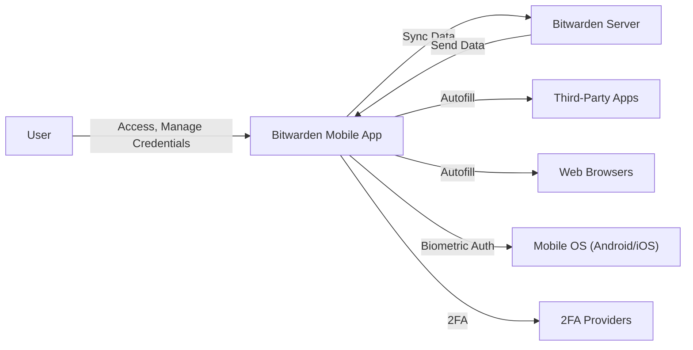
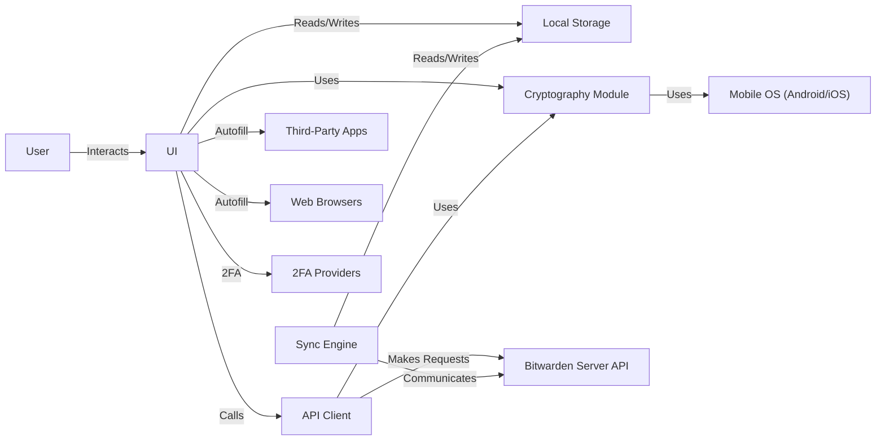
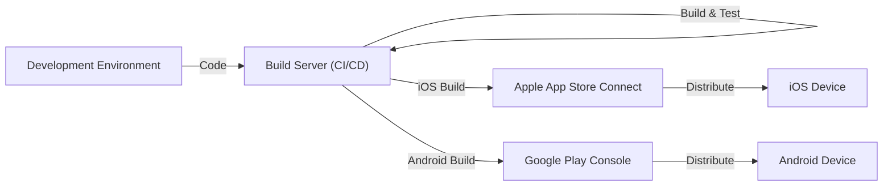
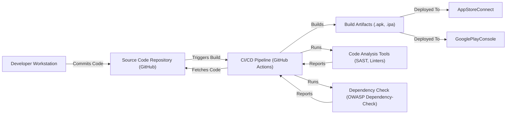

Okay, let's create a design document for the Bitwarden mobile application based on the provided GitHub repository.

# BUSINESS POSTURE

Business Priorities and Goals:

*   Provide a secure and user-friendly password management solution for mobile users.
*   Maintain feature parity with Bitwarden's offerings on other platforms (browser extensions, desktop applications).
*   Ensure cross-platform compatibility and synchronization of user data.
*   Offer both free and premium subscription options, catering to a wide range of users.
*   Maintain a high level of user trust and confidence in the security of their sensitive data.
*   Enable users to securely store and manage passwords, notes, credit card information, and identities.
*   Provide convenient access to credentials through autofill functionality on mobile devices.
*   Support biometric authentication for enhanced security and ease of use.

Most Important Business Risks:

*   Compromise of user credentials due to vulnerabilities in the mobile application.
*   Data breaches resulting from server-side vulnerabilities or attacks.
*   Loss of user data due to synchronization issues or data corruption.
*   Reputational damage caused by security incidents or negative user experiences.
*   Inability to meet user expectations for features, performance, or usability.
*   Violation of user privacy due to inadequate data protection measures.
*   Failure to comply with relevant security and privacy regulations.

# SECURITY POSTURE

Existing Security Controls:

*   security control: End-to-end encryption: User data is encrypted on the client-side before being transmitted to Bitwarden's servers, ensuring that only the user can decrypt and access their information. Implemented in application logic.
*   security control: Zero-knowledge encryption: Bitwarden claims to have no knowledge of user master passwords or the encryption keys used to protect user data. Implemented in application logic.
*   security control: Use of strong cryptographic algorithms: Bitwarden uses industry-standard encryption algorithms such as AES-256 and PBKDF2-SHA256. Implemented in application logic.
*   security control: Two-factor authentication (2FA): Users can enable 2FA to add an extra layer of security to their accounts. Implemented in application logic and server side.
*   security control: Biometric authentication: The mobile app supports biometric authentication methods such as fingerprint and facial recognition. Implemented in application logic.
*   security control: Autofill functionality: The app integrates with the mobile operating system's autofill framework to securely fill in credentials in other apps and browsers. Implemented in application logic.
*   security control: Secure storage of encryption keys: The app securely stores encryption keys on the device, using platform-specific secure storage mechanisms. Implemented in application logic.
*   security control: Regular security audits and penetration testing: Bitwarden undergoes regular security assessments by third-party security firms. Described in public documentation.
*   security control: Open-source codebase: The mobile app's codebase is open source, allowing for community review and scrutiny. Described in public documentation.

Accepted Risks:

*   accepted risk: Reliance on the security of the underlying mobile operating system: The app's security is ultimately dependent on the security of the mobile OS and the device itself.
*   accepted risk: Potential for user error: Users may choose weak master passwords or disable security features, increasing their risk of compromise.
*   accepted risk: Limited control over third-party integrations: The app integrates with third-party services (e.g., for 2FA), which may have their own security vulnerabilities.

Recommended Security Controls:

*   Implement certificate pinning to prevent man-in-the-middle attacks.
*   Integrate with a mobile threat detection (MTD) solution to detect and respond to device-level threats.
*   Provide options for more granular control over data synchronization, such as selective sync or offline-only mode.

Security Requirements:

*   Authentication:
    *   Support strong password policies, including minimum length, complexity, and history requirements.
    *   Implement secure password reset mechanisms, such as email-based verification or security questions.
    *   Protect against brute-force attacks by implementing account lockout or rate-limiting mechanisms.
    *   Offer multiple 2FA options, including TOTP, email, and hardware security keys.
*   Authorization:
    *   Implement role-based access control (RBAC) to restrict access to sensitive features or data based on user roles.
    *   Enforce the principle of least privilege, granting users only the minimum necessary permissions.
*   Input Validation:
    *   Validate all user inputs to prevent injection attacks, such as cross-site scripting (XSS) and SQL injection.
    *   Sanitize user data before displaying it to prevent XSS vulnerabilities.
    *   Implement input length restrictions to prevent buffer overflow attacks.
*   Cryptography:
    *   Use strong, industry-standard encryption algorithms for all sensitive data, both in transit and at rest.
    *   Use secure random number generators for all cryptographic operations.
    *   Regularly update cryptographic libraries to address known vulnerabilities.
    *   Protect encryption keys using secure key management practices.

# DESIGN

## C4 CONTEXT

Element Descriptions:

*   User:
    *   Name: User
    *   Type: Person
    *   Description: The end-user of the Bitwarden mobile application.
    *   Responsibilities: Managing passwords, notes, and other sensitive information. Authenticating to the application.
    *   Security controls: Strong password, 2FA (optional), biometric authentication (optional).
*   Bitwarden Mobile App:
    *   Name: Bitwarden Mobile App
    *   Type: Software System
    *   Description: The mobile application for iOS and Android platforms.
    *   Responsibilities: Storing and managing user credentials, providing autofill functionality, synchronizing data with the Bitwarden server.
    *   Security controls: End-to-end encryption, zero-knowledge encryption, biometric authentication, secure storage of encryption keys.
*   Bitwarden Server:
    *   Name: Bitwarden Server
    *   Type: Software System
    *   Description: The backend server infrastructure that stores and synchronizes user data.
    *   Responsibilities: Storing encrypted user data, handling user authentication, providing synchronization services.
    *   Security controls: Encryption at rest, access controls, regular security audits.
*   Mobile OS (Android/iOS):
    *   Name: Mobile OS (Android/iOS)
    *   Type: Software System
    *   Description: The underlying mobile operating system.
    *   Responsibilities: Providing platform-level security features, managing app permissions, handling biometric authentication.
    *   Security controls: Sandboxing, app permissions, biometric authentication APIs.
*   Third-Party Apps:
    *   Name: Third-Party Apps
    *   Type: Software System
    *   Description: Other applications installed on the user's device.
    *   Responsibilities: Various, depending on the app.
    *   Security controls: Dependent on the individual app.
*   Web Browsers:
    *   Name: Web Browsers
    *   Type: Software System
    *   Description: Web browsers installed on the user's device.
    *   Responsibilities: Rendering web pages, handling user input.
    *   Security controls: Dependent on the individual browser.
*   2FA Providers:
    *   Name: 2FA Providers
    *   Type: Software System
    *   Description: External services that provide two-factor authentication functionality (e.g., TOTP apps, email providers).
    *   Responsibilities: Generating and verifying 2FA codes.
    *   Security controls: Dependent on the individual provider.

## C4 CONTAINER

Element Descriptions:

*   User:
    *   Name: User
    *   Type: Person
    *   Description: The end-user of the Bitwarden mobile application.
    *   Responsibilities: Managing passwords and other sensitive information.
    *   Security controls: Strong password, 2FA (optional), biometric authentication (optional).
*   API Client:
    *   Name: API Client
    *   Type: Container
    *   Description: Handles communication with the Bitwarden Server API.
    *   Responsibilities: Making API requests, handling responses, managing network connections.
    *   Security controls: TLS encryption, API key authentication.
*   UI:
    *   Name: UI
    *   Type: Container
    *   Description: The user interface of the mobile application.
    *   Responsibilities: Displaying data to the user, handling user input, interacting with other components.
    *   Security controls: Input validation, output encoding, secure UI design principles.
*   Local Storage:
    *   Name: Local Storage
    *   Type: Container
    *   Description: Stores encrypted user data locally on the device.
    *   Responsibilities: Securely storing and retrieving data, managing data persistence.
    *   Security controls: Encryption at rest, secure storage APIs provided by the OS.
*   Cryptography Module:
    *   Name: Cryptography Module
    *   Type: Container
    *   Description: Handles all cryptographic operations.
    *   Responsibilities: Encrypting and decrypting data, generating keys, managing digital signatures.
    *   Security controls: Use of strong cryptographic algorithms, secure key management.
*   Sync Engine:
    *   Name: Sync Engine
    *   Type: Container
    *   Description: Manages data synchronization with the Bitwarden server.
    *   Responsibilities: Detecting changes, resolving conflicts, ensuring data consistency.
    *   Security controls: Secure communication with the server, data integrity checks.
*   Bitwarden Server API:
    *   Name: Bitwarden Server API
    *   Type: External System
    *   Description: The API provided by the Bitwarden server.
    *   Responsibilities: Handling requests from the mobile app, managing user data.
    *   Security controls: Authentication, authorization, encryption at rest, regular security audits.
*   Mobile OS (Android/iOS):
    *   Name: Mobile OS (Android/iOS)
    *   Type: External System
    *   Description: The underlying mobile operating system.
    *   Responsibilities: Providing platform-level security features, managing app permissions.
    *   Security controls: Sandboxing, app permissions, biometric authentication APIs.
*   Third-Party Apps:
    *   Name: Third-Party Apps
    *   Type: External System
    *   Description: Other applications installed on the user's device.
    *   Responsibilities: Various, depending on the app.
    *   Security controls: Dependent on the individual app.
*   Web Browsers:
    *   Name: Web Browsers
    *   Type: External System
    *   Description: Web browsers installed on the user's device.
    *   Responsibilities: Rendering web pages, handling user input.
    *   Security controls: Dependent on the individual browser.
*   2FA Providers:
    *   Name: 2FA Providers
    *   Type: External System
    *   Description: External services that provide two-factor authentication functionality.
    *   Responsibilities: Generating and verifying 2FA codes.
    *   Security controls: Dependent on the individual provider.

## DEPLOYMENT

Possible Deployment Solutions:

1.  Standard Mobile App Store Deployment (iOS App Store and Google Play Store).
2.  Enterprise Deployment (using Mobile Device Management (MDM) solutions).
3.  Sideloading (primarily for Android, less common and not recommended for iOS).

Chosen Solution: Standard Mobile App Store Deployment.

Element Descriptions:

*   Development Environment:
    *   Name: Development Environment
    *   Type: Infrastructure
    *   Description: Developers' local machines where the code is written and tested.
    *   Responsibilities: Code development, unit testing, local debugging.
    *   Security controls: Secure coding practices, code reviews, local security tools.
*   Build Server (CI/CD):
    *   Name: Build Server (CI/CD)
    *   Type: Infrastructure
    *   Description: Automated build server (e.g., GitHub Actions, Jenkins, Azure DevOps).
    *   Responsibilities: Building the app, running automated tests, creating release artifacts.
    *   Security controls: Secure build environment, code signing, vulnerability scanning.
*   Apple App Store Connect:
    *   Name: Apple App Store Connect
    *   Type: Platform
    *   Description: Apple's platform for managing and distributing iOS apps.
    *   Responsibilities: App review, distribution, managing releases.
    *   Security controls: Apple's app review process, code signing verification.
*   Google Play Console:
    *   Name: Google Play Console
    *   Type: Platform
    *   Description: Google's platform for managing and distributing Android apps.
    *   Responsibilities: App review, distribution, managing releases.
    *   Security controls: Google Play Protect, code signing verification.
*   iOS Device:
    *   Name: iOS Device
    *   Type: Device
    *   Description: An iPhone or iPad running iOS.
    *   Responsibilities: Running the Bitwarden mobile app.
    *   Security controls: iOS security features, app sandboxing.
*   Android Device:
    *   Name: Android Device
    *   Type: Device
    *   Description: An Android phone or tablet.
    *   Responsibilities: Running the Bitwarden mobile app.
    *   Security controls: Android security features, app sandboxing.

## BUILD

Build Process Description:

1.  Developers write code and commit it to the source code repository (GitHub).
2.  The CI/CD pipeline (GitHub Actions) is triggered by new commits.
3.  The CI/CD pipeline fetches the latest code from the repository.
4.  Code analysis tools (SAST, linters) are run to identify potential security vulnerabilities and code quality issues.
5.  Dependency checks (e.g., OWASP Dependency-Check) are performed to identify vulnerable third-party libraries.
6.  The application is built, creating the necessary build artifacts (.apk for Android, .ipa for iOS).
7.  Automated tests (unit tests, integration tests) are executed.
8.  If all checks and tests pass, the build artifacts are ready for deployment.
9.  The build artifacts are then uploaded to the respective app stores (Apple App Store Connect and Google Play Console) for distribution.

Security Controls in Build Process:

*   Source Code Repository (GitHub): Access controls, branch protection rules, code review requirements.
*   CI/CD Pipeline (GitHub Actions): Secure build environment, limited access, secrets management.
*   Code Analysis Tools (SAST, Linters): Static analysis to identify vulnerabilities, code style enforcement.
*   Dependency Check (OWASP Dependency-Check): Identification of vulnerable third-party libraries.
*   Code Signing: Ensuring the integrity and authenticity of the build artifacts.

# RISK ASSESSMENT

Critical Business Processes to Protect:

*   User authentication and authorization.
*   Secure storage and retrieval of user credentials.
*   Data synchronization between the mobile app and the server.
*   Autofill functionality.
*   Management of user accounts and subscriptions.

Data to Protect and Sensitivity:

*   User master passwords (hashed and salted, never stored in plain text): Extremely Sensitive.
*   Encrypted user vault data (passwords, notes, credit cards, identities): Extremely Sensitive.
*   User email addresses: Sensitive.
*   Subscription information: Sensitive.
*   Device identifiers (used for synchronization and security purposes): Moderately Sensitive.
*   Usage logs (anonymized and aggregated): Low Sensitivity.

# QUESTIONS & ASSUMPTIONS

Questions:

*   What specific mobile threat detection (MTD) solutions are being considered, if any?
*   What are the specific procedures for handling security incidents and data breaches?
*   Are there any plans to implement more advanced security features, such as hardware-backed encryption or support for FIDO2/WebAuthn?
*   What is the frequency and scope of the third-party security audits?
*   What specific measures are in place to protect against supply chain attacks targeting the build process?
*   What is the process for handling user reports of security vulnerabilities?

Assumptions:

*   BUSINESS POSTURE: Bitwarden prioritizes security and user privacy above all else. The company is willing to invest in robust security measures and undergo regular security audits.
*   SECURITY POSTURE: The existing security controls described in Bitwarden's documentation are accurately implemented and maintained. Users are generally aware of basic security best practices, such as choosing strong passwords.
*   DESIGN: The Bitwarden server infrastructure is designed with security in mind, including appropriate access controls, encryption at rest, and regular security updates. The mobile operating systems (Android and iOS) are kept up-to-date with the latest security patches. Third-party integrations are carefully vetted for security risks.