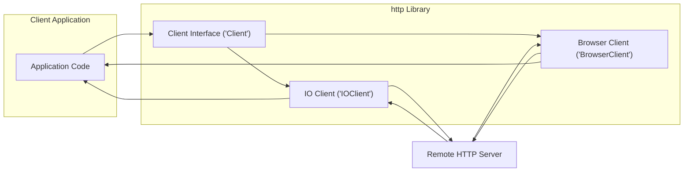
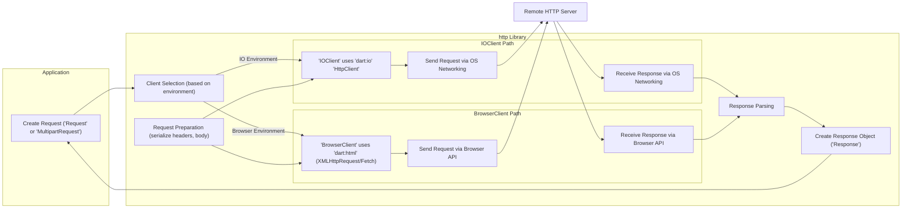

# Project Design Document: Dart HTTP Library

**Version:** 1.1
**Date:** October 26, 2023
**Author:** AI Software Architect

## 1. Introduction

This document provides a detailed design overview of the Dart HTTP library ([https://github.com/dart-lang/http](https://github.com/dart-lang/http)). It aims to facilitate threat modeling by clearly outlining the library's architecture, components, and data flow. This document serves as a reference for security professionals and developers involved in assessing the security posture of applications utilizing this library.

## 2. Goals

*   Provide a clear and comprehensive description of the Dart HTTP library's architecture and key components.
*   Illustrate the data flow within the library for various HTTP operations, highlighting potential security-relevant points.
*   Identify potential areas of security concern and serve as a basis for structured threat modeling activities.
*   Offer a well-structured and easily understandable document for both security and development teams.

## 3. Overview

The Dart HTTP library offers a high-level, platform-agnostic API for making HTTP requests in Dart applications. It abstracts the underlying platform-specific networking mechanisms, providing a consistent interface for developers. The library supports standard HTTP methods and handles request/response processing. The core abstraction is the `Client` interface, with concrete implementations for different environments.

**Key Entities:**

*   **Application Code:** The Dart code that utilizes the `http` library to initiate HTTP communication.
*   **Client Interface (`Client`):** Defines the contract for sending HTTP requests, ensuring a consistent API.
*   **IO Client (`IOClient`):**  Implementation of the `Client` interface for native Dart environments, leveraging `dart:io`.
*   **Browser Client (`BrowserClient`):** Implementation of the `Client` interface for web browser environments, utilizing `dart:html`.
*   **Remote HTTP Server:** The external server that the application interacts with via HTTP.

## 4. Detailed Design

The `http` library comprises several interconnected components, each with specific responsibilities:

*   **Client Interface (`Client`):**
    *   **Function:** Defines the abstract methods (`send`) for executing HTTP requests. Provides convenience methods (`get`, `post`, `put`, `delete`, `head`, `patch`) built upon `send`. Manages resources and potentially connection pooling.
    *   **Security Relevance:**  The entry point for making HTTP requests. Improper implementation or usage can lead to vulnerabilities.

*   **Base Client (`BaseClient`):**
    *   **Function:** Provides a partial implementation of the `Client` interface, handling common tasks like preparing requests and closing resources. Serves as a base class for concrete client implementations.
    *   **Security Relevance:**  Centralized logic; vulnerabilities here could affect all clients.

*   **IO Client (`IOClient`):**
    *   **Function:** Implements the `Client` interface for native Dart applications. Uses `dart:io`'s `HttpClient` for low-level network operations, including socket management and TLS/SSL negotiation.
    *   **Security Relevance:** Directly interacts with the operating system's networking stack. Vulnerable to issues in `dart:io` or improper TLS configuration.

*   **Browser Client (`BrowserClient`):**
    *   **Function:** Implements the `Client` interface for web browser environments. Utilizes the browser's `XMLHttpRequest` or `Fetch API` to make HTTP requests, respecting the browser's security sandbox and CORS policies.
    *   **Security Relevance:**  Relies on the browser's security mechanisms. Susceptible to browser-specific vulnerabilities and CORS bypass issues if not configured correctly on the server.

*   **Request Object (`Request`):**
    *   **Function:** Represents an outgoing HTTP request. Encapsulates the HTTP method, URI, headers, and body.
    *   **Security Relevance:**  Contains user-controlled data (URI, headers, body). Improper construction or handling can lead to injection vulnerabilities (e.g., header injection, SSRF if URI is not validated).

*   **Response Object (`Response`):**
    *   **Function:** Represents an incoming HTTP response. Contains the status code, headers, and body.
    *   **Security Relevance:**  Contains data received from the remote server. Improper handling of the response body can lead to vulnerabilities (e.g., deserialization issues).

*   **Multipart Request (`MultipartRequest`):**
    *   **Function:** A specialized `Request` for sending data with multiple parts, commonly used for file uploads. Handles the creation of the `multipart/form-data` request body.
    *   **Security Relevance:**  Involves handling file data, which can introduce vulnerabilities like path traversal or arbitrary file upload if not handled carefully.

*   **Streamed Request (`StreamedRequest`):**
    *   **Function:** Allows sending requests with bodies provided as streams. Useful for large uploads or dynamically generated content.
    *   **Security Relevance:**  Potential for resource exhaustion if the stream is not handled correctly.

*   **Headers (`Headers` class):**
    *   **Function:** Represents HTTP headers as a case-insensitive map. Provides methods for accessing and manipulating header values.
    *   **Security Relevance:**  Improper handling or setting of headers can lead to security issues (e.g., setting insecure cookies, exposing sensitive information).

*   **URL Utilities (`Uri` class from `dart:core`):**
    *   **Function:** Used for parsing, validating, and manipulating URLs.
    *   **Security Relevance:** Crucial for preventing issues like Server-Side Request Forgery (SSRF) by ensuring the validity and intended target of requests.

## 5. Data Flow

The process of making an HTTP request using the `http` library involves the following data flow:

**Detailed Data Flow Steps:**

1. **Request Creation:** The application creates a `Request` or `MultipartRequest` object, specifying the target URI, HTTP method, headers, and body.
    *   **Security Note:** This is where user-provided data enters the system. Proper input validation and sanitization are crucial at this stage to prevent injection attacks.
2. **Client Selection:** The library selects the appropriate `Client` implementation (`IOClient` or `BrowserClient`) based on the execution environment.
    *   **Security Note:** The choice of client impacts the underlying networking mechanisms and security considerations.
3. **Request Preparation:** The selected `Client` prepares the request for sending. This involves serializing headers and encoding the request body.
    *   **Security Note:** Improper serialization or encoding can lead to vulnerabilities. For example, failure to escape special characters in headers could lead to header injection.
4. **Request Transmission:**
    *   **IOClient Path:** The `IOClient` uses `dart:io`'s `HttpClient` to send the request via the operating system's networking stack. This involves socket creation, connection management, and potentially TLS/SSL negotiation.
        *   **Security Note:** TLS configuration (e.g., certificate verification) is critical here. Vulnerabilities in `dart:io`'s networking implementation could also be a concern.
    *   **BrowserClient Path:** The `BrowserClient` uses `dart:html`'s `XMLHttpRequest` or `Fetch API` to send the request through the browser's networking mechanisms.
        *   **Security Note:** Relies on the browser's security features, including CORS enforcement. Server-side CORS misconfiguration can be a vulnerability.
5. **Response Reception:** The response is received via the respective platform's networking API.
6. **Response Parsing:** The `Client` parses the raw response data to extract the status code, headers, and body.
    *   **Security Note:** Vulnerabilities can arise from improper parsing, especially when handling complex response bodies.
7. **Response Object Creation:** A `Response` object is created, encapsulating the parsed response information.
8. **Response Delivery:** The `Response` object is returned to the application.
    *   **Security Note:** The application code must handle the response securely to prevent vulnerabilities like cross-site scripting (XSS) if the response body contains HTML.

## 6. Security Considerations

Based on the design and data flow, the following areas are important to consider during threat modeling:

*   **URI Validation:** Ensure proper validation and sanitization of URIs to prevent Server-Side Request Forgery (SSRF) attacks.
*   **Header Injection:**  Sanitize header values to prevent attackers from injecting malicious headers. Be cautious when setting headers programmatically.
*   **Request Body Handling:**  Validate and sanitize request body content to prevent injection attacks or other vulnerabilities on the server-side. Be mindful of the `Content-Type` and encoding used.
*   **TLS/SSL Configuration (IOClient):**  Ensure secure TLS configuration, including proper certificate verification and potentially certificate pinning, to prevent man-in-the-middle attacks.
*   **CORS Policy Enforcement (BrowserClient):**  Understand and respect the browser's CORS policy. Server-side misconfiguration can lead to security vulnerabilities.
*   **Cookie Management:**  Handle cookies securely, paying attention to `HttpOnly` and `Secure` flags. Prevent cookie theft or manipulation.
*   **Response Body Handling:**  Carefully handle response bodies, especially when parsing data or rendering content. Be aware of potential deserialization vulnerabilities or XSS risks.
*   **Error Handling:**  Avoid leaking sensitive information in error messages. Implement robust error handling to prevent unexpected behavior.
*   **Multipart Request Security:**  Implement security measures for handling file uploads, such as validating file types, sizes, and content, and preventing path traversal vulnerabilities.
*   **Dependency Security:**  Keep dependencies up-to-date to address any known security vulnerabilities in `dart:io` or browser APIs.
*   **Proxy Configuration:**  If proxy support is used, ensure secure configuration to prevent interception or manipulation of traffic.
*   **Authentication and Authorization:**  When handling authentication headers (e.g., `Authorization`), ensure sensitive credentials are not exposed and are handled securely.

## 7. Dependencies

The `http` library relies on the following core Dart libraries:

*   `dart:core`: Provides fundamental data types, collections, and error handling.
*   `dart:async`: Enables asynchronous programming, essential for network operations.
*   `dart:convert`: Offers utilities for encoding and decoding data, such as JSON and UTF-8.
*   `dart:io` (for `IOClient`): Provides platform-specific I/O functionality, including networking primitives.
*   `dart:html` (for `BrowserClient`): Provides access to browser DOM and APIs, including networking capabilities.

## 8. Deployment

The deployment of the `http` library depends on the type of Dart application:

*   **Command-line applications:** The `IOClient` is typically used, and the library is included as a package dependency.
*   **Web applications:** The `BrowserClient` is used, and the library is included as a package dependency. The browser environment provides the underlying networking capabilities.
*   **Mobile applications (using Flutter):** Both `IOClient` (for native code execution) and `BrowserClient` (for web views) might be used, depending on the specific networking requirements.

## 9. Future Considerations

Potential future developments that could impact the design and security include:

*   **HTTP/2 and HTTP/3 Support:**  Adopting newer HTTP protocols would require significant changes in the underlying client implementations and could introduce new security considerations.
*   **Improved Security Defaults:**  Enhancements to provide more secure defaults for TLS configuration or other security-sensitive settings.
*   **Standardized Interceptors:**  A more formalized way to intercept and modify requests and responses, which could have security implications if not used carefully.
*   **Integration with Security Libraries:**  Closer integration with libraries that provide security features like content security policy (CSP) or subresource integrity (SRI).

This improved design document provides a more detailed and security-focused overview of the Dart HTTP library, serving as a valuable resource for threat modeling and security analysis.
