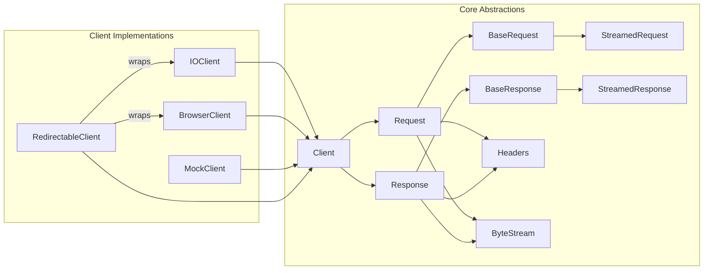
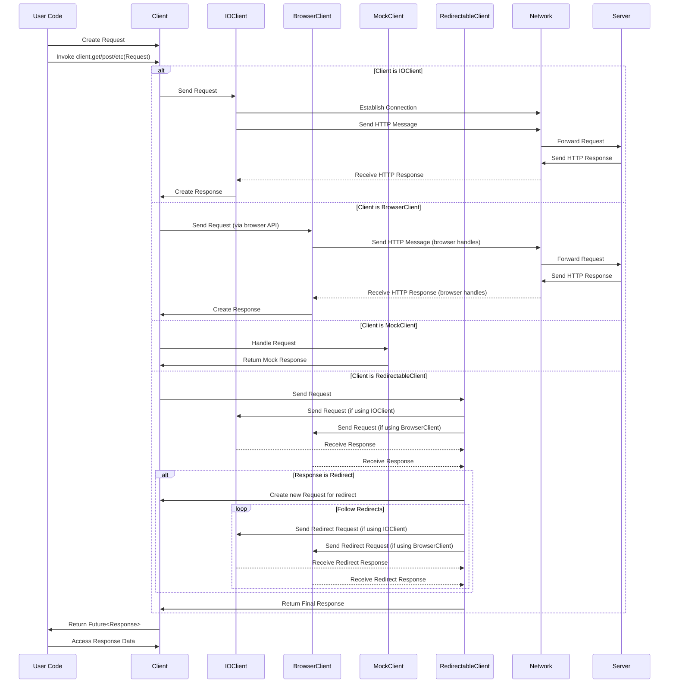

## Project Design Document: Dart HTTP Library (Improved)

**1. Introduction**

This document provides an enhanced design overview of the `dart-lang/http` library, a fundamental package in the Dart ecosystem for executing HTTP requests. This detailed design serves as a crucial artifact for subsequent threat modeling, providing a comprehensive understanding of the library's architecture, data flow, and potential security considerations.

**2. Goals and Non-Goals**

* **Goals:**
    * Offer a versatile and dependable API for initiating diverse HTTP requests (GET, POST, PUT, DELETE, PATCH, etc.).
    * Facilitate the management of standard HTTP features, including headers, request bodies, and response processing.
    * Support various client implementations tailored to different environments (e.g., browser-based, standalone applications).
    * Leverage Dart's asynchronous capabilities through `Future` and `Stream` for efficient operation.
    * Enable customization of request behavior, such as setting timeouts, controlling redirects, and configuring proxies.
    * Provide mechanisms for handling different content types and encoding schemes.
    * Offer abstractions for common HTTP tasks like form encoding and multipart requests.

* **Non-Goals:**
    * Functioning as a complete web server implementation.
    * Implementing sophisticated caching mechanisms beyond basic browser-level caching.
    * Supporting network protocols beyond HTTP and HTTPS (e.g., WebSockets, FTP).
    * Providing built-in, end-to-end security features like comprehensive authentication or authorization frameworks (these are expected to be implemented by the application utilizing the library).
    * Managing complex network configurations or routing.

**3. Architectural Overview**

The `http` library employs a layered architecture, offering abstractions at different levels of interaction with the HTTP protocol. This design promotes flexibility and allows for different implementations depending on the execution environment.

* **Core Abstractions:**
    * `"Client"`: The primary interface for initiating HTTP requests. Concrete implementations handle the underlying network communication. It defines methods like `get`, `post`, `put`, `delete`, `head`, `patch`, and `send`.
    * `"Request"`: Represents an outgoing HTTP request. It encapsulates the HTTP method, URI, headers, and the request body (if any).
    * `"Response"`: Represents an incoming HTTP response received from the server. It includes the HTTP status code, headers, and the response body.
    * `"BaseRequest"`: An abstract class serving as the foundation for `Request`, providing shared functionalities and properties.
    * `"BaseResponse"`: An abstract class serving as the foundation for `Response`, providing shared functionalities and properties.
    * `"StreamedRequest"`: A specialized subclass of `BaseRequest` designed for requests where the body is a stream of data (useful for large uploads).
    * `"StreamedResponse"`: A specialized subclass of `BaseResponse` designed for responses where the body is a stream of data (useful for large downloads).
    * `"Headers"`: A representation of HTTP headers, typically implemented as a case-insensitive map of string keys to lists of string values.
    * `"ByteStream"`: A stream of raw bytes, commonly used for representing the body of requests and responses.

* **Client Implementations:**
    * `"IOClient"`:  Used in environments where `dart:io` is available (e.g., command-line applications, server-side Dart applications, Flutter apps running on native platforms). It leverages the operating system's networking capabilities.
    * `"BrowserClient"`: Used within web browsers. It relies on the browser's built-in `XMLHttpRequest` or the `fetch` API for making HTTP requests.
    * `"MockClient"`:  A client implementation designed for testing purposes. It allows developers to simulate HTTP responses without making actual network calls.
    * `"RedirectableClient"`: A client that wraps another client and handles HTTP redirects according to specified policies.

* **Utility Classes and Functions:**
    * Functions for encoding and decoding request bodies into various formats (e.g., `jsonEncode`, `utf8.encode`, `Uri.encodeFull`).
    * Functions for parsing response bodies from different content types.
    * Classes for constructing and handling multipart form data (`MultipartRequest`).
    * Classes for managing cookies (`Cookie`), though the actual persistence and management of cookies often depend on the underlying platform.
    * Utility functions for working with URIs and headers.

**4. Data Flow (Detailed)**

The process of making an HTTP request using the `http` library typically follows these steps:

1. **Request Construction:** The user's code instantiates a concrete `Request` object. This involves specifying the target URI, the HTTP method (e.g., GET, POST), and optionally setting headers and the request body. The body can be provided as a string, a list of bytes, or a `ByteStream`.
2. **Client Invocation:** The user calls a method on a `Client` instance corresponding to the desired HTTP method (e.g., `client.get(uri)`, `client.post(uri, body: '...')`). Internally, these methods often create a `Request` object and then call the `client.send(request)` method.
3. **Request Processing (Specific to Client Implementation):**
    * **IOClient:**
        * Establishes a network connection (typically a TCP socket) to the server specified in the request URI.
        * Serializes the `Request` object into an HTTP message, including the method, URI, headers, and body. The body might be streamed if it's a `StreamedRequest`.
        * Transmits the HTTP message over the established socket.
        * Listens for the server's response on the socket.
        * Receives the raw HTTP response from the server.
        * Parses the raw response into a `Response` object, extracting the status code, headers, and body (which is often a `ByteStream`).
    * **BrowserClient:**
        * Utilizes the browser's built-in `XMLHttpRequest` or `fetch` API.
        * Constructs the request using the browser's API, setting the method, URL, headers, and body from the `Request` object.
        * The browser handles the underlying network communication, including DNS resolution, connection management, and TLS negotiation.
        * Receives the HTTP response from the browser's API.
        * Wraps the browser's response data into a `Response` object, making it compatible with the `http` library's abstractions.
    * **MockClient:**
        * Instead of making a network call, it consults its pre-configured behavior.
        * Returns a pre-defined `Response` object based on the input `Request`. This is useful for unit testing scenarios.
    * **RedirectableClient:**
        * Receives the `Request`.
        * Delegates the actual request sending to the underlying client it wraps.
        * Examines the `Response` for redirect status codes (e.g., 301, 302, 307, 308).
        * If a redirect occurs and the client is configured to follow redirects, it constructs a new `Request` based on the redirect location and sends it using the underlying client, up to a maximum number of redirects to prevent infinite loops.
4. **Response Handling:** The `Client`'s method (e.g., `get`, `post`, `send`) returns a `Future<Response>` that completes when the response is received and processed.
5. **Response Body Consumption:** The user's code accesses the `Response` object. The response body is often available as a `ByteStream`. Helper methods on the `Response` object (e.g., `response.bodyBytes`, `response.body`) allow for convenient consumption of the body as a list of bytes or a decoded string.

**5. Security Considerations (Detailed for Threat Modeling)**

This section outlines potential security vulnerabilities and considerations relevant for threat modeling the `http` library.

* **Transport Layer Security (TLS/SSL):**
    * **Threat:** Man-in-the-Middle (MITM) attacks. If HTTPS is not used or if TLS negotiation fails or uses weak ciphers, attackers can intercept and potentially modify communication.
    * **Threat:** Insufficient Certificate Validation. If the client doesn't properly validate the server's certificate, it could connect to a malicious server impersonating the legitimate one. This can lead to data breaches or credential theft.
    * **Threat:** Downgrade Attacks. Attackers might attempt to force the client and server to use older, less secure TLS versions.
    * **Mitigation:** Ensure HTTPS is used for sensitive communication. The library relies on the underlying platform's TLS implementation, so platform security configurations are crucial. Consider using certificate pinning for enhanced security in specific scenarios.
* **Input Validation:**
    * **Threat:** Server-Side Request Forgery (SSRF). If the application uses user-provided data to construct URLs without proper validation, an attacker could potentially make the server send requests to internal or external resources, leading to information disclosure or other malicious actions.
    * **Threat:** Header Injection. If the application allows uncontrolled user input to be included in HTTP headers, attackers could inject malicious headers that could be interpreted by the server or intermediate proxies, leading to vulnerabilities like HTTP Response Splitting or XSS.
    * **Threat:** Malicious Body Content. The library needs to handle various content types and encodings securely. Vulnerabilities in parsing or handling specific content types could lead to exploits.
    * **Mitigation:** Always validate and sanitize user-provided input before incorporating it into URLs or headers. Be mindful of the content type being handled and use appropriate parsing mechanisms.
* **Cookie Management:**
    * **Threat:** Session Hijacking. If session cookies are not properly protected (e.g., using the `HttpOnly` and `Secure` flags) or if the library exposes them insecurely, attackers could steal session cookies and impersonate legitimate users.
    * **Threat:** Cross-Site Scripting (XSS) via Cookies. While the library itself doesn't directly cause XSS, improper handling of cookies set by the server could contribute to XSS vulnerabilities if the application doesn't handle them securely.
    * **Mitigation:** Encourage the use of secure cookie attributes (`HttpOnly`, `Secure`, `SameSite`). Be cautious about exposing raw cookie data.
* **Redirection Handling:**
    * **Threat:** Open Redirection. If the application blindly follows redirects without validation, attackers could trick users into visiting malicious websites.
    * **Mitigation:** The `RedirectableClient` offers control over redirect following. Applications should carefully configure redirect behavior and potentially validate redirect targets.
* **Error Handling:**
    * **Threat:** Information Disclosure. Verbose error messages might leak sensitive information about the application's internal workings or the network configuration.
    * **Threat:** Denial of Service (DoS). Improper error handling could lead to resource exhaustion if exceptions are not handled gracefully, especially when dealing with network errors.
    * **Mitigation:** Implement robust error handling that avoids exposing sensitive details. Implement appropriate retry mechanisms and timeouts to prevent resource exhaustion.
* **Dependency Vulnerabilities:**
    * **Threat:** Transitive Dependencies. The `http` library depends on other packages. Vulnerabilities in these dependencies could indirectly affect the security of applications using the `http` library.
    * **Mitigation:** Regularly update dependencies to patch known vulnerabilities. Utilize tools for dependency scanning.
* **Resource Exhaustion:**
    * **Threat:** DoS attacks by sending a large number of concurrent requests or extremely large request/response bodies.
    * **Mitigation:** Implement appropriate timeouts, connection pooling, and rate limiting on the server-side. The library's connection management can be a factor here.
* **Information Disclosure:**
    * **Threat:** Accidental logging or exposure of sensitive information within request or response data (e.g., API keys, authentication tokens) in logs or during debugging.
    * **Mitigation:** Implement secure logging practices and avoid logging sensitive data. Be mindful of data exposure during development and debugging.
* **Proxy Configuration:**
    * **Threat:** If proxy settings are not handled securely, attackers might be able to intercept or redirect traffic.
    * **Mitigation:** Ensure that proxy configurations are managed securely and that the library handles proxy authentication appropriately.

**6. Dependencies**

* `async`: Provides utilities for asynchronous programming, essential for non-blocking network operations.
* `stream_channel`: Provides abstractions for bidirectional communication channels, used internally for handling streamed data.
* `typed_data`: Provides support for typed data structures, potentially used for efficient byte manipulation.
* `path`: Provides cross-platform path manipulation, might be used for handling file paths in certain scenarios.
* `mime`: Provides MIME type handling, crucial for correctly setting and interpreting `Content-Type` headers.

**7. Deployment Considerations**

The deployment context significantly impacts the security considerations for the `http` library.

* **Web Browsers:** The `BrowserClient` operates within the browser's security sandbox, which provides a degree of protection against certain threats. However, vulnerabilities in the browser itself or in the application's JavaScript code can still introduce risks.
* **Mobile Applications (Flutter):** When using `IOClient` in Flutter, the application has more direct access to the underlying operating system's networking capabilities. Security considerations include platform-specific permissions and secure storage of sensitive data.
* **Server-Side Applications (Dart VM):** Using `IOClient` on the server-side requires careful attention to network security, including firewall configurations, secure handling of credentials, and protection against server-side vulnerabilities.
* **Command-Line Tools:** Security considerations for command-line tools using `IOClient` include handling user input securely and preventing unintended network interactions.

**8. Future Considerations (Potential Areas for Evolution)**

* **Enhanced Security Defaults:** Exploring more secure default configurations, such as stricter TLS settings or more robust input validation.
* **Standardized Authentication/Authorization Interceptors:** Providing built-in mechanisms or clear patterns for integrating common authentication and authorization schemes.
* **Improved Logging and Debugging with Security in Mind:** Enhancing logging capabilities while ensuring sensitive information is not inadvertently exposed.
* **More Granular Control over TLS Configuration:** Allowing developers more fine-grained control over TLS settings when needed, while providing secure defaults.
* **First-Party Support for HTTP/2 and HTTP/3:** Potentially integrating support for newer HTTP protocols for improved performance and security.