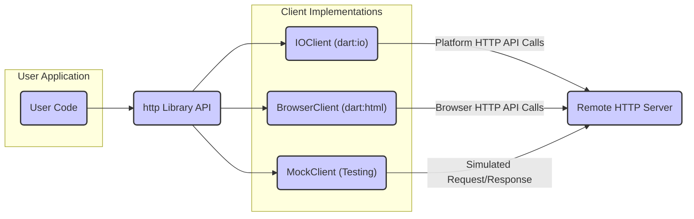

## Project Design Document: dart-lang/http Library (Improved)

**1. Introduction**

This document provides an enhanced design overview of the `dart-lang/http` library, a core Dart package facilitating HTTP communication. It details the library's architecture, key components, and data flow, specifically tailored for subsequent threat modeling activities. This revision aims for greater clarity and actionable insights for security analysis.

**2. Goals**

The primary objectives of the `dart-lang/http` library are to:

* Offer a straightforward and consistent API for executing various HTTP methods (e.g., GET, POST, PUT, DELETE).
* Provide comprehensive support for standard HTTP features, including headers, request bodies, and response handling.
* Enable adaptability across different execution environments through distinct client implementations (e.g., browser, server).
* Manage common HTTP response codes and error scenarios gracefully.
* Simplify interaction with diverse content types (e.g., JSON, form data, binary).
* Promote extensibility and customization through features like custom clients and interceptors.

**3. Non-Goals**

The `dart-lang/http` library is intentionally designed *not* to:

* Function as a standalone web server.
* Implement networking protocols beyond fundamental HTTP (e.g., WebSockets, gRPC are out of scope).
* Offer sophisticated, built-in caching mechanisms beyond basic browser-level caching.
* Handle UI rendering or presentation logic directly.
* Provide explicit, opinionated security hardening beyond leveraging the underlying platform's HTTP capabilities.

**4. High-Level Architecture**

The `http` library employs a layered architecture, emphasizing separation of concerns. A central abstract interface manages HTTP requests, while concrete implementations handle platform-specific networking details.

* **User Application:** The Dart code that utilizes the `http` library to initiate HTTP requests and process responses.
* **http Library API:** The core set of classes and functions exposed by the `http` package (e.g., `get()`, `post()`, the `Client` abstract class). This layer provides a consistent interface, abstracting away the underlying client implementation details.
* **Client Implementations:** Concrete classes that implement the `Client` interface, adapting to specific environments:
    * **IOClient:** Leverages the `dart:io` library for making HTTP requests, primarily used in server-side, desktop, or mobile applications where direct socket access is available.
    * **BrowserClient:** Utilizes the `dart:html` library (specifically the `HttpRequest` API) for making requests within a web browser environment, respecting browser security constraints.
    * **MockClient:** A specialized client designed for testing, allowing developers to simulate HTTP interactions and define predictable responses without actual network calls.
* **Remote HTTP Server:** The external server that the `http` library communicates with over the network.

**5. Detailed Design**

The `http` library's internal structure revolves around several key classes and interfaces:

* **`Client` (Interface):** Defines the fundamental contract for executing HTTP requests. Key methods include `get()`, `post()`, `put()`, `delete()`, `send()`, and `close()`. This interface enables pluggable client implementations.
* **`BaseClient` (Abstract Class):** Provides a foundational implementation of the `Client` interface, handling common tasks like ensuring the client is not used after being closed. Concrete clients often extend this.
* **`Request` (Class):** Represents an outgoing HTTP request. It encapsulates the HTTP method, URL, headers (as a `Headers` object), and the request body (which can be a `String`, `Uint8List`, or a `Stream<List<int>>`).
* **`StreamedRequest` (Class):** A specialized `Request` for handling potentially large or streaming request bodies, avoiding loading the entire body into memory at once.
* **`Response` (Class):** Represents an incoming HTTP response. It contains the HTTP status code, headers (as a `Headers` object), and the response body (as a `String` or `Uint8List`).
* **`StreamedResponse` (Class):** A specialized `Response` for handling potentially large or streaming response bodies. The body is accessed as a `Stream<List<int>>`.
* **`MultipartRequest` (Class):** Facilitates the creation of requests with `multipart/form-data` encoding, commonly used for file uploads and complex form submissions.
* **`MultipartFile` (Class):** Represents a file to be included within a `MultipartRequest`, encapsulating the file's content, filename, and content type.
* **`Headers` (Class):** A wrapper around a `Map<String, String>` for managing HTTP headers, providing case-insensitive access and utility methods for adding, retrieving, and modifying headers.
* **`Interceptor` (Abstract Class):** Enables developers to intercept and modify requests and responses, facilitating tasks like logging, authentication, and caching.
* **Exception Handling:** The library throws specific exceptions (e.g., `ClientException`, `RedirectException`) to indicate various error conditions encountered during HTTP communication.
* **Transformers:**  `StreamTransformer`s are used internally for encoding and decoding request and response bodies based on content type (e.g., for handling JSON).

**6. Data Flow**

The typical flow of data during an HTTP request using the `http` library is as follows:

```mermaid
graph LR
    subgraph "User Application"
        A("User Code: Creates Request Object")
    end
    B("http Library API: Calls Client.send()")
    subgraph "Client Implementation (e.g., IOClient)"
        C("Constructs Platform-Specific Request")
        D("Sends Request via Platform API")
        E("Receives Response from Platform API")
        F("Constructs Response Object")
    end
    G("http Library API: Returns Response Object")
    H("User Code: Processes Response")

    A -- "Request Object" --> B
    B -- "Request Object" --> C
    C -- "Platform Request" --> D
    D -- "HTTP Request" --> E
    E -- "HTTP Response" --> F
    F -- "Response Object" --> G
    G -- "Response Object" --> H
    style A fill:#efe,stroke:#333,stroke-width:2px
    style B fill:#efe,stroke:#333,stroke-width:2px
    style C fill:#efe,stroke:#333,stroke-width:2px
    style D fill:#efe,stroke:#333,stroke-width:2px
    style E fill:#efe,stroke:#333,stroke-width:2px
    style F fill:#efe,stroke:#333,stroke-width:2px
    style G fill:#efe,stroke:#333,stroke-width:2px
    style H fill:#efe,stroke:#333,stroke-width:2px
```

1. **User Code Creates Request Object:** The application code instantiates a `Request` (or a subclass like `MultipartRequest`) with the target URL, HTTP method, headers, and request body.
2. **http Library API Calls Client.send():** The user invokes a method on a `Client` instance (e.g., `client.get()`, `client.post()`), which internally calls the `send()` method, passing the `Request` object.
3. **Client Implementation Constructs Platform-Specific Request:** The active `Client` implementation (e.g., `IOClient`) translates the generic `Request` object into a format suitable for the underlying platform's HTTP API (e.g., `dart:io`'s `HttpClientRequest` or browser's `XMLHttpRequest`).
4. **Sends Request via Platform API:** The client implementation utilizes the platform's native HTTP API to transmit the request to the remote server.
5. **Receives Response from Platform API:** The platform's API receives the HTTP response from the server.
6. **Constructs Response Object:** The client implementation creates a `Response` (or `StreamedResponse`) object from the platform-specific response data, including the status code, headers, and body.
7. **http Library API Returns Response Object:** The `Response` object is returned to the user code through the `http` library API.
8. **User Code Processes Response:** The application code accesses the `Response` object's properties (status code, headers, body) to handle the server's response.

**7. Key Components for Threat Modeling**

For threat modeling purposes, the following components of the `http` library are particularly significant:

* **`Client` Implementations (IOClient, BrowserClient):** These are critical interaction points with the underlying operating system or browser's networking stack. Potential threats include vulnerabilities in the platform's HTTP implementation or improper handling of network resources.
    * **Example Threats:**  Man-in-the-middle attacks if TLS is not enforced, exposure to OS-level networking vulnerabilities.
* **`Request` and `Response` Objects:** These objects carry data exchanged with external systems. Improper construction or parsing can lead to vulnerabilities.
    * **Example Threats:**  HTTP header injection, cross-site scripting (XSS) via response headers if not handled carefully by the user application.
* **Header Handling (`Headers` Class):** The parsing, construction, and handling of HTTP headers are crucial.
    * **Example Threats:**  HTTP header injection attacks if user-controlled input is directly used in headers without sanitization.
* **Body Encoding/Decoding:** The processes of encoding request bodies and decoding response bodies (especially for different content types like JSON or XML) are potential areas for vulnerabilities.
    * **Example Threats:**  Denial-of-service through maliciously crafted content, vulnerabilities in encoding/decoding libraries.
* **URL Handling (within `Request`):** The parsing and validation of URLs are essential to prevent issues.
    * **Example Threats:**  Server-Side Request Forgery (SSRF) if user-provided URLs are not properly validated.
* **Cookie Handling (within `IOClient` and `BrowserClient`):** The management of cookies needs to be secure to prevent unauthorized access or manipulation.
    * **Example Threats:**  Cookie theft, session hijacking if cookies are not handled with appropriate security attributes (e.g., `HttpOnly`, `Secure`).
* **TLS/SSL Implementation (delegated to platform):** While the `http` library relies on the underlying platform for TLS, understanding its configuration and potential weaknesses is important.
    * **Example Threats:**  Downgrade attacks if the platform's TLS implementation is not configured securely.
* **Interceptors:** While providing flexibility, improperly implemented interceptors can introduce security vulnerabilities.
    * **Example Threats:**  Leaking sensitive information through logging interceptors, bypassing security checks in authentication interceptors.

**8. Security Considerations (Actionable Insights)**

When using the `http` library, consider these actionable security measures:

* **Enforce HTTPS:**  Always prioritize HTTPS for secure communication to protect data in transit. The library itself doesn't enforce this, so it's the responsibility of the user application.
* **Input Validation and Sanitization:**  Thoroughly validate and sanitize all user-provided input before incorporating it into HTTP requests (URLs, headers, bodies) to prevent injection attacks.
* **Secure Cookie Handling:** When working with cookies, ensure they are set with appropriate security attributes (`HttpOnly`, `Secure`, `SameSite`) to mitigate risks like XSS and CSRF.
* **Content Type Awareness:** Be explicit about content types in requests and responses and handle encoding/decoding appropriately to prevent unexpected behavior or vulnerabilities.
* **Error Handling:** Implement robust error handling to prevent sensitive information from being leaked in error messages.
* **Regularly Update Dependencies:** Keep the `http` library and its dependencies updated to patch any known security vulnerabilities.
* **Careful Interceptor Implementation:**  Thoroughly review and test any custom interceptors to ensure they do not introduce security flaws. Avoid logging sensitive information in interceptors.
* **Limit Redirects:** Be cautious with following redirects, especially when dealing with untrusted sources, to prevent potential phishing or SSRF attacks. Consider limiting the number of redirects allowed.

**9. Dependencies**

The `http` library relies on the following core Dart packages:

* **`async`:** Provides utilities for asynchronous programming, essential for non-blocking HTTP operations.
* **`stream_channel`:** Used for facilitating communication between isolates, although its direct security implications within the `http` library's core functionality are limited.
* **`typed_data`:** Offers support for typed data structures like `Uint8List`, used for handling binary data in request and response bodies.

It's crucial to be aware of the security posture of these dependencies and keep them updated.

**10. Deployment Considerations**

When deploying applications using the `http` library, consider these security aspects:

* **Environment-Specific Security:**  Ensure the deployment environment (server, browser, mobile device) is securely configured.
* **TLS Configuration:** Verify that TLS is properly configured on the server-side to ensure secure communication.
* **Network Security:** Implement appropriate network security measures (firewalls, intrusion detection systems) to protect against network-level attacks.
* **Dependency Management:** Employ secure dependency management practices to prevent the introduction of vulnerable dependencies.

This improved design document provides a more detailed and actionable foundation for threat modeling the `dart-lang/http` library. By understanding these architectural details and security considerations, developers and security analysts can more effectively identify and mitigate potential vulnerabilities.