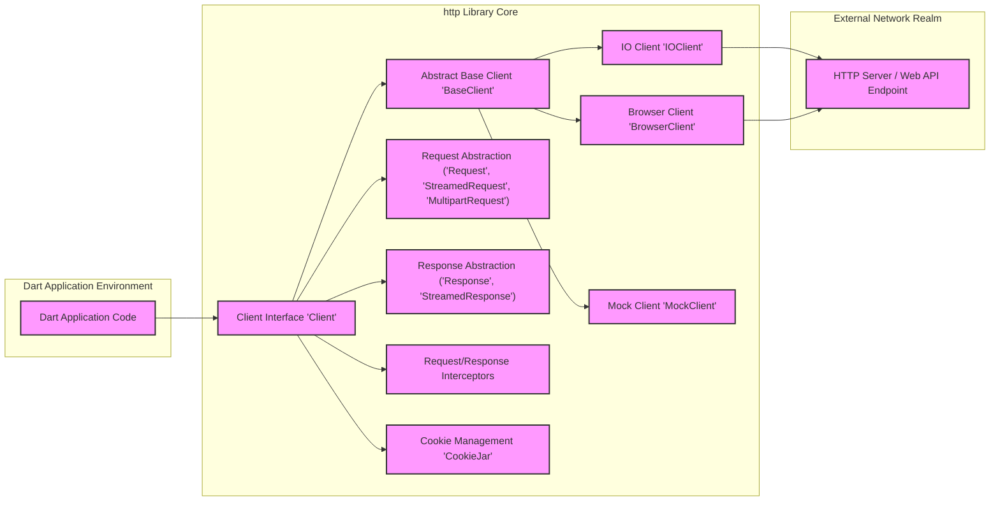
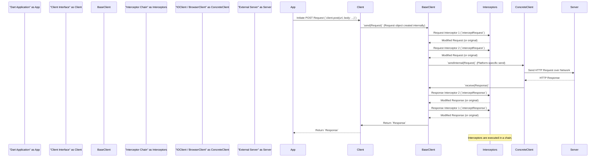

# Project Design Document: `dart-lang/http` Library

**Project Name:** `dart-lang/http`

**Project Repository:** [https://github.com/dart-lang/http](https://github.com/dart-lang/http)

**Version:** 1.1 (Improved Design Document - Based on current repository structure and functionality)

**Document Version:** 1.1
**Date:** 2023-10-27
**Author:** AI Software Architect

## 1. Introduction

This document provides an enhanced design overview of the `dart-lang/http` library, a crucial component for Dart developers needing to interact with web services. It serves as a blueprint for understanding the library's architecture, components, and data flow, specifically tailored for subsequent threat modeling activities. This document details the library's structure to facilitate a comprehensive security analysis.

## 2. Project Overview

The `dart-lang/http` library is designed to be a versatile and dependable HTTP client for Dart applications. Its core objectives are:

*   **Extensibility:**  Empower developers to customize the HTTP client behavior through interceptors, allowing for middleware-like functionality.
*   **Platform Agnostic:**  Function seamlessly across diverse Dart platforms, including web browsers, server-side environments (leveraging `dart:io`), and mobile platforms.
*   **Comprehensive Feature Set:** Offer a wide range of HTTP capabilities:
    *   Standard HTTP Methods: Support for GET, POST, PUT, DELETE, HEAD, PATCH, and OPTIONS.
    *   Header Management: Robust manipulation of request and response headers.
    *   Body Handling: Encoding and decoding of request and response bodies in various formats (JSON, form data, multipart, text, binary).
    *   Streaming Support: Handling of streamed requests and responses for large data transfers.
    *   Cookie Management:  Persistent cookie handling for session management.
    *   Error Handling:  Comprehensive error and exception management for robust applications.
    *   Timeouts: Configuration of timeouts to prevent indefinite request hangs.
    *   Proxy Support:  Configuration options for routing requests through proxy servers.
    *   TLS/SSL Security: Secure communication via HTTPS with TLS/SSL encryption.
    *   Redirect Handling: Management of HTTP redirects.

The library is intended for Dart developers building applications that require communication with backend services, APIs, and web resources. Its design prioritizes flexibility and ease of use while providing a solid foundation for secure HTTP interactions.

## 3. System Architecture

The `dart-lang/http` library employs a modular and layered architecture, promoting maintainability and extensibility.  Its key components are designed to work in concert, providing a cohesive and adaptable HTTP client.

### 3.1. High-Level Architecture Diagram

**Diagram Description Enhancements:**

*   **Dart Application Environment:**  Clarifies that the Dart application code resides within a broader environment.
*   **http Library Core:**  Emphasizes that the components within this subgraph are the central building blocks of the library.
*   **Abstract Base Client:**  Highlights `BaseClient`'s role as an abstract class providing shared functionality.
*   **Request Abstraction & Response Abstraction:**  Uses more descriptive names to indicate the purpose of Request and Response objects.
*   **External Network Realm:**  Replaces "External Network" with "External Network Realm" to better represent the boundary between the application and the external world.
*   **Clearer Node Labels:**  Improved labels for better readability and understanding of each component's role.

### 3.2. Component Description (Detailed)

#### 3.2.1. `Client` Interface (Contract Definition)

*   **Purpose:**  Defines the public API contract for interacting with the HTTP client. It specifies the methods available for making HTTP requests, ensuring consistency across different implementations.
*   **Responsibilities:**
    *   **API Definition:**  Abstracts the underlying HTTP client implementation details from the user.
    *   **Method Signatures:**  Provides standard methods for each HTTP verb (e.g., `get()`, `post()`, `put()`, `delete()`, `head()`, `patch()`, `send()`). The `send()` method offers a lower-level interface for constructing and sending `Request` objects directly.
    *   **Interceptor Integration:**  Defines how interceptors are applied during request and response processing.
    *   **Environment Independence:**  Ensures a consistent API regardless of the execution environment (browser, server, mobile).

#### 3.2.2. `BaseClient` (Abstract Foundation)

*   **Purpose:**  Serves as an abstract base class for concrete `Client` implementations. It encapsulates common logic and functionalities shared across different environments, reducing code duplication and promoting consistency.
*   **Responsibilities:**
    *   **Interceptor Management:**  Handles the registration and invocation of request and response interceptors in a defined order.
    *   **Request Pre-processing:**  Implements common request pre-processing steps, such as applying default headers or handling timeouts (partially).
    *   **Response Post-processing:**  Provides a framework for common response post-processing, including error handling and potentially default response transformations.
    *   **Abstract `sendInternal()` Method:** Defines an abstract method `sendInternal(Request request)` that concrete client implementations (`IOClient`, `BrowserClient`) must implement to perform the platform-specific network request. This enforces a template method pattern.

#### 3.2.3. `IOClient` (Platform-Specific I/O Implementation)

*   **Purpose:**  Provides a concrete `Client` implementation specifically for I/O environments (server-side, mobile, desktop) where `dart:io` is available.
*   **Responsibilities:**
    *   **`dart:io.HttpClient` Integration:**  Leverages the `dart:io` library's built-in `HttpClient` to execute actual network requests.
    *   **Socket Management:**  Handles the creation and management of network sockets for HTTP communication.
    *   **TLS/SSL Negotiation:**  Manages TLS/SSL handshake and encryption for HTTPS connections using `dart:io`'s capabilities.
    *   **Proxy Configuration (via `dart:io.HttpClient`):** Supports proxy settings configured through `dart:io`'s `HttpClient` options.
    *   **Platform-Specific Error Handling:**  Adapts error codes and exceptions from `dart:io` to the `http` library's error handling conventions.

#### 3.2.4. `BrowserClient` (Browser Environment Adaptation)

*   **Purpose:**  Provides a concrete `Client` implementation tailored for browser environments, utilizing browser-specific APIs for network requests.
*   **Responsibilities:**
    *   **Browser API Abstraction:**  Uses browser-native APIs like `XMLHttpRequest` or the more modern `Fetch API` (depending on Dart target and browser compatibility) to perform HTTP requests.
    *   **CORS Handling:**  Manages Cross-Origin Resource Sharing (CORS) preflight requests and restrictions enforced by web browsers.
    *   **Cookie Management (Browser Context):**  Integrates with the browser's built-in cookie storage and management mechanisms.
    *   **Security Context Awareness:** Operates within the browser's security sandbox and adheres to browser security policies.
    *   **Adapting Browser Limitations:**  Handles browser-specific limitations and behaviors related to HTTP requests.

#### 3.2.5. `MockClient` (Testing and Simulation)

*   **Purpose:**  A specialized `Client` implementation designed for testing and simulating HTTP interactions without making actual network calls.
*   **Responsibilities:**
    *   **Request Interception (for Testing):**  Allows test code to intercept outgoing requests and assert on their properties (URL, headers, body, etc.).
    *   **Predefined Response Simulation:**  Enables the definition of mock responses for specific requests, allowing testing of various scenarios (success, errors, different response codes, etc.).
    *   **Deterministic Testing:**  Provides a deterministic environment for testing HTTP-dependent logic, eliminating external network dependencies and flakiness.
    *   **Stateful Mocking (Optional):**  May support stateful mocking scenarios where responses can depend on previous requests or internal state.

#### 3.2.6. Request Abstraction (`Request`, `StreamedRequest`, `MultipartRequest`)

*   **Purpose:**  Provides structured representations of HTTP requests, encapsulating all necessary information for sending a request.
*   **Responsibilities:**
    *   **Request Parameter Storage:**  Stores HTTP method, URI (URL), headers, and request body.
    *   **Body Type Specialization:**
        *   `Request`: For requests with simple, in-memory bodies (e.g., text, JSON).
        *   `StreamedRequest`: For requests with bodies that are streams, enabling efficient handling of large data uploads.
        *   `MultipartRequest`: Specifically designed for `multipart/form-data` requests, commonly used for file uploads and complex form submissions.
    *   **Request Construction and Modification:**  Provides methods for constructing and modifying request parameters programmatically.

#### 3.2.7. Response Abstraction (`Response`, `StreamedResponse`)

*   **Purpose:**  Represents HTTP responses received from the server, providing access to response data and metadata.
*   **Responsibilities:**
    *   **Response Data Storage:** Stores HTTP status code, response headers, and response body.
    *   **Body Access Methods:**  Provides methods to access the response body in different formats:
        *   As a `String` (decoded text).
        *   As a `Uint8List` (raw bytes).
        *   As a `Stream<List<int>>` (for streamed responses).
    *   **Status Code and Header Access:**  Provides easy access to the HTTP status code and response headers.
    *   **Error Representation (Potentially):** May include mechanisms to represent HTTP errors or provide helper methods for checking for error status codes.

#### 3.2.8. Request/Response Interceptors (Middleware Mechanism)

*   **Purpose:**  Enables developers to inject custom logic into the request/response lifecycle, acting as middleware to modify or observe requests and responses.
*   **Responsibilities:**
    *   **Request Interception (Pre-send):**  Allow modification of outgoing requests before they are sent over the network (e.g., adding authentication headers, logging requests, request transformation).
    *   **Response Interception (Post-receive):**  Allow processing of incoming responses before they are returned to the application (e.g., logging responses, handling errors globally, response data transformation, caching).
    *   **Interceptor Chaining:**  Support chaining of multiple interceptors, allowing for layered middleware functionality.
    *   **Order of Execution:**  Define a clear order of execution for interceptors (e.g., request interceptors executed in registration order, response interceptors in reverse registration order).

#### 3.2.9. Cookie Management (`CookieJar`)

*   **Purpose:**  Provides a mechanism for persistent cookie storage and management, enabling session management and stateful HTTP interactions.
*   **Responsibilities:**
    *   **Cookie Storage:**  Stores cookies received from servers, typically in memory or potentially with persistence options (e.g., file system, shared preferences).
    *   **Cookie Association with Requests:**  Automatically attaches relevant cookies to outgoing requests based on the request URL and cookie domain/path attributes.
    *   **Cookie Persistence (Optional):**  May offer options to persist cookies across application sessions.
    *   **Cookie Policy Enforcement:**  May implement cookie policies (e.g., handling of secure, HTTP-only, and same-site attributes).
    *   **Cookie Clearing and Management API:**  Provides an API for programmatically managing cookies (e.g., clearing cookies, retrieving specific cookies).

## 4. Data Flow (Detailed Request Scenario)

The following sequence diagram provides a more detailed view of the data flow for an HTTP POST request with request and response interceptors involved.

**Data Flow Description Enhancements:**

*   **Interceptor Chain Participant:**  Introduces an "Interceptor Chain" participant to explicitly show the sequence of interceptor execution.
*   **Explicit Interceptor Invocation:**  Shows individual calls to `interceptRequest` and `interceptResponse` for each interceptor in the chain.
*   **Interceptor Order:**  Illustrates the order of interceptor execution (Request interceptors in registration order, Response interceptors in reverse registration order).
*   **`sendInternal()` Clarification:**  Uses `sendInternal(Request)` to emphasize the abstract method call to the concrete client.
*   **Note on Interceptor Chain:** Adds a note to highlight the chained nature of interceptor execution.

## 5. Technology Stack

*   **Primary Language:** Dart
*   **Core Dart Libraries:**
    *   `dart:core`: Foundational Dart classes and types.
    *   `dart:async`: Asynchronous programming primitives (Futures, Streams).
    *   `dart:io` (for `IOClient`):  Platform-specific I/O operations, including networking (sockets, HTTP client), file system access, etc.
    *   `dart:html` (for `BrowserClient`): Browser Document Object Model (DOM) and browser APIs, including `XMLHttpRequest`, `Fetch API`, and browser-specific functionalities.
    *   `dart:convert`: Data conversion utilities, particularly for JSON encoding/decoding, but also for other formats like UTF-8.
    *   `dart:typed_data`: Handling of binary data using typed arrays (e.g., `Uint8List`).
    *   `package:http_parser`: (Likely Dependency) For parsing HTTP headers and other HTTP-related string formats.
    *   Potentially other Dart packages for specific functionalities like advanced cookie management or more sophisticated form encoding if not handled directly.

## 6. Security Considerations (Detailed)

Security is paramount for any HTTP client library. The `dart-lang/http` library must address the following security considerations to protect applications and user data:

*   **Transport Layer Security (TLS/SSL) Enforcement (HTTPS):**
    *   **Threat:** Man-in-the-Middle (MITM) attacks, eavesdropping, data interception.
    *   **Mitigation:**  Strongly encourage and default to HTTPS. Ensure proper TLS/SSL negotiation and certificate validation. Provide clear documentation and guidance on using HTTPS correctly.  Consider options for strict transport security (HSTS) if applicable in the context of a client library.
*   **Input Validation and Output Encoding (Request/Response Handling):**
    *   **Threat:** Injection vulnerabilities (e.g., header injection, body injection if constructing requests from untrusted input).
    *   **Mitigation:**  While primarily the responsibility of the application *using* the library, the `http` library should:
        *   Provide APIs that encourage safe construction of requests and handling of responses.
        *   Document best practices for sanitizing and validating user inputs before including them in requests.
        *   Handle encoding and decoding of request/response bodies correctly to prevent interpretation issues.
*   **Cookie Security (Management and Storage):**
    *   **Threat:** Session hijacking, cross-site scripting (XSS) if cookies are not handled securely.
    *   **Mitigation:**
        *   Properly handle cookie attributes (Secure, HttpOnly, SameSite).
        *   Provide options for secure cookie storage (in-memory by default, but consider secure persistent storage options if persistence is implemented).
        *   Document best practices for cookie management and security.
*   **Error Handling and Information Disclosure:**
    *   **Threat:** Leaking sensitive information in error messages (e.g., internal server paths, stack traces, configuration details).
    *   **Mitigation:**  Implement robust error handling that avoids exposing sensitive information in error responses or logs. Provide generic error messages to the client while logging detailed errors securely for debugging purposes.
*   **Denial of Service (DoS) Prevention (Timeouts and Resource Management):**
    *   **Threat:** Client-side DoS if the library doesn't handle timeouts or resource consumption properly, allowing malicious servers to exhaust client resources.
    *   **Mitigation:**
        *   Implement and enforce reasonable default timeouts for requests.
        *   Provide options for configuring timeouts.
        *   Manage resources (sockets, memory, connections) efficiently to prevent resource exhaustion.
*   **Cross-Origin Resource Sharing (CORS) in Browser Environments:**
    *   **Threat:** Unauthorized cross-origin requests in browser environments, potentially leading to data breaches or malicious actions.
    *   **Mitigation:**  `BrowserClient` must correctly handle CORS preflight requests and enforce CORS restrictions imposed by browsers.  Provide clear documentation on CORS implications and how to handle cross-origin requests securely.
*   **Redirect Handling Security:**
    *   **Threat:** Open redirects, where a malicious server could redirect the client to a phishing site or other malicious destination.
    *   **Mitigation:**  Implement secure redirect handling.  Potentially limit the number of redirects followed automatically.  Provide options for users to control redirect behavior or validate redirect destinations.
*   **Dependency Security (Third-Party Libraries):**
    *   **Threat:** Vulnerabilities in third-party libraries used by `http` could be exploited.
    *   **Mitigation:**  Regularly audit and update dependencies.  Choose dependencies carefully, considering their security track record and maintenance status.  Employ dependency scanning tools to identify and address known vulnerabilities.

## 7. Threat Modeling Scope and Focus Areas

This design document is specifically created to facilitate a comprehensive threat model for the `dart-lang/http` library. The threat modeling process should leverage this document to:

*   **Identify Threat Actors and Attack Vectors:** Determine potential malicious actors who might target the library and the possible attack vectors they could use.
*   **STRIDE Analysis:** Apply the STRIDE methodology (Spoofing, Tampering, Repudiation, Information Disclosure, Denial of Service, Elevation of Privilege) to systematically identify threats related to each component and data flow described in this document.
*   **Data Flow Diagram Analysis:**  Use the data flow diagrams to analyze potential points of vulnerability during request and response processing, interceptor execution, and network communication.
*   **Component-Level Threat Assessment:**  Conduct a detailed threat assessment for each component (Client Interface, BaseClient, IOClient, BrowserClient, etc.), considering its specific responsibilities and interactions.
*   **Security Control Evaluation:**  Evaluate the existing security controls within the library and identify any gaps or areas for improvement.
*   **Prioritization of Threats:**  Prioritize identified threats based on their potential impact and likelihood of occurrence.
*   **Mitigation Strategy Development:**  Develop concrete mitigation strategies for the prioritized threats, focusing on design improvements, code changes, and security best practices.

**Specific Focus Areas for Threat Modeling based on this Design:**

*   **Interceptor Security:**  Analyze the security implications of interceptors. Can malicious interceptors be injected? How is interceptor execution order enforced securely?
*   **Platform-Specific Vulnerabilities:**  Investigate potential vulnerabilities specific to `IOClient` (related to `dart:io.HttpClient`) and `BrowserClient` (related to browser APIs and CORS).
*   **Cookie Jar Security:**  Thoroughly analyze the security of the `CookieJar` implementation, especially if persistence is added.
*   **Error Handling Paths:**  Examine error handling code paths for potential information disclosure vulnerabilities.
*   **Request and Response Parsing:**  Analyze the parsing of HTTP requests and responses for vulnerabilities related to malformed or malicious input.

This improved design document provides a more detailed and structured foundation for conducting a robust threat model of the `dart-lang/http` library, ultimately contributing to a more secure and reliable HTTP client for Dart developers.