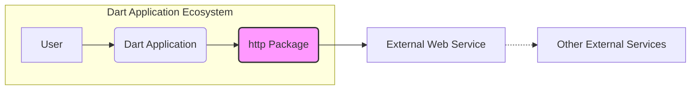
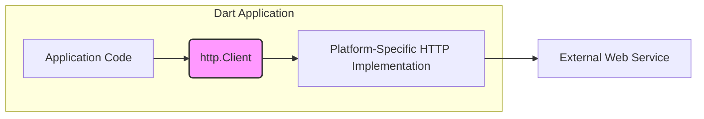
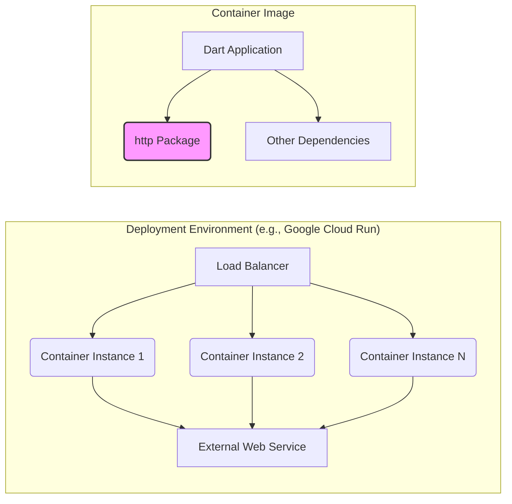

Okay, let's create a design document for the Dart `http` package, focusing on aspects relevant for threat modeling.

# BUSINESS POSTURE

The Dart `http` package is a fundamental building block for many Dart and Flutter applications that need to interact with web services.  It's a community-maintained, open-source project, crucial for the Dart ecosystem's health.

Priorities:

*   Provide a stable, reliable, and easy-to-use API for making HTTP requests.
*   Maintain compatibility across different Dart platforms (web, server, mobile).
*   Ensure the package is performant and doesn't introduce unnecessary overhead.
*   Keep the package up-to-date with evolving web standards and security best practices.
*   Maintain a good developer experience, making it easy to contribute and report issues.

Goals:

*   Enable Dart developers to easily consume and interact with HTTP-based APIs.
*   Facilitate the development of network-connected applications in Dart.
*   Provide a composable and extensible API for handling various HTTP scenarios.

Business Risks:

*   Vulnerabilities in the `http` package could be exploited to compromise applications that use it, potentially leading to data breaches, denial of service, or other security incidents.  This is the *most critical risk* due to the package's widespread use.
*   Performance issues or bugs in the package could negatively impact the performance and reliability of dependent applications.
*   Lack of support for newer HTTP features or protocols could limit the capabilities of applications built with the package.
*   Inadequate documentation or a difficult-to-use API could hinder adoption and lead developers to use less secure alternatives.
*   Lack of maintenance or slow response to security issues could erode trust in the package and the Dart ecosystem.

# SECURITY POSTURE

Existing Security Controls:

*   security control: Code Reviews: All changes to the `http` package go through a code review process on GitHub. (Implemented in: GitHub pull request workflow).
*   security control: Static Analysis: The Dart analyzer is used to identify potential code quality and security issues. (Implemented in: CI workflows, developer tooling).
*   security control: Automated Tests: The package has a comprehensive suite of unit and integration tests to ensure functionality and prevent regressions. (Implemented in: CI workflows, `test/` directory).
*   security control: Dependency Management: Dependencies are managed using `pubspec.yaml` and `pubspec.lock` files, ensuring consistent and reproducible builds. (Implemented in: project files).
*   security control: Fuzz testing: The project uses fuzz testing to check for unexpected inputs. (Implemented in: fuzz/ directory).

Accepted Risks:

*   accepted risk: The package relies on the underlying platform's HTTP client implementations (e.g., `dart:io`'s `HttpClient` on the server, the browser's `fetch` API on the web).  Vulnerabilities in these underlying implementations are outside the direct control of the `http` package.
*   accepted risk: The package does not provide built-in mechanisms for advanced security features like mutual TLS (mTLS) or OAuth. Developers are responsible for implementing these features using other libraries or custom code if needed.
*   accepted risk: The package does not automatically handle all possible HTTP error conditions or edge cases. Developers are responsible for implementing appropriate error handling and retry logic in their applications.

Recommended Security Controls:

*   security control: Regularly update dependencies to address known vulnerabilities in third-party libraries.
*   security control: Implement a security policy (SECURITY.md) that clearly outlines how to report security vulnerabilities.
*   security control: Consider adding more fuzzing tests to cover a wider range of input scenarios.
*   security control: Explore the use of static analysis tools specifically designed for security vulnerability detection (e.g., SAST tools).

Security Requirements:

*   Authentication:
    *   The package should provide a way to easily set authentication headers (e.g., Basic, Bearer).
    *   The package should not store or manage credentials directly. Credential management is the responsibility of the application.

*   Authorization:
    *   The package should not handle authorization logic. Authorization is the responsibility of the application and the server it communicates with.

*   Input Validation:
    *   The package should validate user-provided URLs to prevent common injection vulnerabilities.
    *   The package should properly encode data sent in requests (e.g., URL encoding, escaping special characters).

*   Cryptography:
    *   The package should rely on the underlying platform's TLS/SSL implementation for secure communication over HTTPS.
    *   The package should not implement its own cryptographic algorithms.

# DESIGN

## C4 CONTEXT



Context Diagram Element List:

*   Element:
    *   Name: User
    *   Type: Person
    *   Description: A user interacting with a Dart application that uses the `http` package.
    *   Responsibilities: Initiates requests that ultimately result in HTTP calls.
    *   Security controls: N/A (External to the system)

*   Element:
    *   Name: Dart Application
    *   Type: Software System
    *   Description: A Dart application (web, server, or mobile) that uses the `http` package to communicate with web services.
    *   Responsibilities: Uses the `http` package to make HTTP requests. Handles responses and errors. Implements application-specific logic.
    *   Security controls: Application-specific security controls (authentication, authorization, input validation, etc.).

*   Element:
    *   Name: http Package
    *   Type: Library
    *   Description: The Dart `http` package. Provides an API for making HTTP requests.
    *   Responsibilities: Provides a convenient interface for making HTTP requests. Handles low-level details of HTTP communication.
    *   Security controls: Code reviews, static analysis, automated tests, dependency management, fuzz testing.

*   Element:
    *   Name: External Web Service
    *   Type: Software System
    *   Description: An external web service (e.g., a REST API) that the Dart application communicates with.
    *   Responsibilities: Responds to HTTP requests from the Dart application.
    *   Security controls: External service's security controls (authentication, authorization, input validation, etc.).

*   Element:
    *   Name: Other External Services
    *   Type: Software System
    *   Description: Other external services that the External Web Service might interact with.
    *   Responsibilities: Provide services to the External Web Service.
    *   Security controls: External service's security controls.

## C4 CONTAINER



Container Diagram Element List:

*   Element:
    *   Name: Application Code
    *   Type: Code
    *   Description: The Dart application's code that uses the `http` package.
    *   Responsibilities: Creates `http.Client` instances. Constructs HTTP requests. Handles responses and errors.
    *   Security controls: Application-specific security controls.

*   Element:
    *   Name: http.Client
    *   Type: Class
    *   Description: The main class in the `http` package for making HTTP requests.  Provides methods like `get`, `post`, `put`, `delete`, etc.
    *   Responsibilities: Provides a high-level API for making HTTP requests. Delegates to platform-specific implementations.
    *   Security controls: Input validation (URL validation, header sanitization).

*   Element:
    *   Name: Platform-Specific HTTP Implementation
    *   Type: Library/API
    *   Description: The underlying HTTP client implementation used by `http.Client`.  This varies depending on the platform (e.g., `dart:io`'s `HttpClient` on the server, the browser's `fetch` API on the web).
    *   Responsibilities: Handles the low-level details of HTTP communication, including TCP connections, TLS/SSL, and request/response parsing.
    *   Security controls: Relies on the security controls of the underlying platform (e.g., browser's security model, operating system's TLS implementation).

*   Element:
    *   Name: External Web Service
    *   Type: Software System
    *   Description: An external web service (e.g., a REST API) that the Dart application communicates with.
    *   Responsibilities: Responds to HTTP requests from the Dart application.
    *   Security controls: External service's security controls.

## DEPLOYMENT

Possible Deployment Solutions:

1.  **Server-side Dart application:** Deployed to a server environment (e.g., a virtual machine, a container, a serverless function). Uses `dart:io`'s `HttpClient`.
2.  **Flutter mobile application:** Deployed to mobile devices (Android, iOS). Uses a platform-specific HTTP client (e.g., `dart:io` or a native bridge).
3.  **Flutter web application:** Deployed to a web server. Uses the browser's `fetch` API.

Chosen Deployment Solution (Server-side Dart application using a container):



Deployment Diagram Element List:

*   Element:
    *   Name: Load Balancer
    *   Type: Infrastructure
    *   Description: Distributes incoming traffic across multiple container instances.
    *   Responsibilities: Load balancing, health checks.
    *   Security controls: TLS termination, DDoS protection, firewall rules.

*   Element:
    *   Name: Container Instance 1, 2, N
    *   Type: Container
    *   Description: Instances of the Dart application running in containers.
    *   Responsibilities: Runs the Dart application. Makes HTTP requests using the `http` package.
    *   Security controls: Container security best practices (e.g., minimal base image, least privilege).

*   Element:
    *   Name: External Web Service
    *   Type: Software System
    *   Description: The external web service the application communicates with.
    *   Responsibilities: Responds to HTTP requests.
    *   Security controls: External service's security controls.

*    Element:
    *   Name: Dart Application
    *   Type: Code
    *   Description: The compiled Dart application.
    *   Responsibilities: Contains the application logic.
    *   Security controls: Application-level security controls.

*   Element:
    *   Name: http Package
    *   Type: Library
    *   Description: The `http` package included in the container image.
    *   Responsibilities: Provides HTTP client functionality.
    *   Security controls: As described in the Security Posture section.

*   Element:
    *   Name: Other Dependencies
    *   Type: Library
    *   Description: Other dependencies of the Dart application.
    *   Responsibilities: Provide additional functionality to the application.
    *   Security controls: Dependency management, vulnerability scanning.

## BUILD

```mermaid
graph LR
    A[Developer Workstation] --> B{Git Commit & Push};
    B --> C[GitHub Repository];
    C --> D{GitHub Actions (CI)};
    D --> E[Dart Analyzer];
    D --> F[Unit & Integration Tests];
    D --> G[Fuzz Tests];
    D --> H[Build Artifact (e.g., Docker Image)];
    H --> I[Container Registry];
    style D fill:#ccf,stroke:#333,stroke-width:2px
```

Build Process Description:

1.  **Developer Workstation:** Developers write code and commit changes to a local Git repository.
2.  **Git Commit & Push:** Changes are pushed to the central GitHub repository.
3.  **GitHub Repository:** The central repository stores the source code and triggers CI workflows.
4.  **GitHub Actions (CI):**  GitHub Actions is used as the CI/CD system.  Workflows are triggered on pull requests and pushes to the main branch.
5.  **Dart Analyzer:** The Dart analyzer runs static analysis checks to identify code quality and potential security issues.
6.  **Unit & Integration Tests:** The test suite is executed to ensure functionality and prevent regressions.
7.  **Fuzz Tests:** Fuzz tests are executed to check for unexpected inputs.
8.  **Build Artifact (e.g., Docker Image):** If all checks pass, a build artifact is created.  For a server-side application, this is typically a Docker image.
9.  **Container Registry:** The Docker image is pushed to a container registry (e.g., Docker Hub, Google Container Registry).

Security Controls in Build Process:

*   Code reviews (GitHub pull requests).
*   Static analysis (Dart analyzer).
*   Automated tests (unit and integration tests).
*   Fuzz testing.
*   Dependency management (`pubspec.yaml` and `pubspec.lock`).
*   Use of a CI/CD system (GitHub Actions) to automate the build and testing process.
*   Container image scanning (if applicable, using tools like Trivy or Clair).

# RISK ASSESSMENT

Critical Business Processes:

*   Making HTTP requests to external services: This is the core functionality of the `http` package and is essential for any application that relies on it to communicate with web services.
*   Maintaining the stability and reliability of the Dart ecosystem: The `http` package is a foundational component, and its health is critical to the overall success of Dart and Flutter.

Data to Protect:

*   Data transmitted over HTTP: This includes any data sent to or received from external services. The sensitivity of this data depends on the specific application and the services it interacts with.  Examples include:
    *   **High Sensitivity:** User credentials, personal data, financial information, API keys.
    *   **Medium Sensitivity:** Session tokens, configuration data.
    *   **Low Sensitivity:** Publicly available data.
*   Source code of the `http` package: While the code is open source, protecting it from unauthorized modification is important to prevent the introduction of malicious code.

# QUESTIONS & ASSUMPTIONS

Questions:

*   Are there any specific compliance requirements (e.g., PCI DSS, HIPAA) that apply to applications using the `http` package? This would influence the security controls needed in the applications themselves.
*   What is the expected threat model for typical applications using the `http` package?  Are they primarily web applications, mobile apps, or server-side applications? This helps prioritize security considerations.
*   What level of support is expected for older versions of Dart and the `http` package? This impacts the ability to backport security fixes.

Assumptions:

*   BUSINESS POSTURE: We assume a moderate risk appetite, balancing the need for rapid development and innovation with the importance of security. The project is community-driven, so resources for security may be limited.
*   SECURITY POSTURE: We assume that developers using the `http` package are responsible for implementing appropriate security controls in their own applications, including authentication, authorization, and data validation.
*   DESIGN: We assume that the underlying platform's HTTP client implementations are reasonably secure. We also assume that developers will use HTTPS for sensitive data transmission.