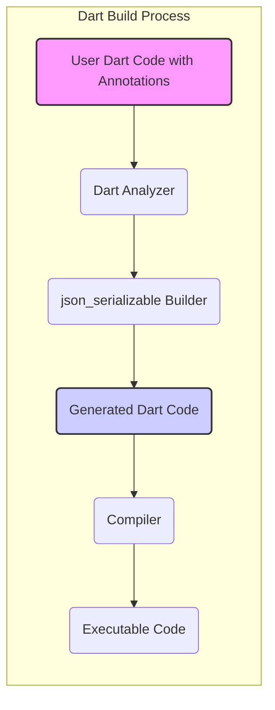
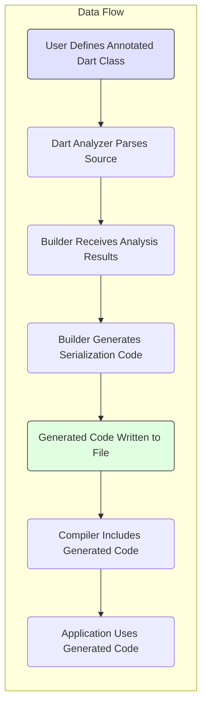

# Project Design Document: json_serializable

**Version:** 1.1
**Date:** October 26, 2023
**Author:** Gemini (AI Expert in Software, Cloud, and Cybersecurity Architecture)

## 1. Introduction

This document details the design of the `json_serializable` project, a Dart package designed to automate the generation of code for converting JSON data to Dart objects and vice versa. This document aims to provide a comprehensive understanding of the project's architecture, data flow, and inherent security considerations. It will serve as a crucial reference point for subsequent threat modeling activities.

## 2. Project Overview

* **Project Name:** `json_serializable`
* **Project Repository:** [https://github.com/dart-lang/json_serializable](https://github.com/dart-lang/json_serializable)
* **Project Description:**  The `json_serializable` package streamlines the interaction with JSON data in Dart by offering an annotation processor. This processor automatically generates the necessary boilerplate code for serialization (Dart to JSON) and deserialization (JSON to Dart). This automation eliminates the manual implementation of `fromJson` and `toJson` methods, thereby accelerating development and reducing the likelihood of human error.

## 3. Goals and Objectives

* **Primary Goal:** To offer a dependable, performant, and intuitive mechanism for generating Dart code that handles JSON serialization and deserialization.
* **Key Objectives:**
    * Automate the creation of `fromJson` and `toJson` methods for user-defined Dart classes.
    * Accommodate a broad spectrum of Dart data types, including primitive types, collections, and nested objects.
    * Provide flexible customization options to tailor the generated code to specific needs.
    * Integrate seamlessly within the standard Dart build process, leveraging existing tooling.
    * Ensure the generated code exhibits high performance characteristics and adheres to best practices for code quality.

## 4. Architectural Design

The `json_serializable` project functions as a code generation tool tightly integrated with the Dart build system. It utilizes the Dart Analyzer and the Builder framework to process Dart source code containing specific annotations and subsequently generate new Dart code.

* **Components:**
    * **User Dart Code with Annotations:** Dart class definitions that include annotations such as `@JsonSerializable()` or related annotations. These annotations serve as directives for the builder, specifying which classes require serialization logic.
    * **Dart Analyzer:** The fundamental component of the Dart SDK responsible for parsing, semantically analyzing, and type-checking Dart code. `json_serializable` relies on the analyzer's output to understand the structure, types, and relationships within the annotated classes.
    * **`json_serializable` Builder:**  A specialized component that integrates with the Dart's `build_runner`. It intercepts the build process, examines the output of the Dart Analyzer, identifies annotated classes, and proceeds to generate the corresponding serialization and deserialization code.
    * **Generated Dart Code:** New Dart source code files containing the implementation of `fromJson` and `toJson` methods (and potentially other supporting functions or classes) for the annotated classes. This generated code becomes an integral part of the project's build output.
    * **Compiler:** The Dart compiler, responsible for translating both the original user-written code and the automatically generated code into executable code (either native code for specific platforms or intermediate code for the Dart VM).
    * **Executable Code:** The final application or library produced by the compilation process, which now incorporates the generated serialization logic, enabling seamless interaction with JSON data.

## 5. Data Flow

The following outlines the sequence of data transformations and component interactions within the `json_serializable` process:

* **Steps:**
    * **User Defines Annotated Dart Class:**  A developer creates a Dart class and adds the appropriate annotations from the `json_serializable` package (e.g., `@JsonSerializable()`). These annotations signal the intent to generate serialization logic for this class.
    * **Dart Analyzer Parses Source:** When the developer initiates the build process (typically using `flutter build` or `dart compile`), the Dart Analyzer parses all project source files, including those containing the annotated classes.
    * **Builder Receives Analysis Results:** The `json_serializable` builder, as part of the build process, receives the structured output from the Dart Analyzer. This output contains detailed information about the syntax, types, and structure of the annotated classes.
    * **Builder Generates Serialization Code:** Based on the analysis results and the specific annotations used, the `json_serializable` builder generates the necessary Dart code for converting instances of the annotated class to and from JSON. This involves creating methods that handle the mapping of Dart object properties to JSON fields and vice-versa.
    * **Generated Code Written to File:** The newly generated Dart code is written to files within a designated build output directory. These files are typically named based on the annotated class and reside in a predictable location.
    * **Compiler Includes Generated Code:** The Dart compiler automatically includes these generated files during the subsequent compilation phase. The compiler treats the generated code as if it were manually written source code.
    * **Application Uses Generated Code:**  The developer can now utilize the automatically generated `fromJson` and `toJson` methods within their application code to seamlessly serialize and deserialize instances of the annotated classes to and from JSON format.

## 6. Security Considerations

This section details potential security considerations relevant to the `json_serializable` project. These points will be further investigated and analyzed during the dedicated threat modeling phase.

* **Input Validation during Code Generation:**
    * **Reliance on Dart Analyzer:** The `json_serializable` builder inherently trusts the output provided by the Dart Analyzer. Any vulnerabilities or inaccuracies within the analyzer could potentially lead to the generation of flawed or insecure code by the builder.
    * **Handling of Malicious Annotations:** While unlikely in typical usage, the builder needs to be resilient against potentially crafted or malicious annotation values. Improper handling could lead to unexpected code generation, compilation errors, or even vulnerabilities if the generated code is executed. For example, excessively long or specially formatted annotation values might cause issues.
* **Security of Generated Code:**
    * **Type Safety and Casting:** The generated `fromJson` methods perform type casting from JSON data to Dart types. If the input JSON does not conform to the expected structure or types, the generated code might throw exceptions or, in less ideal scenarios, lead to type confusion vulnerabilities if not handled robustly.
    * **Null Handling:**  Proper handling of null values in both the incoming JSON and the Dart object properties is critical. Insufficient null checks in the generated code could lead to `NullReferenceError` exceptions or unexpected behavior.
    * **Deserialization of Untrusted Data:** When deserializing JSON data from external or untrusted sources, vulnerabilities in the generated code become a significant concern. For instance:
        * **Missing Field Checks:** If the generated code assumes the presence of certain fields in the JSON without proper checks, malformed JSON could lead to errors.
        * **Incorrect Type Coercion:**  If the generated code attempts to coerce JSON values to Dart types without sufficient validation, it might lead to unexpected behavior or security issues. For example, a string being incorrectly interpreted as a number.
        * **Denial of Service (DoS):**  Extremely large or deeply nested JSON structures could potentially cause excessive memory consumption or stack overflow errors during deserialization if the generated code is not optimized for such scenarios.
* **Dependency Security:**
    * **Transitive Dependencies:** `json_serializable` depends on other packages (e.g., `build_runner`, `analyzer`, `source_gen`). Security vulnerabilities discovered in these direct or transitive dependencies could indirectly impact the security of projects using `json_serializable`. Regular updates and security audits of dependencies are crucial.
* **Build Process Integrity:**
    * **Compromised Build Environment:** If an attacker gains control over the build environment where `json_serializable` is executed, they might be able to tamper with the builder itself or inject malicious code into the generated output. Secure build pipelines and infrastructure are essential.
* **User Code Integration and Responsibility:**
    * **Post-Deserialization Validation:** While `json_serializable` handles the basic conversion, it's the responsibility of the application developer to perform any necessary validation on the deserialized objects before using them. The generated code does not inherently protect against logical flaws or data integrity issues introduced by malicious JSON.
    * **Secure Storage of JSON Data:** `json_serializable` deals with the conversion process, but the security of how the JSON data is stored or transmitted is outside its scope and remains the responsibility of the application developer.

## 7. Technology Stack

* **Primary Programming Language:** Dart
* **Build System Integration:** `build_runner`
* **Code Analysis and Parsing:** `dart_analyzer`
* **Core Dart Libraries:** `dart:core`, `dart:convert`, `dart:collection`
* **Annotation Processing Framework:** Dart's built-in support for annotations and code generation.

## 8. Deployment Model

`json_serializable` is primarily a development-time tool. It functions during the software development lifecycle, specifically within the build process. The `json_serializable` package itself is not deployed as part of the runtime application. Instead, the *generated* code is compiled and included in the final application or library.

## 9. Key Interactions

* **Developer <-> `json_serializable` Annotations:** Developers utilize annotations within their Dart code to provide instructions and configuration to the `json_serializable` builder.
* **Dart Analyzer <-> `json_serializable` Builder:** The Dart Analyzer provides the structured representation of the source code to the `json_serializable` builder, enabling it to understand the annotated classes.
* **`json_serializable` Builder <-> Generated Code:** The core function of the builder is to generate new Dart source code files containing the serialization and deserialization logic.
* **Generated Code <-> Application Code:** The application code then directly invokes the generated `fromJson` and `toJson` methods to perform the conversion between Dart objects and JSON data.

## 10. Assumptions and Constraints

* **Assumption:** The Dart Analyzer functions correctly and provides accurate information about the structure and types of the annotated classes.
* **Assumption:** Developers using `json_serializable` have a basic understanding of JSON structure and Dart data types.
* **Constraint:** The generated code must be valid Dart syntax and adhere to Dart language semantics to ensure successful compilation.
* **Constraint:** The code generation process should be efficient enough to avoid significantly increasing build times, especially for large projects.

## 11. Future Considerations

* **Enhanced Error Reporting and Diagnostics:**  Improving the clarity and detail of error messages generated during the code generation process to assist developers in debugging issues.
* **Support for More Advanced Serialization Scenarios:** Expanding the capabilities of `json_serializable` to handle more complex serialization needs, such as custom serialization logic for specific fields or handling circular dependencies.
* **Performance Optimization of Generated Code:** Continuously evaluating and optimizing the performance of the generated `fromJson` and `toJson` methods to minimize overhead during runtime.
* **Regular Security Audits and Reviews:**  Conducting periodic security audits of the `json_serializable` package and its dependencies to identify and address potential vulnerabilities proactively.
* **Improved Documentation and Examples:** Providing more comprehensive documentation and practical examples to guide developers on best practices for using `json_serializable` securely and effectively.

This enhanced design document offers a more detailed and nuanced understanding of the `json_serializable` project. It provides a solid foundation for conducting a thorough threat modeling exercise, which will be instrumental in identifying potential security risks and formulating appropriate mitigation strategies.