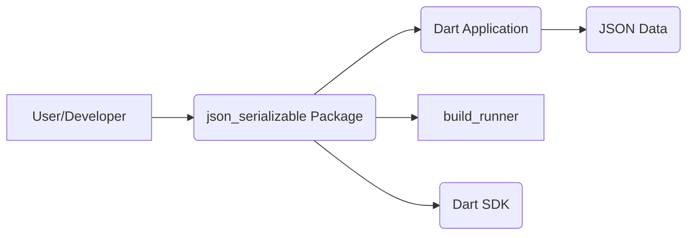
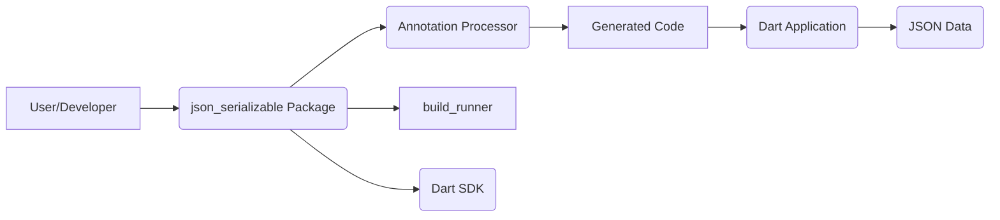
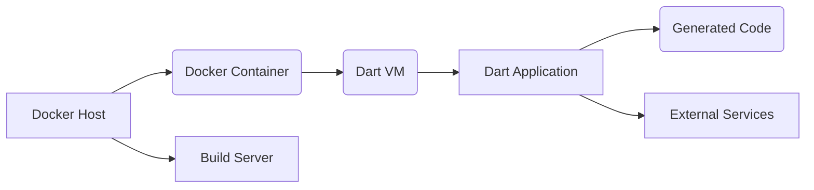
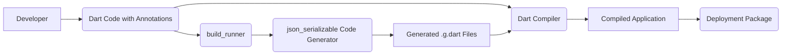

Okay, let's create a design document for the `json_serializable` package in Dart.

# BUSINESS POSTURE

Business Priorities and Goals:

*   Enable developers to easily serialize and deserialize Dart objects to and from JSON.
*   Reduce boilerplate code associated with JSON serialization.
*   Improve developer productivity by automating the generation of serialization logic.
*   Provide a robust and maintainable solution for JSON handling in Dart applications.
*   Support various customization options for serialization behavior.
*   Integrate seamlessly with the Dart ecosystem and build tools.

Business Risks:

*   Incorrectly generated serialization logic could lead to data corruption or unexpected application behavior.
*   Vulnerabilities in the generated code or the package itself could expose applications to security risks, such as injection attacks or denial of service.
*   Lack of support for specific JSON structures or data types could limit the package's applicability.
*   Performance bottlenecks in the serialization process could impact application responsiveness.
*   Changes in the Dart language or the `build_runner` system could break compatibility.
*   Inadequate documentation or examples could hinder adoption and usage.

# SECURITY POSTURE

Existing Security Controls:

*   security control: The package relies on code generation, which reduces the risk of manual errors in serialization logic.
    *   Implemented in: `json_serializable` package itself.
*   security control: The package uses the Dart type system to enforce type safety during serialization and deserialization.
    *   Implemented in: Generated code and Dart's type system.
*   security control: The package is tested.
    *   Implemented in: Test suite in the repository.
*   security control: The package is actively maintained by the Dart team.
    *   Implemented in: Dart team processes.

Accepted Risks:

*   accepted risk: The package relies on the correctness of the `build_runner` and related build tools. Issues in these tools could affect the generated code.
*   accepted risk: Custom `fromJson` and `toJson` methods provided by users are not validated by the package and could introduce vulnerabilities.
*   accepted risk: The package does not provide built-in protection against common web vulnerabilities like XSS or CSRF. These must be handled separately in the application using the package.

Recommended Security Controls:

*   security control: Implement a fuzzer to test the generated serialization and deserialization logic with a wide range of inputs.
*   security control: Integrate static analysis tools (e.g., linters, SAST) into the build process to identify potential vulnerabilities in the package code and generated code.
*   security control: Provide clear documentation and guidelines on how to securely use the package, including best practices for handling user-provided data and avoiding common vulnerabilities.
*   security control: Regularly review and update dependencies to address any known security issues.
*   security control: Consider adding support for content security policies (CSP) or other security headers if the generated code is used in web applications.

Security Requirements:

*   Authentication: Not directly applicable to this package, as it deals with data serialization, not authentication.
*   Authorization: Not directly applicable to this package.
*   Input Validation:
    *   The package should handle invalid JSON input gracefully, without crashing or throwing unexpected exceptions.
    *   The generated code should validate that the input data conforms to the expected types and structure.
    *   Users should be encouraged to validate data before passing it to the `fromJson` methods, especially if the data comes from external sources.
*   Cryptography: Not directly applicable, unless the serialized data itself requires encryption. In such cases, users should encrypt/decrypt the data before/after serialization.
*   Output validation:
    *   The package should handle invalid input for `toJson` methods gracefully.
    *   Users should be encouraged to validate data before passing it to the `toJson` methods, especially if the data comes from external sources.

# DESIGN

## C4 CONTEXT

Context Diagram Element Description:

*   User/Developer
    *   Name: User/Developer
    *   Type: Person
    *   Description: The developer who uses the `json_serializable` package in their Dart application.
    *   Responsibilities: Writes Dart code, defines classes, uses annotations, runs build commands.
    *   Security controls: Follows secure coding practices.
*   json\_serializable Package
    *   Name: json\_serializable Package
    *   Type: Software System
    *   Description: The Dart package that provides JSON serialization functionality.
    *   Responsibilities: Generates serialization code, provides annotations, handles serialization and deserialization.
    *   Security controls: Code generation, type safety, testing.
*   Dart Application
    *   Name: Dart Application
    *   Type: Software System
    *   Description: The application that uses the `json_serializable` package.
    *   Responsibilities: Uses the generated code to serialize and deserialize objects.
    *   Security controls: Application-specific security measures.
*   build\_runner
    *   Name: build\_runner
    *   Type: Software System
    *   Description: The Dart build tool that runs the code generator.
    *   Responsibilities: Executes the code generation process.
    *   Security controls: Relies on the security of the build environment.
*   JSON Data
    *   Name: JSON Data
    *   Type: Data
    *   Description: The JSON data that is being serialized or deserialized.
    *   Responsibilities: Represents the data in a standard format.
    *   Security controls: Data validation, potentially encryption.
*   Dart SDK
    *   Name: Dart SDK
    *   Type: Software System
    *   Description: Dart software development kit.
    *   Responsibilities: Provides core libraries and tools for Dart development.
    *   Security controls: Relies on the security of the Dart SDK.

## C4 CONTAINER

Container Diagram Element Description:

*   User/Developer
    *   Name: User/Developer
    *   Type: Person
    *   Description: The developer who uses the `json_serializable` package.
    *   Responsibilities: Writes Dart code, defines classes, uses annotations, runs build commands.
    *   Security controls: Follows secure coding practices.
*   json\_serializable Package
    *   Name: json\_serializable Package
    *   Type: Library
    *   Description: The Dart package that provides JSON serialization functionality.
    *   Responsibilities: Provides annotations and logic for code generation.
    *   Security controls: Code generation, type safety, testing.
*   Annotation Processor
    *   Name: Annotation Processor
    *   Type: Code Generator
    *   Description: The component within the package that processes annotations and generates code.
    *   Responsibilities: Analyzes annotations, generates serialization logic.
    *   Security controls: Relies on the security of the `build_runner` and Dart SDK.
*   Generated Code
    *   Name: Generated Code
    *   Type: Dart Code
    *   Description: The Dart code generated by the annotation processor.
    *   Responsibilities: Provides `toJson` and `fromJson` methods for classes.
    *   Security controls: Type safety, relies on the correctness of the generator.
*   build\_runner
    *   Name: build\_runner
    *   Type: Software System
    *   Description: The Dart build tool that runs the code generator.
    *   Responsibilities: Executes the code generation process.
    *   Security controls: Relies on the security of the build environment.
*   Dart Application
    *   Name: Dart Application
    *   Type: Software System
    *   Description: The application that uses the `json_serializable` package.
    *   Responsibilities: Uses the generated code to serialize and deserialize objects.
    *   Security controls: Application-specific security measures.
*   JSON Data
    *   Name: JSON Data
    *   Type: Data
    *   Description: The JSON data that is being serialized or deserialized.
    *   Responsibilities: Represents the data in a standard format.
    *   Security controls: Data validation, potentially encryption.
*   Dart SDK
    *   Name: Dart SDK
    *   Type: Software System
    *   Description: Dart software development kit.
    *   Responsibilities: Provides core libraries and tools for Dart development.
    *   Security controls: Relies on the security of the Dart SDK.

## DEPLOYMENT

Deployment of the `json_serializable` package itself is handled through pub.dev. However, applications using it can have various deployment scenarios.

Possible Deployment Solutions:

1.  Web Application (Dart compiled to JavaScript): Deployed to a web server (e.g., Apache, Nginx, Firebase Hosting).
2.  Server-side Application (Dart VM): Deployed to a server (physical or virtual) or a containerized environment (e.g., Docker, Kubernetes).
3.  Mobile Application (Flutter): Packaged and deployed through app stores (Google Play Store, Apple App Store).
4.  Desktop Application (Flutter): Packaged and distributed as an executable for the target platform.

Chosen Deployment Solution (Server-side Application - Docker):

Deployment Diagram Element Description:

*   Docker Host
    *   Name: Docker Host
    *   Type: Server
    *   Description: The physical or virtual machine that hosts the Docker engine.
    *   Responsibilities: Runs the Docker daemon, manages containers.
    *   Security controls: Operating system security, network security, Docker daemon security configuration.
*   Docker Container
    *   Name: Docker Container
    *   Type: Container
    *   Description: The isolated environment running the Dart application.
    *   Responsibilities: Provides a consistent runtime environment for the application.
    *   Security controls: Container isolation, image security, resource limits.
*   Dart VM
    *   Name: Dart VM
    *   Type: Runtime Environment
    *   Description: The Dart Virtual Machine that executes the application code.
    *   Responsibilities: Executes Dart code.
    *   Security controls: Dart VM security features.
*   Dart Application
    *   Name: Dart Application
    *   Type: Application
    *   Description: The application that uses the `json_serializable` package.
    *   Responsibilities: Performs application logic, uses generated code for serialization.
    *   Security controls: Application-specific security measures.
*   Generated Code
    *   Name: Generated Code
    *   Type: Code
    *   Description: The code generated by `json_serializable`.
    *   Responsibilities: Handles JSON serialization and deserialization.
    *   Security controls: Relies on the security of the generator and Dart type system.
*   External Services
    *   Name: External Services
    *   Type: External Systems
    *   Description: Any external services the application interacts with (databases, APIs, etc.).
    *   Responsibilities: Varies depending on the service.
    *   Security controls: Depends on the specific service and its security configuration.
*   Build Server
    *   Name: Build Server
    *   Type: Server
    *   Description: Server that builds application and creates docker image.
    *   Responsibilities: Build application, create docker image, push docker image to repository.
    *   Security controls: Access control, secure build environment.

## BUILD

The build process for applications using `json_serializable` typically involves the following steps:

1.  Developer writes Dart code, including classes annotated with `@JsonSerializable()`.
2.  Developer runs `build_runner` (either `build` or `watch` command).
3.  `build_runner` invokes the `json_serializable` code generator.
4.  The code generator analyzes the annotated classes and generates the corresponding `toJson` and `fromJson` methods in `.g.dart` files.
5.  The Dart compiler compiles the application code, including the generated code.
6.  The compiled application is packaged for deployment (e.g., as a Docker image, a JavaScript bundle, or a mobile app package).

Build Process Diagram:

Security Controls in the Build Process:

*   security control: Code generation: Automates serialization logic, reducing manual errors.
*   security control: Dart type system: Enforces type safety during compilation.
*   security control: Dependency management (pub): Ensures that the correct versions of packages are used.
*   security control: (Recommended) Static analysis (SAST, linters): Can be integrated into the build process to detect potential vulnerabilities.
*   security control: (Recommended) Software Composition Analysis (SCA): Can be used to identify vulnerabilities in dependencies.

# RISK ASSESSMENT

Critical Business Processes:

*   Data serialization and deserialization: This is the core functionality provided by the package and is essential for any application that uses it to handle JSON data.
*   Application functionality relying on serialized data: Any business logic that depends on the correct serialization and deserialization of data is critical.

Data Sensitivity:

*   The sensitivity of the data being serialized depends entirely on the application using the `json_serializable` package. The package itself does not handle any specific data.
*   If the application handles sensitive data (e.g., PII, financial data, credentials), then the serialized JSON data will also be sensitive and must be protected accordingly.
*   If the application handles non-sensitive data, the serialized JSON data will also be non-sensitive.

# QUESTIONS & ASSUMPTIONS

Questions:

*   Are there any specific performance requirements for serialization/deserialization?
*   Are there any specific JSON formats or structures that need to be supported beyond the standard ones?
*   Are there any existing security policies or guidelines that need to be followed?
*   What is the expected lifespan of applications using this package? This impacts the importance of long-term maintainability.
*   What level of error handling and reporting is required for serialization failures?

Assumptions:

*   BUSINESS POSTURE: The primary goal is to simplify JSON serialization in Dart, with a focus on developer productivity and maintainability.
*   SECURITY POSTURE: The Dart team and the package maintainers are responsible for addressing security vulnerabilities in the package itself. Application developers are responsible for securing their applications and the data they handle.
*   DESIGN: The `build_runner` system and the Dart SDK are reliable and secure. The generated code will be used in a variety of applications, with varying security requirements.