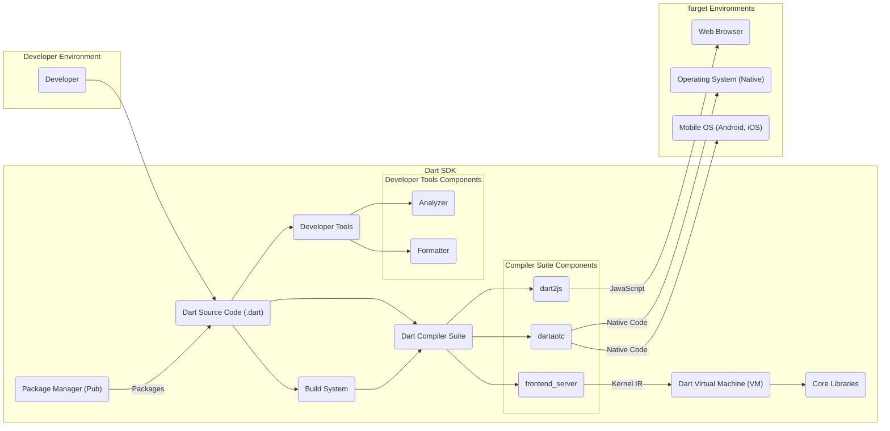
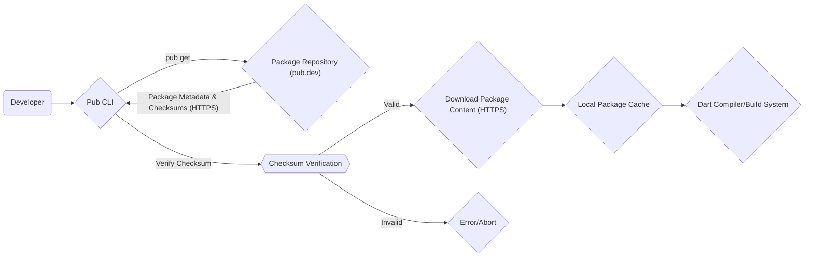
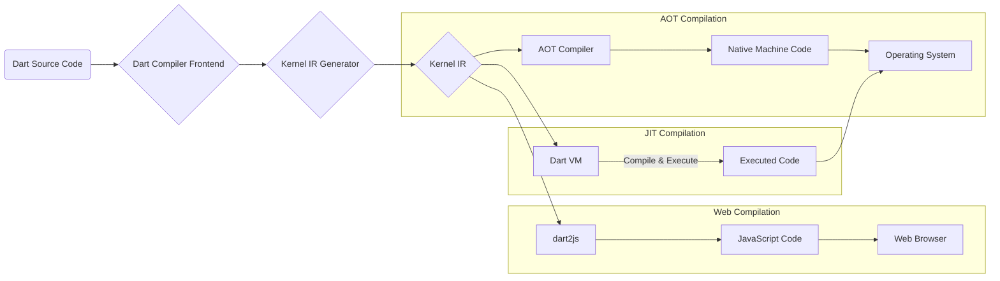

# Project Design Document: Dart SDK

**Version:** 1.1
**Date:** October 26, 2023
**Prepared By:** Gemini (AI Language Model)

## 1. Introduction

This document provides a detailed architectural design of the Dart SDK (Software Development Kit), as represented by the codebase at [https://github.com/dart-lang/sdk](https://github.com/dart-lang/sdk). This document is intended to serve as a comprehensive foundation for subsequent threat modeling activities, providing a clear understanding of the system's components, interactions, and data flows.

## 2. Goals and Objectives

The primary goals of the Dart SDK are to:

* Provide developers with a comprehensive suite of tools and libraries for building and running Dart applications across various platforms.
* Enable efficient cross-platform development targeting web, mobile (iOS and Android), and desktop environments from a single codebase.
* Offer high performance for developed applications through both ahead-of-time (AOT) and just-in-time (JIT) compilation techniques.
* Foster a productive and enjoyable developer experience with features like hot reload and comprehensive tooling.
* Maintain a robust and **secure** development ecosystem, protecting developers and end-users from potential vulnerabilities.

## 3. Scope

This design document focuses on the core components of the Dart SDK that are most relevant for threat modeling and understanding potential attack surfaces. It includes:

* The Dart Compilers:
    * `dartaotc` (Ahead-of-Time compiler for native platforms).
    * `dart2js` (Ahead-of-Time compiler to JavaScript for web).
    * `frontend_server` (Common frontend for the compilers, producing Kernel IR).
* The Dart Virtual Machine (VM): The runtime environment for executing Dart code, including JIT compilation capabilities.
* The Core Libraries: Foundational libraries providing essential functionalities (e.g., `dart:core`, `dart:async`, `dart:io`).
* The Package Manager (Pub): The tool for managing dependencies and distributing Dart packages.
* Key Developer Tools: Essential utilities for development:
    * Analyzer: Performs static analysis for code quality and error detection.
    * Formatter (`dart format`): Enforces consistent code style.
* The Build System: The framework for orchestrating the compilation and packaging of Dart applications.

This document explicitly excludes:

* Specific applications or frameworks built using the Dart SDK (e.g., Flutter).
* The internal implementation details of individual libraries or tools beyond their core functionalities and interactions.
* The infrastructure hosting the Dart SDK website, package repository (pub.dev), or source code repositories.

## 4. High-Level Architecture

## 5. Component Details

This section provides a more detailed breakdown of the key components within the Dart SDK, highlighting their responsibilities, interactions, and potential security considerations.

### 5.1. Dart Compiler Suite

* **Description:** The Dart Compiler Suite is responsible for transforming Dart source code into executable code for various target platforms. It comprises several specialized compilers.
* **Responsibilities:**
    * **Parsing:** Converting Dart source code into an Abstract Syntax Tree (AST).
    * **Static Analysis:** Performing type checking, linting, and other code analysis to identify potential errors and enforce best practices.
    * **Optimization:** Applying various techniques to improve the performance of the generated code.
    * **Code Generation:** Producing platform-specific output:
        * **`dartaotc`:** Generates ahead-of-time compiled native machine code for specific target architectures (e.g., ARM, x64). This code runs directly on the operating system without the need for the full VM.
        * **`dart2js`:** Translates Dart code into highly optimized JavaScript, enabling execution in web browsers.
        * **`frontend_server`:**  A common frontend that performs the initial stages of compilation and generates Kernel Intermediate Representation (IR). This IR serves as an input for both `dartaotc` and the Dart VM.
* **Interactions:**
    * Receives Dart source code as input from the developer or the build system.
    * Interacts with the Core Libraries to understand built-in functionalities.
    * May interact with the Package Manager to resolve dependencies and access package code.
    * Outputs platform-specific executable code or Kernel IR.
* **Security Considerations:**
    * **Compiler Bugs:** Vulnerabilities in the compiler could lead to the generation of insecure code or allow for code injection.
    * **Code Optimization Exploits:** Aggressive optimizations might introduce unexpected behavior or create exploitable conditions.
    * **Kernel IR Manipulation:** If the Kernel IR is compromised, it could lead to the execution of malicious code by the VM.

### 5.2. Dart Virtual Machine (VM)

* **Description:** The Dart VM is a runtime environment that executes Dart code. It supports both Just-In-Time (JIT) and Ahead-of-Time (AOT) execution models.
* **Responsibilities:**
    * **Loading and Executing Kernel IR:** Interpreting and executing the Kernel IR generated by the compiler.
    * **Just-In-Time (JIT) Compilation:** Dynamically compiling frequently executed code segments into native machine code for improved performance.
    * **Memory Management:** Automatic memory management through garbage collection, preventing memory leaks and dangling pointers.
    * **Runtime Services:** Providing essential runtime functionalities like isolates (for concurrency), exception handling, and reflection.
    * **Platform Interoperability:** Providing mechanisms for interacting with the underlying operating system and native libraries (e.g., through FFI - Foreign Function Interface).
* **Interactions:**
    * Receives Kernel IR as input from the compiler.
    * Executes Dart code, interacting with the Core Libraries.
    * Makes system calls to the operating system for I/O and other platform-specific operations.
    * May interact with native libraries through the FFI.
* **Security Considerations:**
    * **VM Vulnerabilities:** Bugs in the VM could allow for sandbox escape, arbitrary code execution, or denial-of-service attacks.
    * **JIT Compilation Security:**  The JIT compilation process itself needs to be secure to prevent the introduction of vulnerabilities.
    * **Memory Safety Issues:** While garbage collection helps, vulnerabilities might still arise from unsafe native interop or VM implementation flaws.
    * **FFI Security:**  Incorrect or malicious use of the FFI can introduce significant security risks by interacting with potentially unsafe native code.

### 5.3. Core Libraries

* **Description:** The Core Libraries provide fundamental classes, interfaces, and functionalities that are essential for Dart programming.
* **Responsibilities:**
    * Providing basic data types (e.g., `int`, `String`, `bool`, `List`, `Map`).
    * Offering asynchronous programming capabilities (`dart:async`).
    * Providing input/output functionalities (`dart:io`).
    * Offering collection classes (`dart:collection`).
    * Providing mathematical functions (`dart:math`).
    * Supporting reflection (`dart:mirrors`).
    * Providing cryptographic functionalities (`dart:convert`, potentially through platform integrations).
* **Interactions:**
    * Used extensively by the Dart Compiler during compilation.
    * Used by the Dart VM during runtime to provide core functionalities.
    * Directly accessed and utilized by Dart application code.
* **Security Considerations:**
    * **Library Vulnerabilities:** Bugs or vulnerabilities in core libraries can be exploited by applications.
    * **Insecure API Usage:**  Improper use of certain library APIs (e.g., those dealing with file I/O or network communication) can introduce security risks.
    * **Cryptographic Weaknesses:** If cryptographic functionalities are not implemented or used correctly, it can compromise data security.

### 5.4. Package Manager (Pub)

* **Description:** Pub is the package manager for Dart, used for managing dependencies and distributing reusable code packages.
* **Responsibilities:**
    * **Dependency Resolution:** Analyzing project dependencies and determining compatible versions of required packages.
    * **Package Download and Installation:** Downloading package files from package repositories (primarily pub.dev).
    * **Package Management:** Managing package versions, updating packages, and handling conflicts.
    * **Package Publishing:** Allowing developers to publish their own Dart packages to the public repository.
* **Interactions:**
    * Interacts with developers through the `pub` command-line tool and the `pubspec.yaml` file.
    * Communicates with package repositories (e.g., pub.dev) over HTTPS to retrieve package information and download files.
    * Stores downloaded packages in a local cache.
    * Provides packages to the Dart Compiler and Build System for use in projects.
* **Security Considerations:**
    * **Supply Chain Attacks:** Risk of malicious packages being published to the repository and downloaded by developers.
    * **Dependency Confusion:** Attackers could publish packages with the same name as internal dependencies to trick developers into downloading malicious versions.
    * **Repository Compromise:** If the package repository itself is compromised, attackers could inject malicious code into legitimate packages.
    * **Insecure Package Content:** Packages might contain vulnerabilities or malicious code that could compromise applications using them.

### 5.5. Developer Tools

* **Description:** These tools enhance the developer experience and aid in code quality and maintainability.
* **Responsibilities:**
    * **Analyzer:** Performs static analysis to identify potential errors, warnings, style violations, and security vulnerabilities in Dart code.
    * **Formatter (`dart format`):** Automatically formats Dart code according to the official style guide, ensuring consistency.
* **Interactions:**
    * Take Dart source code as input.
    * Provide feedback and suggestions to developers, often integrated into IDEs.
    * The Analyzer can interact with the Package Manager to analyze dependencies.
* **Security Considerations:**
    * **Tool Vulnerabilities:** Bugs in the developer tools could be exploited by malicious actors targeting developers' machines.
    * **False Positives/Negatives in Analysis:** The Analyzer might miss real vulnerabilities or report false positives, potentially leading to insecure code being deployed.
    * **Exposure of Sensitive Information:** Developer tools might inadvertently expose sensitive information present in the codebase or environment.

### 5.6. Build System

* **Description:** The Build System orchestrates the process of compiling, linking, and packaging Dart applications for different target platforms.
* **Responsibilities:**
    * **Build Process Management:** Defining and executing the steps required to build an application.
    * **Compiler Invocation:** Invoking the appropriate Dart compilers (`dartaotc`, `dart2js`) with the correct configurations.
    * **Dependency Management Integration:** Working with the Package Manager to ensure that required dependencies are available.
    * **Asset Management:** Handling static assets (e.g., images, configuration files) required by the application.
    * **Packaging and Distribution:** Creating deployable artifacts for different platforms (e.g., executables, web bundles, mobile app packages).
* **Interactions:**
    * Takes Dart source code, build configurations, and assets as input.
    * Invokes the Dart Compilers.
    * Interacts with the Package Manager to retrieve dependencies.
    * Produces deployable application packages.
* **Security Considerations:**
    * **Build Script Vulnerabilities:** Malicious or poorly written build scripts can introduce vulnerabilities into the build process.
    * **Compromised Build Environment:** If the build environment is compromised, attackers could inject malicious code into the application during the build process.
    * **Insecure Handling of Secrets:** Build processes might involve handling sensitive information (e.g., API keys, signing certificates) that needs to be protected.

## 6. Data Flow Diagrams

This section illustrates key data flows within the Dart SDK, focusing on processes relevant to security considerations.

### 6.1. Secure Package Installation

### 6.2. Dart Code Compilation and Execution

## 7. Security Considerations (Detailed)

This section expands on the preliminary security considerations, providing more specific examples of potential threats and vulnerabilities.

* **Supply Chain Security (Pub):**
    * **Threat:** Malicious packages containing malware, backdoors, or vulnerabilities could be published and downloaded, compromising applications that depend on them.
    * **Mitigation:** Pub.dev employs measures like automated analysis and manual review, but vigilance from developers is crucial. Using package integrity checks and verifying publisher reputation are important.
    * **Threat:** Dependency confusion attacks could lead developers to inadvertently download malicious packages with names similar to internal dependencies.
    * **Mitigation:** Employing namespace prefixes for internal packages and carefully reviewing dependencies can help mitigate this.
    * **Threat:** Compromise of the pub.dev infrastructure could allow attackers to inject malicious code into legitimate packages.
    * **Mitigation:** Robust security measures on the pub.dev infrastructure are essential, including access controls, intrusion detection, and regular security audits.

* **Compiler Security:**
    * **Threat:** Vulnerabilities in the compiler could be exploited to generate malicious code or bypass security checks.
    * **Mitigation:** Rigorous testing, code reviews, and security audits of the compiler codebase are necessary.
    * **Threat:** Compiler optimizations, if flawed, could introduce unexpected behavior or create exploitable conditions in the generated code.
    * **Mitigation:** Careful design and testing of optimization passes are crucial. Security considerations should be integrated into the optimization process.
    * **Threat:** Manipulation of the Kernel IR could lead to the execution of unintended or malicious code by the VM.
    * **Mitigation:** Ensuring the integrity of the Kernel IR during transmission and storage is important.

* **VM Security:**
    * **Threat:** Vulnerabilities in the VM (e.g., buffer overflows, use-after-free) could allow for sandbox escape or arbitrary code execution.
    * **Mitigation:** Thorough testing, fuzzing, and security audits of the VM codebase are essential. Memory safety is a paramount concern.
    * **Threat:** The JIT compilation process could be exploited to inject malicious code or bypass security checks.
    * **Mitigation:** Secure coding practices in the JIT compiler and runtime verification mechanisms are necessary.
    * **Threat:** Unsafe use of the Foreign Function Interface (FFI) could introduce vulnerabilities by interacting with potentially insecure native code.
    * **Mitigation:** Clear documentation and guidelines on secure FFI usage are important. Sandboxing or other isolation mechanisms for FFI calls could be considered.

* **Core Libraries Security:**
    * **Threat:** Vulnerabilities in core libraries could be exploited by applications, affecting a wide range of Dart programs.
    * **Mitigation:**  Careful design, implementation, and testing of core libraries are crucial. Regular security reviews and updates are necessary.
    * **Threat:** Insecure usage of library APIs (e.g., file I/O, network communication) by developers can introduce vulnerabilities.
    * **Mitigation:** Providing secure defaults and clear documentation on secure API usage can help prevent these issues. Static analysis tools can also help identify potential insecure API usage.
    * **Threat:** Weaknesses in cryptographic functionalities could compromise data security.
    * **Mitigation:** Adhering to established cryptographic best practices and using well-vetted cryptographic libraries are essential.

* **Developer Tools Security:**
    * **Threat:** Vulnerabilities in developer tools could be exploited to compromise developers' machines or access sensitive project data.
    * **Mitigation:** Secure development practices for developer tools, including input validation and protection against common web vulnerabilities (for web-based tools), are important.
    * **Threat:** False negatives in the Analyzer could lead to developers deploying code with security vulnerabilities.
    * **Mitigation:** Continuously improving the accuracy and coverage of the Analyzer's security checks is necessary.

* **Build System Security:**
    * **Threat:** Malicious or poorly written build scripts could introduce vulnerabilities into the build process or the final application.
    * **Mitigation:**  Following secure scripting practices and carefully reviewing build scripts are important.
    * **Threat:** A compromised build environment could allow attackers to inject malicious code into the application during the build process.
    * **Mitigation:** Securing the build environment with access controls, monitoring, and regular security updates is crucial.
    * **Threat:** Insecure handling of secrets (e.g., API keys, signing certificates) during the build process could lead to their exposure.
    * **Mitigation:** Employing secure secret management practices, such as using environment variables or dedicated secret management tools, is essential.

## 8. Assumptions and Constraints

* It is assumed that the codebase at the provided GitHub repository accurately reflects the current architecture and functionality of the Dart SDK.
* This document provides a high-level architectural overview and does not delve into the intricate implementation details of every single module or function.
* The security considerations outlined are based on common software security principles and potential attack vectors. A comprehensive threat model will involve a more detailed analysis.

## 9. Future Considerations

* **Sandboxing for Isolates:** Exploring more robust sandboxing mechanisms for Dart isolates to further enhance security.
* **Enhanced Static Analysis for Security:** Continuously improving the capabilities of the Analyzer to detect a wider range of security vulnerabilities.
* **Formal Verification of Critical Components:** Applying formal verification techniques to critical components like the VM and compilers to ensure their correctness and security.
* **Improved Transparency and Auditing of Pub Packages:** Implementing mechanisms for better transparency and auditing of packages on pub.dev to enhance trust and security.
* **Standardized Security Testing Frameworks:** Developing and promoting standardized security testing frameworks for Dart applications and packages.

This document provides a solid foundation for understanding the architecture of the Dart SDK and serves as a crucial input for conducting thorough threat modeling activities.