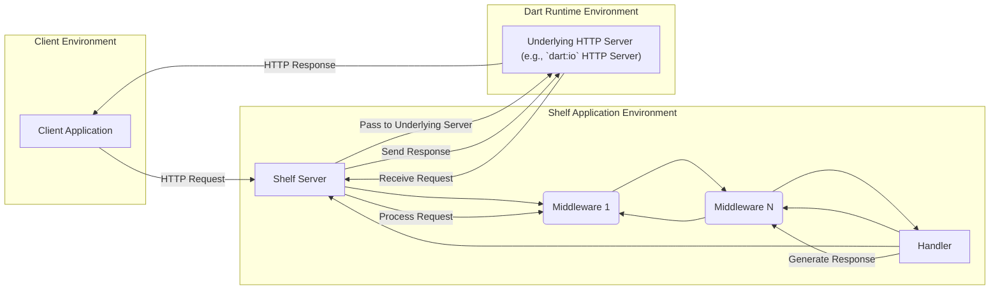
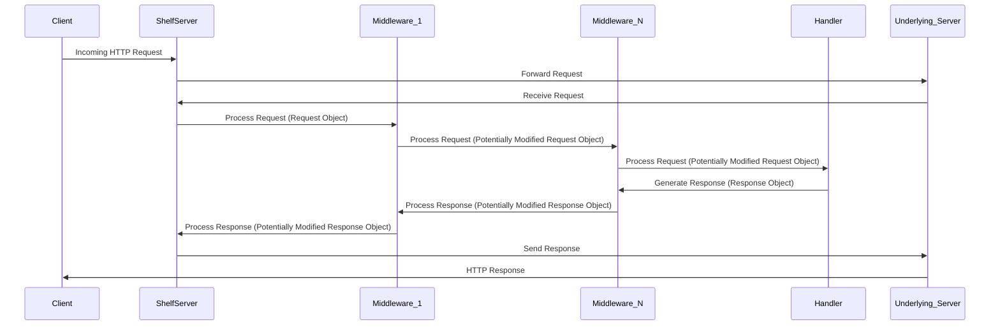

# Project Design Document: Shelf - A Composable HTTP Server Framework for Dart

**Version:** 1.1
**Date:** October 26, 2023
**Author:** AI Software Architect

## 1. Introduction

This document provides an enhanced design overview of the `shelf` package, a composable HTTP server framework for Dart. It details the key components, their interactions, and the overall architecture of the framework with a focus on aspects relevant to threat modeling. This document serves as a foundation for identifying potential security vulnerabilities and attack vectors.

## 2. Goals

* Provide a straightforward and composable mechanism for constructing HTTP servers in Dart applications.
* Offer a highly flexible middleware system for intercepting and processing HTTP requests and responses.
* Abstract the complexities of the underlying HTTP server implementation, promoting platform independence.
* Facilitate unit and integration testing of individual HTTP handlers and middleware components.
* Encourage code reuse and modularity through the composition of handlers and middleware.

## 3. Non-Goals

* To provide a complete web application framework encompassing features like templating engines, database ORM integration, or front-end rendering.
* To implement specific routing algorithms or URL pattern matching (this functionality is typically provided by separate packages built on top of `shelf`, such as `shelf_router`).
* To directly manage low-level network socket operations or intricate details of the HTTP protocol.
* To offer a built-in solution for serving static files from the file system (this is commonly addressed by packages like `shelf_static`).

## 4. High-Level Architecture

The `shelf` framework is architected around the central concepts of **Handlers** and **Middleware**, forming a pipeline for processing HTTP requests. Incoming requests are processed sequentially by a chain of middleware before reaching a designated handler. The generated response then traverses the middleware pipeline in reverse order.

* **Client Application:** Any software application (e.g., web browser, mobile application, API client) that initiates HTTP requests targeting the `shelf` application.
* **Shelf Server:** The primary entry point for incoming HTTP requests. It listens on a specified network address and port, accepting new connections.
* **Middleware:** Functions that intercept and process both incoming HTTP requests and outgoing HTTP responses. They form a chain, allowing for cross-cutting concerns to be addressed. Middleware can modify the request, modify the response, or perform side effects.
* **Handler:** A function that accepts a `Request` object as input and returns a `Response` object. This component encapsulates the core application logic for processing a specific request.
* **Underlying HTTP Server:** The concrete HTTP server implementation provided by the Dart runtime environment (e.g., the `HttpServer` class from the `dart:io` library). `shelf` provides an abstraction layer over this implementation.

## 5. Component Details

### 5.1. `Handler`

* **Purpose:** The fundamental unit responsible for processing an HTTP request and generating the corresponding response.
* **Functionality:** Contains the specific business logic required to handle a particular type of request. This might involve interacting with databases, external services, or performing computations.
* **Security Relevance:** Handlers are critical points for input validation and authorization checks. Vulnerabilities here can lead to data breaches or unauthorized access.
* **Example:** A handler that retrieves user data based on an ID provided in the request path.

### 5.2. `Middleware`

* **Purpose:** To intercept and process HTTP requests and responses, enabling the implementation of cross-cutting concerns.
* **Functionality:** A middleware function takes a `Handler` as input and returns a new `Handler`. This allows for the creation of a processing pipeline. Middleware can:
    * Inspect and modify the incoming `Request` (e.g., adding headers, parsing authentication tokens).
    * Inspect and modify the outgoing `Response` (e.g., adding security headers, compressing the body).
    * Perform actions before or after the inner handler is invoked (e.g., logging requests, enforcing rate limits).
    * Short-circuit the request processing pipeline by returning a `Response` directly (e.g., for authentication failures).
* **Types:**
    * **Request Middleware:** Primarily focuses on processing the incoming `Request` before it reaches the core handler.
    * **Response Middleware:** Primarily focuses on processing the outgoing `Response` after it has been generated by the handler.
* **Composition:** Middleware is composed using the `Pipeline` class or by directly chaining middleware functions. The order of middleware in the pipeline is significant.
* **Security Relevance:** Middleware plays a crucial role in implementing security measures such as authentication, authorization, input sanitization, and adding security headers. Misconfigured or vulnerable middleware can introduce significant security risks.
* **Example:** Middleware that authenticates users based on a JWT token in the request headers.

### 5.3. `Request`

* **Purpose:** Represents an incoming HTTP request, providing access to all relevant request information.
* **Attributes:** Contains details about the request, including:
    * `url`: The requested URL, including path and query parameters.
    * `method`: The HTTP method used (e.g., GET, POST, PUT, DELETE).
    * `headers`: A map of HTTP headers associated with the request.
    * `body`: A stream representing the request body.
    * `context`: A mutable map for sharing data between different middleware and the handler during the request lifecycle.
* **Security Relevance:** The `Request` object contains potentially sensitive information that needs to be handled securely. Improper parsing or handling of request data can lead to vulnerabilities.
* **Example:** Accessing the request body to extract data submitted in a form.

### 5.4. `Response`

* **Purpose:** Represents an outgoing HTTP response, encapsulating the information to be sent back to the client.
* **Attributes:** Contains details about the response, including:
    * `statusCode`: The HTTP status code indicating the outcome of the request (e.g., 200 OK, 404 Not Found, 500 Internal Server Error).
    * `headers`: A map of HTTP headers to be included in the response.
    * `body`: The response body, which can be a string, a stream, or `null`.
* **Security Relevance:** The `Response` object is crucial for setting security headers and preventing information leakage. Incorrectly configured responses can expose sensitive data.
* **Example:** Setting the `Content-Type` header to indicate the format of the response body.

### 5.5. `Server` (from `shelf/shelf_io.dart`)

* **Purpose:** Provides a concrete implementation of an HTTP server using the `dart:io` library's `HttpServer`.
* **Functionality:**
    * Listens for incoming connections on a specified host and port.
    * Accepts new connections from clients.
    * Receives HTTP requests from clients.
    * Passes incoming requests to the provided `Handler` (typically the entry point of the middleware pipeline).
    * Sends the `Response` generated by the handler back to the client.
* **Security Relevance:** The server implementation is responsible for handling network connections and can be a target for denial-of-service attacks or other network-level exploits. Proper configuration and security hardening of the underlying server are essential.
* **Example:** Starting a `shelf` server on `localhost:8080`.

### 5.6. `Pipeline`

* **Purpose:** A utility class designed to simplify the construction and management of middleware chains.
* **Functionality:** Offers a fluent interface for adding middleware functions to a processing pipeline. The `addHandler` method is used to specify the final handler that will process the request after all middleware has been executed.
* **Security Relevance:** The order in which middleware is added to the pipeline is critical for security. For example, authentication middleware should typically be placed before authorization middleware.
* **Example:** Creating a pipeline with logging middleware followed by authentication middleware.

## 6. Data Flow

The typical flow of an HTTP request and its corresponding response through a `shelf` application can be visualized as follows:

1. **Client sends an HTTP request:** The client application initiates an HTTP request to the `shelf` server. This request includes headers, body (if applicable), and other relevant information.
2. **Shelf Server receives the request:** The `shelf` server, utilizing the underlying HTTP server, receives the incoming request.
3. **Request passes through the middleware pipeline:** The `Request` object is passed sequentially through the chain of middleware functions. Each middleware can inspect and potentially modify the `Request` object.
4. **Request reaches the handler:** After traversing the middleware pipeline, the (potentially modified) `Request` object is passed to the designated `Handler`.
5. **Handler processes the request:** The `Handler` executes its core logic based on the received `Request` and generates a `Response` object.
6. **Response passes back through the middleware pipeline:** The generated `Response` object is passed back through the middleware pipeline in reverse order. Each middleware can inspect and potentially modify the `Response` object.
7. **Shelf Server sends the response:** The `shelf` server sends the final (potentially modified) `Response` back to the client via the underlying HTTP server.
8. **Client receives the response:** The client application receives the HTTP response.

## 7. Security Considerations

This section expands on the initial security considerations, providing more specific examples and potential threats.

* **Input Validation and Sanitization:**
    * **Threat:** Injection attacks (e.g., SQL injection, cross-site scripting), data corruption, unexpected behavior.
    * **Mitigation:** Implement robust input validation and sanitization within handlers and middleware. Validate data types, formats, and ranges. Sanitize user-provided input to remove potentially harmful characters or code.
    * **Component Relevance:** Primarily the responsibility of Handlers and Request Middleware.
* **Authentication and Authorization:**
    * **Threat:** Unauthorized access to resources, data breaches, privilege escalation.
    * **Mitigation:** Implement strong authentication mechanisms (e.g., OAuth 2.0, JWT) and enforce authorization policies to control access based on user roles or permissions.
    * **Component Relevance:** Primarily implemented using Request Middleware.
* **Secure Defaults and Security Headers:**
    * **Threat:** Vulnerabilities due to insecure default configurations, exposure to common web attacks (e.g., cross-site scripting, clickjacking).
    * **Mitigation:** Ensure the framework encourages secure defaults. Utilize Response Middleware to set appropriate security headers (e.g., `Content-Security-Policy`, `Strict-Transport-Security`, `X-Frame-Options`).
    * **Component Relevance:** Primarily managed by Response Middleware.
* **CORS (Cross-Origin Resource Sharing):**
    * **Threat:** Unauthorized access to resources from different origins, potential for cross-site request forgery (CSRF) attacks.
    * **Mitigation:** Configure CORS policies carefully using Middleware to explicitly allow access only from trusted origins.
    * **Component Relevance:** Implemented using Request and Response Middleware.
* **Request Body Handling:**
    * **Threat:** Denial-of-service attacks through excessively large request bodies, buffer overflows if not handled correctly.
    * **Mitigation:** Implement limits on request body size. Use streaming APIs to process large bodies without loading them entirely into memory.
    * **Component Relevance:** Handlers and Request Middleware need to handle request bodies securely.
* **Error Handling and Information Leakage:**
    * **Threat:** Sensitive information being exposed in error messages, providing attackers with insights into the application's internal workings.
    * **Mitigation:** Implement proper error handling that logs detailed errors internally but returns generic error messages to the client. Avoid exposing stack traces or sensitive data in responses.
    * **Component Relevance:** Handlers and potentially Response Middleware for masking error details.
* **Dependency Management:**
    * **Threat:** Security vulnerabilities in third-party libraries used by the `shelf` application.
    * **Mitigation:** Regularly audit and update dependencies to patch known vulnerabilities. Utilize dependency scanning tools.
    * **Component Relevance:**  Applies to the entire application built using `shelf`.
* **TLS/SSL Configuration:**
    * **Threat:** Man-in-the-middle attacks, eavesdropping on sensitive data transmitted over the network.
    * **Mitigation:** Ensure that the underlying HTTP server is properly configured to use TLS/SSL with strong ciphers and up-to-date certificates.
    * **Component Relevance:** Configuration of the `Server` component and the underlying HTTP server.

## 8. Deployment Considerations

The security posture of a `shelf` application is also influenced by its deployment environment.

* **Standalone Dart Applications:**
    * **Consideration:** The application is directly exposed to the internet. Security hardening of the operating system and network is crucial.
    * **Threats:** Direct attacks on the server, denial-of-service attacks.
* **Docker Containers:**
    * **Consideration:** Containerization provides isolation but requires secure container image management and runtime configuration.
    * **Threats:** Vulnerabilities in the container image, misconfigured container runtime.
* **Cloud Platforms (e.g., GCP, AWS, Azure):**
    * **Consideration:** Leverage cloud provider security features like firewalls, load balancers, and managed TLS certificates.
    * **Threats:** Misconfigured cloud resources, compromised cloud accounts.
* **Behind a Reverse Proxy (e.g., Nginx, Apache):**
    * **Consideration:** The reverse proxy can handle TLS termination, load balancing, and provide an additional layer of security.
    * **Threats:** Misconfigured reverse proxy, vulnerabilities in the reverse proxy software.

## 9. Future Considerations

* **Standardized Security Middleware:** Explore the possibility of providing more built-in or recommended security middleware components for common tasks like rate limiting, CSRF protection, and more advanced authentication schemes.
* **Improved Security Auditing Tools:**  Develop or integrate with tools that can help developers identify potential security vulnerabilities in their `shelf` applications.
* **Formal Security Guidelines and Best Practices:**  Provide comprehensive documentation and guidelines on building secure applications with `shelf`.

This enhanced design document provides a more detailed understanding of the `shelf` framework, particularly focusing on aspects relevant to security and threat modeling. It serves as a valuable resource for identifying potential vulnerabilities and designing secure `shelf`-based applications.
