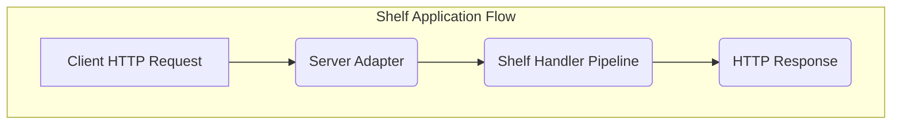
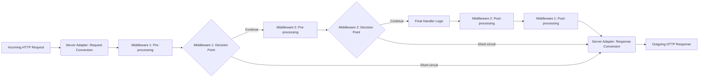

# Project Design Document: Shelf - A Composable Middleware Framework for Dart HTTP Servers

**Version:** 1.1
**Date:** October 26, 2023
**Author:** Gemini (AI Language Model)

## 1. Introduction

This document provides an enhanced and detailed design overview of the `shelf` package. `shelf` is a foundational library in the Dart ecosystem, enabling the construction of robust and modular HTTP servers and middleware. This document is specifically crafted to facilitate a thorough understanding of `shelf`'s architecture and components, serving as a critical input for subsequent threat modeling exercises. A clear understanding of this design is essential for identifying potential security vulnerabilities.

## 2. Goals

The primary design goals of the `shelf` package are:

* **Simplicity and Consistency:** To offer an intuitive and uniform API for handling HTTP requests and generating responses within Dart applications.
* **Middleware Composability:** To empower developers to effortlessly chain together independent functions (middleware) that can intercept, modify, or enhance the processing of HTTP requests and responses.
* **Code Reusability:** To encourage the creation of modular and reusable middleware components that can be applied across diverse applications and projects.
* **Platform Independence:** To operate seamlessly regardless of the underlying server implementation, such as `dart:io`'s `HttpServer` or serverless environments.
* **Testability:** To provide a well-defined and easily testable structure for implementing HTTP request handling logic, promoting robust and reliable applications.

## 3. Non-Goals

The `shelf` package explicitly avoids the following responsibilities:

* **Direct Web Server Implementation:** `shelf` is a framework, not a server. It relies on external server implementations (like `dart:io`'s `HttpServer`) or adapters for environments like serverless functions to handle the underlying network communication.
* **Specific Routing Solutions:** While `shelf` offers mechanisms for building routing logic (like `Cascade`), it does not enforce or provide a specific routing implementation. Developers are free to choose or build their own routing solutions on top of `shelf`.
* **Built-in Security Features:** `shelf` provides the structure for implementing security measures through middleware, but it doesn't include pre-built security features like authentication or authorization mechanisms. Security is primarily the responsibility of the middleware and the underlying server environment.

## 4. High-Level Architecture

At a high level, a `shelf` application processes incoming HTTP requests through a defined pipeline. This pipeline consists of a series of handlers and middleware that transform the request and ultimately generate a response.

* **Client HTTP Request:** The initial HTTP request originating from a client (e.g., a web browser, another service).
* **Server Adapter:** This component acts as a bridge between the underlying server implementation (e.g., `dart:io`'s `HttpServer`, a serverless function runtime) and the `shelf` framework. It translates the server's native request format into a `shelf` `Request` object and converts the `shelf` `Response` back into the server's expected response format.
* **Shelf Handler Pipeline:** The core of the `shelf` application. This is a sequence of `Handler` functions, potentially wrapped by `Middleware`, that process the incoming request. The order of components in this pipeline is crucial.
* **HTTP Response:** The final HTTP response generated by the `shelf` application after processing the request through the pipeline. This response is then sent back to the client by the Server Adapter.

## 5. Detailed Design

### 5.1. Core Components

* **`Handler`:**
    * Definition: A fundamental function in `shelf` responsible for processing an incoming `Request` and producing a `Response`.
    * Signature: `Future<Response> Function(Request request)`
    * Example: `Handler myHandler = (Request request) async => Response.ok('Data requested for path: ${request.url.path}');`
    * Role: Contains the core application logic for handling a specific type of HTTP request.

* **`Middleware`:**
    * Definition: A higher-order function that wraps a `Handler`, allowing for interception and modification of requests and responses both before and after the inner handler is invoked.
    * Signature: `Handler Function(Handler innerHandler)`
    * Example: `Middleware loggingMiddleware = (Handler innerHandler) => (Request request) async { print('Received request for ${request.url}'); final response = await innerHandler(request); print('Sending response with status ${response.statusCode}'); return response; };`
    * Role: Enables cross-cutting concerns like logging, authentication, authorization, header manipulation, and more to be implemented in a modular and reusable way.

* **`Request`:**
    * Definition: An immutable object representing an incoming HTTP request.
    * Key Attributes:
        * `url`: A `Uri` object representing the requested URL.
        * `method`: A `String` representing the HTTP method (e.g., 'GET', 'POST', 'PUT').
        * `headers`: A `Map<String, String>` containing the HTTP request headers (case-insensitive keys).
        * `body`: A `Stream<List<int>>` providing access to the request body content. This allows for handling large request bodies efficiently.
        * `context`: A mutable `Map<Object, Object>` that can be used to store request-scoped data that can be accessed by different parts of the middleware pipeline. This is useful for passing information between middleware components.
    * Immutability: Ensures that the request object cannot be modified after creation, promoting predictable behavior.

* **`Response`:**
    * Definition: An immutable object representing an HTTP response to be sent back to the client.
    * Key Attributes:
        * `statusCode`: An `int` representing the HTTP status code (e.g., 200, 404, 500).
        * `headers`: A `Map<String, String>` containing the HTTP response headers.
        * `body`: The response body content. This can be a `String`, a `List<int>`, or a `Stream<List<int>>`. Using streams is recommended for large responses to improve performance and reduce memory usage.
        * `context`: A mutable `Map<Object, Object>` that can be used to store response-scoped data.
    * Immutability: Similar to `Request`, this ensures the response object remains consistent.

* **`Pipeline`:**
    * Definition: A builder class that simplifies the creation of a `Handler` by chaining together a sequence of `Middleware` and a final `Handler`.
    * Usage: Middleware is added using the `addMiddleware()` method, and the final handler is set using the `addHandler()` method or by passing it to the `Pipeline` constructor.
    * Output:  The `Pipeline`'s `addHandler` (or constructor) returns a single `Handler` function that represents the entire middleware pipeline.

* **`Cascade`:**
    * Definition: A mechanism for combining multiple `Handler` functions into a single `Handler`.
    * Behavior: When a request is passed to a `Cascade`, it executes the handlers in the order they were added. The first handler to return a non-`null` `Response` will have its response used, and subsequent handlers will not be executed.
    * Use Case: Primarily used for implementing routing logic, where different handlers are responsible for different URL paths or request methods.

### 5.2. Request Processing Lifecycle

The journey of an HTTP request through a `shelf` application follows a well-defined path:

1. **Incoming HTTP Request:** The initial request arrives at the server.
2. **Server Adapter: Request Conversion:** The server adapter transforms the server's specific request format into a `shelf` `Request` object.
3. **Middleware Pipeline (Pre-processing):** The `Request` is passed through the chain of middleware. Each middleware in turn has the opportunity to:
    * Inspect and potentially modify the `Request` object.
    * Perform actions before the next handler in the pipeline is invoked (e.g., logging).
    * Short-circuit the pipeline by returning a `Response` directly, preventing subsequent middleware and the final handler from executing.
4. **Decision Points in Middleware:** Middleware can decide whether to continue processing the request down the pipeline or to return a response immediately (short-circuiting). This is crucial for implementing logic like authentication or authorization.
5. **Final Handler Logic:** If the request is not short-circuited by middleware, it reaches the final `Handler` in the pipeline. This handler contains the core application logic for processing the request and generating a `Response`.
6. **Middleware Pipeline (Post-processing):** The `Response` generated by the final handler is then passed back through the middleware chain in reverse order. Each middleware has a chance to:
    * Inspect and potentially modify the `Response` object.
    * Perform actions after the inner handler has executed (e.g., adding security headers).
7. **Server Adapter: Response Conversion:** The server adapter converts the `shelf` `Response` object back into the format expected by the underlying server.
8. **Outgoing HTTP Response:** The final HTTP response is sent back to the client.

### 5.3. Data Handling Considerations

* **Request Body Consumption:** The `Request.body` is a `Stream`. It's crucial to handle this stream carefully. Once a stream is consumed, it cannot be read again. Middleware or handlers that need to read the body should be mindful of this and potentially buffer the stream if it needs to be accessed multiple times.
* **Response Body Generation:**  Generating response bodies as `Stream`s is recommended for large responses to avoid loading the entire response into memory.
* **Header Handling:** `shelf` uses case-insensitive keys for headers. Middleware should be aware of this when inspecting or modifying headers.

## 6. Security Considerations (Relevant to Threat Modeling)

This section highlights security aspects inherent in the `shelf` design that are crucial for threat modeling:

* **Middleware as the Security Layer:**  Since `shelf` itself provides minimal built-in security features, middleware is the primary mechanism for implementing security controls. This means vulnerabilities can arise from:
    * **Missing Security Middleware:** Failure to implement necessary security checks (e.g., authentication, authorization).
    * **Flawed Middleware Logic:** Bugs or oversights in middleware implementations (e.g., incorrect authentication logic, bypassable authorization checks).
    * **Incorrect Middleware Ordering:** Placing middleware in the wrong order can lead to security vulnerabilities (e.g., applying authorization *after* processing sensitive data).
* **Input Validation Responsibility:** Middleware is typically responsible for validating and sanitizing incoming request data. Lack of proper input validation can lead to various injection attacks (e.g., SQL injection, cross-site scripting).
* **Authentication and Authorization Implementation:** Middleware is the standard place to implement authentication and authorization. Vulnerabilities here can lead to unauthorized access to resources.
* **Session Management Security:** If sessions are used, middleware is responsible for secure session management, including using secure cookies, preventing session fixation, and handling session expiration.
* **Error Handling and Information Disclosure:**  Careless error handling in middleware or handlers can inadvertently leak sensitive information to clients.
* **Header Security Management:** Middleware can be used to set important security headers (e.g., `Content-Security-Policy`, `Strict-Transport-Security`). Misconfiguration or absence of these headers can create vulnerabilities.
* **Request Body Handling Vulnerabilities:**  Middleware needs to handle request bodies securely to prevent issues like denial-of-service attacks (by limiting request body size) or vulnerabilities related to parsing untrusted data.
* **Dependency Chain Security:** The security of a `shelf` application also depends on the security of its dependencies, including other middleware packages. Vulnerabilities in dependencies can be exploited.

## 7. Dependencies

The `shelf` package has minimal direct dependencies, primarily relying on the core Dart SDK. However, typical applications built with `shelf` will depend on other packages for specific functionalities. Examples include:

* **`shelf_router`:** For declarative routing of requests to different handlers.
* **`shelf_static`:** For serving static files (e.g., HTML, CSS, JavaScript).
* **`http`:** For making HTTP requests from within the application (though not a direct dependency for server functionality).
* **Logging packages:** For implementing logging within middleware.
* **Authentication/Authorization packages:** For implementing security measures.
* **Database interaction packages:** For connecting to and interacting with databases.
* **Template engines:** For generating dynamic HTML content.

## 8. Deployment Considerations

`shelf` applications can be deployed in various environments:

* **Standalone Dart Applications:** Using `dart:io`'s `HttpServer` as the server adapter, allowing for direct execution of the Dart application.
* **Serverless Environments:** Deployed as serverless functions (e.g., AWS Lambda, Google Cloud Functions) using specific `shelf` adapter packages for these environments.
* **Containerized Environments (e.g., Docker):**  Packaged into Docker containers for deployment on container orchestration platforms like Kubernetes.
* **Behind Reverse Proxies:** Often deployed behind reverse proxies like Nginx or Apache, which handle tasks like TLS termination, load balancing, and caching. The reverse proxy forwards requests to the `shelf` application.

## 9. Future Considerations

Potential areas for future development and improvement in `shelf` could include:

* **Standardized Middleware Interfaces:** Further defining and promoting common interfaces for middleware to enhance interoperability and reusability across different packages.
* **Enhanced Routing Abstractions:** Exploring more sophisticated and flexible routing mechanisms built directly into `shelf` or as officially supported extensions.
* **Improved Testing Utilities:** Providing more comprehensive and convenient tools for testing `shelf` applications and individual middleware components in isolation.
* **Observability Features:**  Adding built-in support or standardized patterns for metrics collection and tracing to improve the monitoring and debugging of `shelf` applications.

This improved design document provides a more in-depth understanding of the `shelf` package, emphasizing aspects relevant to security and threat modeling. By carefully considering the architecture, components, and request processing flow outlined here, security professionals can more effectively identify and mitigate potential vulnerabilities in applications built with `shelf`.