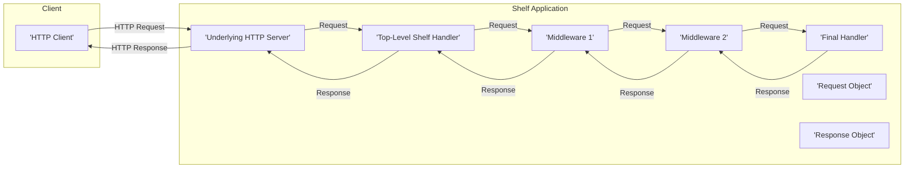
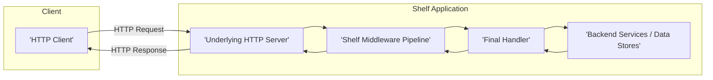
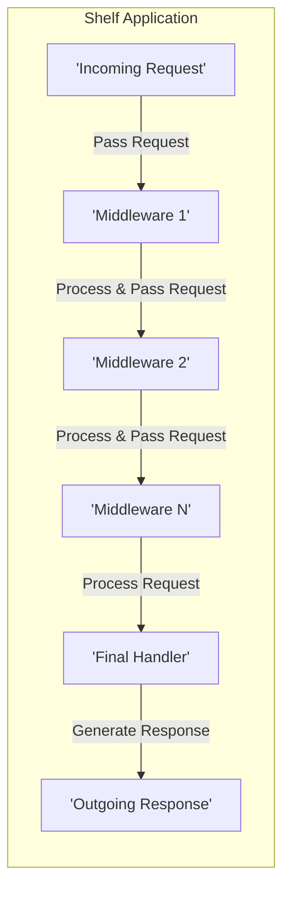

## Project Design Document: Shelf - A Middleware Framework for Dart HTTP Servers (Improved)

**1. Introduction**

This document provides an enhanced design overview of the `shelf` package, a middleware framework for building web servers in Dart. This detailed description is specifically intended to facilitate thorough threat modeling activities. It elaborates on the core components, data flow, and deployment considerations of `shelf` applications, providing a more granular understanding of the system's inner workings.

**2. Goals**

* Provide a more in-depth and comprehensive description of the `shelf` architecture and its key components, including specific examples.
* Clearly and precisely illustrate the request processing flow within a `shelf` application, highlighting potential interception points.
* Identify potential areas of interest for security analysis and threat modeling with more specific examples of vulnerabilities.
* Serve as a definitive and detailed reference point for understanding the system's design, behavior, and potential security implications.

**3. Overview**

`shelf` is a Dart package designed as a foundational framework for constructing composable HTTP servers. Its central concept is middleware, where individual functions act as interceptors, examining and potentially modifying both incoming HTTP requests and outgoing responses. This middleware-centric approach promotes modularity, reusability, and separation of concerns in server-side logic. A typical `shelf` application is structured as a pipeline, an ordered sequence of middleware functions culminating in a final handler responsible for generating the ultimate HTTP response.

**4. Core Components**

* **Handler:**
    * A function with the signature `Future<Response> Function(Request request)`.
    * This function accepts a `Request` object as input and asynchronously returns a `Response` object.
    * It embodies the core business logic for processing a specific HTTP request.
    * The terminal handler within a `shelf` pipeline is the ultimate source of the HTTP response.
    * *Example:* A handler that retrieves data from a database based on the request path.

* **Middleware:**
    * A higher-order function with the signature `Handler Function(Handler innerHandler)`.
    * It takes an existing `Handler` (the "inner" handler) as input and returns a *new* `Handler`.
    * This wrapping mechanism allows middleware to execute code before and/or after the inner handler.
    * Middleware can perform a wide range of tasks:
        * **Request Modification:** Altering headers, parameters, or the body of the incoming request.
        * **Response Modification:** Adjusting status codes, headers, or the body of the outgoing response.
        * **Authentication/Authorization:** Verifying user credentials and permissions.
        * **Logging:** Recording request and response details.
        * **Error Handling:** Catching exceptions and generating appropriate error responses.
        * **Caching:** Storing and retrieving responses to improve performance.
    * Middleware functions are chained together, forming the request processing pipeline.
    * *Example:* A logging middleware that prints the request method and URL to the console.

* **Pipeline:**
    * A mechanism for sequentially applying middleware to a final handler.
    * The `Pipeline` class in `shelf` provides a fluent interface for building this sequence.
    * Requests traverse the middleware pipeline in the order the middleware was added.
    * Responses traverse the pipeline in reverse order.
    * *Example:* `Pipeline().addMiddleware(logRequests()).addHandler(myFinalHandler);`

* **Request:**
    * An object representing an incoming HTTP request, typically an instance of `shelf.Request`.
    * Encapsulates all relevant information about the request:
        * `method`: The HTTP method used (e.g., 'GET', 'POST', 'PUT', 'DELETE').
        * `url`: The requested URL, including path and query parameters.
        * `headers`: A map of HTTP headers (e.g., `{'Content-Type': 'application/json'}`).
        * `body`: A `Stream<List<int>>` representing the request body.
        * `context`: A mutable map for sharing data between middleware.
        * `requestedUri`: The parsed `Uri` of the request.
    * *Example:* Accessing the request headers using `request.headers`.

* **Response:**
    * An object representing an outgoing HTTP response, typically an instance of `shelf.Response`.
    * Contains the necessary information to construct the HTTP response sent to the client:
        * `statusCode`: The HTTP status code (e.g., 200, 404, 500).
        * `headers`: A map of HTTP headers to be sent with the response.
        * `body`: The response body, which can be a `String`, `List<int>`, or a `Stream<List<int>>`.
        * `context`: A mutable map for sharing data between middleware.
    * *Example:* Creating a JSON response with a status code of 200.

* **Server:**
    * The underlying HTTP server implementation responsible for listening for connections and dispatching requests.
    * `shelf` itself is agnostic to the specific server implementation.
    * Common server implementations used with `shelf` include:
        * `dart:io`'s `HttpServer`.
        * Third-party packages like `shelf_io`.
    * The server takes a `Handler` function (typically the result of a `Pipeline`) as input.

* **Handler Function (Top-Level):**
    * The primary entry point for handling incoming HTTP requests within a `shelf` application.
    * This is the function passed to the underlying HTTP server.
    * It is usually constructed by combining middleware and a final handler using a `Pipeline`.
    * *Example:* `final handler = Pipeline().addMiddleware(authMiddleware).addHandler(myApiHandler);`

**5. Data Flow**

The following detailed steps illustrate the journey of an HTTP request through a `shelf` application:

1. An HTTP client initiates a request to the server (e.g., a browser making a GET request).
2. The underlying HTTP server (e.g., `HttpServer` from `dart:io`) receives the incoming request.
3. The server invokes the top-level `shelf` handler function, passing it a `Request` object representing the incoming request.
4. The `Request` object enters the middleware pipeline.
5. **Middleware Execution (Forward Path):** Each middleware in the pipeline is executed sequentially in the order they were added.
    * Each middleware function receives the `Request` object and the *next* handler in the chain as arguments.
    * A middleware can:
        * Inspect and potentially modify the `Request` object before passing it down the chain.
        * Short-circuit the pipeline by returning a `Response` directly, preventing subsequent middleware and the final handler from executing. This is often used for authentication failures or early error responses.
        * Invoke the next handler in the chain to continue processing the request.
6. The request eventually reaches the final handler after passing through all the middleware.
7. The final handler processes the `Request` and generates a `Response` object.
8. **Middleware Execution (Backward Path):** The `Response` object begins its journey back through the middleware pipeline, but this time in *reverse* order.
    * Each middleware has the opportunity to inspect and potentially modify the `Response` object before it's passed further back.
    * This allows middleware to add headers, modify the body, or perform other post-processing tasks.
9. The `Response` object, potentially modified by the middleware, is returned to the underlying HTTP server.
10. The HTTP server sends the `Response` back to the originating client.

**6. Deployment Considerations**

`shelf` applications offer flexibility in deployment environments:

* **Standalone Servers:**
    * Utilizing `dart:io`'s `HttpServer` directly within a Dart application.
    * Suitable for simple deployments or local development.
    * Requires manual configuration of networking and process management.
* **Cloud Platforms:**
    * **Compute Instances (VMs):** Running the Dart application on virtual machines offered by providers like AWS EC2, Google Compute Engine, or Azure Virtual Machines. Provides full control over the operating system and environment.
    * **Containers (Docker, Kubernetes):** Packaging the `shelf` application into Docker containers for consistent deployment and scalability. Orchestration platforms like Kubernetes can manage containerized `shelf` applications.
    * **Serverless Functions (e.g., Cloud Functions, AWS Lambda, Azure Functions):** Adapting `shelf` handlers to fit the serverless execution model. This often involves using adapter libraries (e.g., `shelf_aws_api_gateway`) to translate serverless event formats to `shelf` `Request` and `Response` objects.
* **Edge Computing:**
    * Deploying `shelf` applications on edge devices or infrastructure closer to the users or data sources.
    * Reduces latency and improves performance for geographically distributed users.

The chosen deployment environment significantly impacts security considerations, including network security, access control, and the attack surface.

**7. Security Considerations (Detailed)**

This section expands on potential security considerations relevant to `shelf` applications, providing more specific examples of threats and potential mitigations.

* **Input Validation:**
    * **Threat:** Injection attacks (e.g., SQL injection, cross-site scripting (XSS), command injection) if user-supplied data is not properly validated and sanitized before being used in database queries, rendered in HTML, or passed to system commands.
    * **Mitigation:** Implement robust input validation middleware to check data types, formats, and ranges. Sanitize input to remove or escape potentially malicious characters. Use parameterized queries or ORMs to prevent SQL injection. Employ content security policies (CSP) to mitigate XSS.
* **Authentication and Authorization:**
    * **Threat:** Unauthorized access to resources or functionality if authentication and authorization mechanisms are weak or absent.
    * **Mitigation:** Implement authentication middleware to verify user identities (e.g., using JWT, OAuth 2.0). Implement authorization middleware to enforce access control policies based on user roles or permissions. Avoid storing sensitive credentials directly in the application.
* **CORS (Cross-Origin Resource Sharing):**
    * **Threat:** Malicious websites hosted on different origins could potentially access sensitive data or perform actions on behalf of legitimate users if CORS policies are not correctly configured.
    * **Mitigation:** Configure CORS middleware to explicitly allow only trusted origins to access the application's resources. Avoid using wildcard (`*`) for allowed origins in production environments.
* **HTTP Header Security:**
    * **Threat:** Vulnerabilities arising from missing or misconfigured security-related HTTP headers (e.g., clickjacking, MIME sniffing attacks, insecure connections).
    * **Mitigation:** Utilize middleware to set security headers like `Content-Security-Policy`, `Strict-Transport-Security`, `X-Frame-Options`, `X-Content-Type-Options`, and `Referrer-Policy`.
* **Request Body Handling:**
    * **Threat:** Denial-of-service (DoS) attacks through excessively large request bodies, leading to resource exhaustion. Vulnerabilities related to parsing and processing complex request body formats.
    * **Mitigation:** Implement limits on request body size. Use appropriate parsing libraries and handle potential parsing errors gracefully. Be cautious when deserializing untrusted data.
* **Response Body Handling:**
    * **Threat:** Exposure of sensitive information in response bodies, especially in error messages or debugging information in production environments.
    * **Mitigation:** Ensure that error messages are generic and do not reveal internal system details. Avoid including sensitive data in response bodies unless absolutely necessary and properly secured.
* **Error Handling:**
    * **Threat:** Information leakage through detailed error messages, potentially revealing internal system structure or vulnerabilities.
    * **Mitigation:** Implement centralized error handling middleware to catch exceptions and return generic error responses to clients. Log detailed error information securely for debugging purposes.
* **Dependency Management:**
    * **Threat:** Using outdated or vulnerable dependencies can introduce security flaws into the application.
    * **Mitigation:** Regularly update `shelf` and its dependencies to the latest stable versions. Use dependency scanning tools to identify and address known vulnerabilities.
* **TLS/SSL Encryption:**
    * **Threat:** Communication between the client and server is vulnerable to eavesdropping and man-in-the-middle attacks if not encrypted using HTTPS.
    * **Mitigation:** Ensure that the `shelf` application is served over HTTPS. This is typically configured at the server level or through a reverse proxy.
* **Middleware Security:**
    * **Threat:** Vulnerabilities in custom or third-party middleware can compromise the security of the entire application.
    * **Mitigation:** Thoroughly review and test all middleware components. Follow secure coding practices when developing custom middleware. Be cautious when using third-party middleware and ensure it is from a trusted source.

**8. Diagrams**

* **High-Level Architecture:**

* **Request Processing Flow (Detailed):**

**9. Future Considerations**

* Investigating advanced middleware patterns for specific security concerns (e.g., rate limiting, request signing).
* Analyzing the performance implications of different middleware configurations.
* Exploring integration with security information and event management (SIEM) systems for monitoring and alerting.
* Developing guidelines and best practices for writing secure `shelf` middleware.

This improved design document provides a more comprehensive and detailed understanding of the `shelf` framework, specifically tailored for effective threat modeling. The enhanced descriptions of components, data flow, and security considerations offer a solid foundation for identifying and mitigating potential vulnerabilities.