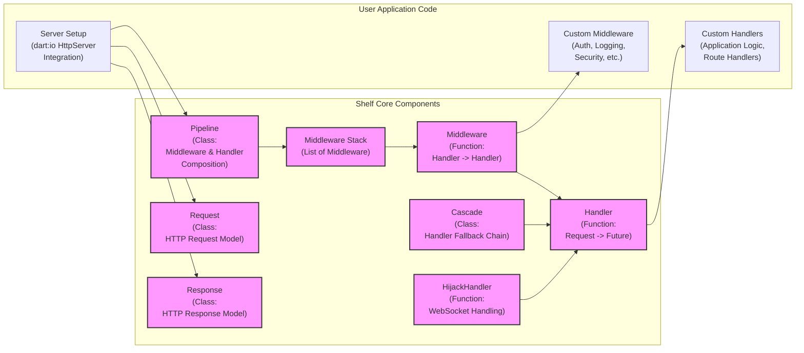

# Project Design Document: Shelf - A Middleware Framework for Dart HTTP Servers

**Version:** 1.1
**Date:** October 26, 2023
**Author:** Gemini (AI Expert in Software, Cloud, and Cybersecurity Architecture)

## 1. Introduction

This document provides a detailed design overview of the `shelf` Dart package (https://github.com/dart-lang/shelf). Shelf is a lightweight and powerful middleware framework for building composable HTTP servers in Dart. It simplifies HTTP request and response handling, enabling developers to create modular, testable, and maintainable server-side applications. This document serves as a foundation for threat modeling and security analysis of projects built using the Shelf framework.

## 2. Project Overview

**Project Name:** Shelf
**Project Repository:** https://github.com/dart-lang/shelf
**Project Description:** Shelf is a core Dart package for server-side web development. It provides an elegant middleware-based approach to constructing HTTP request pipelines.  Instead of dealing directly with low-level HTTP server APIs, developers define handlers and middleware that operate on `Request` and `Response` objects. Shelf handles the orchestration of these components, promoting code reuse and separation of concerns. It is designed to be server implementation agnostic, typically used with `dart:io`'s `HttpServer` but adaptable to other server environments.

**Key Features:**

*   **Middleware Pipeline Architecture:**  HTTP requests are processed sequentially through a configurable pipeline of middleware functions.
*   **Composable HTTP Handlers:**  Handlers are functions that encapsulate application logic, taking a `Request` and returning a `Response`. They are easily composed and chained.
*   **Abstracted Request and Response Objects:**  `Request` and `Response` classes provide a high-level, Dart-friendly interface to HTTP semantics, simplifying request and response manipulation.
*   **Server Implementation Independence:** Shelf is decoupled from specific HTTP server implementations, enhancing portability and testability.
*   **Extensible Middleware System:**  The framework is highly extensible, allowing developers to create custom middleware for specific application needs.
*   **Focus on HTTP Layer:** Shelf concentrates on the HTTP request/response lifecycle, leaving routing and other higher-level concerns to be addressed by middleware or application logic.

## 3. Goals and Objectives

The primary goals of Shelf are:

*   **Simplicity and Ease of Use:** To offer a straightforward and intuitive API for building HTTP servers in Dart, reducing boilerplate and complexity.
*   **Modularity and Reusability:** To encourage the development of modular, reusable server-side components through the middleware pattern.
*   **Composability and Flexibility:** To enable developers to easily compose and customize request processing pipelines using middleware.
*   **Testability and Maintainability:** To facilitate unit testing of individual middleware and handlers, leading to more maintainable applications.
*   **Performance and Efficiency:** To provide a performant foundation for building web servers without introducing unnecessary overhead.
*   **Security Foundation (Middleware Responsibility):** To provide a secure base framework, recognizing that application security is primarily managed through well-designed middleware and handlers.

## 4. Target Audience

The target audience for Shelf includes:

*   Dart developers building any type of server-side application that communicates over HTTP.
*   Developers seeking a structured and organized approach to handling HTTP requests and responses.
*   Teams requiring a framework that promotes code modularity, testability, and collaborative development for server-side projects.
*   Developers who prefer to focus on application logic rather than low-level HTTP server details.
*   Architects and developers designing microservices or APIs in Dart.

## 5. System Architecture

### 5.1. High-Level Architecture

Shelf's core architecture revolves around a **middleware pipeline** that processes incoming HTTP **requests**. Each request flows through a series of **middleware** components before reaching a final **handler**. The **handler** generates a **response**, which then flows back through the pipeline (often in reverse order for response processing) before being sent to the client via the underlying **server**.

```mermaid
flowchart LR
    subgraph "Client"
        "Client (Browser, App, CLI)" --> C["Client"];
    end
    subgraph "Shelf Application"
        direction TB
        C --> RQ["Request"];
        RQ --> MW1["Middleware 1"];
        MW1 --> MW2["Middleware 2"];
        MW2 --> MD_ELLIPSIS["..."];
        MD_ELLIPSIS --> MWN["Middleware N"];
        MWN --> H["Handler"];
        H --> RS["Response"];
        RS --> MWN_R["Middleware N\n(Response Processing)"];
        MWN_R --> MD_ELLIPSIS_R["..."];
        MD_ELLIPSIS_R --> MW1_R["Middleware 1\n(Response Processing)"];
        MW1_R --> Server["Server\n(dart:io HttpServer)"];
        Server --> Client;
    end

```

**Components:**

*   **Client:**  Any HTTP client initiating requests to the Shelf application (e.g., web browsers, mobile applications, command-line tools, other servers).
*   **Server (dart:io HttpServer):** The underlying HTTP server, typically `dart:io`'s `HttpServer`, responsible for network communication, listening for connections, and passing raw requests to the Shelf pipeline. Shelf abstracts away the specifics of this server.
*   **Request (`shelf.Request`):**  A Dart object representing an incoming HTTP request. It encapsulates all request details: HTTP method, URI, headers, query parameters, and request body.
*   **Response (`shelf.Response`):** A Dart object representing an HTTP response to be sent back to the client. It includes the HTTP status code, headers, and response body.
*   **Middleware (Function):**  A function that intercepts and processes a `Request` or `Response`. Middleware functions are chained together to form the request processing pipeline. They can perform various tasks:
    *   **Request Modification:** Altering the incoming request (e.g., adding headers, rewriting URLs).
    *   **Authentication and Authorization:** Verifying user credentials and permissions.
    *   **Logging and Monitoring:** Recording request details for auditing and performance analysis.
    *   **Caching:** Implementing caching mechanisms to improve performance.
    *   **Compression:** Compressing responses to reduce bandwidth usage.
    *   **Error Handling:** Intercepting and handling errors gracefully.
    *   **Security Headers:** Adding security-related HTTP headers.
*   **Handler (Function):** The core application logic. A `Handler` function takes a `Request` object and returns a `Future<Response>`. It's responsible for processing the request and generating the appropriate response based on the application's functionality.
*   **Pipeline (Composition):** The ordered sequence of middleware and the final handler. Shelf provides utilities to construct and manage this pipeline, ensuring requests are processed in the defined order.

### 5.2. Component-Level Architecture



**Component Descriptions (Detailed):**

*   **`Handler` (Function):**  The fundamental building block of a Shelf application. It's a Dart function with the signature `Future<Response> Function(Request)`.  Handlers contain the core business logic for processing requests and generating responses.
*   **`Middleware` (Function):** A higher-order function that wraps a `Handler`. It has the signature `Handler Function(Handler)`. Middleware functions operate on the request *before* it reaches the inner handler and/or on the response *after* the handler has processed the request. This allows for cross-cutting concerns to be implemented in a modular way.
*   **`Pipeline` (Class):**  The central class in Shelf for composing middleware and handlers. It takes a list of `Middleware` functions and a final `Handler` and creates a single, combined `Handler` that represents the entire request processing pipeline.
*   **`Request` (Class):**  A Dart class that models an HTTP request. It provides properties and methods to access all aspects of the request, including:
    *   `method`: HTTP method (GET, POST, etc.).
    *   `uri`: Request URI (including path, query parameters, etc.).
    *   `headers`: HTTP headers.
    *   `body`: Request body (as a stream or bytes).
    *   `context`:  A map for storing request-scoped data that can be passed between middleware and handlers.
*   **`Response` (Class):** A Dart class that models an HTTP response. It allows setting:
    *   `statusCode`: HTTP status code (200 OK, 404 Not Found, etc.).
    *   `headers`: HTTP response headers.
    *   `body`: Response body (as a stream, bytes, or a string).
*   **`Cascade` (Class):** A utility class that enables creating fallback handler chains. It takes a list of handlers and executes them in order until one returns a non-`null` response or doesn't throw a `NotFoundException`. This is useful for implementing routing or trying different handlers based on request characteristics.
*   **`HijackHandler` (Function):** A specialized handler designed for WebSocket hijacking. It allows a handler to take control of the underlying socket connection for WebSocket communication.
*   **`Middleware Stack` (List):**  Internally within the `Pipeline`, middleware functions are managed as an ordered list, ensuring they are applied in the correct sequence.
*   **Custom Handlers (User Application Code):**  Handlers developed by application developers to implement specific application features and route logic. These handlers are the core of the application's functionality.
*   **Custom Middleware (User Application Code):** Middleware functions created by developers to address application-specific requirements, such as custom authentication schemes, logging formats, security policies, or request transformations.
*   **Server Setup (User Application Code):** The code responsible for initializing and configuring the underlying HTTP server (e.g., `dart:io` `HttpServer`), binding it to a network address and port, and connecting it to the Shelf `Pipeline` to start processing requests.

## 6. Data Flow

The data flow for an incoming HTTP request in a Shelf application is as follows:

1.  **HTTP Request Reception:** The `dart:io` `HttpServer` receives a raw HTTP request from a client over the network.
2.  **`shelf.Request` Object Creation:** The server creates a `shelf.Request` object, parsing the raw HTTP request data into a structured Dart object.
3.  **Pipeline Entry:** The `shelf.Request` is passed to the configured Shelf `Pipeline`.
4.  **Middleware Execution (Request Phase - Forward):** The pipeline iterates through the registered middleware functions in the order they were added. Each middleware function:
    *   Receives the `Request` object.
    *   Can inspect, modify, or replace the `Request`.
    *   Can short-circuit the pipeline by returning a `Response` directly (e.g., for authentication failures).
    *   Otherwise, it calls the next middleware in the chain (or the handler if it's the last middleware).
5.  **Handler Invocation:** After all request-phase middleware have executed, the final `Handler` in the pipeline is invoked with the (potentially modified) `Request`.
6.  **`shelf.Response` Generation:** The `Handler` processes the request and returns a `Future<shelf.Response>`.
7.  **Middleware Execution (Response Phase - Reverse):** The pipeline is traversed *in reverse order* for response processing. Each middleware function:
    *   Receives the `Response` object (and the original `Request` via closure).
    *   Can inspect, modify, or replace the `Response`.
    *   Typically performs actions based on the response (e.g., logging the response status, adding caching headers).
8.  **Response Transmission to Server:** After all response-phase middleware have executed, the final `shelf.Response` is passed back to the `dart:io` `HttpServer`.
9.  **HTTP Response Sending:** The `HttpServer` sends the HTTP response back to the client over the network.

```mermaid
flowchart LR
    subgraph "Client"
        ClientRequest["HTTP Request"] --> Client;
    end
    subgraph "Shelf Application"
        direction TB
        Client --> HttpServer["dart:io HttpServer\n(Receive)"];
        HttpServer --> ShelfRequest["shelf.Request\n(Create)"];
        ShelfRequest --> MW1_Req["Middleware 1\n(Request Phase)"];
        MW1_Req --> MW2_Req["Middleware 2\n(Request Phase)"];
        MW2_Req --> MD_ELLIPSIS_REQ["..."];
        MD_ELLIPSIS_REQ --> MWN_Req["Middleware N\n(Request Phase)"];
        MWN_Req --> HandlerFunc["Handler\n(Process Request)"];
        HandlerFunc --> ShelfResponse["shelf.Response\n(Generate)"];
        ShelfResponse --> MWN_Resp["Middleware N\n(Response Phase)"];
        MWN_Resp --> MD_ELLIPSIS_RESP["..."];
        MD_ELLIPSIS_RESP --> MW2_Resp["Middleware 2\n(Response Phase)"];
        MW2_Resp --> MW1_Resp["Middleware 1\n(Response Phase)"];
        MW1_Resp --> HttpServer_Resp["dart:io HttpServer\n(Send)"];
        HttpServer_Resp --> ClientResponse["HTTP Response"];
    end
    ClientResponse --> Client;
```

## 7. Security Considerations (Detailed)

Security in Shelf applications is primarily managed through the design and implementation of middleware and handlers. Shelf itself provides the framework, but the security posture of an application depends on how these components are built and configured. Key security considerations include:

*   **Input Validation and Sanitization:**
    *   **Vulnerability:** Injection attacks (SQL Injection, XSS, Command Injection, Header Injection) arise from processing untrusted input without validation.
    *   **Mitigation:** Implement middleware to validate and sanitize all incoming request data:
        *   **Request Headers:** Validate expected header formats and values.
        *   **Query Parameters:** Sanitize and validate query parameters against expected types and ranges.
        *   **Request Body:**  Validate the structure and content of request bodies (e.g., JSON, XML). Sanitize string inputs to prevent XSS if reflected in responses.
    *   **Example (Middleware):** A middleware could parse JSON request bodies and validate the presence and type of required fields before passing the request to the handler.

*   **Authentication and Authorization:**
    *   **Vulnerability:** Unauthorized access to resources and functionalities if authentication and authorization are not properly implemented.
    *   **Mitigation:** Use middleware to enforce authentication and authorization:
        *   **Authentication Middleware:** Verify user credentials (e.g., using JWT, OAuth 2.0, session cookies).
        *   **Authorization Middleware:** Check user permissions against required roles or policies for accessing specific resources or endpoints.
    *   **Example (Middleware):** An authentication middleware could verify a JWT in the `Authorization` header and populate the request context with user information for subsequent authorization middleware or handlers.

*   **Session Management:**
    *   **Vulnerability:** Session hijacking, session fixation, and insecure session storage can compromise user accounts.
    *   **Mitigation:** Implement secure session management practices if using sessions:
        *   **Secure Session IDs:** Generate cryptographically strong and unpredictable session IDs.
        *   **Secure Storage:** Store session data securely (e.g., using encrypted cookies, server-side session stores).
        *   **Session Timeout:** Implement appropriate session timeouts to limit the window of opportunity for session hijacking.
        *   **HTTP-only and Secure Cookies:** Set `HttpOnly` and `Secure` flags on session cookies to mitigate client-side script access and transmission over insecure channels.

*   **Cross-Origin Resource Sharing (CORS):**
    *   **Vulnerability:**  Unrestricted CORS can allow malicious websites to make requests to your application on behalf of users, potentially leading to data breaches or CSRF attacks.
    *   **Mitigation:** Configure CORS middleware to strictly control allowed origins:
        *   **Whitelist Origins:** Specify a whitelist of allowed origin domains.
        *   **Restrict Methods and Headers:** Control allowed HTTP methods and headers for cross-origin requests.
        *   **`Access-Control-Allow-Credentials`:**  Handle credentials (`true` or `false`) carefully based on security requirements.

*   **Cross-Site Request Forgery (CSRF):**
    *   **Vulnerability:** CSRF attacks allow malicious websites to induce users to perform unintended actions on your application while authenticated.
    *   **Mitigation:** Implement CSRF protection middleware:
        *   **Synchronizer Token Pattern:** Generate and validate CSRF tokens in requests that modify data.
        *   **Double-Submit Cookie Pattern:** Use cookies and request headers to verify request origin.
        *   **`SameSite` Cookie Attribute:** Use `SameSite` cookie attribute (Strict or Lax) to mitigate some CSRF risks.

*   **Error Handling and Information Disclosure:**
    *   **Vulnerability:** Verbose error messages can leak sensitive information about the application's internal workings, database structure, or code paths to attackers.
    *   **Mitigation:** Implement robust error handling middleware:
        *   **Generic Error Responses:** Return generic error pages to clients, avoiding detailed error messages in production.
        *   **Secure Logging:** Log detailed error information securely server-side for debugging and monitoring, but do not expose it to clients.
        *   **Exception Handling:** Catch exceptions gracefully and return appropriate HTTP error codes.

*   **Denial of Service (DoS) and Rate Limiting:**
    *   **Vulnerability:**  DoS attacks can overwhelm the server and make the application unavailable.
    *   **Mitigation:** Implement rate limiting middleware:
        *   **Request Rate Limiting:** Limit the number of requests from a single IP address or user within a given time window.
        *   **Connection Limits:** Limit the number of concurrent connections.
        *   **Request Size Limits:** Limit the maximum size of request bodies to prevent resource exhaustion.

*   **HTTP Header Security:**
    *   **Vulnerability:** Missing security headers can leave applications vulnerable to various client-side attacks.
    *   **Mitigation:** Use middleware to set security-related HTTP response headers:
        *   `Content-Security-Policy` (CSP): Mitigate XSS attacks by controlling resources the browser is allowed to load.
        *   `Strict-Transport-Security` (HSTS): Enforce HTTPS connections.
        *   `X-Frame-Options`: Prevent clickjacking attacks.
        *   `X-Content-Type-Options: nosniff`: Prevent MIME-sniffing vulnerabilities.
        *   `Referrer-Policy`: Control referrer information sent in requests.

*   **Dependency Vulnerabilities:**
    *   **Vulnerability:** Using outdated or vulnerable dependencies can introduce security flaws into the application.
    *   **Mitigation:** Regularly audit and update dependencies:
        *   **Dependency Scanning:** Use tools to scan dependencies for known vulnerabilities.
        *   **Keep Dependencies Up-to-Date:** Regularly update dependencies to the latest secure versions.
        *   **Monitor Security Advisories:** Subscribe to security advisories for dependencies used in the project.

*   **WebSocket Security (if using `HijackHandler`):**
    *   **Vulnerability:** WebSocket connections can be vulnerable to injection attacks, DoS, and other security issues if not handled securely.
    *   **Mitigation:** Apply security best practices for WebSockets:
        *   **Input Validation:** Validate all data received over WebSocket connections.
        *   **Authentication and Authorization:** Authenticate and authorize WebSocket connections.
        *   **Secure Communication:** Use secure WebSocket protocol (WSS) for encrypted communication.
        *   **Rate Limiting:** Apply rate limiting to WebSocket messages to prevent DoS.

**Comprehensive Threat Modeling:**  It is crucial to conduct a thorough threat model specific to each Shelf application. This involves identifying assets, threats, vulnerabilities, and implementing appropriate security controls through middleware and handler design.

## 8. Deployment Model

Shelf applications are deployed as standalone Dart executables or within containerized environments. Common deployment models include:

1.  **Standalone Dart Application:**
    *   **Process:** Compile the Dart application using `dart compile exe` or `dart compile aot`. Deploy the executable and necessary assets to a server.
    *   **Environment:** Suitable for simple deployments, development environments, or when direct control over the server process is needed.
    *   **Server:** Requires a server environment capable of running Dart executables (OS with Dart SDK or a self-contained executable).

2.  **Containerized Deployment (Docker):**
    *   **Process:** Create a Dockerfile to containerize the Shelf application and its dependencies. Build a Docker image and deploy it to a container runtime environment (Docker Engine, Kubernetes, etc.).
    *   **Environment:** Recommended for production deployments, scalability, and consistent environments across development, staging, and production.
    *   **Orchestration:** Often used with container orchestration platforms like Kubernetes for managing scaling, health checks, and updates.

3.  **Cloud Platform Deployment (PaaS/FaaS):**
    *   **Platform as a Service (PaaS):** Deploy to cloud PaaS offerings (e.g., Google App Engine, AWS Elastic Beanstalk, Azure App Service) that provide managed environments for running web applications.
    *   **Function as a Service (FaaS):**  Potentially deploy individual handlers as serverless functions (e.g., AWS Lambda, Google Cloud Functions, Azure Functions) if the application architecture is suitable for serverless. (Less common for full Shelf applications, but possible for specific use cases).
    *   **Environment:** Leverage cloud provider's infrastructure, scalability, and managed services.

**Reverse Proxy (Recommended for Production):**

In almost all production deployments, it is highly recommended to place a reverse proxy (e.g., Nginx, Apache, HAProxy, cloud load balancers) in front of the Shelf application. The reverse proxy provides essential functionalities:

*   **SSL/TLS Termination:** Handle SSL/TLS encryption and decryption, offloading this task from the Shelf application.
*   **Load Balancing:** Distribute traffic across multiple instances of the Shelf application for scalability and high availability.
*   **Caching:** Cache static content and potentially dynamic responses to improve performance and reduce load on the application.
*   **Web Application Firewall (WAF):** Protect against common web attacks (e.g., SQL injection, XSS, DDoS).
*   **Rate Limiting and DoS Protection:** Implement rate limiting and other DoS mitigation strategies at the reverse proxy level.
*   **Static File Serving:** Efficiently serve static files (images, CSS, JavaScript) directly from the reverse proxy, bypassing the application for static content.

## 9. Technology Stack

*   **Programming Language:** Dart (version >= 2.12 recommended for null safety)
*   **Framework:** Shelf (https://github.com/dart-lang/shelf)
*   **HTTP Server Implementation:** `dart:io`'s `HttpServer` (or compatible server implementations)
*   **Dependencies:**  Defined in `pubspec.yaml`. Common dependencies might include:
    *   `shelf_router`: For routing requests to different handlers.
    *   `shelf_static`: For serving static files.
    *   `json_annotation`, `json_serializable`: For JSON serialization/deserialization.
    *   `jwt_decoder`, `oauth2`: For authentication and authorization.
    *   Logging and monitoring packages.
    *   Database client packages (e.g., `postgres`, `mongo_dart`).
*   **Deployment Environment:**
    *   Operating System: Linux (recommended for production), macOS, Windows.
    *   Dart SDK:  Required for running Dart applications.
    *   Reverse Proxy: Nginx, Apache, HAProxy, or cloud load balancer (recommended for production).
    *   Container Runtime (Optional but recommended for production): Docker, Kubernetes, etc.
    *   Cloud Platform (Optional): AWS, Google Cloud, Azure.

## 10. Glossary

*   **Handler:** A function that processes an HTTP request and returns a response, representing the application's core logic for a specific endpoint or functionality.
*   **Middleware:** A function that intercepts and processes requests and responses in a pipeline, handling cross-cutting concerns like logging, authentication, security, and request/response modification.
*   **Pipeline:** An ordered sequence of middleware functions and a final handler that HTTP requests pass through for processing.
*   **Request:** A Dart object representing an incoming HTTP request, encapsulating all request data.
*   **Response:** A Dart object representing an HTTP response to be sent back to the client.
*   **CORS (Cross-Origin Resource Sharing):** A browser security mechanism that restricts cross-origin HTTP requests to prevent unauthorized access between different domains.
*   **CSRF (Cross-Site Request Forgery):** An attack that forces authenticated users to perform unintended actions on a web application.
*   **DoS (Denial of Service):** An attack aimed at making a service unavailable to legitimate users, often by overwhelming it with traffic.
*   **XSS (Cross-Site Scripting):** A type of injection attack where malicious scripts are injected into trusted websites, allowing attackers to execute code in users' browsers.
*   **SQL Injection:** An injection attack that exploits vulnerabilities in database queries to gain unauthorized access or manipulate data.
*   **Reverse Proxy:** A server that sits in front of backend servers, forwarding client requests to them and providing additional functionalities like load balancing, caching, and security.
*   **PaaS (Platform as a Service):** A cloud computing model that provides a platform for developing, running, and managing applications without managing the underlying infrastructure.
*   **FaaS (Function as a Service):** A serverless computing model where code is executed in response to events, and the cloud provider manages the server infrastructure.

This improved document provides a more detailed and comprehensive design overview of the Shelf framework, with enhanced sections on security considerations and deployment models. It is intended to be a valuable resource for understanding Shelf's architecture and for conducting thorough threat modeling and security assessments of Shelf-based applications.