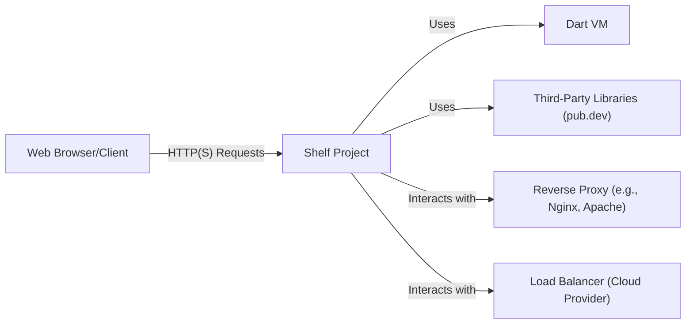
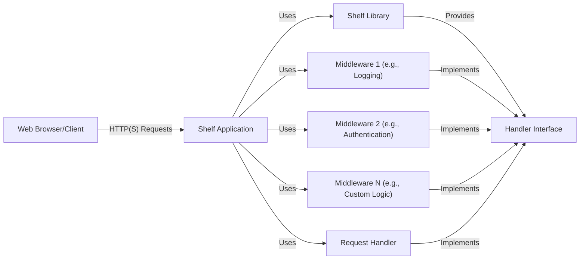
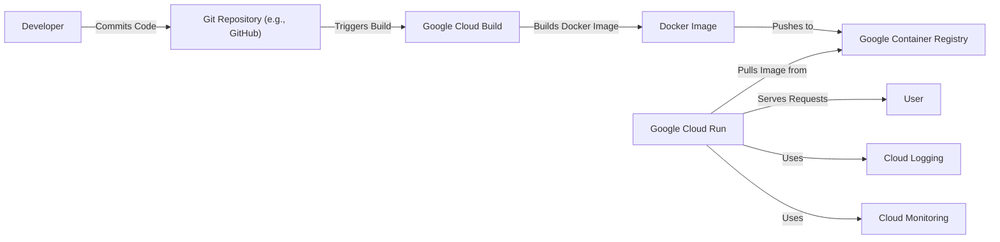
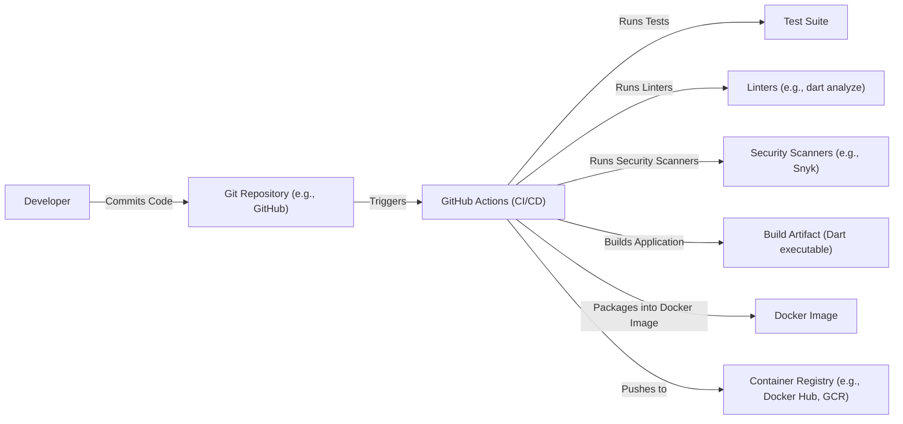

# Project Design Document: Shelf (Dart Web Server Middleware)

## BUSINESS POSTURE

Shelf is a project that aims to simplify and standardize the creation of web servers and middleware in Dart. It provides a clean, composable way to handle HTTP requests and responses.  It's not a full-fledged web framework, but rather a foundational layer upon which frameworks can be built.

Priorities:

*   Provide a stable, well-tested, and reliable foundation for Dart web development.
*   Enable easy creation of reusable middleware components.
*   Promote best practices for handling HTTP requests and responses.
*   Maintain a small, focused core API.
*   Ensure compatibility across different Dart platforms (server, VM, web).

Goals:

*   Become the de facto standard for Dart web server middleware.
*   Facilitate the development of a robust ecosystem of Shelf-compatible packages.
*   Reduce boilerplate code in Dart web applications.
*   Improve the overall quality and maintainability of Dart web server code.

Business Risks:

*   Security vulnerabilities in Shelf could impact a wide range of Dart web applications. This is the most critical risk.
*   Lack of adoption by the Dart community would limit the project's impact.
*   Inability to keep up with evolving web standards and Dart language features.
*   Performance bottlenecks could hinder the scalability of applications built on Shelf.
*   Breaking changes in the API could disrupt existing applications and middleware.

## SECURITY POSTURE

Existing Security Controls:

*   security control: Extensive test suite covering various aspects of HTTP handling. (Implemented in the `test/` directory of the repository).
*   security control: Use of Dart's type system to prevent common errors. (Implicit in the Dart language).
*   security control: Focus on immutability to reduce the risk of unintended side effects. (Design principle throughout the codebase).
*   security control: Sanitization of request headers and URLs to prevent injection attacks. (Partially implemented, needs further review).
*   security control: Regular dependency updates to address known vulnerabilities in third-party libraries. (Managed through `pubspec.yaml` and `pubspec.lock`).

Accepted Risks:

*   accepted risk: Shelf itself does not provide built-in mechanisms for authentication or authorization. It relies on middleware or the application layer to implement these features.
*   accepted risk: Shelf does not automatically handle HTTPS.  This is typically handled by a reverse proxy (like Nginx or Apache) or a cloud provider's load balancer.
*   accepted risk: Shelf does not include built-in protection against common web vulnerabilities like XSS or CSRF.  Developers are expected to use appropriate middleware or coding practices to mitigate these risks.

Recommended Security Controls:

*   security control: Implement a comprehensive security review and penetration testing process.
*   security control: Provide clear documentation and examples on how to securely configure and use Shelf, including best practices for handling common web vulnerabilities.
*   security control: Consider adding built-in support for common security headers (e.g., HSTS, CSP, X-Content-Type-Options).
*   security control: Explore options for integrating with security scanning tools to automatically detect vulnerabilities.
*   security control: Establish a clear process for reporting and addressing security vulnerabilities.

Security Requirements:

*   Authentication: Shelf should provide a clear and consistent way for middleware to handle authentication. It should not prescribe a specific authentication mechanism, but should facilitate the integration of various authentication methods (e.g., OAuth, JWT, Basic Auth).
*   Authorization: Shelf should provide a mechanism for middleware to enforce authorization rules. This could involve checking user roles, permissions, or other attributes.
*   Input Validation: Shelf should encourage and facilitate thorough input validation to prevent injection attacks and other data-related vulnerabilities.  This includes validating headers, query parameters, and request bodies.
*   Cryptography: Shelf should not handle cryptography directly, but should provide a way for middleware to access cryptographic libraries and securely manage secrets.  It should also encourage the use of secure protocols (e.g., HTTPS).

## DESIGN

### C4 CONTEXT

*   Elements Description:

    *   Name: User
        *   Type: Person
        *   Description: Represents a user interacting with a web application built using Shelf.
        *   Responsibilities: Sends HTTP requests to the server and receives responses.
        *   Security controls: Browser-based security controls (e.g., same-origin policy, cookie security).

    *   Name: Shelf Project
        *   Type: Software System
        *   Description: The core Shelf library and any application-specific code built using it.
        *   Responsibilities: Handles HTTP requests, processes them through middleware, and generates responses.
        *   Security controls: Input validation, sanitization, middleware-based security features (authentication, authorization).

    *   Name: Dart VM
        *   Type: Technology
        *   Description: The Dart Virtual Machine that executes the Shelf application.
        *   Responsibilities: Provides the runtime environment for the Dart code.
        *   Security controls: Dart VM security features, sandboxing (if applicable).

    *   Name: Third-Party Libraries (pub.dev)
        *   Type: Software System
        *   Description: External Dart packages used by the Shelf application.
        *   Responsibilities: Provide additional functionality not included in Shelf or the Dart standard library.
        *   Security controls: Dependency vulnerability scanning, regular updates.

    *   Name: Reverse Proxy (e.g., Nginx, Apache)
        *   Type: Software System
        *   Description: A server that sits in front of the Shelf application and handles tasks like SSL termination, request routing, and caching.
        *   Responsibilities: Provides an additional layer of security and performance optimization.
        *   Security controls: Web Application Firewall (WAF), SSL/TLS configuration, access control lists.

    *   Name: Load Balancer (Cloud Provider)
        *   Type: Software System
        *   Description: Distributes incoming traffic across multiple instances of the Shelf application.
        *   Responsibilities: Ensures high availability and scalability.
        *   Security controls: DDoS protection, health checks, security groups.

### C4 CONTAINER

*   Elements Description:

    *   Name: User
        *   Type: Person
        *   Description: Represents a user interacting with the web application.
        *   Responsibilities: Sends HTTP requests and receives responses.
        *   Security controls: Browser-based security controls.

    *   Name: Shelf Application
        *   Type: Container (Dart Application)
        *   Description: The main application code that uses the Shelf library.
        *   Responsibilities: Configures middleware, defines request handlers, and starts the server.
        *   Security controls: Application-specific security logic, secure coding practices.

    *   Name: Shelf Library
        *   Type: Container (Library)
        *   Description: The core Shelf library providing the foundation for building web servers.
        *   Responsibilities: Provides the `Handler` interface, request/response objects, and core utilities.
        *   Security controls: Input validation, sanitization (limited).

    *   Name: Middleware 1 (e.g., Logging)
        *   Type: Container (Dart Class)
        *   Description: An example middleware component for logging requests and responses.
        *   Responsibilities: Intercepts requests, logs relevant information, and passes the request to the next handler.
        *   Security controls: Secure logging practices (avoid logging sensitive data).

    *   Name: Middleware 2 (e.g., Authentication)
        *   Type: Container (Dart Class)
        *   Description: An example middleware component for authenticating users.
        *   Responsibilities: Verifies user credentials, sets authentication context, and potentially rejects unauthorized requests.
        *   Security controls: Secure authentication mechanisms (e.g., OAuth, JWT), protection against brute-force attacks.

    *   Name: Middleware N (e.g., Custom Logic)
        *   Type: Container (Dart Class)
        *   Description: A placeholder for any other custom middleware components.
        *   Responsibilities: Varies depending on the specific middleware.
        *   Security controls: Depends on the specific middleware functionality.

    *   Name: Request Handler
        *   Type: Container (Dart Class)
        *   Description: The final handler that processes the request and generates a response.
        *   Responsibilities: Handles the core business logic of the application.
        *   Security controls: Input validation, output encoding, secure data handling.

    *   Name: Handler Interface
        *   Type: Interface
        *   Description: The core interface defined by Shelf that all handlers and middleware must implement.
        *   Responsibilities: Defines the contract for handling HTTP requests.
        *   Security controls: None directly, but enforces a consistent structure for request handling.

### DEPLOYMENT

Possible Deployment Solutions:

1.  Standalone Dart VM: Running the Shelf application directly on a server using the Dart VM.
2.  Docker Container: Packaging the Shelf application and its dependencies into a Docker container.
3.  Cloud Platform (e.g., Google Cloud Run, AWS Lambda, Azure Functions): Deploying the application as a serverless function or containerized application on a cloud platform.
4.  App Engine (Google Cloud): Deploying application to Google Cloud App Engine environment.

Chosen Solution (Detailed Description): Docker Container with Google Cloud Run

This solution provides a good balance of portability, scalability, and ease of management.

*   Elements Description:

    *   Name: Developer
        *   Type: Person
        *   Description: The developer writing and committing code.
        *   Responsibilities: Writes code, tests, and commits to the repository.
        *   Security controls: Code reviews, secure coding practices.

    *   Name: Git Repository (e.g., GitHub)
        *   Type: Software System
        *   Description: The source code repository.
        *   Responsibilities: Stores the application code and tracks changes.
        *   Security controls: Access controls, branch protection rules.

    *   Name: Google Cloud Build
        *   Type: Software System
        *   Description: A continuous integration and continuous delivery (CI/CD) service.
        *   Responsibilities: Builds the Docker image and pushes it to the container registry.
        *   Security controls: IAM roles and permissions, build process security.

    *   Name: Docker Image
        *   Type: Artifact
        *   Description: The packaged application and its dependencies.
        *   Responsibilities: Provides a consistent and portable runtime environment.
        *   Security controls: Image scanning for vulnerabilities.

    *   Name: Google Container Registry
        *   Type: Software System
        *   Description: A private registry for storing Docker images.
        *   Responsibilities: Stores and manages Docker images.
        *   Security controls: Access controls, vulnerability scanning.

    *   Name: Google Cloud Run
        *   Type: Software System
        *   Description: A fully managed serverless container platform.
        *   Responsibilities: Deploys and scales the application automatically.
        *   Security controls: IAM roles and permissions, network security, automatic scaling.

    *   Name: User
        *   Type: Person
        *   Description: End user of application.
        *   Responsibilities: Access application.
        *   Security controls: N/A.

    *   Name: Cloud Logging
        *   Type: Software System
        *   Description: Centralized logging service.
        *   Responsibilities: Collects and stores application logs.
        *   Security controls: Access controls, data retention policies.

    *   Name: Cloud Monitoring
        *   Type: Software System
        *   Description: Monitoring and alerting service.
        *   Responsibilities: Monitors application performance and health.
        *   Security controls: Access controls, alerting rules.

### BUILD

Build Process Description:

1.  Developer commits code to the Git repository (e.g., GitHub).
2.  A GitHub Actions workflow is triggered by the commit.
3.  The workflow runs the test suite to ensure code quality and functionality.
4.  Linters (e.g., `dart analyze`) are run to check for code style and potential errors.
5.  Security scanners (e.g., Snyk) are run to identify vulnerabilities in dependencies.
6.  The application is built into a Dart executable.
7.  The executable is packaged into a Docker image along with its dependencies.
8.  The Docker image is pushed to a container registry (e.g., Docker Hub, Google Container Registry).

Security Controls:

*   security control: GitHub Actions workflows are defined in code and version-controlled, ensuring reproducibility and auditability.
*   security control: Test suite execution ensures that code changes do not introduce regressions.
*   security control: Linters enforce code style and help prevent common errors.
*   security control: Security scanners automatically detect vulnerabilities in dependencies.
*   security control: Docker image builds create a consistent and isolated environment for the application.
*   security control: Container registries provide secure storage and access control for Docker images.
*   security control: Use of minimal base Docker images to reduce the attack surface.
*   security control: Regular updates of build tools and dependencies.

## RISK ASSESSMENT

Critical Business Processes:

*   Serving web requests reliably and efficiently.
*   Maintaining the integrity and confidentiality of data handled by applications built on Shelf.
*   Providing a stable and secure platform for Dart web development.

Data Sensitivity:

*   Shelf itself does not handle sensitive data directly. However, applications built on Shelf may handle various types of data, including:
    *   Personally Identifiable Information (PII)
    *   Financial data
    *   Authentication credentials
    *   Session data
    *   Application-specific data

The sensitivity of the data depends on the specific application built using Shelf.  It is crucial for developers using Shelf to understand the sensitivity of the data they are handling and implement appropriate security measures.

## QUESTIONS & ASSUMPTIONS

Questions:

*   What specific types of applications are expected to be built using Shelf? (This will help determine the most relevant security concerns.)
*   What is the expected scale of these applications? (This will impact performance and scalability requirements.)
*   What are the specific security requirements of the organizations that will be using Shelf? (This will help prioritize security controls.)
*   Are there any existing security policies or guidelines that need to be followed?
*   What level of support and maintenance will be provided for Shelf?

Assumptions:

*   BUSINESS POSTURE: Shelf is intended to be a foundational library, not a complete web framework. Developers are expected to have a good understanding of web security principles.
*   SECURITY POSTURE: Developers will use appropriate middleware and coding practices to address common web vulnerabilities. Shelf will provide the necessary tools and guidance, but the ultimate responsibility for security lies with the application developer.
*   DESIGN: The deployment environment will provide basic security features like network firewalls and access controls. The chosen deployment solution (Docker with Google Cloud Run) is assumed to be secure and well-maintained. The build process will be automated and secured using GitHub Actions.