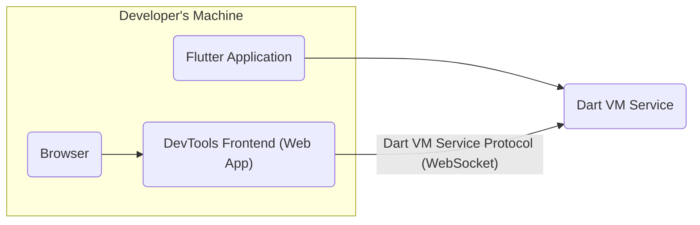
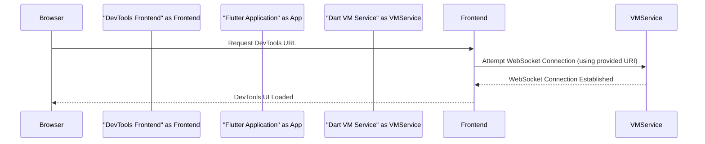
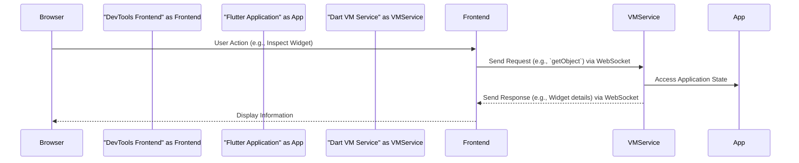

# Project Design Document: Flutter DevTools

**Version:** 1.1
**Date:** October 26, 2023
**Prepared By:** Gemini (AI Architecture Expert)

## 1. Introduction

This document provides a detailed architectural design of the Flutter DevTools project, as found in the GitHub repository [https://github.com/flutter/devtools](https://github.com/flutter/devtools). This document is intended to serve as a foundation for subsequent threat modeling activities. It outlines the key components, their interactions, data flows, and technologies involved.

## 2. Project Overview

Flutter DevTools is a suite of performance and debugging tools for Flutter applications. It helps developers diagnose performance issues, inspect the UI layout, analyze memory usage, and debug application logic. DevTools is a web application that connects to a running Flutter application (either on a physical device, emulator, or web browser) through a communication protocol.

## 3. Goals

* Provide a comprehensive overview of the Flutter DevTools architecture.
* Identify key components and their responsibilities.
* Describe the interactions and data flow between components.
* Highlight technologies and protocols used.
* Serve as a basis for identifying potential security threats and vulnerabilities.

## 4. Non-Goals

* Detailed code-level implementation specifics.
* Performance benchmarking or optimization strategies.
* Specific UI/UX design details.
* In-depth analysis of individual DevTools features (e.g., Network Profiler internals).

## 5. Target Audience

* Security engineers and architects performing threat modeling.
* Developers contributing to or maintaining Flutter DevTools.
* Individuals seeking a high-level understanding of the DevTools architecture.

## 6. Architectural Overview

Flutter DevTools follows a client-server architecture where the DevTools web application (client) communicates with a running Flutter application (server) through the Dart VM Service Protocol.

**Key Components:**

* DevTools Frontend (Web App)
* Browser
* Flutter Application
* Dart VM Service

## 7. Component Details

### 7.1. DevTools Frontend (Web App)

* **Description:** The primary user interface for interacting with DevTools. It's a single-page application built with Flutter web.
* **Responsibilities:**
    * Presenting debugging and profiling information to the user.
    * Sending commands and requests to the Dart VM Service.
    * Receiving and processing data from the Dart VM Service.
    * Managing the user interface and user interactions.
* **Key Technologies:**
    * Flutter (for UI development)
    * Dart (programming language)
    * WebSockets (for communication with the Dart VM Service)
* **Deployment:** Served as static web assets, typically from a local development server or potentially bundled within the Flutter SDK.

### 7.2. Flutter Application

* **Description:** The application being inspected and debugged by DevTools.
* **Responsibilities:**
    * Running the application code.
    * Exposing debugging and profiling information through the Dart VM Service.
    * Responding to commands from DevTools (via the Dart VM Service).
* **Key Technologies:**
    * Flutter framework
    * Dart programming language
* **Deployment:** Deployed on various platforms (iOS, Android, Web, Desktop).

### 7.3. Dart VM Service

* **Description:** An embedded service within the Dart VM that provides a programmatic interface for interacting with a running Dart application.
* **Responsibilities:**
    * Exposing APIs for inspecting the application's state (e.g., objects, isolates, stack traces).
    * Providing performance profiling data (e.g., CPU usage, memory allocation).
    * Allowing control over the application's execution (e.g., pausing, stepping).
    * Handling communication with DevTools via the Dart VM Service Protocol.
* **Key Technologies:**
    * Dart Virtual Machine (VM)
    * Dart VM Service Protocol (typically over WebSockets)
* **Deployment:** Runs within the same process as the Flutter application.

### 7.4. Browser

* **Description:** The web browser used by the developer to access and interact with the DevTools frontend.
* **Responsibilities:**
    * Rendering the DevTools web application.
    * Executing JavaScript code for the DevTools frontend.
    * Establishing WebSocket connections to the Dart VM Service (indirectly through the DevTools frontend).
* **Key Technologies:**
    * Standard web browser technologies (HTML, CSS, JavaScript)

## 8. Data Flow Diagrams

### 8.1. Initial Connection Establishment

**Description:**

* The developer navigates to the DevTools URL in their browser.
* The DevTools frontend attempts to establish a WebSocket connection to the Dart VM Service of the target Flutter application. The URI for the Dart VM Service is typically provided by the Flutter tooling (e.g., `flutter run`).
* The Dart VM Service accepts the connection.
* The DevTools frontend loads the user interface in the browser.

### 8.2. Data Exchange for Debugging/Profiling

**Description:**

* The developer interacts with the DevTools UI (e.g., clicks a button, selects a widget).
* The DevTools frontend translates this action into a request to the Dart VM Service using the Dart VM Service Protocol (e.g., requesting details about a specific object).
* The Dart VM Service interacts with the running Flutter application to retrieve the requested information.
* The Dart VM Service sends the response back to the DevTools frontend via the WebSocket connection.
* The DevTools frontend processes the response and updates the UI in the browser to display the information to the developer.

## 9. Security Considerations (High-Level)

This section outlines potential security considerations that will be further explored during threat modeling.

* **Authentication and Authorization:**
    * How is the connection to the Dart VM Service secured?  Typically, the connection relies on the developer having access to the device or emulator where the Flutter application is running.
    * Is there any authentication required to connect to the service? Currently, there is generally no explicit authentication mechanism beyond the network access.
    * Are there any authorization mechanisms to control access to sensitive information or actions?  Authorization is largely implicit based on the ability to connect to the Dart VM Service.
* **Data Security in Transit:**
    * Is the communication between DevTools and the Dart VM Service encrypted (e.g., using secure WebSockets - `wss://`)?  Communication often occurs over `ws://` for local development, but `wss://` could be used in specific configurations.
    * What measures are in place to prevent eavesdropping or tampering with the communication?  The security of the local network is a factor.
* **Access Control:**
    * Who can access the DevTools interface and potentially control the running application? Anyone with network access to the machine running DevTools and the Flutter application.
    * Are there any risks associated with unauthorized access to DevTools?  An attacker could potentially inspect application data, modify its state, or even cause it to crash.
* **Information Disclosure:**
    * What sensitive information about the application is exposed through the Dart VM Service?  Application state, memory contents, performance metrics, and potentially source code information.
    * Could this information be misused if accessed by an attacker? Yes, it could reveal business logic, API keys (if present in memory), or other sensitive data.
* **Remote Code Execution:**
    * Does the Dart VM Service Protocol allow for actions that could lead to remote code execution on the target device or emulator?  Yes, the protocol allows for evaluating arbitrary Dart code.
    * What safeguards are in place to prevent malicious commands from being executed? Reliance on the developer's environment being trusted.
* **Cross-Site Scripting (XSS):**
    * As DevTools is a web application, is it susceptible to XSS vulnerabilities? Yes, if user-provided data or data from the Dart VM Service is not properly sanitized before being displayed.
    * How is user-provided data handled and sanitized within the DevTools frontend?  This needs careful review of the frontend codebase.
* **Cross-Site Request Forgery (CSRF):**
    * Could an attacker trick a developer into performing actions on their Flutter application through DevTools without their knowledge?  Less likely in typical local development scenarios, but could be a concern if DevTools is exposed on a network.
* **Dependency Vulnerabilities:**
    * Are there any known vulnerabilities in the dependencies used by the DevTools frontend or the Dart VM Service?  Regular dependency scanning and updates are crucial.

## 10. Technologies Used

* **Programming Languages:**
    * Dart
    * JavaScript
* **Frameworks and Libraries:**
    * Flutter
    * Flutter web
* **Protocols:**
    * Dart VM Service Protocol (typically over WebSockets)
    * HTTP/HTTPS
* **Other:**
    * Web Browsers

## 11. Deployment Model

Flutter DevTools is typically accessed in one of the following ways:

* **Launched from Flutter CLI:** When running `flutter run`, the CLI often provides a link to open DevTools in the browser. This usually connects to a locally running application.
* **Standalone Web Application:** DevTools can be built and served as a standalone web application.
* **Embedded in IDEs:** Some IDEs (like IntelliJ/Android Studio and VS Code) have integrated DevTools functionality.

The deployment model can influence the attack surface and potential threats. For instance, a locally running DevTools instance might have different security considerations compared to a publicly accessible one (though the latter is not the typical use case).

## 12. Future Considerations

* **Enhanced Security Features:**  Future development might include more robust authentication and authorization mechanisms for connecting to the Dart VM Service.
* **Improved Data Encryption:**  Ensuring end-to-end encryption for all communication between DevTools and the target application.
* **Role-Based Access Control:** Implementing granular access control within DevTools to restrict access to certain features or data based on user roles.
* **Content Security Policy (CSP):** Implementing a strong CSP for the DevTools web application to mitigate XSS risks.
* **Subresource Integrity (SRI):** Using SRI for external resources to prevent tampering.

This document provides a foundational understanding of the Flutter DevTools architecture. The information presented here will be crucial for conducting a thorough threat modeling exercise to identify and mitigate potential security risks.
