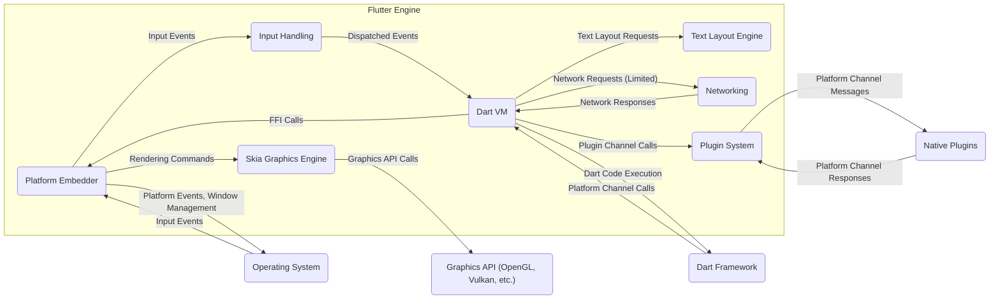
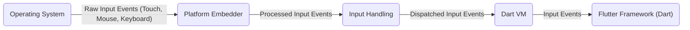
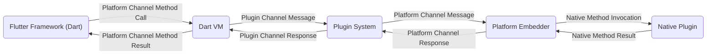

## Project Design Document: Flutter Engine for Threat Modeling (Improved)

**1. Introduction**

This document provides an enhanced architectural overview of the Flutter Engine, specifically designed to facilitate comprehensive threat modeling activities. It details the key components, their interactions, and the flow of various data types within the engine. The primary goal is to provide a clear and detailed understanding of the system's structure, boundaries, and potential attack surfaces for security analysis.

**2. Project Overview**

The Flutter Engine serves as the foundational runtime environment for Flutter applications. Implemented primarily in C++, it's engineered for portability across diverse platforms, including Android, iOS, Web, and Desktop. Its core responsibilities encompass:

*   High-performance UI rendering utilizing the Skia graphics library.
*   Execution of Dart code through the embedded Dart Virtual Machine (VM).
*   Establishment and management of platform channels for seamless communication with the underlying operating system.
*   Comprehensive handling of user input events, such as touch, mouse, and keyboard interactions.
*   Provision of a flexible plugin system to extend the engine's capabilities with platform-specific functionalities.

This document specifically concentrates on the internal architecture and data flow *within* the Flutter Engine itself, excluding the broader Flutter framework and the applications built upon it. This focused approach allows for a more granular security analysis of the engine's core components.

**3. Architectural Overview**

The Flutter Engine is composed of several interconnected components that collectively provide the runtime environment for Flutter applications.

*   **Platform Embedder:** This is the platform-specific integration point for the Flutter Engine. It acts as a bridge between the engine and the host operating system, responsible for:
    *   Native Window Management: Creating, managing, and interacting with the native window provided by the operating system.
    *   Event Loop Management: Providing the main event loop that drives the application's execution.
    *   Platform Event Handling: Receiving and processing platform-specific events such as lifecycle events (e.g., app start, pause, resume), accessibility events, and system notifications. This is a critical boundary for potential OS-level attacks.
    *   Rendering Surface Setup: Initializing and managing the rendering surface where Skia draws the UI.
    *   Platform API Interfacing: Providing access to platform-specific APIs (e.g., sensors, storage, networking) through platform channels.
*   **Dart VM (Virtual Machine):** This component is responsible for the execution of Dart code within the Flutter environment. Its key functions include:
    *   Dart Code Compilation and Execution: Compiling Dart code (potentially just-in-time) and managing its execution.
    *   Memory Management and Garbage Collection: Allocating and managing memory for Dart objects, including garbage collection to prevent memory leaks.
    *   Core Dart Libraries: Providing access to fundamental Dart libraries and functionalities.
    *   Foreign Function Interface (FFI): Enabling communication and data exchange between Dart code and the Flutter Engine's C++ codebase. This interface is a potential point for vulnerabilities if not handled securely.
*   **Skia Graphics Engine:** This high-performance 2D graphics library is central to rendering the Flutter UI. It handles:
    *   Drawing Primitives: Rendering basic shapes, text, and images.
    *   Transformations and Effects: Applying transformations (e.g., scaling, rotation) and visual effects to rendered content.
    *   Graphics API Abstraction: Interacting with the underlying platform's graphics API (e.g., OpenGL, Vulkan, Metal, Direct3D) to perform rendering operations. Vulnerabilities in Skia could lead to rendering glitches or, in severe cases, code execution.
*   **Text Layout Engine:** This component focuses on the complex task of laying out and rendering text, including:
    *   Internationalization and Bidirectional Text Support: Handling text in various languages and writing directions.
    *   Font Management: Interacting with font providers to access and render text using different fonts.
    *   Complex Text Shaping:  Handling ligatures, kerning, and other advanced typographic features.
*   **Input Handling:** This subsystem manages the flow of user interactions within the Flutter Engine:
    *   Raw Input Event Reception: Receiving raw input events (touch events, mouse movements, keyboard presses) from the Platform Embedder.
    *   Event Processing and Dispatching: Processing these raw events and dispatching them to the appropriate parts of the Dart layer for handling.
    *   Gesture Recognition: Identifying and interpreting user gestures (e.g., taps, swipes, pinches). Improper handling of input can lead to denial-of-service or unexpected behavior.
*   **Networking (Limited Scope within Engine):** While the primary networking logic resides in the Dart framework, the engine provides some low-level networking capabilities, mainly for:
    *   Asset Downloading: Fetching assets required by the application (e.g., images, fonts).
    *   Developer Tool Communication: Communicating with debugging and profiling tools. This communication channel needs to be secured to prevent unauthorized access or manipulation.
*   **Plugin System:** This mechanism allows for extending the Flutter Engine's functionality through platform-specific native code. It involves:
    *   Platform Channels: Defining named channels for asynchronous communication between Dart code and native platform code. The security of these channels is paramount.
    *   Plugin Registration and Invocation: Providing mechanisms for registering native plugins and invoking their methods from Dart. This introduces a trust boundary that needs careful consideration.

**4. System Architecture Diagram**

**5. Data Flow Diagrams**

This section illustrates the flow of critical data types within the Flutter Engine, highlighting potential points of interest for security analysis.

**5.1. User Input Flow**

**5.2. Rendering Data Flow**

**5.3. Platform Channel Communication Flow (Plugin)**

**6. Key Security Considerations**

This section details potential security concerns within the Flutter Engine, categorized for clarity and to facilitate targeted threat modeling.

*   **Platform Embedder Security:**
    *   **OS API Vulnerabilities:** Exploitation of vulnerabilities in the underlying operating system APIs used by the embedder.
    *   **Privilege Escalation:** Potential for malicious actors to leverage embedder functionalities to gain elevated privileges on the system.
    *   **Information Disclosure:** Risks associated with the embedder exposing sensitive information about the application or the system.
    *   **Input Event Manipulation:**  The possibility of intercepting or manipulating input events before they reach the engine.
*   **Dart VM Security:**
    *   **JIT Compilation Vulnerabilities:** Exploits targeting the just-in-time compilation process of the Dart VM, potentially leading to arbitrary code execution.
    *   **Memory Corruption Bugs:** Vulnerabilities such as buffer overflows or use-after-free errors within the VM's memory management.
    *   **Sandbox Escapes:** Attempts to break out of the Dart VM's sandbox (if any) to access system resources.
    *   **Denial of Service:**  Attacks aimed at crashing or making the Dart VM unresponsive.
*   **Skia Graphics Engine Security:**
    *   **Rendering Vulnerabilities:** Exploits related to the processing of malformed image data or complex rendering instructions, potentially leading to crashes or code execution.
    *   **Graphics API Exploits:** Vulnerabilities in the underlying graphics APIs (OpenGL, Vulkan, etc.) that Skia interacts with.
    *   **Resource Exhaustion:**  Attacks that attempt to consume excessive GPU resources, leading to denial of service.
*   **Text Layout Engine Security:**
    *   **Font Parsing Vulnerabilities:** Exploits related to parsing malicious font files, potentially leading to code execution.
    *   **Denial of Service:** Attacks involving the rendering of extremely complex or malformed text, causing excessive resource consumption.
*   **Input Handling Security:**
    *   **Input Injection Attacks:**  Exploiting vulnerabilities in how input events are processed to inject malicious commands or data.
    *   **Denial of Service:**  Flooding the input system with excessive events to make the application unresponsive.
*   **Plugin System Security:**
    *   **Malicious Plugins:** The risk of using third-party plugins that contain malicious code or vulnerabilities.
    *   **Insecure Platform Channels:**  Vulnerabilities in the implementation of platform channels that could allow for unauthorized access or manipulation of data.
    *   **Data утечка:**  Plugins potentially accessing and leaking sensitive data.
*   **FFI Security:**
    *   **Vulnerabilities in Native Code:** Security flaws in the native C++ code that is called through the FFI.
    *   **Data Marshalling Issues:** Errors in how data is passed between Dart and native code, potentially leading to memory corruption or information disclosure.
*   **Networking Security (within the Engine):**
    *   **Insecure Connections:** Lack of encryption or proper validation when downloading assets or communicating with developer tools.
    *   **Man-in-the-Middle Attacks:**  The potential for attackers to intercept and manipulate network communication.
*   **Resource Exhaustion:**
    *   **CPU and Memory Exhaustion:**  Attacks that attempt to consume excessive CPU or memory resources, leading to application crashes or system instability.
    *   **GPU Resource Exhaustion:**  As mentioned in Skia security, attacks targeting GPU resources.

**7. Assumptions and Constraints**

*   This document focuses specifically on the Flutter Engine's architecture and does not encompass the security of the broader Flutter framework or individual applications built using Flutter.
*   It is assumed that the underlying operating system and hardware provide a baseline level of security. However, platform-specific vulnerabilities will need to be considered during threat modeling.
*   The security of individual plugins is outside the direct scope of this document, but the plugin system itself is considered a significant attack surface.
*   Threat modeling activities will need to consider the specific platform on which the Flutter Engine is deployed, as security considerations can vary significantly (e.g., mobile vs. web vs. desktop).

**8. Future Considerations**

*   This document should be reviewed and updated periodically to reflect any architectural changes or new features introduced in the Flutter Engine.
*   Specific threat modeling exercises, utilizing methodologies like STRIDE or PASTA, will provide more detailed insights into potential vulnerabilities and inform the development of mitigation strategies.
*   Further investigation into the security mechanisms implemented within each component of the Flutter Engine (e.g., sandboxing, input validation) is recommended.

This improved design document provides a more detailed and structured foundation for threat modeling the Flutter Engine. By outlining the key components, data flows, and potential security considerations, it aims to facilitate a comprehensive and effective security analysis of this critical runtime environment.