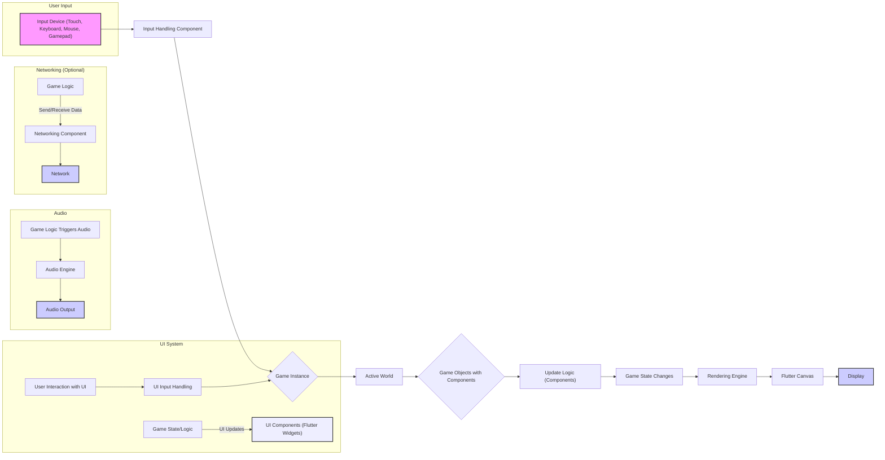

# Project Design Document: Flame Engine

**Version:** 1.1
**Date:** October 26, 2023
**Author:** AI Software Architect

## 1. Introduction

This document provides a detailed design overview of the Flame Engine, an open-source 2D game engine built on top of Flutter. This document aims to comprehensively describe the engine's architecture, key components, and data flow, serving as a robust foundation for subsequent threat modeling activities. The focus is on providing sufficient detail to identify potential vulnerabilities and attack vectors.

## 2. Goals and Objectives

The primary goals of the Flame Engine are to:

* Provide a comprehensive and well-structured set of tools and abstractions for building high-quality 2D games within the Flutter ecosystem.
* Offer a highly modular and extensible architecture, empowering developers to customize and extend the engine's functionality to suit specific game requirements.
* Enable efficient and performant rendering, ensuring smooth and engaging gameplay experiences across various target platforms.
* Facilitate the seamless integration of fundamental game development concepts, including sprite management, complex animations, robust collision detection, and versatile input handling mechanisms.
* Foster a thriving and supportive community by providing clear, concise documentation, illustrative examples, and accessible contribution guidelines.

## 3. High-Level Architecture

The Flame Engine employs a component-based architecture, where distinct modules handle specific aspects of game development. This design leverages Flutter's powerful widget system and its efficient rendering pipeline. The core principle is to separate concerns, making the engine easier to understand, maintain, and extend.

* **Core Engine:**  Provides the foundational game loop, manages game entities and their components, and oversees the overall game lifecycle.
* **Rendering Engine:**  Responsible for drawing game elements on the screen, efficiently utilizing Flutter's `Canvas` API and rendering primitives. This includes managing sprites, animations, and visual effects.
* **Input Handling:**  Manages diverse user input sources (touch, keyboard, mouse, gamepads) and translates these inputs into actionable game events.
* **Audio Engine:**  Provides a comprehensive suite of functionalities for playing, managing, and manipulating sound effects and background music within the game.
* **Collision Detection:**  Offers a flexible system for detecting collisions between game objects, supporting various collision shapes and detection algorithms.
* **Animation System:**  Enables the creation and sophisticated management of animations for sprites and other visual elements, including frame-based and tweened animations.
* **UI System:**  Facilitates the creation of interactive in-game user interfaces by seamlessly integrating with Flutter's rich widget library.
* **Networking (Optional):**  Provides optional tools and abstractions for implementing network functionalities in games, supporting various network protocols and architectures.
* **Tiled Support (Optional):**  Offers optional integration with the popular Tiled map editor, allowing for the creation and efficient rendering of complex tile-based game levels.
* **Effects System:**  Provides capabilities for applying visual effects to game objects, such as color filters, blurs, and other post-processing effects.

## 4. Component Details

This section provides a more detailed breakdown of the key components within the Flame Engine.

### 4.1. Core Engine

* **Game Loop:** The heart of the engine, orchestrating the continuous cycle of updating the game state and rendering the game scene. It manages the timing and synchronization of these processes.
* **Component System:** A fundamental design pattern where game entities are constructed by composing reusable and independent components. Each component encapsulates specific behaviors, data, and logic.
* **World:**  A container that manages the collection of active game objects (entities with associated components) within the current game scene or level.
* **Camera:**  Defines the virtual viewpoint through which the game world is observed. It controls the visible area and can be manipulated to create scrolling or zooming effects.
* **Game Instance:** The primary entry point for any Flame game application. It is responsible for initializing the engine, managing the game loop, and coordinating the overall game flow.
* **Lifecycle Management:**  Handles the complete lifecycle of game objects and their components, including initialization, periodic updates, rendering, and proper disposal to prevent resource leaks.
* **Game State Management:** Provides mechanisms for managing the overall state of the game, including variables, flags, and data that persist across different parts of the game.

### 4.2. Rendering Engine

* **Canvas:**  Directly utilizes Flutter's `Canvas` API, providing low-level access to drawing primitives for rendering game elements.
* **Sprites:**  Represents individual 2D images used as the visual representation of game objects. Sprites can be loaded from image assets and manipulated within the game.
* **Sprite Sheets:**  An optimization technique for efficiently storing multiple related sprites within a single image file, reducing the number of texture swaps and improving rendering performance.
* **Text Rendering:**  Provides functionalities for rendering text within the game, allowing for customization of fonts, styles, and colors.
* **Particles:**  Enables the creation and dynamic management of particle effects, used for simulating phenomena like explosions, smoke, or magic effects.
* **Layers:**  Allows for organizing and rendering game elements on different visual planes, enabling depth effects and controlling the order in which elements are drawn.
* **Viewport:**  Defines the currently visible portion of the game world, often linked to the `Camera` component.
* **Effects (Rendering):**  Components that apply visual transformations and filters to rendered elements, such as color adjustments, blurring, or distortion.

### 4.3. Input Handling

* **Input Processors:**  Interfaces directly with Flutter's event system to capture raw input events originating from various sources like touchscreens, keyboards, and mice.
* **Gesture Detection:**  Implements logic to recognize common user gestures, such as taps, drags, pinches, and swipes, translating these into higher-level game actions.
* **Input Mapping:**  Provides a flexible system for mapping raw input events or detected gestures to specific actions within the game, allowing for customizable control schemes.
* **Focus Management:**  Manages which game object or UI element currently has input focus, ensuring that input events are directed to the appropriate recipient.
* **Gamepad Support:**  Handles input from connected gamepads or controllers, allowing for alternative control schemes.

### 4.4. Audio Engine

* **Audio Players:**  Components responsible for the playback of individual sound effects and background music tracks. They manage the audio stream and playback controls.
* **Audio Cache:**  An efficient mechanism for loading and caching audio assets (sound files) to minimize loading times and improve performance.
* **Spatial Audio (Optional):**  Provides functionalities for positioning sound sources in a virtual 3D space, allowing for realistic audio panning and distance effects (if implemented).
* **Audio Groups:**  Allows for grouping and managing multiple audio sources together, enabling volume control or effects to be applied to a set of sounds.

### 4.5. Collision Detection

* **Collision Shapes:**  Defines the geometric shapes used to represent the boundaries of game objects for collision detection. Common shapes include circles, rectangles, and polygons.
* **Collision Detection Algorithms:**  Implements various algorithms for efficiently detecting overlaps between collision shapes, such as AABB (Axis-Aligned Bounding Box) collision or more precise polygon collision.
* **Collision Callbacks:**  Mechanisms for triggering specific functions or actions when a collision is detected between two or more game objects, allowing for game logic to react to collisions.
* **Collision Layers/Masks:**  Allows for filtering collision checks, enabling specific groups of objects to interact with each other while ignoring others.

### 4.6. Animation System

* **Animation Components:**  Components attached to game objects that manage the animation state and playback of visual elements.
* **Animation Sequences:**  Defines the ordered sequence of frames or states that constitute an animation.
* **Tweening:**  Provides methods for smoothly interpolating values (e.g., position, rotation, scale) over a specified duration, creating smooth transitions and animations.
* **Animation State Machines:**  Allows for defining complex animation behaviors with different states and transitions between them, triggered by game events or conditions.

### 4.7. UI System

* **Widget Integration:**  Leverages Flutter's extensive widget library, allowing developers to create rich and interactive in-game UIs using familiar Flutter concepts.
* **Overlay Management:**  Handles the display and management of UI elements that appear on top of the main game scene, such as menus, score displays, or dialog boxes.
* **Input Handling for UI:**  Manages input events specifically targeted at UI elements, allowing for interaction with buttons, sliders, and other UI controls.
* **Layout Management:**  Utilizes Flutter's layout system (e.g., `Row`, `Column`, `Stack`) to arrange UI elements within the game.

### 4.8. Networking (Optional)

* **Socket Management:**  Provides abstractions for creating, managing, and closing network connections using various protocols (e.g., TCP, UDP, WebSockets).
* **Data Serialization/Deserialization:**  Tools and utilities for converting game data into a format suitable for transmission over a network and vice versa (e.g., using JSON or Protocol Buffers).
* **Network Protocols (e.g., TCP, UDP, WebSockets):**  Supports different network communication protocols, allowing developers to choose the most appropriate protocol for their game's needs.
* **Multiplayer Synchronization:**  Mechanisms for synchronizing game state and actions between multiple connected clients in a multiplayer game.

### 4.9. Tiled Support (Optional)

* **Map Parsing:**  Functionality to parse and interpret map data from files created with the Tiled map editor (e.g., `.tmx` files).
* **Tile Rendering:**  Efficiently renders tile-based game levels based on the parsed map data, handling different tile layers and properties.
* **Object Layer Handling:**  Allows for the creation and management of game objects and entities directly within the Tiled map editor, simplifying level design.
* **Custom Properties:**  Supports the use of custom properties defined in Tiled maps, allowing for additional data to be associated with tiles and objects.

### 4.10. Effects System

* **Component-Based Effects:** Visual effects are often implemented as components that can be added to game objects.
* **Shader Support:**  May allow for the use of custom shaders for advanced visual effects.
* **Post-Processing Effects:**  Effects applied to the entire rendered scene after the initial rendering pass.

## 5. Data Flow

The following flowchart illustrates the typical data flow within a Flame game, highlighting key interactions between components:

**Data Flow Description:**

1. **User Input:** User interactions from various input devices are captured by the operating system.
2. **Input Handling:** The `Input Handling Component` receives these raw input events from Flutter's event system.
3. **Game Instance:** The `Input Handling Component` translates the raw input into game-specific actions and passes them to the `Game Instance`.
4. **Active World:** The `Game Instance` directs these actions to the `Active World`, which contains the game's entities.
5. **Game Objects with Components:**  Specific `Game Objects` and their associated `Components` receive the relevant input actions.
6. **Update Logic:**  Components execute their update logic based on the received input and the current game state, potentially modifying their internal data.
7. **Game State Changes:** The update logic within components leads to changes in the overall `Game State`.
8. **Rendering Engine:** The `Rendering Engine` observes the `Game State` and prepares the visual representation of the game world.
9. **Flutter Canvas:** The `Rendering Engine` utilizes the Flutter `Canvas` API to draw the game scene based on the current state of game objects.
10. **Display:** The rendered scene is presented to the user on the screen.
11. **Audio:** Game logic can trigger audio events based on game state changes or user actions.
12. **Audio Engine:** The `Audio Engine` receives these audio requests and plays the corresponding sound effects or background music.
13. **Audio Output:** The audio is outputted to the user's audio device.
14. **Networking (Optional):** Game logic can interact with the `Networking Component` to send and receive data over the network, enabling multiplayer functionality or communication with external services.
15. **Network:** Data is transmitted and received over the network.
16. **UI System:** The `UI System` observes the `Game State` and updates the visual representation of UI elements (Flutter Widgets).
17. **User Interaction with UI:** Users interact with the UI elements.
18. **UI Input Handling:** The `UI Input Handling` processes these interactions.
19. **Game Instance (via UI):** UI interactions can trigger actions that are passed back to the `Game Instance`, influencing the game state.

## 6. Security Considerations (Detailed for Threat Modeling)

This section expands on the initial security considerations, providing more specific details relevant to the Flame Engine's architecture and potential threats.

* **Input Validation and Sanitization:**
    * **User-Provided Text:**  Strictly validate and sanitize any text input received from users (e.g., player names, chat messages) to prevent cross-site scripting (XSS) attacks if displayed in a web context or other injection vulnerabilities.
    * **Numerical Input:**  Validate numerical input (e.g., scores, health values) to prevent out-of-bounds errors, buffer overflows, or unexpected game behavior. Implement checks for minimum and maximum values.
    * **File Handling (if applicable):** If the engine or games built with it allow users to upload or select files, implement rigorous validation to prevent malicious file uploads that could lead to code execution or data breaches.
* **Resource Management and Denial of Service:**
    * **Object Spawning Limits:** Implement limits on the number of game objects, particles, or other dynamic elements that can be spawned to prevent resource exhaustion attacks that could lead to crashes or performance degradation.
    * **Memory Management:** Ensure proper allocation and deallocation of memory to prevent memory leaks, which can eventually lead to crashes. Utilize Flutter's memory management features effectively.
    * **Network Resource Limits (if applicable):**  Implement rate limiting and connection limits to prevent denial-of-service attacks against networked game instances.
* **Network Security (If Applicable):**
    * **Secure Communication:**  Utilize secure communication protocols like HTTPS or TLS for all network communication involving sensitive data (e.g., authentication credentials, in-app purchases).
    * **Authentication and Authorization:** Implement robust authentication mechanisms to verify the identity of players and authorization checks to control access to game features and data.
    * **Protection Against Common Network Attacks:**  Implement measures to mitigate common network attacks such as man-in-the-middle attacks, replay attacks, and packet manipulation. Consider using secure protocols and encryption.
    * **Server-Side Validation:**  Perform critical game logic and data validation on the server-side to prevent cheating and manipulation by clients.
* **Third-Party Dependency Management:**
    * **Vulnerability Scanning:** Regularly scan third-party dependencies for known security vulnerabilities using automated tools.
    * **Dependency Updates:** Keep all dependencies up-to-date with the latest security patches and bug fixes.
    * **License Compliance:** Ensure compliance with the licenses of all third-party libraries used.
* **Data Persistence Security:**
    * **Secure Storage:**  Utilize secure storage mechanisms for persistent game data (e.g., player progress, settings). Avoid storing sensitive information in plain text. Consider encryption.
    * **Data Integrity:** Implement mechanisms to ensure the integrity of persistent data and prevent tampering or corruption.
* **Code Injection Prevention:**
    * **Avoid Dynamic Code Execution:**  Minimize or eliminate the use of dynamic code execution features that could be exploited for code injection attacks.
    * **Secure Scripting (if applicable):** If the engine supports scripting, implement a secure sandbox environment to limit the capabilities of scripts and prevent them from accessing sensitive resources or executing arbitrary code.
* **Update Mechanism Security:**
    * **Signed Updates:**  Ensure that updates to the engine or games built with it are digitally signed to verify their authenticity and prevent the installation of malicious updates.
    * **Secure Distribution Channels:**  Distribute updates through secure and trusted channels.
* **Client-Side Security:**
    * **Anti-Tampering Measures:** Implement measures to detect and prevent tampering with the game client application.
    * **Obfuscation:** Consider code obfuscation techniques to make it more difficult for attackers to reverse engineer the game's code.

## 7. Deployment Considerations

Games built with the Flame Engine can be deployed on various platforms supported by Flutter, each with its own security implications:

* **Mobile (iOS and Android):**
    * **App Store Security:** Rely on the security measures implemented by the respective app stores (Apple App Store and Google Play Store) for app distribution and sandboxing.
    * **Platform Permissions:**  Carefully manage and request only necessary platform permissions to minimize the attack surface.
    * **Secure Storage:** Utilize platform-specific secure storage mechanisms for sensitive data.
* **Web:**
    * **Web Security Best Practices:** Adhere to standard web security best practices to prevent common web vulnerabilities (e.g., XSS, CSRF).
    * **Content Security Policy (CSP):** Implement a strong CSP to mitigate XSS attacks.
    * **Secure Communication (HTTPS):**  Enforce HTTPS for all communication between the client and server.
* **Desktop (Windows, macOS, Linux):**
    * **Operating System Security:**  Rely on the security features of the underlying operating system.
    * **Code Signing:**  Sign the application executable to verify its authenticity and prevent tampering.
    * **Distribution Channels:**  Distribute the application through trusted channels to avoid malware distribution.

## 8. Future Considerations

* **Enhanced Security Audits:**  Conduct regular security audits and penetration testing to identify and address potential vulnerabilities.
* **Standardized Security Practices:**  Develop and enforce standardized security practices throughout the development lifecycle.
* **Community Security Engagement:**  Encourage community involvement in identifying and reporting security vulnerabilities through a responsible disclosure program.

This document provides a comprehensive design overview of the Flame Engine, serving as a solid foundation for thorough threat modeling and security analysis. The detailed component descriptions and data flow diagrams, along with the expanded security considerations, aim to facilitate the identification and mitigation of potential security risks.