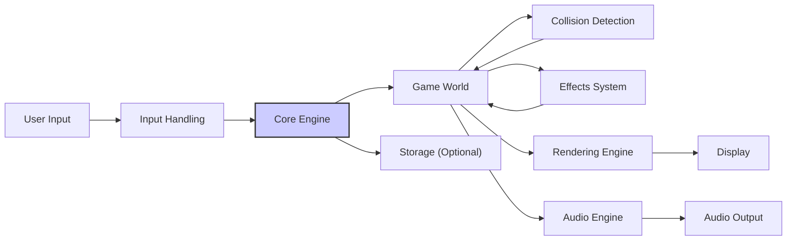

# Project Design Document: Flame Engine

**Version:** 1.1
**Date:** October 26, 2023
**Prepared By:** Gemini (AI Language Model)

## 1. Introduction

This document provides a detailed design overview of the Flame Engine, an open-source, modular 2D game engine built on top of Flutter. It serves as a reference for understanding the engine's architecture, components, and data flow, specifically for the purpose of conducting threat modeling. This document outlines the key elements of the engine to identify potential security vulnerabilities and risks.

### 1.1. Purpose

The primary purpose of this document is to provide a comprehensive architectural description of the Flame Engine to facilitate effective threat modeling activities. This document will be used to:

*   Identify core components and their interactions within the engine.
*   Understand the flow of data through the engine's various modules.
*   Highlight potential areas of security concern based on the design.
*   Serve as a foundational document for developing security requirements and mitigation strategies.

### 1.2. Scope

This document covers the core architectural design of the Flame Engine. It includes:

*   A high-level overview of the engine's structure and design principles.
*   Detailed descriptions of major components and their respective responsibilities.
*   Illustrations of data flow and interactions between components.
*   Initial security considerations identified based on the current design.

This document does not cover:

*   Fine-grained implementation details of individual classes or functions within the engine.
*   Specific security vulnerabilities or known exploits targeting the engine.
*   Detailed mitigation strategies or security controls to address identified threats.
*   Deployment specifics of individual games built using the Flame Engine.

### 1.3. Target Audience

This document is intended for:

*   Security architects and engineers responsible for threat modeling the Flame Engine.
*   Developers contributing to the development and maintenance of the Flame Engine.
*   Individuals seeking a comprehensive understanding of the Flame Engine's internal workings from a security perspective.

## 2. Overview

The Flame Engine is a modular 2D game engine designed for the Flutter ecosystem. Its primary goal is to provide a robust and user-friendly set of tools and functionalities for developing 2D games across various platforms supported by Flutter (iOS, Android, Web, Desktop). The engine emphasizes a component-based architecture, promoting code reusability and maintainability by allowing game entities to be composed of independent, functional components.

## 3. Architectural Design

The Flame Engine's architecture is structured around several key components that collaborate to provide the necessary functionalities for game development.

### 3.1. Key Components

*   **Core Engine:** The central component responsible for managing the game loop, handling time progression, and overseeing the overall game lifecycle. It orchestrates the interactions between other components.
*   **Game World:** Represents the dynamic environment of the game, containing all active game objects (entities) and their current states. It acts as a container and manager for game entities.
*   **Components System:** A core design principle of Flame. This system allows developers to attach reusable behaviors and data structures (components) to game entities, enabling a flexible and composable approach to game object design.
*   **Rendering Engine:**  Manages the visual presentation of the game. It takes the current state of the `Game World` and renders it to the screen using Flutter's rendering capabilities. This includes handling sprites, animations, and visual effects.
*   **Input Handling:**  Responsible for capturing and processing user input from various sources, such as touch events, keyboard input, and mouse interactions. It translates these raw inputs into actions within the game.
*   **Audio Engine:**  Handles the playback of sound effects and background music within the game. It provides functionalities for loading, playing, pausing, and controlling audio assets.
*   **Collision Detection:** Provides mechanisms for detecting when game objects in the `Game World` overlap or interact. This is crucial for implementing game mechanics and interactions.
*   **Effects System:**  Allows for the creation and management of visual effects, such as particle systems, lighting effects, and other visual enhancements that add dynamism to the game.
*   **UI System (Overlays):** Enables the creation and management of user interface elements that are displayed on top of the game scene. This includes buttons, menus, and other interactive UI elements.
*   **Networking (Optional Modules):** Provides functionalities for implementing multiplayer features and communication with external services. This is often implemented as separate modules or extensions to the core engine.
*   **Storage (Local Persistence):** Allows games to save and load game state, player progress, and other persistent data locally on the user's device.
*   **Tiled Support:** Integrates with the Tiled map editor, allowing developers to create and render tile-based game levels within the engine.

### 3.2. Component Relationships

The following diagram illustrates the high-level relationships and dependencies between the key components of the Flame Engine.

```mermaid
graph LR
    subgraph "Flame Engine"
        direction LR
        C["Core Engine"] --> GW["Game World"]
        C --> RE["Rendering Engine"]
        C --> IH["Input Handling"]
        C --> AE["Audio Engine"]
        GW --> CS["Components System"]
        GW --> CD["Collision Detection"]
        GW --> ES["Effects System"]
        GW --> UI["UI System (Overlays)"]
        optional N["Networking (Optional)"]
        optional S["Storage (Local Persistence)"]
        optional T["Tiled Support"]
        GW --> N
        GW --> S
        RE --> CS
        IH --> GW
        AE --> GW
        CD --> GW
        ES --> GW
        UI --> C
        T --> GW
    end
    style C fill:#f9f,stroke:#333,stroke-width:2px
```

### 3.3. Data Flow

The typical data flow within a Flame game follows a cyclical pattern driven by the game loop.

*   **Input Phase:**
    *   User interaction triggers input events (e.g., touch, key press).
    *   The `Input Handling` component captures these events.
    *   Processed input data is passed to the `Core Engine`.
*   **Update Phase:**
    *   The `Core Engine` advances the game state based on elapsed time.
    *   Input data is used to update the `Game World`, potentially modifying the state of game entities and their components.
    *   The `Collision Detection` component checks for interactions between entities in the `Game World`.
    *   Based on collisions and game logic, the `Effects System` might be triggered to create visual effects.
    *   Components attached to entities in the `Game World` execute their logic, further updating the game state.
*   **Render Phase:**
    *   The `Rendering Engine` receives the current state of the `Game World`.
    *   It renders the visual elements of the game (sprites, animations, UI) onto the screen using Flutter's rendering pipeline.
*   **Audio Phase:**
    *   The `Audio Engine` plays relevant sound effects and music based on events and the current game state.
*   **Persistence (Optional):**
    *   At specific points, or when the game is closed, the `Storage` component can be used to save the current game state to local storage.



## 4. Security Considerations

Based on the architectural design of the Flame Engine, several potential security considerations need to be addressed:

*   **Input Handling Vulnerabilities:**
    *   Susceptibility to buffer overflows or injection attacks through malformed or excessively long input strings.
    *   Exposure to denial-of-service (DoS) attacks by flooding the input system with events.
    *   Potential for exploits if input handling logic is not carefully implemented and validated.
*   **Asset Handling and Integrity:**
    *   Risk of loading and executing malicious code embedded within game assets (e.g., images, audio files).
    *   Vulnerability to path traversal attacks if asset loading mechanisms do not properly sanitize file paths.
    *   Potential for unauthorized modification or replacement of game assets, leading to unexpected behavior or cheating.
*   **Networking Security (If Implemented):**
    *   Standard network security concerns such as man-in-the-middle (MITM) attacks, eavesdropping, and data tampering if communication is not properly secured (e.g., using HTTPS).
    *   Vulnerabilities related to authentication and authorization of players in multiplayer games.
    *   Risk of denial-of-service attacks targeting the game server or client.
*   **Local Storage Security:**
    *   Potential for unauthorized access or modification of saved game data, leading to cheating or data breaches if sensitive information is stored insecurely.
    *   Risk of data corruption if storage mechanisms are not robust.
*   **Dependency Vulnerabilities:**
    *   The engine's reliance on Flutter and other Dart packages introduces potential vulnerabilities if these dependencies have known security flaws. Regular updates and security audits of dependencies are crucial.
*   **Game Logic Exploits:**
    *   Bugs or flaws in the game logic implemented using the `Components System` can be exploited by players to gain unfair advantages or cause unintended consequences.
*   **UI Security (Especially in Web Deployments):**
    *   If the game is deployed on the web, the `UI System` might be vulnerable to common web security issues like cross-site scripting (XSS) if it interacts with external data or services without proper sanitization.
*   **Third-Party Library Risks:**
    *   If the engine integrates with third-party libraries for specific functionalities, the security posture of these libraries needs to be carefully evaluated.

## 5. Dependencies

The Flame Engine relies on the following key technologies and libraries:

*   **Flutter Framework:** Provides the foundation for UI rendering, platform integration, and the overall development framework.
*   **Dart Programming Language:** The primary programming language used for developing the Flame Engine.
*   **Pub Packages (Dart Packages):** The engine leverages various community-developed Dart packages for functionalities such as:
    *   Audio processing and playback.
    *   Networking capabilities.
    *   Image manipulation and loading.
    *   State management.
    *   Other utility functions.

## 6. Deployment

Games developed with the Flame Engine are deployed as standard Flutter applications. This allows them to be deployed across a wide range of platforms supported by Flutter:

*   **Mobile:** iOS and Android platforms.
*   **Web:**  Through Flutter's web support, enabling browser-based games.
*   **Desktop:** Windows, macOS, and Linux operating systems.

The deployment process involves building the Flutter application for the target platform, which bundles the compiled Flame Engine code, game assets, and the Flutter runtime.

## 7. Future Considerations

As the Flame Engine continues to evolve, new features and functionalities may introduce new security considerations. Potential future areas to consider from a security perspective include:

*   **Scripting Language Integration:** If support for scripting languages is added, security measures to prevent the execution of malicious scripts will be necessary.
*   **Plugin or Extension System:**  If a plugin system is introduced, the security of third-party plugins and their potential impact on the engine's integrity will need to be addressed.
*   **Advanced Networking Features:**  More complex networking features, such as real-time multiplayer interactions, will require robust security protocols and considerations.
*   **In-App Purchases and Monetization:**  If the engine integrates with in-app purchase systems, secure handling of transactions and user data will be critical.

This document provides a comprehensive overview of the Flame Engine's architecture for the purpose of threat modeling. Further detailed analysis and investigation will be required to identify specific vulnerabilities and develop appropriate mitigation strategies.