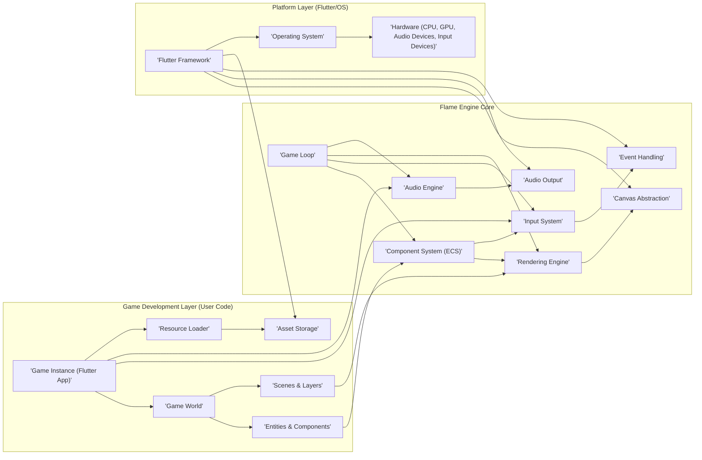

# Flame Engine Project Design Document for Threat Modeling

**Version:** 1.1
**Date:** October 26, 2023
**Author:** AI Software Architecture Expert

## 1. Introduction

This document provides an enhanced and detailed design overview of the Flame Engine project, an open-source 2D game engine built with Flutter. This document is intended to serve as a robust foundation for subsequent threat modeling activities. It meticulously outlines the system's architecture, key components, data flow, and technology stack to facilitate the comprehensive identification and mitigation of potential security vulnerabilities within the *engine itself*.  This document focuses on the core engine architecture and common use cases, not on specific games built with Flame.

## 2. Project Overview

**Project Name:** Flame Engine
**Project Repository:** [https://github.com/flame-engine/flame](https://github.com/flame-engine/flame)
**Project Description:** Flame is a highly modular 2D game engine for Flutter, providing a rich and versatile set of tools and components to build games efficiently and rapidly. It is designed to be a comprehensive engine covering a wide spectrum of game development needs, including advanced rendering, complex animation, robust input handling, integrated audio, and sophisticated game logic management.

**Target Audience:** Game developers, particularly those proficient in Flutter and Dart, ranging from hobbyists to professional teams.

**Key Features:**

*   **Flutter-based Cross-Platform:**  Leverages the inherent cross-platform capabilities of Flutter, enabling games to be deployed across a multitude of platforms (mobile, web, desktop) from a single codebase.
*   **Entity-Component-System (ECS) Inspired Architecture:** Employs a flexible and reusable component-based architecture inspired by ECS principles, promoting modularity and maintainability in game logic.
*   **Advanced Rendering System:** Provides a powerful suite of tools for rendering diverse visual elements, including sprites, sprite sheets, animations, particle effects, tile maps, and vector graphics.
*   **Comprehensive Input Handling:**  Manages a wide range of user input methods, including multi-touch, mouse, keyboard, and gamepads, with customizable input mapping and event processing.
*   **Integrated Audio System:**  Offers seamless audio playback and management capabilities, supporting sound effects, background music, positional audio, and audio effects.
*   **Collision Detection and Physics:**  Provides robust collision detection mechanisms and optional physics engine integrations for realistic game object interactions.
*   **Efficient Game Loop Management:**  Handles the core game loop with optimized frame updates, time management, and frame rate control, ensuring smooth and consistent gameplay.
*   **Highly Modular Design:**  Adopts a modular architecture allowing developers to selectively use only the necessary engine modules, resulting in smaller build sizes and enhanced customization.
*   **Open Source and Community-Driven:**  Benefits from community-driven development, transparency, and continuous improvement through open contributions and feedback.

## 3. Architecture Overview

Flame Engine is designed with a modular and layered architecture to promote flexibility and maintainability. The core engine provides essential functionalities, while optional modules extend its capabilities for specific game development needs. Games developed using Flame Engine are fundamentally Flutter applications that integrate and utilize the engine's components.

### 3.1. High-Level Architecture Diagram

### 3.2. Architecture Description

*   **Platform Layer (Flutter/OS):** This layer provides the foundational services upon which Flame Engine is built.
    *   **"'Flutter Framework'"**: The core Flutter framework provides cross-platform abstraction, UI rendering, widget management, event handling, and asset management. Flame Engine is implemented as a Flutter package, deeply integrated with the framework.
    *   **"'Operating System'"**: The underlying operating system (e.g., Android, iOS, Web Browser, Windows, macOS, Linux) provides system-level services, resource management, and hardware access.
    *   **"'Hardware (CPU, GPU, Audio Devices, Input Devices)'"**: The physical hardware components that execute the game, including processors, graphics processing units, audio output devices, and input peripherals.

*   **Flame Engine Core:** This layer contains the fundamental engine functionalities, independent of specific game logic.
    *   **"'Game Loop'"**: The central orchestrator of the engine, responsible for managing the game's execution cycle. It controls the timing of updates, rendering, and input processing, aiming for a consistent frame rate. It drives the entire engine operation.
    *   **"'Component System (ECS)'"**: An Entity-Component-System inspired architecture that forms the backbone of game logic organization.
        *   **Entities:** Lightweight identifiers representing game objects. They are essentially containers for components.
        *   **Components:** Data-centric modules that define specific attributes and behaviors of entities (e.g., `'PositionComponent'`, `'SpriteComponent'`, `'VelocityComponent'`, `'HealthComponent'`).
        *   **Systems:** Logic processors that operate on entities possessing specific combinations of components. Systems implement game rules and behaviors by manipulating component data (e.g., rendering system, movement system, collision system).
    *   **"'Input System'"**:  Manages all forms of user input, abstracting platform-specific input events. It processes raw input from various sources (touch, mouse, keyboard, gamepads) and translates them into engine-level input actions that game logic can respond to.
    *   **"'Rendering Engine'"**:  Responsible for all visual aspects of the game. It manages the rendering pipeline, processes rendering components, and utilizes the `'Canvas Abstraction'` to draw game elements efficiently. It handles sprite rendering, animation, particle effects, and more.
    *   **"'Audio Engine'"**: Manages audio playback and sound effects. It handles loading, playing, pausing, and controlling audio assets. It interacts with the platform's `'Audio Output'` for sound delivery.
    *   **"'Canvas Abstraction'"**:  Provides a platform-independent interface for the `'Rendering Engine'` to interact with Flutter's canvas. It simplifies drawing operations and hides platform-specific rendering details, ensuring cross-platform consistency.
    *   **"'Audio Output'"**:  Represents the platform's audio subsystem responsible for delivering audio signals to speakers or headphones.
    *   **"'Event Handling'"**:  Manages internal engine events and input events, providing a mechanism for different parts of the engine and game logic to communicate and react to changes.

*   **Game Development Layer (User Code):** This layer represents the game-specific code written by developers using the Flame Engine.
    *   **"'Game Instance (Flutter App)'"**: The main Flutter application that embodies the game. It initializes the Flame Engine, sets up the game world, and manages the overall game lifecycle.
    *   **"'Game World'"**: Represents the game environment and manages the active game state. It typically contains scenes, layers, and entities.
    *   **"'Entities & Components'"**: Game developers define specific entities and attach components to them to create game objects and implement game-specific logic, leveraging the ECS architecture provided by the engine.
    *   **"'Scenes & Layers'"**:  Organize game content into logical units. Scenes represent distinct game states (e.g., main menu, gameplay level), and layers within scenes control rendering order and visual organization.
    *   **"'Resource Loader'"**:  Handles the loading of game assets from `'Asset Storage'`. It provides asynchronous loading capabilities and asset caching.
    *   **"'Asset Storage'"**:  Stores game assets. In Flutter, this primarily refers to the application's asset bundle, which is packaged with the application. It can also potentially include access to local file storage or (less commonly for core assets) remote resources.

## 4. Data Flow

Data flows through the Flame Engine in a continuous cycle, primarily driven by the `'Game Loop'`. Understanding these data flows is crucial for threat modeling.

1.  **Input Data Flow (User Interaction to Game State):**
    *   User actions (touch, mouse, keyboard input) are captured by `'Input Devices'` and initially processed by the `'Operating System'`.
    *   The `'Flutter Framework'` receives these raw input events and forwards them to the `'Input System'` within the Flame Engine Core.
    *   The `'Input System'` interprets and translates raw input into game-relevant input events (e.g., button presses, touch gestures, mouse movements). These events are then dispatched to the `'Game Instance'` and made available to `'Systems'` within the `'Component System'`.
    *   Game logic, implemented within `'Components'` and `'Systems'`, reacts to these input events, modifying the game state (e.g., changing entity positions, triggering actions, updating game variables).

2.  **Game State Update Data Flow (Logic and Simulation):**
    *   The `'Game Loop'` initiates game state updates at regular intervals.
    *   Within the `'Component System'`, `'Systems'` iterate through relevant entities and their components.
    *   Based on game logic, elapsed time, and potentially input events, `'Systems'` process component data, updating the game state. This includes calculations for movement, physics simulations, AI behavior, and other game mechanics.
    *   Modified component data represents the updated game state, ready for rendering and further processing.

3.  **Rendering Data Flow (Game State to Visual Output):**
    *   The `'Game Loop'` triggers the `'Rendering Engine'` to render the current game frame.
    *   The `'Rendering Engine'` traverses entities that possess rendering-related components (e.g., `'SpriteComponent'`, `'TextComponent'`, `'AnimatedSpriteComponent'`).
    *   For each renderable entity, the `'Rendering Engine'` retrieves component data (e.g., position, sprite image, animation frame, text string, color).
    *   Using this data, the `'Rendering Engine'` generates rendering commands and utilizes the `'Canvas Abstraction'` to draw the visual elements onto the Flutter canvas.
    *   The `'Flutter Framework'` then renders the canvas to the screen via the `'GPU'` and the `'Operating System'`, resulting in the visual output displayed to the user.

4.  **Audio Data Flow (Game Events to Sound Output):**
    *   Game logic (within `'Components'`, `'Systems'`, or directly in the `'Game Instance'`) can trigger audio events (e.g., playing a sound effect, starting background music).
    *   These audio events are received by the `'Audio Engine'`.
    *   The `'Audio Engine'` manages audio asset playback, applying volume, panning, and other audio effects as needed.
    *   The `'Audio Engine'` sends processed audio data to the `'Audio Output'` of the platform.
    *   The `'Operating System'` and `'Audio Devices'` handle the final stage of audio processing and output through speakers or headphones.

5.  **Asset Loading Data Flow (Storage to Engine):**
    *   When the `'Game Instance'` or `'Component System'` requires game assets (images, audio files, fonts, data files), it requests them through the `'Resource Loader'`.
    *   The `'Resource Loader'` locates and retrieves the requested assets from the `'Asset Storage'` (typically Flutter's asset bundle).
    *   The `'Resource Loader'` may perform asset decoding or processing (e.g., image decoding, audio format conversion).
    *   Loaded and processed assets are then provided to the requesting components or game logic, making them available for rendering, audio playback, or game data processing.

## 5. Technology Stack

*   **Programming Language:** Dart (primary language for Flame Engine and Flutter)
*   **Framework:** Flutter (UI framework and platform abstraction layer)
*   **Rendering API (Abstracted by Flutter):** Skia Graphics Engine (typically, but can vary depending on the target platform and Flutter's rendering backend)
*   **Audio Libraries (Abstracted by Flutter):** Platform-specific audio APIs (e.g., OpenAL, platform media APIs)
*   **Build System:** Flutter build system (based on Gradle for Android, Xcode for iOS, CMake for desktop, etc.)
*   **Dependency Management:** pub.dev (Dart package package manager)
*   **Version Control:** Git (hosted on GitHub)
*   **Operating Systems (Target Platforms):** Android, iOS, Web (HTML5 Canvas and WebGL), Windows, macOS, Linux (leveraging Flutter's platform support)

## 6. Key Components - Detailed Description (Security Focus)

This section provides a more detailed examination of key components, specifically focusing on their security implications and potential vulnerabilities.

### 6.1. Resource Loader and Asset Storage

*   **Functionality:**  The `'Resource Loader'` manages the process of loading game assets from `'Asset Storage'`. This includes images, audio, fonts, and potentially game data files (JSON, etc.). `'Asset Storage'` is typically the application's asset bundle, packaged within the application.
*   **Security Relevance:**
    *   **Asset Integrity and Authenticity:** Ensuring that loaded assets are genuine and have not been tampered with. Malicious asset replacement could lead to game compromise.
    *   **Asset Poisoning:**  If assets are loaded from external or untrusted sources (less common but possible), there's a risk of loading malicious assets designed to exploit vulnerabilities or inject malicious code.
    *   **Unauthorized Asset Access:**  While Flutter's asset system restricts access to the asset bundle, vulnerabilities in the `'Resource Loader'` or underlying Flutter framework could potentially allow unauthorized access to or modification of assets.
    *   **Path Traversal Vulnerabilities (Mitigated by Flutter):**  If asset paths are dynamically constructed, there's a theoretical risk of path traversal attacks to access files outside the intended asset directory. Flutter's asset system is designed to mitigate this, but careful code review is still advisable if dynamic asset paths are used.
    *   **Denial of Service (DoS) via Resource Exhaustion:** Loading excessively large or numerous assets, especially if triggered maliciously, could lead to memory exhaustion, performance degradation, or application crashes, resulting in a denial of service.

### 6.2. Input System

*   **Functionality:** The `'Input System'` handles all user input events, translating raw input into game actions. It provides mechanisms for game logic to react to user interactions.
*   **Security Relevance:**
    *   **Input Validation and Sanitization (Limited Relevance in Typical Games):** While less critical than in web applications, improper handling of input events could lead to unexpected behavior or exploits in game logic if input is not processed robustly.
    *   **Input Injection:**  In scenarios where input is processed and used to construct commands or data structures, vulnerabilities could arise if input is not properly sanitized, potentially leading to injection attacks (though less likely in typical game contexts).
    *   **Denial of Service (Input Flooding):**  Maliciously sending a flood of input events could potentially overwhelm the game's input processing pipeline, leading to performance degradation or crashes (DoS).
    *   **Replay Attacks:**  If input events are logged or captured, they could potentially be replayed to gain unfair advantages or exploit game mechanics, especially in networked games (though input replay is more of a game design/anti-cheat concern).
    *   **Game Logic Exploits via Input Manipulation:**  Exploiting vulnerabilities in how input is processed and how game logic reacts to specific input sequences could allow players to bypass intended game mechanics, trigger unintended actions, or gain unfair advantages.

### 6.3. Component System (ECS) and Game Logic

*   **Functionality:** The `'Component System (ECS)'` provides the architectural framework for organizing game logic. `'Components'` store data, and `'Systems'` process components to implement game behaviors and rules. Game logic is primarily implemented within `'Systems'` and `'Components'`.
*   **Security Relevance:**
    *   **Logic Bugs as Exploits:**  Bugs or flaws in game logic implemented within `'Systems'` and `'Components'` can be exploited by players to cheat, break the game, or cause unintended behavior. These logic flaws are often the primary source of game exploits.
    *   **State Manipulation and Data Corruption:**  If game state (stored in `'Components'`) is not properly managed, validated, or protected, it could be manipulated in unintended ways, leading to exploits, cheating, or game instability. Data corruption in components could have cascading effects.
    *   **Data Integrity and Consistency:** Ensuring the integrity and consistency of game state data within `'Components'` is crucial for preventing exploits and maintaining game fairness and stability. Inconsistent or invalid component data can lead to unpredictable and exploitable behavior.
    *   **System Interactions and Race Conditions:**  Complex interactions between different `'Systems'` could potentially introduce race conditions or unexpected side effects that could be exploited. Careful design and testing are needed to prevent such issues.

### 6.4. Networking (Optional - Engine Core is Platform Agnostic, but Games May Use It)

*   **Functionality:** While the Flame Engine core is network-agnostic, games built with Flame Engine often incorporate networking for multiplayer features, online leaderboards, or other online services. Networking functionality would be implemented in the "Game Development Layer" using Flutter's networking capabilities or external networking libraries.
*   **Security Relevance (If Networking is Implemented in Games):**
    *   **Standard Network Security Threats:** All common network security concerns become relevant: authentication, authorization, data encryption (TLS/SSL), injection attacks (SQL injection if databases are involved, command injection if server-side processing is vulnerable), denial of service (DDoS), man-in-the-middle attacks, etc.
    *   **Game-Specific Network Exploits:**  Exploiting vulnerabilities in game networking protocols, server-side game logic, or client-server communication to cheat, gain unfair advantages, manipulate game state on the server, or disrupt gameplay for other players.
    *   **Cheating and Anti-Cheat Measures:**  Networked games are susceptible to cheating. Security measures and anti-cheat mechanisms are essential to maintain fair gameplay.
    *   **Session Hijacking and Impersonation:**  Vulnerabilities in session management or authentication could allow attackers to hijack player sessions or impersonate other players.
    *   **Data Serialization/Deserialization Vulnerabilities:**  Vulnerabilities in how game data is serialized and deserialized for network transmission could be exploited to inject malicious data or cause buffer overflows or other memory corruption issues.

## 7. Security Considerations and Potential Threat Areas (Actionable for Threat Modeling)

This section outlines key security considerations and potential threat areas, providing a starting point for a more detailed threat modeling exercise.

*   **Asset Loading and Management:**
    *   **Threat:** Malicious Asset Injection/Replacement.
    *   **Vulnerability:** Lack of asset integrity checks, loading assets from untrusted sources.
    *   **Potential Impact:** Game compromise, malicious code execution (if asset processing vulnerabilities exist).
    *   **Threat:** Denial of Service via Resource Exhaustion.
    *   **Vulnerability:** Unbounded asset loading, large asset sizes.
    *   **Potential Impact:** Game crashes, performance degradation, denial of service.

*   **Input Handling:**
    *   **Threat:** Input Flooding Denial of Service.
    *   **Vulnerability:** Inefficient input processing, lack of input rate limiting.
    *   **Potential Impact:** Game performance degradation, crashes, denial of service.
    *   **Threat:** Game Logic Exploits via Input Manipulation.
    *   **Vulnerability:** Logic flaws in input processing, predictable input handling.
    *   **Potential Impact:** Cheating, bypassing game mechanics, unintended game behavior.

*   **Component System (ECS) and Game Logic:**
    *   **Threat:** Logic Bugs Exploited for Cheating/Game Breaking.
    *   **Vulnerability:** Flaws in game logic within Systems and Components.
    *   **Potential Impact:** Cheating, unfair advantages, game instability, unintended game behavior.
    *   **Threat:** Game State Manipulation/Data Corruption.
    *   **Vulnerability:** Lack of data validation, improper state management in Components.
    *   **Potential Impact:** Cheating, game instability, unpredictable behavior, exploits.
    *   **Threat:** Race Conditions and System Interaction Issues.
    *   **Vulnerability:** Concurrency issues in System processing, complex system interactions.
    *   **Potential Impact:** Unpredictable game behavior, potential exploits, game instability.

*   **Networking (If Implemented in Games):**
    *   **Threat:** Network Exploits and Cheating in Multiplayer.
    *   **Vulnerability:** Weak network protocols, server-side logic vulnerabilities, lack of anti-cheat measures.
    *   **Potential Impact:** Unfair gameplay, cheating, game disruption, player dissatisfaction.
    *   **Threat:** Session Hijacking and Impersonation.
    *   **Vulnerability:** Weak authentication, insecure session management.
    *   **Potential Impact:** Account compromise, unauthorized access, cheating, griefing.
    *   **Threat:** Data Injection and Manipulation via Network.
    *   **Vulnerability:** Lack of input validation on network data, insecure serialization/deserialization.
    *   **Potential Impact:** Cheating, game state corruption, potential remote code execution (less likely but possible depending on vulnerabilities).
    *   **Threat:** Denial of Service (DDoS) against Game Servers.
    *   **Vulnerability:** Server infrastructure vulnerabilities, lack of DDoS protection.
    *   **Potential Impact:** Game server downtime, disruption of online gameplay.

## 8. Diagrams (Mermaid Syntax)

This improved document provides a more in-depth and security-focused design overview of the Flame Engine project. It is now better equipped to serve as a solid foundation for conducting comprehensive threat modeling activities, enabling the proactive identification and mitigation of potential security vulnerabilities within the engine and games built using it. The next step is to use this document to perform detailed threat modeling, using methodologies like STRIDE or PASTA, to systematically analyze each component and data flow for specific threats and vulnerabilities.