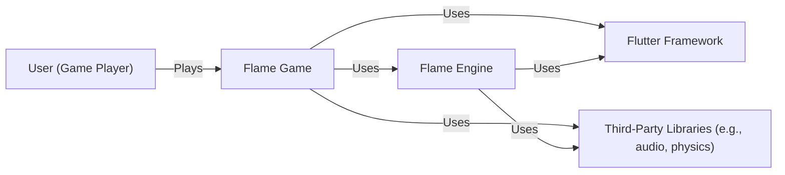
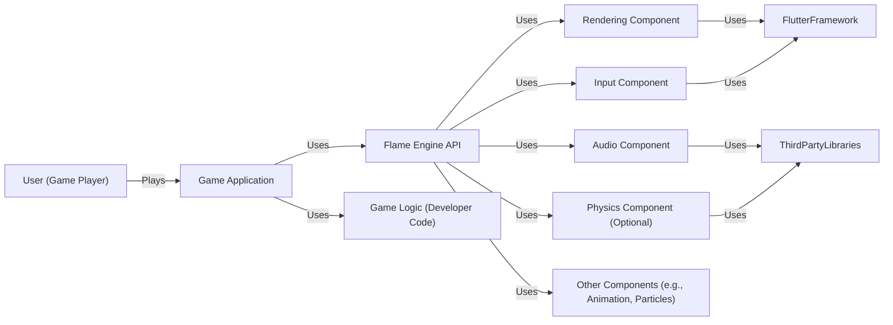
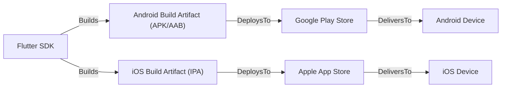
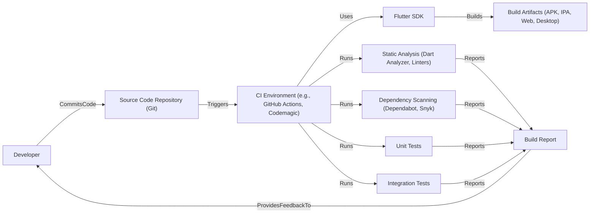

Okay, let's create a design document for the Flame game engine, focusing on aspects relevant for threat modeling.

# BUSINESS POSTURE

Flame is an open-source game engine built on top of Flutter.  This suggests a community-driven development model, prioritizing ease of use, rapid development, and cross-platform compatibility.  The primary goal is likely to empower developers (especially those already familiar with Flutter) to create 2D games efficiently.  The project's success hinges on adoption and contribution by the community.

Business Priorities:

*   Ease of Use:  Attract developers by providing a simple, intuitive API and clear documentation.
*   Cross-Platform Compatibility:  Enable game deployment to a wide range of platforms (mobile, web, desktop).
*   Performance:  Ensure the engine can handle the demands of 2D game development without performance bottlenecks.
*   Community Growth:  Foster a vibrant and active community of users and contributors.
*   Extensibility: Allow developers to easily extend the engine's functionality.

Business Risks:

*   Lack of Adoption:  If the engine fails to attract a sufficient user base, development may stall.
*   Security Vulnerabilities:  Vulnerabilities in the engine could be exploited in games built with it, potentially harming players and damaging the reputation of Flame and Flutter.
*   Performance Issues:  Poor performance could limit the complexity of games that can be created, making the engine less attractive.
*   Fragmentation:  Lack of consistent development practices or a poorly managed community could lead to fragmentation and incompatibility issues.
*   Dependency Risks: Reliance on Flutter and other third-party libraries introduces risks related to the security and stability of those dependencies.

# SECURITY POSTURE

The provided GitHub repository offers limited explicit information about security controls. We must infer based on the nature of the project (an open-source game engine built on Flutter) and common best practices.

Existing Security Controls:

*   security control: Open Source: The code is publicly available, allowing for community scrutiny and contributions to security improvements. (Described in the GitHub repository).
*   security control: Dependency Management: Flame uses pubspec.yaml to manage dependencies, allowing for version pinning and updates. (Described in the GitHub repository, file pubspec.yaml).
*   security control: Flutter Framework Security: Flame inherits some security features from the underlying Flutter framework, such as its rendering pipeline and memory management. (Described in Flutter documentation).
*   security control: Code Reviews: While not explicitly stated, it's highly likely that pull requests undergo code review before being merged. (Inferred from standard open-source practices).

Accepted Risks:

*   accepted risk: Third-Party Dependency Vulnerabilities: Flame relies on external packages, and vulnerabilities in these packages could impact the engine's security.
*   accepted risk: User-Generated Content Risks: Games built with Flame may handle user-generated content, which introduces risks of injection attacks, cross-site scripting (XSS), and other content-related vulnerabilities. This is primarily the responsibility of game developers using Flame, but the engine should provide tools to mitigate these risks.
*   accepted risk: Limited Formal Security Audits: As an open-source project, it's unlikely that Flame undergoes regular, formal security audits.

Recommended Security Controls:

*   security control: Static Analysis: Integrate static analysis tools (e.g., Dart analyzer, linters) into the development workflow to identify potential security issues early.
*   security control: Dependency Scanning: Regularly scan dependencies for known vulnerabilities using tools like Dependabot or Snyk.
*   security control: Security Documentation: Provide clear documentation on security best practices for game developers using Flame, including guidance on handling user input, managing data, and securing network communication.
*   security control: Fuzz Testing: Consider implementing fuzz testing to identify unexpected behavior and potential vulnerabilities in the engine's core components.

Security Requirements:

*   Authentication: Flame itself, as a game engine, does not directly handle user authentication. This is the responsibility of individual games built with Flame. However, the engine should provide mechanisms or guidance for securely integrating with authentication services if needed.
*   Authorization: Similar to authentication, authorization is typically handled at the game level. Flame should provide tools or guidance for implementing role-based access control or other authorization schemes within games.
*   Input Validation: Flame should provide robust input validation mechanisms to prevent common injection attacks. This includes validating user input from keyboards, touchscreens, gamepads, and other input sources. The engine should also provide guidance for game developers on how to securely handle user-generated content.
*   Cryptography: Flame should provide access to cryptographic primitives (e.g., hashing, encryption) for use cases such as secure data storage, secure communication, and digital signatures. The engine should use secure, well-vetted cryptographic libraries.

# DESIGN

## C4 CONTEXT

Element Descriptions:

*   Element:
    *   Name: User (Game Player)
    *   Type: Person
    *   Description: The end-user who plays games built with the Flame engine.
    *   Responsibilities: Interacts with the game.
    *   Security controls: N/A (External to the system)

*   Element:
    *   Name: Flame Game
    *   Type: Software System
    *   Description: A game created using the Flame engine.
    *   Responsibilities: Provides game logic, user interface, and gameplay.
    *   Security controls: Input validation, output encoding, secure handling of user data, implementation of authentication and authorization (if applicable).

*   Element:
    *   Name: Flame Engine
    *   Type: Software System
    *   Description: The core game engine providing functionalities for game development.
    *   Responsibilities: Provides components for rendering, input handling, collision detection, animation, audio, etc.
    *   Security controls: Secure coding practices, dependency management, input validation, regular security reviews.

*   Element:
    *   Name: Flutter Framework
    *   Type: Software System
    *   Description: The underlying UI toolkit used by Flame.
    *   Responsibilities: Provides rendering, layout, and platform-specific integrations.
    *   Security controls: Relies on Flutter's built-in security features and regular updates.

*   Element:
    *   Name: Third-Party Libraries
    *   Type: Software System
    *   Description: External libraries used by Flame or individual games (e.g., for audio, physics).
    *   Responsibilities: Provide specific functionalities not covered by Flame or Flutter.
    *   Security controls: Dependency scanning, regular updates, careful selection of reputable libraries.

## C4 CONTAINER

Element Descriptions:

*   Element:
    *   Name: User (Game Player)
    *   Type: Person
    *   Description: The end-user who plays the game.
    *   Responsibilities: Interacts with the game.
    *   Security controls: N/A (External to the system)

*   Element:
    *   Name: Game Application
    *   Type: Container (Mobile App, Web App, Desktop App)
    *   Description: The compiled game executable.
    *   Responsibilities: Runs the game, handles user interaction, and manages game state.
    *   Security controls: Depends on the platform and deployment method (e.g., code signing, sandboxing).

*   Element:
    *   Name: Flame Engine API
    *   Type: Container (Library/Module)
    *   Description: The public interface of the Flame engine.
    *   Responsibilities: Provides access to engine functionalities for game developers.
    *   Security controls: API design should follow secure coding principles, input validation.

*   Element:
    *   Name: Game Logic (Developer Code)
    *   Type: Container (Code/Scripts)
    *   Description: The code written by the game developer using the Flame Engine API.
    *   Responsibilities: Implements the specific game rules, mechanics, and content.
    *   Security controls: Developer's responsibility to implement secure coding practices, input validation, and data handling.

*   Element:
    *   Name: Rendering Component
    *   Type: Container (Library/Module)
    *   Description: Handles rendering of game elements to the screen.
    *   Responsibilities: Manages graphics, sprites, animations, and visual effects.
    *   Security controls: Relies on Flutter's rendering pipeline, potential vulnerabilities related to image processing.

*   Element:
    *   Name: Input Component
    *   Type: Container (Library/Module)
    *   Description: Processes user input from various sources.
    *   Responsibilities: Handles keyboard, mouse, touch, and gamepad input.
    *   Security controls: Input validation, sanitization, prevention of injection attacks.

*   Element:
    *   Name: Audio Component
    *   Type: Container (Library/Module)
    *   Description: Manages audio playback and effects.
    *   Responsibilities: Plays music, sound effects, and handles audio mixing.
    *   Security controls: Potential vulnerabilities related to audio file parsing, secure handling of audio buffers.

*   Element:
    *   Name: Physics Component (Optional)
    *   Type: Container (Library/Module)
    *   Description: Provides physics simulation (if used).
    *   Responsibilities: Handles collision detection, physics calculations, and object movement.
    *   Security controls: Depends on the specific physics engine used (e.g., Box2D, Forge2D), potential vulnerabilities related to physics calculations and data handling.

*   Element:
    *   Name: Other Components (e.g., Animation, Particles)
    *   Type: Container (Library/Module)
    *   Description: Other modules within the Flame engine.
    *   Responsibilities: Provide additional functionalities for game development.
    *   Security controls: Depends on the specific component, secure coding practices, input validation.

*   Element:
    *   Name: FlutterFramework
    *   Type: Software System
    *   Description: The underlying UI toolkit used by Flame.
    *   Responsibilities: Provides rendering, layout, and platform-specific integrations.
    *   Security controls: Relies on Flutter's built-in security features and regular updates.

*   Element:
    *   Name: ThirdPartyLibraries
    *   Type: Software System
    *   Description: External libraries used by Flame or individual games (e.g., for audio, physics).
    *   Responsibilities: Provide specific functionalities not covered by Flame or Flutter.
    *   Security controls: Dependency scanning, regular updates, careful selection of reputable libraries.

## DEPLOYMENT

Flame games, being built on Flutter, can be deployed to multiple platforms.  We'll focus on a common scenario: deploying to Android and iOS.

Possible Deployment Solutions:

1.  **Android:**  APK or App Bundle generated via Flutter build tools, distributed through the Google Play Store or sideloaded.
2.  **iOS:** IPA file generated via Flutter build tools, distributed through the Apple App Store or TestFlight.
3.  **Web:**  Compiled to JavaScript and WebAssembly, hosted on a web server.
4.  **Desktop (Windows, macOS, Linux):**  Compiled to native executables, distributed through platform-specific stores or directly.

Chosen Solution (Android and iOS):

Element Descriptions:

*   Element:
    *   Name: Flutter SDK
    *   Type: Tooling
    *   Description: The Flutter SDK used to build the game for different platforms.
    *   Responsibilities: Compiles the code, manages dependencies, and generates build artifacts.
    *   Security controls: Relies on the security of the Flutter SDK and its build process.

*   Element:
    *   Name: Android Build Artifact (APK/AAB)
    *   Type: Artifact
    *   Description: The compiled game package for Android.
    *   Responsibilities: Contains the game code, assets, and resources.
    *   Security controls: Code signing, ProGuard/R8 obfuscation (optional).

*   Element:
    *   Name: iOS Build Artifact (IPA)
    *   Type: Artifact
    *   Description: The compiled game package for iOS.
    *   Responsibilities: Contains the game code, assets, and resources.
    *   Security controls: Code signing, App Store review process.

*   Element:
    *   Name: Google Play Store
    *   Type: Platform
    *   Description: The distribution platform for Android apps.
    *   Responsibilities: Hosts the game, manages updates, and handles user downloads.
    *   Security controls: Google Play Protect, app review process.

*   Element:
    *   Name: Apple App Store
    *   Type: Platform
    *   Description: The distribution platform for iOS apps.
    *   Responsibilities: Hosts the game, manages updates, and handles user downloads.
    *   Security controls: App Store review process, sandboxing.

*   Element:
    *   Name: Android Device
    *   Type: Device
    *   Description: An Android device running the game.
    *   Responsibilities: Executes the game code.
    *   Security controls: Android operating system security features, sandboxing.

*   Element:
    *   Name: iOS Device
    *   Type: Device
    *   Description: An iOS device running the game.
    *   Responsibilities: Executes the game code.
    *   Security controls: iOS operating system security features, sandboxing.

## BUILD

The build process for Flame games leverages Flutter's build system.

Security Controls in Build Process:

*   Static Analysis:  Dart analyzer and linters are used to identify potential code quality and security issues.
*   Dependency Scanning: Tools like Dependabot or Snyk scan dependencies for known vulnerabilities.
*   Automated Testing: Unit and integration tests help ensure code correctness and can be used to test security-related functionality.
*   CI/CD:  A CI/CD pipeline (e.g., GitHub Actions, Codemagic) automates the build, test, and deployment process, ensuring consistency and reducing manual errors.
*   Code Signing: Build artifacts (APK, IPA) are digitally signed to verify their authenticity and integrity.

# RISK ASSESSMENT

Critical Business Processes:

*   Game Distribution: Ensuring that games can be reliably built and deployed to target platforms.
*   Game Updates: Providing a mechanism for delivering updates and bug fixes to players.
*   Community Engagement: Maintaining a healthy and active community of developers.

Data to Protect:

*   Source Code:  The Flame engine's source code is publicly available, but protecting it from unauthorized modification is important. (Low Sensitivity - Public)
*   Game Assets:  Assets (images, audio, etc.) used in games may have licensing restrictions or represent intellectual property. (Variable Sensitivity - Depends on the game)
*   Player Data:  If games collect any player data (e.g., high scores, progress), this data needs to be protected according to privacy regulations and best practices. (Variable Sensitivity - Depends on the game)
*   Build Artifacts:  Protecting the integrity of build artifacts (APK, IPA) is crucial to prevent malicious code injection. (High Sensitivity)

# QUESTIONS & ASSUMPTIONS

Questions:

*   Are there any specific security certifications or compliance requirements that Flame aims to meet (e.g., for specific game genres or target markets)?
*   What level of support is provided for handling user-generated content within games built with Flame?
*   Are there any plans to integrate with specific backend services (e.g., for multiplayer, leaderboards, analytics)?
*   What is the process for handling security vulnerability reports in the Flame engine?

Assumptions:

*   BUSINESS POSTURE: The primary goal is to create a user-friendly and popular game engine, prioritizing ease of use and community growth over strict security certifications.
*   SECURITY POSTURE: Security is a consideration, but the project relies heavily on community contributions and the inherent security of Flutter. Formal security audits are not a regular occurrence.
*   DESIGN: The design prioritizes modularity and extensibility, allowing developers to customize and extend the engine's functionality. The build process leverages standard Flutter tools and practices.