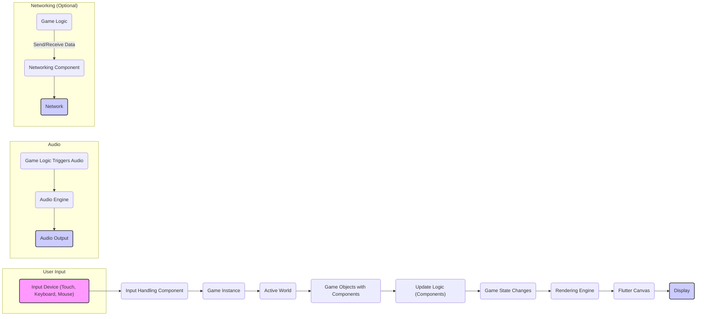

# Project Design Document: Flame Engine

**Version:** 1.1
**Date:** October 26, 2023
**Author:** AI Software Architect

## 1. Introduction

This document provides a detailed design overview of the Flame Engine, an open-source 2D game engine built on top of Flutter. This document elaborates on the engine's architecture, key components, and data flow, providing a robust foundation for subsequent threat modeling activities. This version includes more detailed explanations and refinements based on initial feedback.

## 2. Goals and Objectives

The primary goals of the Flame Engine are to:

*   Provide a comprehensive and well-structured set of tools and abstractions specifically designed for building high-quality 2D games within the Flutter ecosystem.
*   Offer a highly modular and extensible architecture, empowering developers to customize and extend the engine's core functionalities to suit their specific game requirements.
*   Enable efficient and performant rendering, ensuring smooth and engaging gameplay experiences even on resource-constrained devices.
*   Facilitate the seamless integration of fundamental game development concepts, including sprite management, complex animations, robust collision detection systems, and intuitive input handling mechanisms.
*   Foster a thriving and supportive community by providing clear, comprehensive documentation, practical examples, and readily accessible support channels.

## 3. High-Level Architecture

The Flame Engine is built upon a component-based architecture, where distinct modules handle specific aspects of game development. This design leverages Flutter's powerful widget system and its efficient rendering pipeline.

*   **Core Engine:**  Provides the foundational game loop management, robust component management system, and comprehensive lifecycle management for game entities.
*   **Rendering Engine:**  Manages the entire process of drawing game elements on the screen, directly utilizing Flutter's low-level `Canvas` API and rendering primitives for optimal performance.
*   **Input Handling:**  Responsible for capturing and processing user input from diverse sources, including touch interactions, keyboard events, and mouse movements, translating these into actionable game events.
*   **Audio Engine:**  Offers a suite of functionalities for seamless integration and management of sound effects and background music, enhancing the auditory experience of the game.
*   **Collision Detection:**  Provides sophisticated mechanisms for accurately detecting collisions between various game objects, enabling realistic interactions within the game world.
*   **Animation System:**  Enables the creation and precise management of complex animations for sprites and other visual elements, bringing the game to life with dynamic movements.
*   **UI System:**  Facilitates the creation of interactive in-game user interfaces by leveraging the flexibility and power of Flutter's widget system.
*   **Networking (Optional):**  Offers optional tools and abstractions for implementing network functionalities in games, enabling multiplayer experiences and online features.
*   **Tiled Support (Optional):**  Provides optional integration with the popular Tiled map editor, allowing developers to easily create and render complex tile-based game levels.

## 4. Component Details

This section provides a more detailed breakdown of the key components within the Flame Engine and their specific responsibilities.

### 4.1. Core Engine

*   **Game Loop:** The fundamental loop that drives the entire game execution, responsible for orchestrating the update of the game state and the subsequent rendering of the game scene at consistent intervals, ensuring smooth gameplay.
*   **Component System:** A central design pattern where game entities are constructed by composing reusable and independent components. Each component encapsulates specific behaviors, data, and logic, promoting modularity and code reusability.
*   **World:**  Manages the collection of all active game objects (entities composed of components) within the current game scene, acting as a container for the dynamic elements of the game.
*   **Camera:**  Defines the virtual viewport through which the player perceives the game world, controlling the visible area and perspective.
*   **Game Instance:** The primary entry point for any Flame game, responsible for initializing the engine, setting up the initial game state, and managing the overarching game loop execution.
*   **Lifecycle Management:**  Handles the complete lifecycle of game objects and their associated components, including initialization, periodic updates, and proper disposal to prevent resource leaks.

### 4.2. Rendering Engine

*   **Canvas:**  Directly utilizes Flutter's `Canvas` API, providing low-level access to drawing primitives for highly optimized rendering of game elements.
*   **Sprites:**  Represents 2D images that serve as the visual representation of game objects, offering efficient ways to load, manage, and render image assets.
*   **Sprite Sheets:**  Enables the efficient storage and animation of multiple related sprites within a single image file, optimizing texture loading and memory usage.
*   **Text Rendering:**  Provides functionalities for rendering text within the game, allowing for dynamic display of information, scores, and other textual elements.
*   **Particles:**  Enables the creation and dynamic management of particle effects, adding visual flair and realism to the game through effects like explosions, smoke, and magic spells.
*   **Layers:**  Allows for organizing and rendering game elements on distinct layers, providing control over drawing order, parallax effects, and other visual depth manipulations.
*   **Viewport:**  Defines the specific visible area of the game world that is currently being rendered, allowing for focusing on specific regions or implementing scrolling mechanics.

### 4.3. Input Handling

*   **Input Processors:**  Handles the reception of raw input events directly from Flutter's event system, capturing touch events, keyboard presses, mouse movements, and other input modalities.
*   **Gesture Detection:**  Implements logic to recognize common user gestures, such as taps, drags, pinches, and swipes, translating these into meaningful game interactions.
*   **Input Mapping:**  Provides a mechanism to map raw input events or detected gestures to specific, predefined game actions, allowing for customizable control schemes.
*   **Focus Management:**  Manages which specific game object or UI element is currently the target of user input, ensuring that interactions are directed appropriately.

### 4.4. Audio Engine

*   **Audio Players:**  Responsible for the actual playback of sound effects and background music, providing controls for volume, panning, and looping.
*   **Audio Cache:**  Manages the loading and caching of audio assets (sound files), optimizing performance by reducing load times and memory usage.
*   **Spatial Audio (Optional):**  May provide functionalities for positioning sounds in a virtual 3D space, creating a more immersive auditory experience (implementation dependent).

### 4.5. Collision Detection

*   **Collision Shapes:**  Defines the geometric shapes used to represent the boundaries of game objects for collision detection purposes, including common shapes like circles, rectangles, and polygons.
*   **Collision Detection Algorithms:**  Implements various algorithms for efficiently detecting overlaps and intersections between defined collision shapes, optimizing performance for games with many interacting objects.
*   **Collision Callbacks:**  Allows developers to define specific actions or logic to be triggered when collisions occur between designated game objects, enabling interactive gameplay mechanics.

### 4.6. Animation System

*   **Animation Components:**  Specialized components that manage the animation state of sprites or other visual elements, controlling which animation frame is currently displayed and handling transitions between animations.
*   **Animation Sequences:**  Defines the ordered sequence of frames that constitute a specific animation, including timing information and looping behavior.
*   **Tweening:**  Provides mechanisms for smoothly interpolating values over a specified duration, enabling smooth transitions for properties like position, scale, rotation, and color.

### 4.7. UI System

*   **Widget Integration:**  Leverages the full power and flexibility of Flutter's widget system for creating complex and interactive in-game user interfaces, allowing for the use of standard UI elements and custom widgets.
*   **Overlay Management:**  Handles the display and management of UI elements that are rendered on top of the main game scene, such as menus, score displays, and dialog boxes.
*   **Input Handling for UI:**  Manages input events specifically targeted at UI elements, ensuring that user interactions with the UI are correctly processed.

### 4.8. Networking (Optional)

*   **Socket Management:**  Provides abstractions for managing network connections, simplifying the process of establishing and maintaining communication channels.
*   **Data Serialization/Deserialization:**  Offers tools and utilities for converting game data into a format suitable for transmission over a network and vice versa.
*   **Network Protocols (e.g., TCP, UDP):**  May offer support for different network communication protocols, allowing developers to choose the most appropriate protocol for their game's needs.

### 4.9. Tiled Support (Optional)

*   **Map Parsing:**  Implements functionality to parse map data from files created with the Tiled map editor, interpreting the layout, tilesets, and object definitions.
*   **Tile Rendering:**  Handles the efficient rendering of tile-based game levels based on the parsed map data, drawing the individual tiles to create the game environment.
*   **Object Layer Handling:**  Manages the objects and entities defined within the Tiled map, allowing for the placement of interactive elements and triggers within the level design.

## 5. Data Flow

The following flowchart illustrates the typical data flow within a game built using the Flame Engine:

**Data Flow Description:**

*   **User Input:** User interactions originate from various `Input Devices` such as touchscreens, keyboards, and mice.
*   **Input Handling:** The `Input Handling Component` receives and processes these raw input events, translating them into meaningful game actions or gestures.
*   **Game Instance:** The processed input is then passed to the central `Game Instance`, which acts as the orchestrator of the game.
*   **Active World:** The `Game Instance` directs the relevant input information to the `Active World`, which contains all the dynamic elements of the current game state.
*   **Game Objects with Components:** Specific `Game Objects` within the `Active World`, along with their associated `Components`, receive the input data.
*   **Update Logic:** The `Components` then execute their specific update logic based on the received input and the current game state, modifying their internal data or triggering actions.
*   **Game State Changes:** The execution of update logic leads to modifications in the overall `Game State`, such as changes in object positions, velocities, or other relevant properties.
*   **Rendering Engine:** The `Rendering Engine` receives information about the updated `Game State` to prepare the next frame for display.
*   **Flutter Canvas:** The `Rendering Engine` utilizes the Flutter `Canvas` to draw the game scene based on the current `Game State`.
*   **Display:** The rendered scene is then presented to the user on the `Display`.
*   **Audio:**  Separately, `Game Logic` can trigger audio events based on game state or user actions.
*   **Audio Engine:** These audio triggers are sent to the `Audio Engine`, which manages the playback of sound effects and music.
*   **Audio Output:** The `Audio Engine` outputs the sound to the user's `Audio Output` device.
*   **Networking (Optional):**  Optionally, `Game Logic` can interact with the `Networking Component` to send and receive data over a network.
*   **Network:** The `Networking Component` handles the transmission of data over the `Network`.

## 6. Security Considerations (Detailed for Threat Modeling)

This section expands on the initial security considerations, providing more specific examples of potential threats and mitigation strategies relevant to the Flame Engine's architecture.

*   **Input Validation:**  Crucial for preventing various attacks.
    *   **Threat:** Malicious users could inject harmful scripts or commands through text input fields if not properly sanitized.
    *   **Mitigation:** Implement robust input sanitization techniques to remove or escape potentially dangerous characters before processing.
    *   **Threat:** Providing excessively large or negative numerical input could lead to unexpected behavior, crashes, or even exploits.
    *   **Mitigation:** Implement strict validation rules to ensure numerical input falls within acceptable ranges.
*   **Resource Management:** Essential for maintaining game stability and preventing denial-of-service scenarios.
    *   **Threat:** An attacker could intentionally trigger the spawning of an excessive number of game objects or particles, overwhelming system resources and causing performance degradation or crashes.
    *   **Mitigation:** Implement limits on the number of spawned objects and particles, and employ resource pooling techniques to reuse objects efficiently.
    *   **Threat:** Memory leaks due to improper resource disposal can lead to gradual performance degradation and eventual crashes.
    *   **Mitigation:** Ensure proper disposal of all allocated resources when they are no longer needed, particularly for dynamically created objects and assets.
*   **Network Security (If Applicable):**  Critical for protecting networked games and user data.
    *   **Threat:** Communication over unencrypted channels can expose sensitive data to eavesdropping.
    *   **Mitigation:** Utilize secure communication protocols like HTTPS or implement encryption for network traffic.
    *   **Threat:** Unauthorized access to game servers or player accounts can lead to cheating or data breaches.
    *   **Mitigation:** Implement robust authentication and authorization mechanisms to verify user identities and control access to resources.
    *   **Threat:** Networked games are susceptible to various network attacks, such as denial-of-service (DoS) or distributed denial-of-service (DDoS) attacks.
    *   **Mitigation:** Implement appropriate network security measures, such as rate limiting and traffic filtering, to mitigate these attacks.
*   **Third-Party Dependencies:**  Introduce potential vulnerabilities if not managed carefully.
    *   **Threat:** Using outdated or vulnerable third-party libraries can expose the engine and games built with it to known security flaws.
    *   **Mitigation:** Regularly update dependencies to their latest versions, ensuring that security patches are applied promptly.
    *   **Threat:** Malicious actors could potentially inject malicious code into compromised dependencies.
    *   **Mitigation:** Employ dependency scanning tools to identify known vulnerabilities and verify the integrity of third-party libraries.
*   **Data Persistence:** Requires careful consideration to protect sensitive game data.
    *   **Threat:** Storing sensitive game data in insecure locations or without proper encryption can lead to unauthorized access and data breaches.
    *   **Mitigation:** Utilize secure storage mechanisms provided by the target platform and encrypt sensitive data at rest.
    *   **Threat:** Tampering with saved game data can allow players to cheat or gain unfair advantages.
    *   **Mitigation:** Implement mechanisms to verify the integrity of saved game data, such as using checksums or digital signatures.
*   **Code Injection:** A significant risk if the engine allows for dynamic code execution.
    *   **Threat:** If the engine allows for scripting or modding, vulnerabilities could allow attackers to inject and execute arbitrary code, potentially compromising the entire system.
    *   **Mitigation:** Implement strict sandboxing and validation for any dynamically loaded code or scripts.
*   **Update Mechanism:**  A potential attack vector if not secured.
    *   **Threat:** A compromised update mechanism could be used to distribute malicious updates, infecting users' systems.
    *   **Mitigation:** Ensure that updates are downloaded from trusted sources over secure channels and that the integrity of updates is verified before installation.

## 7. Deployment Considerations

Games built with the Flame Engine, leveraging Flutter's cross-platform capabilities, can be deployed on a wide range of platforms, each with its own security considerations:

*   **Mobile (iOS and Android):**  The primary target for many Flame games.
    *   **Security Considerations:**  Adhere to platform-specific security guidelines for app development, including secure storage of sensitive data, proper handling of permissions, and protection against reverse engineering. Utilize code obfuscation techniques to make it harder for attackers to analyze the game's code.
*   **Web:**  Deployment as web applications introduces web-specific security concerns.
    *   **Security Considerations:**  Protect against common web vulnerabilities such as cross-site scripting (XSS) and cross-site request forgery (CSRF). Ensure secure communication over HTTPS and implement appropriate content security policies (CSP).
*   **Desktop (Windows, macOS, Linux):**  Desktop deployments also have their own security landscape.
    *   **Security Considerations:**  Protect against malware and unauthorized access to system resources. Utilize code signing to verify the authenticity of the application and prevent tampering. Be mindful of file system permissions and potential vulnerabilities related to local file storage.

## 8. Future Considerations

*   **Enhanced Networking Capabilities:**  Further development of more robust and secure networking features, including built-in support for secure protocols and advanced security measures.
*   **Advanced Rendering Techniques:**  Exploration and integration of more sophisticated rendering techniques, potentially including considerations for security implications of new rendering APIs.
*   **Scripting Language Support:**  If scripting language support is added, careful consideration of security implications and implementation of robust sandboxing mechanisms will be crucial.
*   **Editor Tools:**  Development of dedicated editor tools should include security considerations to prevent vulnerabilities in the development workflow itself.

This revised document provides a more comprehensive and detailed understanding of the Flame Engine's design, offering a stronger foundation for conducting a thorough and effective threat modeling exercise to identify and mitigate potential security risks.
