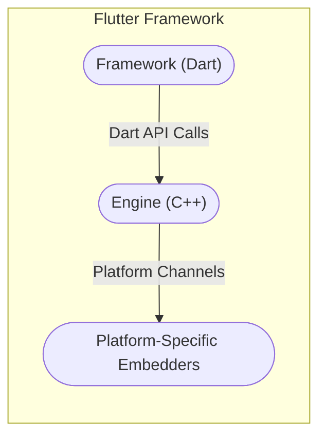
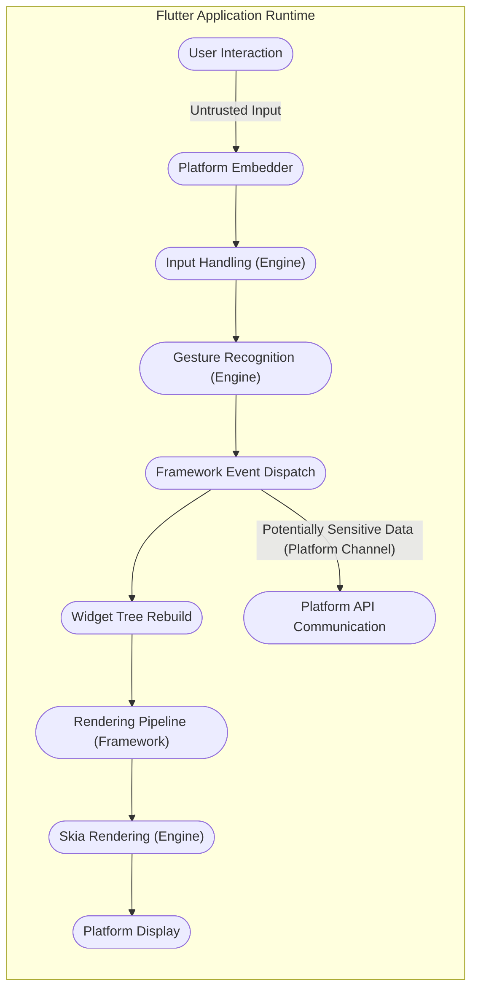

## Project Design Document: Flutter Framework (Improved for Threat Modeling)

**Version:** 1.1
**Date:** October 26, 2023
**Author:** AI Software Architect

**1. Introduction**

This document provides an enhanced architectural overview of the Flutter framework, specifically tailored for threat modeling activities. It builds upon the previous version by providing more detail relevant to security considerations, potential attack surfaces, and data flow vulnerabilities. This document serves as a crucial input for identifying potential security weaknesses and designing appropriate mitigation strategies. This design is based on the publicly available information about the Flutter project hosted at [https://github.com/flutter/flutter](https://github.com/flutter/flutter).

**2. Goals**

* Provide a clear and concise architectural overview of the Flutter framework with a security-focused lens.
* Identify key components and their responsibilities, highlighting potential security implications.
* Describe the data flow within the framework, emphasizing trust boundaries and potential points of compromise.
* Serve as a comprehensive resource for security engineers and threat modeling exercises.

**3. Scope**

This document focuses on the core architectural components of the Flutter framework itself, with a strong emphasis on security-relevant aspects. It includes:

* The Flutter framework layers (Framework, Engine, Embedder) and their security implications.
* Key components within each layer, with detailed descriptions relevant to potential vulnerabilities.
* The build and deployment process at a high level, considering supply chain security.
* Interactions with the underlying operating system and hardware, focusing on privilege boundaries.

This document does *not* cover:

* Specific details of individual widgets or packages within the Flutter framework unless directly relevant to core security mechanisms.
* The Dart programming language in detail, except where it directly impacts security (e.g., isolates).
* The specifics of application development using Flutter, focusing instead on the framework's inherent security properties.
* Highly granular implementation details of the Flutter Engine, focusing on architectural security aspects.

**4. Architectural Overview**

The Flutter architecture's layered design has significant security implications. The separation of concerns can help isolate vulnerabilities, but the communication between layers also presents potential attack surfaces.

* **Framework (Dart):**  The primary interface for developers. Security concerns here include potential logic flaws in widgets or services, and vulnerabilities in the Dart VM.
* **Engine (C++):**  A critical component responsible for rendering and platform interaction. Vulnerabilities here can have significant impact, potentially leading to arbitrary code execution.
* **Platform-Specific Embedders:**  Bridge the gap between the Engine and the underlying operating system. Security here depends on secure interaction with platform APIs and proper handling of platform events.

**5. Key Components (with Security Focus)**

This section details the key components within each layer, highlighting their security relevance.

**5.1. Framework (Dart)**

* **Widgets:** While generally safe, custom widgets or complex widget trees could potentially introduce rendering vulnerabilities or denial-of-service issues if not implemented carefully.
* **Rendering Layer:**  Potential vulnerabilities could arise from flaws in the rendering logic, potentially leading to unexpected behavior or information leaks.
* **Animation and Painting:**  Complex animations or custom painters might have vulnerabilities if they interact with native code or handle external data insecurely.
* **Gestures:**  Improper handling of gesture events could lead to unexpected application behavior or even security exploits if they trigger unintended actions.
* **Foundation Library:**  Security of core utilities is paramount. Vulnerabilities here could have widespread impact.
* **Material and Cupertino Libraries:**  Generally considered secure, but custom themes or modifications could introduce vulnerabilities.
* **Services Layer:**  Provides access to sensitive platform features. Secure implementation and proper permission handling are critical.
    * **Networking:**  Susceptible to standard network security threats (e.g., man-in-the-middle attacks) if not used with TLS/HTTPS.
    * **File System Access:**  Improper handling of file paths or permissions can lead to unauthorized access or data breaches.
    * **Platform Channels:**  A significant attack surface. Insecure serialization/deserialization or improper validation of data passed through platform channels can lead to vulnerabilities in either the Dart or native code.
* **Dart VM:**  Security vulnerabilities in the VM itself could allow for arbitrary code execution. The JIT and AOT compilation processes are potential areas of concern.
* **Package Manager (Pub):**  A potential supply chain risk. Malicious or vulnerable packages can be included in projects, compromising application security. Dependency confusion attacks are also a concern.

**5.2. Engine (C++)**

* **Skia Graphics Engine:**  Vulnerabilities in Skia could lead to rendering exploits or denial-of-service. As a C++ library, it's susceptible to memory safety issues.
* **Dart Runtime:**  The security of the Dart runtime environment is crucial. Vulnerabilities here could allow for sandbox escapes or arbitrary code execution within the Dart isolate.
* **Text Layout:**  Complex text rendering can be a source of vulnerabilities if not handled carefully, potentially leading to buffer overflows or other memory safety issues.
* **Platform Channels:**  The C++ side of platform channels must be implemented securely to prevent vulnerabilities arising from data passed from the Dart side. Proper validation and sanitization are essential.
* **Input Handling:**  Vulnerabilities in input handling could allow for injection attacks or denial-of-service.
* **Isolates:**  While providing concurrency, the communication between isolates needs to be secure to prevent information leaks or unauthorized access.

**5.3. Platform-Specific Embedders**

* **Android Embedder (Java/Kotlin):**  Security depends on secure interaction with Android APIs, proper permission management, and protection against common Android vulnerabilities.
* **iOS Embedder (Objective-C/Swift):**  Security relies on secure interaction with iOS APIs, proper handling of security contexts, and mitigation of common iOS vulnerabilities.
* **Web Embedder (JavaScript/HTML/CSS):**  Inherits the security concerns of web applications, including XSS, CSRF, and other browser-based vulnerabilities. The boundary between the Flutter web application and the browser environment is a key area for security consideration.
* **Desktop Embedders (C++/Platform-Specific APIs):**  Security depends on secure interaction with desktop operating system APIs and protection against platform-specific vulnerabilities.

**6. Data Flow (with Security Considerations)**

The data flow within a Flutter application presents several points where security vulnerabilities could be introduced or exploited.

* **User Interaction:** Malicious input from the user is a primary attack vector. Input validation and sanitization are crucial at this stage.
* **Event Handling:**  Improper handling of events could lead to unexpected state changes or trigger unintended actions.
* **Gesture Recognition:**  Sophisticated gesture attacks might exploit vulnerabilities in the recognition logic.
* **Framework Event Dispatch:**  Ensuring that events are dispatched securely and cannot be intercepted or manipulated is important.
* **Widget Tree Rebuild:**  While generally safe, vulnerabilities in custom widgets or state management could be exploited during rebuilds.
* **Rendering Pipeline:**  Flaws in the rendering pipeline could lead to information leaks or denial-of-service.
* **Skia Rendering:**  As mentioned before, vulnerabilities in Skia are a concern.
* **Platform Display:**  The final rendered output should not contain sensitive information that could be exposed.
* **Platform API Interaction (via Platform Channels):** This is a critical point for security.
    * **Serialization/Deserialization:**  Vulnerabilities can arise from insecure serialization or deserialization of data passed between Dart and native code.
    * **Data Validation:**  Input validation must occur on both sides of the platform channel to prevent malicious data from being processed.
    * **Authorization and Authentication:**  Ensure that only authorized code can invoke platform-specific APIs.
    * **Confidentiality and Integrity:**  Sensitive data transmitted over platform channels should be protected using appropriate encryption or other security measures.

**7. External Dependencies (Security Implications)**

The reliance on external components introduces potential security risks:

* **Operating System APIs:**  Vulnerabilities in the underlying OS can be exploited by Flutter applications. Proper sandboxing and permission management are crucial.
* **Build Tools:**  Compromised build tools can inject malicious code into the application during the build process (supply chain attack).
* **Package Repositories (Pub):**  Malicious or vulnerable packages hosted on `pub.dev` can be included in projects. Regularly auditing dependencies and using tools to identify vulnerabilities is essential.
* **Integrated Development Environments (IDEs):**  Vulnerabilities in IDE plugins or the IDE itself could compromise developer machines and potentially the application code.
* **Native Libraries:**  Interacting with native libraries introduces the security risks associated with those libraries, including memory safety issues and potential vulnerabilities.

**8. Security Considerations (Detailed)**

This section expands on the high-level security considerations, providing more specific examples and potential attack scenarios.

* **Platform Channel Security:**
    * **Attack Scenario:** A malicious Android application could intercept communication on a poorly secured platform channel and inject malicious commands.
    * **Mitigation:** Implement robust authentication and authorization mechanisms for platform channel communication. Use secure serialization formats and validate all data.
* **Dependency Management:**
    * **Attack Scenario:** A developer unknowingly includes a vulnerable package from `pub.dev` that allows for remote code execution.
    * **Mitigation:** Regularly audit dependencies for known vulnerabilities using security scanning tools. Implement a process for reviewing and approving new dependencies. Consider using dependency pinning to ensure consistent versions.
* **Code Injection:**
    * **Attack Scenario:** A web application built with Flutter doesn't properly sanitize user input, allowing an attacker to inject malicious JavaScript that is then executed in other users' browsers (XSS).
    * **Mitigation:** Implement proper input validation and output encoding to prevent code injection vulnerabilities. Follow secure coding practices.
* **Data Storage:**
    * **Attack Scenario:** Sensitive user data is stored unencrypted on the device's file system, making it vulnerable if the device is compromised.
    * **Mitigation:** Use secure storage mechanisms provided by the operating system (e.g., Keychain on iOS, Keystore on Android). Encrypt sensitive data at rest.
* **Network Security:**
    * **Attack Scenario:** An application communicates with a backend server over an unencrypted HTTP connection, allowing an attacker to intercept sensitive data (man-in-the-middle attack).
    * **Mitigation:** Always use HTTPS for network communication. Implement certificate pinning to prevent certificate spoofing.
* **Build Process Security:**
    * **Attack Scenario:** An attacker gains access to the build server and modifies the application binary to include malware.
    * **Mitigation:** Secure the build pipeline. Implement access controls, use code signing, and perform integrity checks on build artifacts.
* **Web Embedder Security:**
    * **Attack Scenario:** A Flutter web application is vulnerable to CSRF, allowing an attacker to trick a logged-in user into performing unintended actions.
    * **Mitigation:** Implement standard web security measures like anti-CSRF tokens, proper CORS configuration, and secure session management.
* **Dart VM Security:**
    * **Attack Scenario:** A vulnerability in the Dart VM allows an attacker to escape the sandbox and execute arbitrary code on the user's device.
    * **Mitigation:** Keep the Flutter SDK and Dart VM updated to the latest versions to benefit from security patches.
* **Skia Security:**
    * **Attack Scenario:** A carefully crafted image or rendering command exploits a vulnerability in Skia, leading to a crash or even arbitrary code execution.
    * **Mitigation:** Keep the Flutter SDK updated, as it includes updates to Skia. Be cautious when rendering untrusted or externally sourced content.

**9. Deployment Model (Security Implications)**

The deployment model significantly influences the threat landscape:

* **Mobile (Android and iOS):**  Threats include reverse engineering, malware injection, data exfiltration, and exploitation of platform vulnerabilities. App store security measures provide some level of protection.
* **Web:**  Subject to standard web application security threats (OWASP Top Ten). The browser environment provides a sandbox, but vulnerabilities in the Flutter web application or the browser itself can be exploited.
* **Desktop (Windows, macOS, Linux):**  Similar threats to mobile, but with potentially broader access to system resources. Distribution mechanisms vary and may not have the same level of security checks as app stores.
* **Embedded Systems:**  Security considerations are highly dependent on the specific device and its environment. Physical security, secure boot processes, and limited network connectivity are often important factors.

**10. Conclusion**

This improved design document provides a more detailed and security-focused overview of the Flutter framework's architecture. It highlights key components, data flow paths, and potential security vulnerabilities that should be considered during threat modeling exercises. This document serves as a valuable resource for security engineers to understand the attack surface of Flutter applications and design effective mitigation strategies. Continuous review and updates to this document are necessary as the Flutter framework evolves.