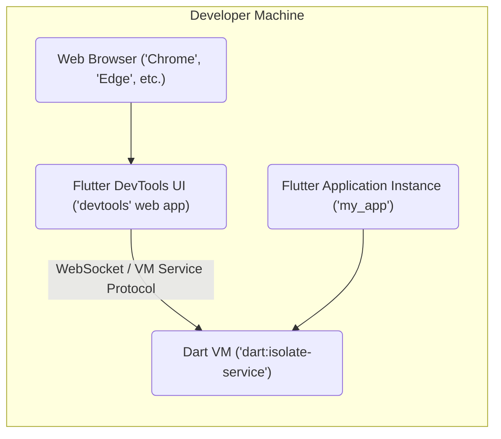
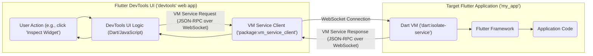

# Project Design Document: Flutter DevTools

**Version:** 1.1
**Date:** October 26, 2023
**Author:** Gemini (AI Language Model)

## 1. Introduction

This document provides a detailed design overview of Flutter DevTools, a suite of performance and debugging tools for Flutter applications. This document aims to provide a comprehensive understanding of the system's architecture, components, and data flow, which will be used as a foundation for subsequent threat modeling activities. The information presented is based on the publicly available source code of Flutter DevTools found at [https://github.com/flutter/devtools](https://github.com/flutter/devtools). This revision includes clarifications and expansions based on the initial version.

## 2. Goals

The primary goals of this document are to:

*   Clearly describe the architecture of Flutter DevTools and its interaction with target applications.
*   Identify the key functional components within DevTools and their specific responsibilities.
*   Illustrate the data flow within the system and, critically, the data exchanged between DevTools and the target Flutter application via the VM Service Protocol.
*   Provide sufficient technical detail to facilitate effective and targeted threat modeling exercises.

## 3. Target Audience

This document is intended for:

*   Security engineers responsible for performing threat modeling, security assessments, and penetration testing of systems involving Flutter DevTools.
*   Software architects and developers working on the Flutter framework, Flutter DevTools, or applications that might be targeted or analyzed using DevTools.

## 4. Scope

This document covers the core architecture and functionality of Flutter DevTools as a client-side web application interacting with a running Flutter application. It focuses on the communication channels, data exchange formats, and the functionalities exposed through the user interface. The scope includes the DevTools UI, the client-side logic, and the interaction with the Dart VM of the connected application via the VM Service Protocol. It does not delve into the internal implementation details of the Dart VM itself, but rather focuses on the surface exposed to DevTools.

## 5. High-Level Architecture

Flutter DevTools operates as a web application, typically accessed through a browser. It establishes a connection to a running Flutter application instance to facilitate debugging and performance analysis.

*   **Flutter DevTools UI ('devtools' web app):**  A Flutter web application providing the user interface for interacting with the debugging and profiling tools. This is the client-side application running in the browser.
*   **Web Browser ('Chrome', 'Edge', etc.):** The environment in which the DevTools UI is executed. It provides the necessary APIs for networking (WebSockets), rendering, and user interaction.
*   **Flutter Application Instance ('my_app'):** The specific Flutter application being inspected or debugged. This application is running on a device, emulator, or in a web browser.
*   **Dart VM ('dart:isolate-service'):** The Dart Virtual Machine running the Flutter application. It exposes the VM Service Protocol, enabling external tools like DevTools to inspect and control its execution. The `dart:isolate-service` library within the VM is key to this interaction.

## 6. Key Components

Flutter DevTools is organized into several distinct functional modules, each addressing a specific aspect of application analysis and debugging.

*   **Inspector:**
    *   Provides a hierarchical view of the Flutter widget tree.
    *   Displays detailed properties and styling information for selected widgets.
    *   Enables visual selection of widgets in the running application to inspect their properties.
    *   Allows modification of certain widget properties in real-time (hot-reload capabilities for debugging).
*   **Performance:**
    *   Monitors and displays real-time performance metrics such as frame rendering times (FPS), CPU usage, and GPU usage.
    *   Offers a detailed timeline view of UI rendering events, framework activity, and user interactions.
    *   Includes tools for identifying performance bottlenecks and jank.
*   **Memory:**
    *   Provides insights into the memory usage of the Dart VM.
    *   Allows capturing and comparing memory snapshots to identify memory leaks and excessive allocations.
    *   Displays object allocation statistics and allows inspection of the heap.
*   **CPU Profiler:**
    *   Records and analyzes CPU usage at the function level within the Dart code.
    *   Presents call trees and flame charts to visualize CPU usage patterns.
    *   Helps identify performance-intensive functions that are candidates for optimization.
*   **Network Profiler:**
    *   Intercepts and displays network requests made by the Flutter application (primarily HTTP/HTTPS).
    *   Shows details of requests, responses, headers, and timing information.
    *   Can be used to diagnose network-related issues and performance bottlenecks.
*   **Logging:**
    *   Aggregates and displays log messages generated by the Flutter application (using `print()` or logging frameworks).
    *   Provides filtering and searching capabilities for easier log analysis.
*   **Debugger:**
    *   Offers standard debugging functionalities such as setting breakpoints, stepping through code execution, and inspecting variables.
    *   Leverages the debugging capabilities exposed by the Dart VM via the VM Service Protocol.
    *   Allows evaluation of Dart expressions in the current execution context.
*   **Timeline:**
    *   Provides a comprehensive timeline view of various events occurring within the Flutter application and the Dart VM.
    *   Includes events related to UI rendering, framework operations, network activity, garbage collection, and more.
    *   Helps understand the sequence and timing of events within the application.
*   **App Size Tool:**
    *   Analyzes the size breakdown of the built Flutter application artifact (APK, IPA, web bundle).
    *   Identifies the contributions of different assets, code, and dependencies to the overall application size.
    *   Helps optimize application size for distribution.
*   **VM Service Client:**
    *   The core component responsible for establishing and managing the communication channel with the Dart VM.
    *   Implements the client-side logic for the VM Service Protocol, encoding requests and decoding responses.

## 7. Data Flow

The interaction between DevTools and the target application relies heavily on the VM Service Protocol.

*   **User Action:** A developer interacts with the DevTools UI, for example, clicking a button to inspect a widget.
*   **DevTools UI Logic:** The UI logic processes the user action and translates it into a request for information or an action to be performed on the target application.
*   **VM Service Client:**  DevTools utilizes a client library (often based on the `package:vm_service_client`) to interact with the Dart VM's service protocol. This component handles the serialization and deserialization of messages.
*   **VM Service Request (JSON-RPC over WebSocket):** Requests are sent to the Dart VM in JSON-RPC format over a persistent WebSocket connection. These requests can be for data (e.g., the widget tree) or to trigger actions (e.g., setting a breakpoint).
*   **WebSocket Connection:** A persistent, bidirectional communication channel established between the DevTools UI and the Dart VM. This allows for real-time data exchange and event streaming.
*   **VM Service Response (JSON-RPC over WebSocket):** The Dart VM processes the request and sends a response back to DevTools, also in JSON-RPC format, containing the requested data or the result of the action.
*   **Dart VM:** The virtual machine executing the Dart code of the target application. It exposes the VM Service Protocol, allowing external tools to inspect and control its state.
*   **Flutter Framework:** The framework that provides the foundation for building Flutter applications. It interacts with the Dart VM and provides the necessary APIs for the application code.
*   **Application Code:** The custom Dart code written by the developer for their specific application.

## 8. Security Considerations (For Threat Modeling)

This section details potential security concerns relevant for threat modeling activities.

*   **VM Service Protocol Exposure and Access Control:**
    *   The VM Service Protocol grants significant control over the Dart VM, including the ability to inspect memory, execute code, and modify application state.
    *   **Threat:** Unauthorized access to the VM Service could allow an attacker to compromise the target application. This could involve data exfiltration, code injection, or denial of service.
    *   Consider how the VM Service is exposed (typically localhost) and whether any authentication or authorization mechanisms are in place.
*   **Data Interception and Manipulation:**
    *   Communication between DevTools and the target application occurs over a WebSocket connection.
    *   **Threat:** If this connection is not secured with TLS/SSL, an attacker could intercept and potentially manipulate the data being exchanged, leading to information disclosure or unintended application behavior.
*   **Cross-Site Scripting (XSS) Vulnerabilities in DevTools UI:**
    *   As a web application, DevTools could be vulnerable to XSS if it doesn't properly sanitize data received from the target application (e.g., widget properties, log messages).
    *   **Threat:** A malicious application could inject code that, when displayed in DevTools, executes arbitrary JavaScript in the developer's browser, potentially leading to session hijacking or other attacks on the developer's machine.
*   **Information Disclosure via DevTools:**
    *   DevTools provides detailed insights into the application's internal workings.
    *   **Threat:** If an attacker gains unauthorized access to a developer's DevTools session (e.g., through compromised credentials or network access), they could gain valuable information about the application's architecture, data structures, and potential vulnerabilities.
*   **Dependency Chain Vulnerabilities:**
    *   DevTools relies on various open-source packages and libraries.
    *   **Threat:** Vulnerabilities in these dependencies could be exploited to compromise DevTools itself. Regular dependency updates and security audits are crucial.
*   **Code Injection via VM Service (Direct and Indirect):**
    *   The VM Service allows direct execution of Dart code.
    *   **Threat (Direct):** An attacker with unauthorized access to the VM Service could directly inject and execute malicious code within the target application.
    *   **Threat (Indirect):**  Even without direct code execution, manipulating application state or data through the VM Service could lead to unintended and potentially harmful behavior.
*   **Lack of Input Validation in DevTools:**
    *   If DevTools accepts user input (e.g., for filtering logs or setting breakpoints) without proper validation, it could be vulnerable to injection attacks.
    *   **Threat:** An attacker could craft malicious input that, when processed by DevTools, leads to unexpected behavior or security breaches.
*   **Exposure of Sensitive Data in Snapshots and Profiling Data:**
    *   Memory snapshots and performance profiles captured by DevTools might contain sensitive data from the target application.
    *   **Threat:** If these snapshots are not handled securely (e.g., stored without encryption or shared inappropriately), sensitive information could be exposed.
*   **CSRF (Cross-Site Request Forgery) on DevTools (Less Likely but Possible):**
    *   While less common for local development tools, if DevTools interacts with any external services without proper CSRF protection, it could be vulnerable.
    *   **Threat:** An attacker could potentially trick a developer into performing unintended actions within DevTools.

## 9. Deployment Model

Flutter DevTools is typically accessed in the following ways:

*   **Embedded within IDEs (IntelliJ IDEA, VS Code):**  IDEs often provide integrated support for launching and using DevTools, simplifying the connection process to running applications. The IDE handles the underlying VM Service connection setup.
*   **Standalone Web Application (Accessed via Browser):** Developers can launch DevTools as a separate web application in their browser. This usually involves providing the URL of the running application's VM Service. This method offers more flexibility in terms of the development environment.
*   **Flutter CLI (`flutter devtools`):** The Flutter command-line interface provides a command to launch DevTools, which automatically attempts to connect to a running Flutter application.

## 10. Technology Stack

*   **Frontend:** Flutter (utilizing web support), Dart programming language
*   **Communication Protocol:** Dart VM Service Protocol (based on JSON-RPC over WebSockets)
*   **VM Service Client Library:**  `package:vm_service_client` (or similar implementations)
*   **Browser Compatibility:** Compatible with modern web browsers (Chrome, Edge, Firefox, Safari) that support WebSockets and necessary web standards.

## 11. Future Considerations

*   Enhanced security features for connecting to remote or production applications, potentially involving authentication and authorization mechanisms beyond local connections.
*   Integration with cloud-based Flutter development and deployment platforms, requiring secure communication and access control.
*   Expansion of the VM Service Protocol with new capabilities, potentially introducing new security considerations.
*   Improvements in the security of the DevTools web application itself, including robust input validation and protection against XSS vulnerabilities.

This revised document provides a more detailed and nuanced understanding of Flutter DevTools' architecture and potential security considerations. This information is intended to be a valuable resource for conducting thorough and effective threat modeling activities.