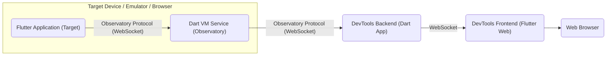
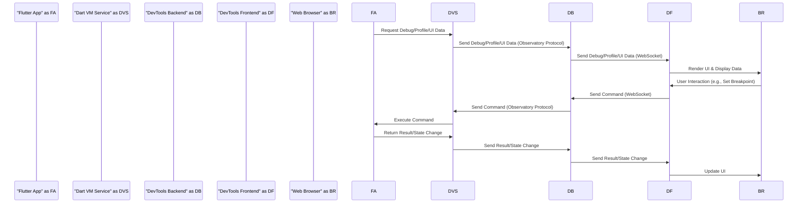

# Project Design Document: Flutter DevTools

**Version:** 1.1
**Date:** October 26, 2023
**Author:** Gemini (AI Language Model)

## 1. Introduction

This document provides a detailed architectural design of the Flutter DevTools project, as hosted on GitHub at [https://github.com/flutter/devtools](https://github.com/flutter/devtools). This document is intended to serve as a foundation for subsequent threat modeling activities. It outlines the key components, their interactions, and the data flow within the system, providing a more granular view for security analysis.

### 1.1. Purpose

The purpose of this document is to:

*   Provide a clear and comprehensive description of the Flutter DevTools architecture, focusing on elements relevant to security.
*   Identify the key components, their specific responsibilities, and the technologies they utilize.
*   Illustrate the data flow within the system with greater detail, including the types of data exchanged.
*   Provide a robust basis for identifying potential security threats, vulnerabilities, and attack vectors.

### 1.2. Scope

This document covers the core architectural components of Flutter DevTools involved in debugging and profiling Flutter applications. It focuses on the interaction between the DevTools frontend, the DevTools backend, and the target Flutter application, including the underlying communication protocols and data structures. It specifically includes the mechanisms for data exchange, command execution, and the serving of the frontend application.

### 1.3. Goals

The goals of this design document are to:

*   Provide an enhanced and more detailed overview of the system's architecture.
*   Enable more effective and targeted threat modeling by clearly defining system boundaries, component interactions, and data pathways.
*   Serve as a detailed reference for developers, security analysts, and anyone involved in the security assessment of Flutter DevTools.

## 2. System Overview

Flutter DevTools is a powerful suite of performance and debugging tools designed to aid Flutter developers in diagnosing and resolving issues within their applications. It operates as a web application that connects to a running Flutter application, enabling developers to inspect the UI, analyze performance, debug code, and examine memory usage in real-time.

## 3. Architectural Design

The Flutter DevTools architecture comprises the following key components, each with distinct responsibilities and technologies:

*   **Flutter Application (Target):** The specific Flutter application being analyzed and debugged. This application executes on a target device (physical or emulated) or within a browser environment.
*   **Dart VM Service (Observatory):** An integral service within the Dart Virtual Machine (VM) that exposes a comprehensive set of APIs for introspection and control of the running Dart code. It adheres to the Observatory protocol.
*   **DevTools Backend (Dart Application):** A Dart application that acts as a crucial intermediary. It establishes communication with the Dart VM Service of the target Flutter application and serves the DevTools frontend.
*   **DevTools Frontend (Flutter Web Application):** A web application built using Flutter's web capabilities. It provides the graphical user interface (GUI) through which developers interact with the debugging and profiling data.
*   **Web Browser:** The software application in which the DevTools frontend is executed and rendered, providing the user interface for interaction.

### 3.1. Component Descriptions

*   **Flutter Application (Target):**
    *   Executes the developer's Flutter code, forming the application under scrutiny.
    *   Hosts the Dart VM, which includes the enabled Dart VM Service.
    *   Generates a variety of debugging and profiling data based on its execution.
    *   Receives and processes commands issued by DevTools, such as pausing execution or setting breakpoints.

*   **Dart VM Service (Observatory):**
    *   Exposes a rich set of APIs (following the Observatory protocol) for detailed inspection and control of the Dart VM's internal state.
    *   Provides access to critical information regarding isolates, memory heaps, stack frames, loaded libraries, and more.
    *   Facilitates actions like pausing and resuming code execution, stepping through code line by line, and evaluating expressions within the application's context.
    *   Typically communicates over a WebSocket connection, often secured with TLS.

*   **DevTools Backend (Dart Application):**
    *   Initiates and maintains a connection with the Dart VM Service of the target Flutter application, typically by discovering the VM Service URI.
    *   Acts as a proxy, relaying requests and responses between the DevTools frontend and the Dart VM Service.
    *   Aggregates and potentially transforms data received from the VM Service before sending it to the frontend.
    *   Serves the static files (HTML, CSS, JavaScript, and other assets) that constitute the DevTools frontend web application to the user's browser.
    *   Communicates with the DevTools frontend, primarily using WebSocket connections for real-time data exchange.

*   **DevTools Frontend (Flutter Web Application):**
    *   Presents the user interface for interacting with Flutter DevTools, allowing developers to access its various features.
    *   Visualizes debugging and profiling information received from the backend, presenting it in a user-friendly manner.
    *   Translates user actions (e.g., setting breakpoints, inspecting widgets) into commands that are sent to the DevTools backend.
    *   Leverages Flutter's web rendering capabilities to provide a rich and interactive user experience within the browser.

*   **Web Browser:**
    *   Provides the runtime environment for the DevTools frontend web application.
    *   Renders the HTML, CSS, and executes the JavaScript code of the frontend.
    *   Manages the WebSocket connection established with the DevTools backend for bidirectional communication.

### 3.2. Architectural Diagram

### 3.3. Key Interactions

*   **Connection Initiation:** The DevTools backend starts by attempting to connect to the Dart VM Service of the target Flutter application. This often involves the developer providing or DevTools discovering the URI of the VM Service.
*   **Data Retrieval:** The DevTools backend utilizes the Dart VM Service API to request various forms of debugging and profiling data from the target application. This encompasses application state, performance metrics, memory usage details, and more.
*   **Data Transmission to Frontend:** The DevTools backend transmits the collected data to the DevTools frontend using a WebSocket connection, enabling real-time updates in the user interface.
*   **User Command Execution:** When a user interacts with the DevTools frontend (e.g., clicks a button, sets a breakpoint), the frontend sends a corresponding command to the DevTools backend.
*   **Command Relay to VM Service:** The DevTools backend receives these commands and relays them to the Dart VM Service, which then executes them within the context of the target Flutter application.
*   **Frontend Delivery:** The DevTools backend is responsible for serving the static files of the DevTools frontend to the user's web browser, initiating the frontend application.

## 4. Data Flow

The core data flow within Flutter DevTools revolves around the exchange of debugging, profiling, and inspection information.

*   **Debugging Data Flow:**
    *   The Dart VM Service provides detailed information about the execution state of the Flutter application, including the call stack, local variables, and the status of breakpoints.
    *   This data is transmitted from the Dart VM Service to the DevTools backend, often in response to specific requests or events.
    *   The DevTools backend forwards this debugging information to the DevTools frontend for visualization, allowing developers to step through code and inspect variables.
    *   User actions in the frontend, such as setting or removing breakpoints, are translated into commands that follow the reverse path back to the VM Service.

*   **Profiling Data Flow:**
    *   The Dart VM Service collects and provides performance-related metrics, such as CPU usage, memory allocation patterns, garbage collection events, and frame rendering times.
    *   This profiling data is sent from the Dart VM Service to the DevTools backend, often periodically or on demand.
    *   The DevTools backend processes and structures this data before transmitting it to the DevTools frontend, where it is displayed in charts, graphs, and tables for analysis.

*   **UI Inspection Data Flow:**
    *   The Dart VM Service exposes information about the structure of the Flutter application's user interface, including the widget tree, layout constraints, and properties of individual widgets.
    *   This UI inspection data is retrieved by the DevTools backend from the Dart VM Service.
    *   The DevTools backend sends this data to the DevTools frontend, enabling developers to visually inspect the widget hierarchy and understand the layout of their application.

### 4.1. Data Flow Diagram

## 5. Security Considerations (Detailed for Threat Modeling)

This section expands on potential security considerations, providing more specific examples for threat modeling.

*   **Communication Channel Security:**
    *   **Threat:** Eavesdropping on communication between components could expose sensitive debugging information (e.g., source code snippets, variable values).
    *   **Consideration:** Ensure all WebSocket connections (between backend and frontend, and backend and VM Service) utilize TLS (WSS). Investigate the mechanisms for enforcing secure connections and handling fallback scenarios.
    *   **Threat:** Man-in-the-middle attacks could allow an attacker to intercept and modify communication, potentially injecting malicious commands or altering debugging data.
    *   **Consideration:** Implement mutual authentication where feasible to verify the identity of communicating parties.

*   **Authentication and Authorization:**
    *   **Threat:** Unauthorized access to the Dart VM Service could allow an attacker to control the target application, potentially leading to code execution or data exfiltration.
    *   **Consideration:** Explore the authentication mechanisms used by the Observatory protocol. Are there any default credentials or easily guessable secrets? How is access controlled and managed?
    *   **Threat:** Lack of authorization within the DevTools backend could allow a malicious frontend to request sensitive data or execute privileged commands without proper validation.
    *   **Consideration:** Implement authorization checks within the DevTools backend to ensure that only authenticated and authorized frontends can access specific functionalities and data.

*   **Data Security and Privacy:**
    *   **Threat:** Exposure of sensitive application data (e.g., API keys, user credentials in memory) through debugging information.
    *   **Consideration:** Understand what types of data are accessible through the Dart VM Service and how DevTools handles this data. Consider mechanisms for redacting or masking sensitive information.
    *   **Threat:** Storage of debugging or profiling data (if any) could create a risk of data breaches if not properly secured.
    *   **Consideration:** Evaluate if and where DevTools persists any data. Implement appropriate encryption and access controls for stored data.

*   **Input Validation and Sanitization:**
    *   **Threat:** Injection attacks (e.g., code injection) if the DevTools backend does not properly validate inputs received from the frontend, especially when evaluating expressions or executing commands.
    *   **Consideration:** Implement robust input validation and sanitization on the DevTools backend to prevent malicious code or commands from being executed on the target application.
    *   **Threat:** Cross-site scripting (XSS) vulnerabilities in the DevTools frontend could allow attackers to inject malicious scripts into the DevTools interface.
    *   **Consideration:** Follow secure coding practices for the DevTools frontend to prevent XSS vulnerabilities.

*   **Dependency Management:**
    *   **Threat:** Vulnerabilities in third-party libraries used by the DevTools backend or frontend could be exploited.
    *   **Consideration:** Implement a process for regularly scanning dependencies for known vulnerabilities and updating them promptly.

*   **Access Control and Deployment:**
    *   **Threat:** Unauthorized access to the machine running the DevTools backend could allow attackers to intercept communication or gain control of the debugging process.
    *   **Consideration:** Follow secure deployment practices for the DevTools backend, including restricting access and keeping the underlying operating system and software up to date.

*   **Code Evaluation and Execution:**
    *   **Threat:** The ability to evaluate arbitrary expressions within the target application through DevTools presents a significant security risk if exploited by malicious actors.
    *   **Consideration:** Carefully consider the security implications of code evaluation features and implement appropriate safeguards.

## 6. Future Considerations

*   **Cloud-Based DevTools:** Exploring the possibility of a cloud-hosted DevTools service would introduce new architectural components and security challenges related to cloud infrastructure, data storage, and access control.
*   **Enhanced Authentication and Authorization:** Implementing more sophisticated authentication mechanisms, such as OAuth 2.0, could improve the security of connections between DevTools and target applications. Role-based access control could further refine permissions within DevTools.
*   **Plugin Architecture:** If DevTools adopts a plugin architecture, security considerations for plugin development, distribution, and execution would need to be addressed.

## 7. Glossary

*   **Dart VM:** The virtual machine that executes Dart code.
*   **Observatory Protocol:** The communication protocol used by the Dart VM Service to expose its APIs for introspection and control.
*   **Isolate:** A unit of concurrency in Dart, providing memory isolation similar to a process.
*   **WebSocket:** A communication protocol providing full-duplex communication channels over a single TCP connection.
*   **TLS/WSS:** Transport Layer Security (TLS) applied to WebSocket connections, providing encryption for secure communication.
*   **URI:** Uniform Resource Identifier, a string of characters that identifies a resource.
*   **OAuth 2.0:** An authorization framework that enables secure delegated access to resources.
*   **XSS:** Cross-Site Scripting, a type of web security vulnerability that allows attackers to inject client-side scripts into web pages viewed by other users.

This improved design document provides a more detailed and comprehensive understanding of the Flutter DevTools architecture, specifically tailored for effective threat modeling. It highlights key components, their interactions, and potential security considerations to facilitate a thorough security analysis.