# Project Design Document: Flutter DevTools for Threat Modeling (Improved)

**Project Name:** Flutter DevTools

**Project Repository:** [https://github.com/flutter/devtools](https://github.com/flutter/devtools)

**Document Version:** 1.1
**Date:** 2023-10-27
**Author:** AI Software Architecture Expert

## 1. Introduction

This document provides an enhanced and more detailed design overview of Flutter DevTools, specifically tailored for threat modeling and security analysis. Building upon the initial design document, this version aims to provide a deeper understanding of the system's architecture, components, data flow, and technologies, with a stronger emphasis on security-relevant aspects. This document serves as a crucial input for identifying potential security vulnerabilities, attack vectors, and risks associated with Flutter DevTools. It will be used as the foundation for subsequent threat modeling exercises.

## 2. Project Overview

Flutter DevTools is a suite of web-based developer tools designed to aid in debugging and profiling Flutter applications. Its primary goal is to provide developers with insights into the runtime behavior of their Flutter apps, enabling them to identify and resolve performance bottlenecks, debug logical errors, and understand resource usage. Key features include:

*   **Inspector:** Real-time visualization of the Flutter widget tree, allowing inspection of widget properties and layout.
*   **Performance Profiler:** Tools for analyzing application performance, including CPU and memory profiling, frame rendering analysis, and performance timeline visualization.
*   **Debugger:** A full-featured debugger allowing step-through execution, breakpoint setting, variable inspection, and call stack analysis.
*   **Network Profiler:** Monitoring and inspection of network requests made by the Flutter application, including request details, headers, and responses.
*   **Logging View:** Aggregation and display of application logs, including `print()` statements and framework logs.
*   **Memory Profiler:** Detailed analysis of memory allocation, garbage collection, and identification of potential memory leaks.
*   **CPU Profiler:** In-depth analysis of CPU usage, allowing identification of performance-critical code sections.

DevTools is designed for extensibility, allowing for the addition of new tools and features. It operates by establishing a connection to a running Flutter application's Dart VM service, leveraging the service's introspection and control capabilities.  Understanding this client-server architecture and the communication pathways is crucial for threat modeling.

## 3. System Architecture

Flutter DevTools employs a client-server architecture where the "server" component is an extension within the debugged Flutter application's Dart VM, and the "client" is a web application running in a browser. This separation of concerns is important for security analysis as it defines distinct trust boundaries and communication channels.

### 3.1. High-Level Architecture Diagram (Security Focused)

```mermaid
graph LR
    subgraph "Developer Workstation - Less Trusted Zone"
        A["Web Browser - Potentially Compromised"] -- "HTTPS/WSS (Ideal), HTTP/WS (Local Dev)" --> B["DevTools Frontend (Flutter Web App) - Client"]
    end
    B -- "WebSocket (Unauthenticated by Default)" --> C["DevTools Backend (Dart VM Service Extension) - Server"]
    C -- "Dart VM Service Protocol (Authenticated)" --> D["Dart VM Service - Privileged Access"]
    D -- "Dart VM Internals - Highly Privileged" --> E["Debugged Flutter Application - Target Application"]
    style A fill:#f9f,stroke:#333,stroke-width:2px
    style B fill:#ccf,stroke:#333,stroke-width:2px
    style C fill:#ccf,stroke:#333,stroke-width:2px
    style D fill:#ccf,stroke:#333,stroke-width:2px
    style E fill:#f9f,stroke:#333,stroke-width:2px
    classDef securityLevel1 fill:#f9f,stroke:#333,stroke-width:2px
    classDef securityLevel2 fill:#ccf,stroke:#333,stroke-width:2px
    class A,E securityLevel1
    class B,C,D securityLevel2
```

**Diagram Explanation (Security Context Added):**

*   **"Web Browser - Potentially Compromised"**:  The user's web browser is considered part of a less trusted zone. Browsers can be vulnerable to various attacks (XSS, malware, etc.), making the DevTools Frontend environment potentially less secure. Communication ideally should be over HTTPS/WSS, but local development often uses HTTP/WS.
*   **"DevTools Frontend (Flutter Web App) - Client"**: The client-side application. While Flutter Web provides some security benefits, it's still a web application and needs to be considered for client-side vulnerabilities. It communicates over WebSocket, which, by default, might not be authenticated, posing a potential access control issue.
*   **"DevTools Backend (Dart VM Service Extension) - Server"**:  The server-side component running within the Dart VM. It acts as a bridge to the Dart VM Service. It's crucial to analyze the security of this extension, especially its interaction with the Dart VM Service and its handling of commands from the Frontend.
*   **"Dart VM Service - Privileged Access"**: A built-in service within the Dart VM providing powerful introspection and control capabilities. Access to this service is typically protected by an authentication token, but the strength and management of this token are important security considerations. Compromise of this service grants significant control over the debugged application.
*   **"Debugged Flutter Application - Target Application"**: The application being debugged. It's the target of DevTools' operations and is directly affected by commands and data requests. Security vulnerabilities in DevTools could potentially be exploited to impact the debugged application.

### 3.2. Component Breakdown (Security Perspective)

#### 3.2.1. DevTools Frontend (Flutter Web App) - Client-Side Security

*   **Technology:** Flutter (Web), Dart, HTML, CSS, JavaScript (transpiled from Dart).
*   **Security Considerations:**
    *   **XSS Vulnerabilities:** As a web application, it's susceptible to XSS if user inputs or data from the backend are not properly sanitized before rendering in the UI. Input validation and output encoding are crucial.
    *   **Client-Side Logic Security:**  Sensitive logic or data handling on the client-side should be minimized as client-side code is easily inspectable and modifiable.
    *   **Dependency Security:**  Third-party Flutter packages used in the frontend need to be vetted for vulnerabilities. Supply chain security is relevant here.
    *   **Communication Security:**  Reliance on secure communication protocols (WSS) is essential, especially for non-local debugging scenarios.
    *   **Content Security Policy (CSP):** Implementing a strong CSP can mitigate certain types of attacks, including XSS.

#### 3.2.2. DevTools Backend (Dart VM Service Extension) - Server-Side Security within VM

*   **Technology:** Dart.
*   **Security Considerations:**
    *   **Dart VM Service Protocol Interaction Security:**  Properly using the Dart VM Service Protocol API and adhering to its security guidelines is critical. Incorrect usage could lead to vulnerabilities.
    *   **Command Handling Security:**  Careful validation and sanitization of commands received from the Frontend are necessary to prevent command injection or other malicious operations.
    *   **Data Handling Security:**  Sensitive data retrieved from the Dart VM Service needs to be handled securely and transmitted to the Frontend over a secure channel. Data minimization and least privilege principles should be applied.
    *   **Access Control within VM:**  While running within the Dart VM's security context, the Backend should still adhere to principles of least privilege and avoid unnecessary access to sensitive VM internals beyond what's required for its functionality.
    *   **WebSocket Server Security:**  The WebSocket server implementation needs to be robust and secure against common WebSocket vulnerabilities.

#### 3.2.3. Dart VM Service - Core Security Component

*   **Technology:** C++, Dart.
*   **Security Considerations:**
    *   **Service Authentication:** The Dart VM Service relies on authentication tokens to control access. The strength of the token generation, distribution, and validation mechanisms is paramount. Weak tokens or insecure token handling can lead to unauthorized access.
    *   **Authorization and Access Control:**  The Dart VM Service API provides a wide range of capabilities.  Fine-grained access control mechanisms should be in place to limit the actions that can be performed even with a valid token.  Not all operations should be accessible to all clients.
    *   **API Security:**  The Dart VM Service API itself needs to be designed and implemented securely to prevent vulnerabilities such as buffer overflows, injection flaws, or logic errors that could be exploited through the protocol.
    *   **Exposure Control:**  Limiting the exposure of the Dart VM Service to only authorized and necessary connections is important. Network configurations and firewall rules should be considered.

#### 3.2.4. Debugged Flutter Application - Security Impact Target

*   **Technology:** Flutter, Dart.
*   **Security Considerations (as related to DevTools):**
    *   **Impact of DevTools Vulnerabilities:**  Vulnerabilities in DevTools can directly impact the security of the debugged application. For example, code injection through DevTools could compromise the application's integrity or confidentiality.
    *   **Data Exposure via DevTools:**  DevTools can expose sensitive data from the debugged application (memory, network traffic, etc.).  If DevTools is compromised, this data could be leaked.
    *   **Performance Impact of DevTools:**  While not directly a security vulnerability, excessive resource consumption by DevTools could lead to denial-of-service conditions for the debugged application, especially in performance-sensitive scenarios.

## 4. Data Flow (Security Analysis)

Analyzing data flow is crucial for threat modeling as it reveals where data is processed, transmitted, and stored, highlighting potential points of interception or manipulation.

### 4.1. Data Flow Diagram (Security Zones)

```mermaid
graph LR
    subgraph "Debugged Flutter Application - High Trust Zone"
        A["Debugged Flutter Application Data"]
        B["Dart VM Service"]
        C["DevTools Backend"]
    end
    subgraph "Developer Workstation - Lower Trust Zone"
        D["DevTools Frontend"]
        E["Web Browser"]
    end
    A -- "Data Access (Internal VM Calls)" --> B
    B -- "Dart VM Service Protocol (Authenticated Channel)" --> C
    C -- "WebSocket (Potentially Unsecured Channel)" --> D
    D -- "Data Rendering & User Interaction" --> E
    style A fill:#f9f,stroke:#333,stroke-width:2px
    style B fill:#ccf,stroke:#333,stroke-width:2px
    style C fill:#ccf,stroke:#333,stroke-width:2px
    style D fill:#ccf,stroke:#333,stroke-width:2px
    style E fill:#f9f,stroke:#333,stroke-width:2px
    classDef highTrust fill:#ccf,stroke:#333,stroke-width:2px
    classDef lowTrust fill:#f9f,stroke:#333,stroke-width:2px
    class A,B,C highTrust
    class D,E lowTrust
```

**Data Flow Description (Security Focused):**

1.  **Data Origin - "Debugged Flutter Application Data" (High Trust Zone):** Sensitive application data resides within the debugged application's memory space. This is considered the most trusted zone.
2.  **"Data Access (Internal VM Calls)" to "Dart VM Service" (High Trust Zone):** The Dart VM Service accesses this data through internal VM calls. This communication is within the same trust zone and is considered secure from external threats.
3.  **"Dart VM Service Protocol (Authenticated Channel)" to "DevTools Backend" (High Trust Zone):** Data is transmitted from the Dart VM Service to the DevTools Backend using the Dart VM Service Protocol. This channel *should* be authenticated, providing a degree of security. However, the strength of authentication and potential vulnerabilities in the protocol implementation need to be assessed. Both components are still within the higher trust zone of the debugged application's VM.
4.  **"WebSocket (Potentially Unsecured Channel)" to "DevTools Frontend" (Lower Trust Zone):** Data is then sent from the DevTools Backend to the DevTools Frontend over a WebSocket connection. This is a critical security boundary.  **By default, WebSocket connections might not be encrypted or authenticated.** This channel represents a significant potential attack surface, especially in non-local debugging scenarios.  The use of WSS is highly recommended for production-like or remote debugging.
5.  **"Data Rendering & User Interaction" in "Web Browser" (Lower Trust Zone):** Finally, the DevTools Frontend renders the data in the web browser. The browser environment is considered a lower trust zone, and vulnerabilities in the Frontend or the browser itself could expose the data.

**Security Implications of Data Flow:**

*   **Trust Boundary Crossing:** The most significant trust boundary is crossed when data moves from the DevTools Backend (within the debugged application's VM) to the DevTools Frontend (in the web browser) via WebSocket. This is where security controls are most critical.
*   **Channel Security:** The WebSocket channel is a primary concern. Lack of encryption (using WS instead of WSS) exposes data in transit. Lack of authentication allows potentially unauthorized clients to connect and receive sensitive data.
*   **Data Exposure in Browser:** Data rendered in the browser is potentially accessible through browser vulnerabilities or malicious browser extensions.

## 5. Technology Stack (Security Relevant Technologies)

*   **Frontend:**
    *   Flutter (for UI framework):  Security benefits of Flutter framework itself (e.g., compiled code, potential for better security practices compared to traditional web frameworks).
    *   Dart (programming language): Memory safety and other language-level security features of Dart.
    *   HTML, CSS, JavaScript (for web browser compatibility): Standard web technologies, bringing standard web security concerns (XSS, CSP, etc.).
    *   WebSocket (for communication with backend):  Security protocols for WebSocket (WSS), authentication mechanisms.
*   **Backend:**
    *   Dart (programming language):  Security features of Dart.
    *   Dart VM Service Protocol (for communication with Dart VM Service):  Protocol security, authentication mechanisms.
    *   WebSocket (for communication with frontend): WebSocket server implementation security.
*   **Debugged Application:**
    *   Flutter, Dart, Dart VM:  Underlying platform security.

## 6. Deployment Model (Security Implications)

*   **Local Development (Default and Most Common):**
    *   **Security Posture:** Lower risk in typical local development scenarios as communication is usually within the developer's machine (`localhost`). However, even in local development, vulnerabilities could be exploited if the developer's machine is compromised.
    *   **Communication Channel:** Often uses unencrypted HTTP/WS for simplicity.
    *   **Authentication:** Authentication might be less strictly enforced in local development.

*   **Remote Debugging (Less Common, Higher Risk):**
    *   **Security Posture:** Significantly higher risk due to network exposure. Remote debugging scenarios require careful consideration of network security.
    *   **Communication Channel:** **Must use HTTPS/WSS for secure communication.**  Unencrypted communication over a network is highly vulnerable.
    *   **Authentication and Authorization:** Robust authentication and authorization mechanisms are essential to prevent unauthorized access to the Dart VM Service and sensitive debugging data.  Network segmentation and access control lists (ACLs) might be necessary.
    *   **Exposure Surface:** Remote debugging increases the attack surface as the Dart VM Service and DevTools Backend become accessible over a network.

## 7. Security Considerations (Detailed and Expanded)

This section expands on the initial security considerations, providing more specific examples and potential attack vectors for threat modeling.

*   **Communication Channel Security (WebSocket) - Critical Vulnerability Area:**
    *   **Unencrypted Communication (WS):** Using unencrypted WebSocket (WS) exposes all debugging data transmitted between the Frontend and Backend to network eavesdropping. This is especially critical in remote debugging scenarios. **Recommendation: Enforce WSS for all non-local connections and ideally even for local connections.**
    *   **Lack of WebSocket Authentication:** If the WebSocket connection is not properly authenticated, any client on the network could potentially connect to the DevTools Backend and gain access to debugging data and control over the debugged application. **Recommendation: Implement robust WebSocket authentication to ensure only authorized DevTools Frontends can connect.** Consider using session-based authentication or token-based authentication.
    *   **WebSocket Denial of Service (DoS):**  An attacker could potentially flood the WebSocket endpoint with connection requests or messages, leading to a DoS attack on the DevTools Backend and potentially impacting the debugged application. **Recommendation: Implement rate limiting and connection limits on the WebSocket server.**

*   **Dart VM Service Protocol Security - Authentication and Authorization Weaknesses:**
    *   **Weak or Predictable Service Authentication Tokens:** If the Dart VM Service authentication tokens are weak, easily guessable, or predictable, attackers could potentially obtain valid tokens and gain unauthorized access to the service. **Recommendation: Use strong, randomly generated, and securely managed authentication tokens.**  Consider token rotation and expiration.
    *   **Insufficient Authorization Controls:** Even with valid authentication, the Dart VM Service might not have fine-grained authorization controls. An attacker with a valid token might be able to perform actions beyond their intended scope. **Recommendation: Implement role-based access control (RBAC) or attribute-based access control (ABAC) within the Dart VM Service to limit the actions that can be performed based on the authenticated client's privileges.**
    *   **Token Leakage:**  Authentication tokens could be leaked through various means (e.g., insecure storage, logging, network interception if not using HTTPS). **Recommendation: Implement secure token handling practices, including secure storage, avoiding logging tokens, and enforcing HTTPS/WSS.**

*   **Data Sensitivity and Exposure - Information Disclosure Risks:**
    *   **Exposure of Source Code and Application Logic:** DevTools can expose significant portions of the application's source code and runtime logic through features like the inspector and debugger. Unauthorized access to DevTools could lead to intellectual property theft or reverse engineering.
    *   **Exposure of Sensitive Data in Memory and Network Traffic:** Memory snapshots, network profiler data, and debugger variable inspection can reveal sensitive data processed by the application (e.g., user credentials, API keys, personal information).  Data leaks through DevTools could have serious privacy implications.
    *   **Logging Sensitive Information:**  If DevTools logs sensitive debugging information (e.g., in server logs or client-side storage), this could create persistent vulnerabilities. **Recommendation: Avoid logging sensitive data and implement secure logging practices.**

*   **Code Injection Risks (via Evaluate Expression, Hot Reload) - Integrity and Availability Risks:**
    *   **Malicious Code Injection via "Evaluate Expression":** The "evaluate expression" feature allows execution of arbitrary Dart code within the debugged application's context. If an attacker gains unauthorized access to DevTools, they could use this feature to inject malicious code, potentially compromising the application's integrity, stealing data, or causing denial of service. **Recommendation:  Restrict access to "evaluate expression" functionality to authenticated and authorized users. Consider implementing sandboxing or code execution restrictions for this feature.**
    *   **Hot Reload as an Attack Vector:** While intended for development, the hot reload mechanism involves injecting code into a running application. If this mechanism is not properly secured, it could potentially be abused to inject malicious code. **Recommendation: Secure the hot reload process and ensure it can only be initiated by authorized developers.**

*   **Cross-Site Scripting (XSS) in DevTools Frontend - Client-Side Vulnerability:**
    *   **Reflected or Stored XSS:** If the DevTools Frontend does not properly sanitize data received from the Backend or user inputs, it could be vulnerable to XSS attacks. An attacker could inject malicious scripts into the DevTools UI, potentially stealing developer credentials, session tokens, or compromising the developer's workstation. **Recommendation: Implement robust input validation and output encoding in the DevTools Frontend to prevent XSS vulnerabilities. Regularly perform security testing and code reviews to identify and fix XSS vulnerabilities.**

*   **Denial of Service (DoS) - Availability Risk:**
    *   **Resource Exhaustion Attacks on Dart VM Service or Backend:** An attacker could send a large number of requests to the Dart VM Service or DevTools Backend, exhausting resources (CPU, memory, network bandwidth) and causing a DoS condition. **Recommendation: Implement rate limiting, request throttling, and resource usage monitoring to mitigate DoS attacks.**
    *   **Exploiting Resource-Intensive DevTools Features:**  Certain DevTools features, like memory profiling or heap snapshotting, can be resource-intensive. An attacker could trigger these features repeatedly to cause a DoS. **Recommendation: Implement safeguards to prevent abuse of resource-intensive features.  Consider resource quotas and timeouts.**

This improved design document provides a more security-focused perspective on Flutter DevTools architecture and data flow. It highlights critical security considerations and potential threat areas, serving as a more robust foundation for conducting comprehensive threat modeling and developing effective security mitigations.  Further threat modeling activities should use this document as a starting point to identify specific threats, vulnerabilities, and risks, and to develop appropriate security controls.