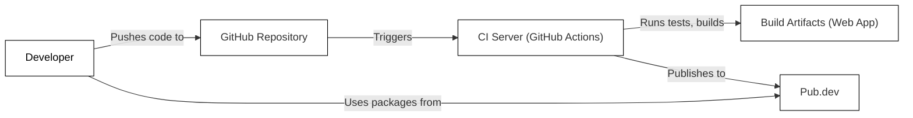

Okay, let's create a design document for the Flutter DevTools project, keeping in mind its purpose and potential security considerations.

# BUSINESS POSTURE

Business Priorities and Goals:

*   Improve developer productivity: DevTools aims to significantly reduce the time and effort required for Flutter developers to debug, profile, and optimize their applications.
*   Enhance application quality: By providing tools for identifying and resolving performance bottlenecks, memory leaks, and UI layout issues, DevTools helps developers build higher-quality Flutter applications.
*   Support a wide range of Flutter platforms: DevTools needs to be compatible with various target platforms supported by Flutter, including mobile (Android, iOS), web, desktop (Windows, macOS, Linux), and embedded systems.
*   Foster a thriving Flutter ecosystem: By offering a robust and user-friendly debugging and profiling toolset, DevTools contributes to the overall growth and adoption of the Flutter framework.
*   Open Source and Community Driven: The project is open source and relies on community contributions, meaning that maintainability, extensibility, and clear documentation are crucial.

Most Important Business Risks:

*   Performance degradation of the target application: If DevTools introduces significant overhead or interferes with the normal execution of the application being debugged, it could hinder developer productivity and potentially mask or alter the very issues it's meant to diagnose.
*   Incompatibility with Flutter SDK updates: As the Flutter SDK evolves, DevTools must be continuously updated to maintain compatibility. Failure to do so could render it unusable and disrupt developer workflows.
*   Security vulnerabilities in DevTools itself: Since DevTools interacts with running applications and potentially sensitive data, vulnerabilities in DevTools could be exploited to compromise developer machines or the applications being developed.
*   Poor user experience: If DevTools is difficult to use, buggy, or unreliable, developers may abandon it in favor of other tools or workarounds, diminishing its value and impact.
*   Lack of adoption: If developers don't find DevTools useful or relevant to their needs, the project's goals will not be met.

# SECURITY POSTURE

Existing Security Controls:

*   security control: Code Reviews: Being an open-source project on GitHub, all code changes are subject to review by other contributors and maintainers. This helps identify potential security flaws before they are merged into the main codebase. (Described in GitHub repository's contribution guidelines).
*   security control: Static Analysis: The project likely uses static analysis tools (e.g., the Dart analyzer, linters) to identify potential code quality and security issues during development and CI. (Implied by the use of Dart and common practices in the Flutter ecosystem).
*   security control: Dependency Management: The project uses pubspec.yaml and pubspec.lock files to manage dependencies, allowing for tracking and auditing of third-party libraries. (Visible in the GitHub repository).
*   security control: Regular Updates: The project is actively maintained, with frequent releases that include bug fixes and security updates. (Visible in the GitHub repository's release history).

Accepted Risks:

*   accepted risk: Limited formal security audits: While code reviews and static analysis are performed, there may not be regular, in-depth security audits conducted by dedicated security professionals.
*   accepted risk: Reliance on community contributions: The open-source nature of the project means that security vulnerabilities could be introduced by contributors, although code reviews mitigate this risk.
*   accepted risk: Potential for data exposure during debugging: DevTools inherently needs access to application data to provide debugging and profiling capabilities. This creates a potential risk of sensitive data exposure if DevTools is compromised or misused.

Recommended Security Controls:

*   security control: Implement a Security Development Lifecycle (SDL): Formalize the process of incorporating security considerations throughout the development lifecycle, including threat modeling, security testing, and vulnerability management.
*   security control: Conduct regular penetration testing: Perform periodic penetration tests by security experts to identify vulnerabilities that may be missed by code reviews and static analysis.
*   security control: Implement a vulnerability disclosure program: Establish a clear process for security researchers to responsibly report vulnerabilities found in DevTools.
*   security control: Enhance data sanitization and masking: Implement mechanisms to sanitize or mask sensitive data displayed in DevTools, reducing the risk of accidental exposure.
*   security control: Consider sandboxing: Explore the possibility of running DevTools in a sandboxed environment to limit its access to the host system and other applications.

Security Requirements:

*   Authentication:
    *   DevTools should authenticate securely to the target application being debugged. This may involve using existing authentication mechanisms provided by the Flutter framework or platform-specific APIs.
    *   If DevTools uses a separate server component, secure authentication between the DevTools UI and the server is required.
*   Authorization:
    *   DevTools should only access the data and functionality necessary for its intended purpose. It should not have unrestricted access to the target application or the host system.
    *   Access control mechanisms should be in place to prevent unauthorized users from accessing or modifying application data through DevTools.
*   Input Validation:
    *   All input received by DevTools, whether from the user interface or the target application, should be strictly validated to prevent injection attacks and other vulnerabilities.
    *   Data received from the target application should be treated as untrusted and carefully sanitized before being displayed or processed.
*   Cryptography:
    *   If DevTools transmits data over a network (e.g., to a remote server), secure communication channels (e.g., TLS/SSL) should be used to protect the data in transit.
    *   Any sensitive data stored by DevTools (e.g., credentials, application data) should be encrypted at rest.

# DESIGN

## C4 CONTEXT

```mermaid
graph LR
    User["Developer"]
    DevTools["Flutter DevTools"]
    FlutterApp["Flutter Application"]
    Browser["Web Browser"]
    OperatingSystem["Operating System"]
    RemoteVM["Remote Dart VM"]

    User -- Uses --> DevTools
    DevTools -- Debugs, Profiles --> FlutterApp
    DevTools -- Runs in --> Browser
    FlutterApp -- Runs on --> OperatingSystem
    DevTools -.-> RemoteVM : Connects to
    classDef box fill:#fff,stroke:#000,stroke-width:1px
    classDef person fill:#fff,stroke:#000,stroke-width:1px,color:#000
    class User,FlutterApp,Browser,OperatingSystem,RemoteVM box
    class DevTools box
    class User person

```

Element Descriptions:

*   Element:
    *   Name: Developer
    *   Type: Person
    *   Description: A software developer using Flutter DevTools to debug and profile their Flutter application.
    *   Responsibilities: Interacts with the DevTools UI, sets breakpoints, inspects variables, analyzes performance data, etc.
    *   Security controls: N/A (External to the system)

*   Element:
    *   Name: Flutter DevTools
    *   Type: Software System
    *   Description: A suite of debugging and profiling tools for Flutter applications.
    *   Responsibilities: Provides a user interface for interacting with the target application, displays debugging information, collects performance data, etc.
    *   Security controls: Code Reviews, Static Analysis, Dependency Management, Regular Updates

*   Element:
    *   Name: Flutter Application
    *   Type: Software System
    *   Description: The Flutter application being debugged or profiled.
    *   Responsibilities: Executes the application logic, responds to user input, interacts with the operating system, etc.
    *   Security controls: Relies on the security of the Flutter framework and the underlying operating system.

*   Element:
    *   Name: Web Browser
    *   Type: Software System
    *   Description: The web browser in which DevTools runs (typically Chrome or Edge).
    *   Responsibilities: Hosts the DevTools UI, provides a JavaScript runtime environment, handles communication with the target application.
    *   Security controls: Relies on the security of the web browser itself.

*   Element:
    *   Name: Operating System
    *   Type: Software System
    *   Description: The operating system on which the Flutter application is running (e.g., Android, iOS, Windows, macOS, Linux).
    *   Responsibilities: Provides the underlying platform for the Flutter application, manages resources, handles system calls, etc.
    *   Security controls: Relies on the security of the operating system itself.

*   Element:
    *   Name: Remote Dart VM
    *   Type: Software System
    *   Description: Dart VM running remotely, e.g. on mobile device or different machine.
    *   Responsibilities: Executes compiled Dart code.
    *   Security controls: Relies on the security of the Dart VM itself.

## C4 CONTAINER

```mermaid
graph LR
    User["Developer"]
    DevToolsUI["DevTools UI (Web App)"]
    DevToolsServer["DevTools Server (Dart)"]
    FlutterApp["Flutter Application"]
    Browser["Web Browser"]
    OperatingSystem["Operating System"]
    RemoteVM["Remote Dart VM"]

    User -- Uses --> DevToolsUI
    DevToolsUI -- Communicates with --> DevToolsServer
    DevToolsServer -- Debugs, Profiles --> FlutterApp
    DevToolsUI -- Runs in --> Browser
    FlutterApp -- Runs on --> OperatingSystem
    DevToolsServer -.-> RemoteVM : Connects to
    classDef box fill:#fff,stroke:#000,stroke-width:1px
    classDef person fill:#fff,stroke:#000,stroke-width:1px,color:#000
    class User,FlutterApp,Browser,OperatingSystem,RemoteVM box
    class DevToolsUI,DevToolsServer box
    class User person
```

Element Descriptions:

*   Element:
    *   Name: Developer
    *   Type: Person
    *   Description: A software developer using Flutter DevTools.
    *   Responsibilities: Interacts with the DevTools UI.
    *   Security controls: N/A

*   Element:
    *   Name: DevTools UI (Web App)
    *   Type: Web Application
    *   Description: The user interface of DevTools, running in a web browser.
    *   Responsibilities: Displays debugging information, provides controls for interacting with the target application, communicates with the DevTools Server.
    *   Security controls: Input Validation, Sanitization of data received from the DevTools Server.

*   Element:
    *   Name: DevTools Server (Dart)
    *   Type: Application
    *   Description: A Dart application that acts as a bridge between the DevTools UI and the target Flutter application.
    *   Responsibilities: Communicates with the target application's VM service, collects debugging and profiling data, sends data to the DevTools UI.
    *   Security controls: Authentication with the target application's VM service, Authorization to access specific data and functionality, Input Validation of data received from the target application.

*   Element:
    *   Name: Flutter Application
    *   Type: Software System
    *   Description: The Flutter application being debugged.
    *   Responsibilities: Executes application logic.
    *   Security controls: Relies on Flutter framework security.

*   Element:
    *   Name: Web Browser
    *   Type: Software System
    *   Description: The browser hosting the DevTools UI.
    *   Responsibilities: Provides the runtime environment for the DevTools UI.
    *   Security controls: Relies on the browser's security.

*   Element:
    *   Name: Operating System
    *   Type: Software System
    *   Description: The OS running the Flutter application.
    *   Responsibilities: Provides the platform for the application.
    *   Security controls: Relies on the OS's security.

*   Element:
    *   Name: Remote Dart VM
    *   Type: Software System
    *   Description: Dart VM running remotely.
    *   Responsibilities: Executes compiled Dart code.
    *   Security controls: Relies on the security of the Dart VM itself.

## DEPLOYMENT

Possible Deployment Solutions:

1.  Local Development: DevTools runs locally alongside the Flutter application being developed. This is the most common scenario for development.
2.  Remote Debugging: DevTools connects to a Flutter application running on a remote device or emulator.
3.  Web-Based DevTools: DevTools is hosted on a web server and accessed through a web browser. This allows for centralized access and potentially easier updates.

Chosen Solution (Detailed Description): Local Development

In the local development scenario, DevTools is typically launched from the command line or an IDE (e.g., VS Code, Android Studio) when debugging a Flutter application. The DevTools server component starts as a separate process on the developer's machine and establishes a connection with the Flutter application's Dart VM service. The DevTools UI is then opened in a web browser, which communicates with the DevTools server via WebSockets.

```mermaid
graph LR
    DeveloperMachine["Developer Machine"]
    FlutterAppVM["Flutter App (Dart VM)"]
    DevToolsServerProcess["DevTools Server (Dart Process)"]
    BrowserInstance["Web Browser (DevTools UI)"]
    OperatingSystem["Operating System"]

    DeveloperMachine -- Hosts --> FlutterAppVM
    DeveloperMachine -- Hosts --> DevToolsServerProcess
    DeveloperMachine -- Hosts --> BrowserInstance
    FlutterAppVM -- Communicates with <--> DevToolsServerProcess : VM Service Protocol
    DevToolsServerProcess -- Communicates with <--> BrowserInstance : WebSockets
    OperatingSystem -- Underlies --> DeveloperMachine

    classDef box fill:#fff,stroke:#000,stroke-width:1px
    class DeveloperMachine,FlutterAppVM,DevToolsServerProcess,BrowserInstance,OperatingSystem box
```

Element Descriptions:

*   Element:
    *   Name: Developer Machine
    *   Type: Node
    *   Description: The developer's computer running the Flutter SDK, IDE, and DevTools.
    *   Responsibilities: Hosts the Flutter application, DevTools server, and web browser.
    *   Security controls: Relies on the security of the developer's machine (e.g., OS security, firewall, antivirus).

*   Element:
    *   Name: Flutter App (Dart VM)
    *   Type: Container Instance
    *   Description: The running instance of the Flutter application, including the Dart VM.
    *   Responsibilities: Executes the application code, exposes a VM service for debugging.
    *   Security controls: Relies on the security of the Dart VM and the Flutter framework.

*   Element:
    *   Name: DevTools Server (Dart Process)
    *   Type: Container Instance
    *   Description: The DevTools server process running on the developer's machine.
    *   Responsibilities: Communicates with the Flutter application's VM service, processes data, serves the DevTools UI.
    *   Security controls: Authentication with the Flutter application's VM service, Input Validation.

*   Element:
    *   Name: Web Browser (DevTools UI)
    *   Type: Container Instance
    *   Description: The web browser instance displaying the DevTools UI.
    *   Responsibilities: Renders the UI, handles user interactions, communicates with the DevTools server.
    *   Security controls: Relies on the security of the web browser.

*   Element:
    *   Name: Operating System
    *   Type: Node
    *   Description: The operating system of the developer's machine.
    *   Responsibilities: Provides the underlying platform for all processes.
    *   Security controls: Relies on the OS's inherent security features.

## BUILD

The Flutter DevTools build process involves several steps, from compiling the Dart code to packaging the web application for deployment. The build process is automated using scripts and tools within the Flutter SDK and the DevTools repository.



Build Process Description:

1.  Code Changes: Developers make changes to the DevTools codebase and push them to the GitHub repository.
2.  Continuous Integration (CI): GitHub Actions, the CI system used by the project, is triggered by code pushes.
3.  Build and Test: The CI server runs build scripts that:
    *   Fetch dependencies using `pub get`.
    *   Analyze the code using the Dart analyzer and linters (static analysis).
    *   Run unit and integration tests.
    *   Build the DevTools web application using `webdev build`.
4.  Artifact Generation: The build process produces a deployable web application (HTML, JavaScript, CSS).
5.  Publishing: The built web application can be published to pub.dev, making it available for use by other developers.

Security Controls in the Build Process:

*   security control: Static Analysis: The Dart analyzer and linters are used to identify potential code quality and security issues during the build process.
*   security control: Dependency Management: pubspec.yaml and pubspec.lock files ensure that dependencies are tracked and can be audited for vulnerabilities.
*   security control: Automated Testing: Unit and integration tests help ensure that code changes do not introduce regressions or security vulnerabilities.
*   security control: CI/CD Pipeline: GitHub Actions provides a controlled and auditable environment for building and deploying DevTools.
*   security control: Code Reviews: All code changes are reviewed before being merged into the main branch.

# RISK ASSESSMENT

Critical Business Processes to Protect:

*   The ability for developers to efficiently debug and profile their Flutter applications.
*   The integrity and reliability of the DevTools codebase.
*   The reputation of the Flutter project and its ecosystem.

Data to Protect and Sensitivity:

*   Application Source Code (Potentially Sensitive): While DevTools doesn't directly store application source code, it may display snippets of code during debugging. The sensitivity depends on the nature of the application being developed.
*   Application Data (Potentially Sensitive): DevTools may display application data during debugging, including user inputs, API responses, and internal state. The sensitivity depends on the type of data processed by the application.
*   Performance Metrics (Low Sensitivity): DevTools collects performance data (e.g., frame rates, memory usage) which is generally not considered sensitive.
*   Developer Credentials (Potentially Sensitive): If DevTools integrates with other services (e.g., cloud-based profiling tools), it may handle developer credentials. These credentials should be protected with strong encryption and secure storage.

# QUESTIONS & ASSUMPTIONS

Questions:

*   Are there any specific compliance requirements (e.g., GDPR, HIPAA) that DevTools needs to adhere to?
*   What is the expected threat model for DevTools? Are there any specific types of attackers or attacks that are of particular concern?
*   What level of access does DevTools have to the target application's memory and data?
*   Are there any plans to integrate DevTools with cloud-based services?
*   What is the process for handling security vulnerabilities reported by external researchers?

Assumptions:

*   BUSINESS POSTURE: The primary goal of DevTools is to improve developer productivity and application quality. Security is a secondary, but still important, consideration.
*   SECURITY POSTURE: The project follows basic secure development practices, including code reviews and static analysis. However, there may be room for improvement in terms of formal security audits and penetration testing.
*   DESIGN: DevTools primarily operates in a local development environment, but may also support remote debugging scenarios. The architecture is based on a client-server model, with the UI running in a web browser and the server component communicating with the target application's VM service. The build process is automated using CI/CD pipelines.