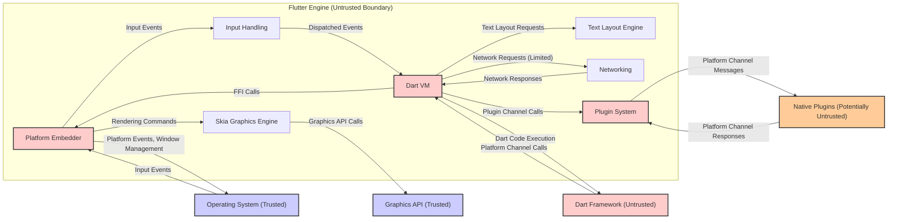
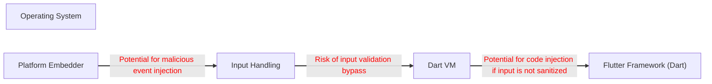
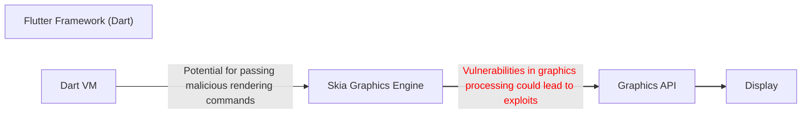
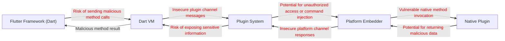

## Project Design Document: Flutter Engine for Threat Modeling (Improved)

**1. Introduction**

This document provides an enhanced architectural overview of the Flutter Engine, specifically designed to facilitate comprehensive threat modeling. It details the key components, their interactions, and data flows, with a strong emphasis on identifying potential attack surfaces and security vulnerabilities. The goal is to provide a clear and actionable understanding of the system's architecture from a security perspective.

**2. Project Overview**

The Flutter Engine serves as the foundational runtime environment for Flutter applications. Implemented primarily in C++, it's engineered for portability across diverse platforms (Android, iOS, Web, Desktop). Its core responsibilities include:

*   High-performance UI rendering using the Skia graphics library.
*   Execution of Dart code via the Dart Virtual Machine (VM).
*   Establishment and management of platform channels for communication with the underlying operating system, representing a significant interaction point and potential attack surface.
*   Processing and routing of input events (touch, mouse, keyboard), a critical area for potential injection vulnerabilities.
*   Provision of a plugin system to extend functionality, introducing a modularity that requires careful security consideration.

This document focuses specifically on the architecture and data flow *within* the Flutter Engine itself, highlighting potential vulnerabilities at this level, rather than the broader Flutter framework or applications built upon it.

**3. Architectural Overview and Potential Attack Surfaces**

The Flutter Engine comprises several interconnected components, each presenting unique security considerations.

*   **Platform Embedder:** This platform-specific integration layer acts as the primary interface between the Flutter Engine and the host operating system. It is responsible for:
    *   Native window creation and management.
    *   The application's main loop execution.
    *   Handling platform-specific events (lifecycle, accessibility), which could be manipulated by a malicious actor.
    *   Setting up the rendering surface, a potential target for graphics-related vulnerabilities.
    *   Interfacing with platform APIs, a critical attack surface if these interactions are not secured.
    *   **Potential Attack Surfaces:** Exploitable vulnerabilities in platform API interactions, mishandling of platform events, and weaknesses in native window management.
*   **Dart VM (Virtual Machine):** This component executes Dart code and is responsible for:
    *   Compilation and execution of Dart code, where vulnerabilities in the JIT compiler could be exploited.
    *   Memory management and garbage collection for Dart objects, potential areas for memory corruption vulnerabilities.
    *   Providing core Dart libraries, which might contain security flaws.
    *   Interacting with the Flutter Engine's C++ code through Foreign Function Interface (FFI), a boundary where type mismatches or improper validation can lead to vulnerabilities.
    *   **Potential Attack Surfaces:** Exploits in the JIT compiler, memory corruption bugs, vulnerabilities in core Dart libraries, and weaknesses in the FFI implementation.
*   **Skia Graphics Engine:** This 2D graphics library renders the Flutter UI and handles:
    *   Drawing shapes, text, and images, where vulnerabilities in image processing or font rendering could exist.
    *   Applying transformations and effects, potential areas for unexpected behavior or exploits.
    *   Interacting with the underlying graphics API (OpenGL, Vulkan, Metal, Direct3D), where vulnerabilities in the API or its usage could be exploited.
    *   **Potential Attack Surfaces:** Vulnerabilities in image decoding, font rendering, shader processing, and improper use of the underlying graphics API.
*   **Text Layout Engine:** This component manages complex text layout and is responsible for:
    *   Handling internationalization and bidirectional text, where vulnerabilities related to complex text processing could arise.
    *   Interacting with font providers, a potential source of malicious fonts.
    *   **Potential Attack Surfaces:** Exploits related to complex text rendering, vulnerabilities in font handling, and denial-of-service through maliciously crafted text.
*   **Input Handling:** This subsystem manages user interactions and is responsible for:
    *   Receiving raw input events from the Platform Embedder, a potential entry point for malicious input.
    *   Processing and dispatching these events to the Dart layer, where improper validation could lead to vulnerabilities.
    *   Handling gesture recognition, which might have vulnerabilities related to complex touch sequences.
    *   **Potential Attack Surfaces:** Input injection vulnerabilities, denial-of-service through malformed input, and exploits in gesture recognition logic.
*   **Networking (Limited Scope within Engine):** While primarily handled at the Dart framework level, the engine provides some low-level networking for:
    *   Downloading assets, a potential vector for delivering malicious content.
    *   Communicating with developer tools, which could be targeted for unauthorized access.
    *   **Potential Attack Surfaces:** Man-in-the-middle attacks during asset download, vulnerabilities in network protocols, and unauthorized access through developer tool communication channels.
*   **Plugin System:** This extension mechanism allows platform-specific code integration and involves:
    *   Defining platform channels for communication between Dart and native code, a critical boundary for security.
    *   Providing mechanisms for registering and invoking platform-specific implementations, where vulnerabilities in plugin code or the communication mechanism can be exploited.
    *   **Potential Attack Surfaces:** Malicious plugins, vulnerabilities in platform channel implementations, insecure communication protocols, and privilege escalation through plugin interactions.

**4. System Architecture Diagram with Security Zones**

**5. Data Flow Diagrams with Security Considerations**

**5.1. User Input Flow and Potential Threats**

**5.2. Rendering Data Flow and Potential Threats**

**5.3. Platform Channel Communication Flow (Plugin) and Potential Threats**

**6. Key Security Considerations and Potential Threats**

This section expands on the initial security considerations, providing more specific examples of potential threats.

*   **Platform Embedder Vulnerabilities:**
    *   Buffer overflows when handling platform events.
    *   Privilege escalation through misuse of platform APIs.
    *   Denial-of-service attacks by flooding the embedder with events.
*   **Dart VM Security:**
    *   Exploitable vulnerabilities in the JIT compiler leading to arbitrary code execution.
    *   Memory corruption bugs allowing attackers to control program flow.
    *   Security flaws in core Dart libraries that could be leveraged.
*   **Skia Graphics Engine Vulnerabilities:**
    *   Remote code execution through vulnerabilities in image decoding libraries.
    *   Denial-of-service attacks by rendering excessively complex graphics.
    *   Cross-site scripting (XSS) vulnerabilities in web-based rendering contexts.
*   **Text Layout Engine Vulnerabilities:**
    *   Denial-of-service attacks by rendering specially crafted text.
    *   Potential for buffer overflows when handling complex text layouts.
    *   Exposure of sensitive information through improper text rendering.
*   **Input Handling Vulnerabilities:**
    *   Input injection attacks (e.g., SQL injection if input is used in database queries in plugins).
    *   Denial-of-service attacks by sending a large volume of input events.
    *   Bypassing security checks through manipulated input sequences.
*   **Plugin Security:**
    *   Malicious plugins designed to steal data or compromise the system.
    *   Vulnerabilities in plugin code that can be exploited by other applications or remote attackers.
    *   Insecure communication over platform channels, allowing for eavesdropping or tampering.
*   **FFI Security:**
    *   Type mismatches between Dart and native code leading to crashes or vulnerabilities.
    *   Improper validation of data passed across the FFI boundary.
    *   Vulnerabilities in the native code called through FFI.
*   **Resource Exhaustion:**
    *   Denial-of-service attacks by consuming excessive CPU, memory, or GPU resources.
    *   Memory leaks leading to application crashes.
*   **Communication Channel Security:**
    *   Man-in-the-middle attacks on network connections used for downloading assets or communicating with developer tools.
    *   Exposure of sensitive information transmitted over unencrypted channels.

**7. Assumptions and Constraints**

*   The primary focus is the security of the core Flutter Engine. Security considerations for the broader Flutter framework and individual applications are outside the immediate scope.
*   It is assumed that the underlying operating system and hardware provide a baseline level of security. However, vulnerabilities in these layers can impact the Flutter Engine.
*   Threat modeling activities will need to consider the specific platform on which the Flutter Engine is deployed, as security landscapes vary significantly.
*   The security of the plugin ecosystem is a critical concern but is largely dependent on the developers of individual plugins. This document highlights the potential risks introduced by plugins.

**8. How to Use This Document for Threat Modeling**

This document provides a structured overview of the Flutter Engine's architecture and potential security vulnerabilities. It can be used in the following ways during threat modeling sessions:

*   **Identify Assets:** The components and data flows described represent key assets that need protection.
*   **Identify Threats:** The "Security Considerations" sections provide a starting point for brainstorming potential threats against each component and data flow.
*   **Identify Attack Surfaces:** The architectural overview and diagrams highlight the boundaries and interaction points that represent potential attack surfaces.
*   **Analyze Vulnerabilities:** The document points to potential vulnerabilities within each component, which can be further investigated.
*   **Model Threats:** The data flow diagrams can be used to trace how threats might propagate through the system.
*   **Prioritize Risks:** The information can help in assessing the likelihood and impact of different threats.

**9. Future Considerations**

*   This document should be reviewed and updated regularly to reflect changes in the Flutter Engine's architecture and the evolving threat landscape.
*   Specific threat modeling exercises should be conducted for different deployment scenarios and platform configurations.
*   Security testing, including penetration testing and code reviews, should be performed to identify and address vulnerabilities.

This improved document provides a more detailed and security-focused view of the Flutter Engine's architecture, making it a valuable resource for conducting thorough and effective threat modeling activities. The explicit mention of potential attack surfaces and threats associated with each component enhances its utility for security analysis.