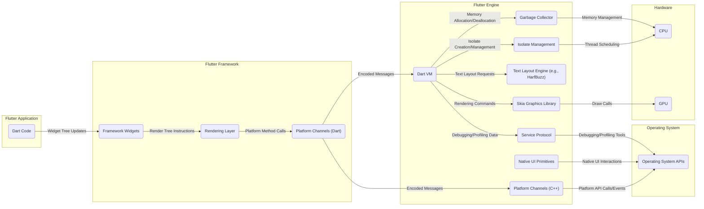
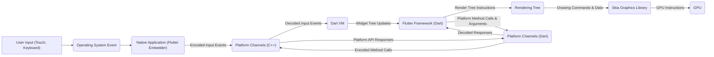

# Project Design Document: Flutter Engine

**Version:** 1.1
**Date:** October 26, 2023
**Prepared By:** Gemini (AI Language Model)

## 1. Introduction

This document provides an enhanced and more detailed design overview of the Flutter Engine, based on the codebase at [https://github.com/flutter/engine](https://github.com/flutter/engine). This revised document aims to provide an even stronger foundation for subsequent threat modeling activities by elaborating on component responsibilities and interactions.

## 2. Goals and Objectives

The primary goal remains to provide a clear and comprehensive understanding of the Flutter Engine's design for security analysis and threat modeling. Specific objectives include:

*   Clearly identifying the major components of the Flutter Engine and their specific roles.
*   Describing the interactions and data flow between these components with greater detail on data types and communication methods.
*   Highlighting external dependencies and interfaces, including specific examples.
*   Providing enhanced visual representations of the engine's architecture and data flow.
*   Offering more specific initial security considerations related to individual components.

## 3. High-Level Architecture

The Flutter Engine serves as the core runtime for Flutter applications, providing the essential low-level functionalities for rendering, input management, and communication with the underlying platform. It's primarily implemented in C++ and acts as an intermediary between the Flutter framework (written in Dart) and the host operating system.

## 4. Key Components and Interactions

This section provides a more detailed description of the major components within the Flutter Engine and their specific interactions:

*   **Dart VM:**
    *   **Role:** Executes Dart code within isolates. Manages memory through a garbage collector. Provides the foundation for Flutter's reactive programming model. Offers debugging and profiling capabilities via the Service Protocol.
    *   **Interactions:**
        *   Receives encoded messages from the Dart Framework via Platform Channels.
        *   Sends rendering commands to the Skia Graphics Library to draw UI elements.
        *   Requests text layout services from the Text Layout Engine.
        *   Manages the lifecycle and communication between Dart isolates.
        *   Provides debugging and profiling data to external tools through the Service Protocol.
*   **Skia Graphics Library:**
    *   **Role:**  A high-performance 2D graphics library responsible for rasterizing UI elements onto the screen. It handles drawing shapes, text, images, and applying effects.
    *   **Interactions:**
        *   Receives rendering commands (e.g., drawRect, drawText) and associated data from the Dart VM.
        *   Utilizes the GPU for hardware acceleration when available, or falls back to software rendering.
        *   Abstracts away platform-specific graphics APIs (e.g., OpenGL, Vulkan, Metal).
*   **Platform Channels (C++):**
    *   **Role:**  The bridge for asynchronous communication between Dart code running in the Dart VM and native platform code. It handles the serialization and deserialization of messages.
    *   **Interactions:**
        *   Receives encoded messages from the Dart Framework (via the Dart side of Platform Channels).
        *   Invokes platform-specific APIs based on the received messages (method calls).
        *   Receives events and data from the native platform and forwards them as messages to the Dart VM.
        *   Handles the marshalling of data types between Dart and native representations.
*   **Text Layout Engine (e.g., HarfBuzz):**
    *   **Role:** Responsible for advanced text layout and shaping, including handling complex scripts, ligatures, and internationalization requirements.
    *   **Interactions:**
        *   Receives text strings, font information, and styling attributes from the Dart VM.
        *   Performs text shaping and returns glyph information and positioning data.
        *   The output is then used by Skia to render the text.
*   **Native UI Primitives:**
    *   **Role:**  Wrappers around native UI components provided by the underlying operating system. These are often used for embedding the Flutter view within a native application and handling platform-specific interactions.
    *   **Interactions:**
        *   Provides a surface for Skia to render onto.
        *   Handles platform-specific input events (touch, keyboard, etc.) and passes them to the engine via Platform Channels.
        *   Can be used to interact with native UI elements or functionalities.
*   **Isolate Management:**
    *   **Role:** Manages the creation, execution, and destruction of Dart isolates, which are independent units of execution with their own memory and event loops. This enables concurrency in Flutter applications.
    *   **Interactions:**
        *   Creates and manages the lifecycle of isolates based on requests from the Dart VM.
        *   Facilitates communication between isolates (if needed).
        *   Handles scheduling and execution of code within isolates.
*   **Garbage Collector:**
    *   **Role:**  An automated memory management system within the Dart VM that reclaims memory occupied by objects that are no longer in use, preventing memory leaks.
    *   **Interactions:**
        *   Monitors object usage within the Dart VM.
        *   Automatically identifies and reclaims unused memory.
        *   Runs periodically or when memory pressure is high.
*   **Service Protocol:**
    *   **Role:**  A communication protocol that allows external tools (like debuggers and profilers) to inspect and control the Dart VM.
    *   **Interactions:**
        *   Exposes APIs for inspecting the state of isolates, objects, and the call stack.
        *   Allows for actions like setting breakpoints, stepping through code, and collecting performance data.
        *   Typically accessed over a network socket.

## 5. Data Flow

This section provides a more granular view of the data flow within the Flutter Engine, highlighting the types of data exchanged between components:

*   **User Interaction:** User input events (e.g., touch coordinates, key presses) are captured by the operating system.
*   **Native Event Handling:** The operating system delivers these raw input events to the native application shell (Flutter Embedder).
*   **Platform Channel Transmission (Native to Dart):** The native application uses Platform Channels to send encoded representations of these input events to the Flutter Engine's C++ side.
*   **Message Decoding and Event Dispatch (C++):** The C++ Platform Channel implementation decodes the messages and dispatches the events to the Dart VM.
*   **Framework Event Processing (Dart):** The Dart framework receives these events and updates the widget tree based on application logic.
*   **Render Tree Construction and Updates (Dart):** Changes in the widget tree trigger the creation or modification of the render tree, which describes how UI elements should be laid out and painted.
*   **Rendering Commands Generation (Dart to Skia):** The rendering layer in the Dart framework translates the render tree into a series of drawing commands (e.g., draw calls for shapes, text, images). These commands, along with associated data (coordinates, colors, etc.), are passed to the Skia Graphics Library.
*   **GPU Rendering (Skia):** Skia processes these commands, leveraging the GPU for accelerated rendering. It translates the high-level commands into low-level GPU instructions.
*   **Platform API Calls (Dart to Native):** Dart code can also initiate communication with the native platform through Platform Channels to access device features or services. This involves encoding method names and arguments, sending them to the native side, and receiving responses.

## 6. External Dependencies and Interfaces

The Flutter Engine relies on several key external libraries and interfaces, each with its own potential security considerations:

*   **Skia Graphics Library:**
    *   **Purpose:**  Core rendering engine.
    *   **Security Implications:** Vulnerabilities in Skia could lead to rendering exploits, denial-of-service, or information disclosure.
*   **Operating System APIs (e.g., Android SDK, iOS SDK, Win32 API):**
    *   **Purpose:**  Provides access to platform-specific functionalities (e.g., sensors, networking, file system).
    *   **Security Implications:** Incorrect usage or vulnerabilities in OS APIs could be exploited by malicious actors.
*   **Text Layout Engine (e.g., HarfBuzz, ICU Layout):**
    *   **Purpose:**  Handles complex text layout and shaping.
    *   **Security Implications:**  Bugs in the text layout engine could potentially lead to crashes or unexpected behavior when processing specially crafted text.
*   **ICU (International Components for Unicode):**
    *   **Purpose:** Provides internationalization and localization support, including text processing and collation.
    *   **Security Implications:** Vulnerabilities in ICU's text processing or data could lead to security issues.
*   **zlib (or similar compression libraries):**
    *   **Purpose:** Used for data compression in various parts of the engine.
    *   **Security Implications:**  Vulnerabilities in compression libraries (e.g., buffer overflows) could be exploited if used improperly.
*   **libpng/libjpeg (or similar image decoding libraries):**
    *   **Purpose:** Used for decoding image formats.
    *   **Security Implications:** Image decoding libraries are common targets for exploits. Vulnerabilities could allow for code execution when processing malicious images.

## 7. Deployment

The Flutter Engine is not deployed as a standalone executable. Instead, it is compiled and packaged as a platform-specific library or framework that is embedded within a native application shell. The deployment process involves:

*   **Compilation:** The C++ source code of the Flutter Engine is compiled for the target platform (e.g., ARM for mobile, x64 for desktop).
*   **Packaging:** The compiled engine is packaged along with the Dart code and assets of the Flutter application into an application bundle (e.g., APK for Android, IPA for iOS, executable for desktop).
*   **Integration:** The native application shell initializes the Flutter Engine and provides a surface for rendering.

## 8. Security Considerations (Specific to Components)

This section expands on the initial security considerations, providing more specific examples related to individual components:

*   **Dart VM:**
    *   **Potential Threats:**  JIT compilation vulnerabilities, sandbox escapes, memory corruption bugs in the garbage collector, vulnerabilities in the Service Protocol allowing unauthorized access or control.
*   **Skia Graphics Library:**
    *   **Potential Threats:** Rendering vulnerabilities leading to crashes or arbitrary code execution, denial-of-service through resource exhaustion, pixel injection attacks.
*   **Platform Channels (C++ and Dart):**
    *   **Potential Threats:**  Injection of malicious method calls from the native side, insecure data serialization/deserialization leading to vulnerabilities, unauthorized access to platform APIs.
*   **Text Layout Engine:**
    *   **Potential Threats:**  Crashes or unexpected behavior when processing maliciously crafted text, potential for buffer overflows during text shaping.
*   **Native UI Primitives:**
    *   **Potential Threats:**  Security vulnerabilities in the underlying native UI components could be exposed, improper handling of platform events leading to unexpected behavior.
*   **Isolate Management:**
    *   **Potential Threats:**  Bypassing isolate boundaries to access sensitive data or execute code in other isolates.
*   **External Dependencies:**
    *   **Potential Threats:**  Vulnerabilities in any of the external libraries (Skia, HarfBuzz, ICU, etc.) could be exploited through the Flutter Engine. This highlights the importance of keeping dependencies up-to-date and performing security audits.

## 9. Future Considerations

Future development efforts for the Flutter Engine may include:

*   **Enhanced Security Features:**  Implementation of new security mechanisms, such as improved sandboxing or memory protection.
*   **Further Performance Optimizations:**  Continued efforts to improve rendering performance and reduce resource consumption, potentially involving changes to core components.
*   **New Platform Support:**  Adapting the engine to support emerging platforms and architectures, which may introduce new security challenges.
*   **Modularity Improvements:**  Further modularization of the engine could impact dependency management and security boundaries.

This detailed design document serves as a comprehensive resource for understanding the architecture and components of the Flutter Engine. It provides a solid foundation for conducting thorough threat modeling exercises to identify and mitigate potential security risks.