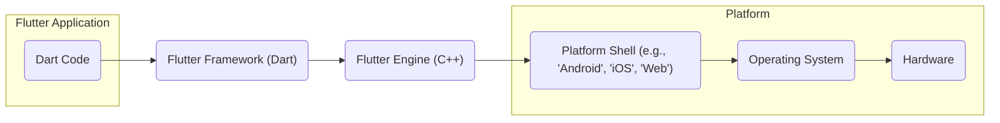
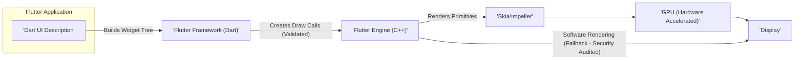
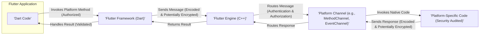

# Project Design Document: Flutter Engine for Threat Modeling

**Version:** 1.1
**Date:** October 26, 2023
**Prepared By:** AI Software Architect

## 1. Introduction

This document provides an enhanced architectural overview of the Flutter Engine, specifically tailored for subsequent threat modeling activities. It elaborates on the key components, their interactions, and the data flows within the engine, with a stronger focus on security implications. This document aims to provide a more granular understanding of the system's structure to facilitate a more comprehensive identification of potential security vulnerabilities. The target project is the open-source Flutter Engine, as found on GitHub: [https://github.com/flutter/engine](https://github.com/flutter/engine).

## 2. Goals and Objectives

*   Provide a clear and detailed architectural overview of the Flutter Engine, emphasizing security-relevant aspects.
*   Identify key components and their specific responsibilities, including potential security risks associated with each.
*   Describe the primary data flows within the engine, highlighting trust boundaries and potential points of compromise.
*   Elaborate on potential areas of security concern with concrete examples for future threat modeling.
*   Serve as a robust foundational document for security assessments, penetration testing, and vulnerability analysis.

## 3. Architectural Overview

The Flutter Engine serves as the core runtime for Flutter applications, bridging the gap between the Dart-based Flutter Framework and the underlying platform. Its C++ implementation handles critical functionalities and interacts directly with system resources.

Here's a high-level architectural diagram:

## 4. Key Components

This section provides a more detailed breakdown of the Flutter Engine's key components, with a focus on their security implications:

*   **Dart VM Integration:**
    *   **Responsibility:** Executes Dart code, manages memory for Dart objects, and facilitates communication between Dart and native code.
    *   **Security Implications:** Vulnerabilities in the Dart VM could lead to arbitrary code execution. Improper isolation between isolates could allow cross-isolate attacks. The boundary between Dart and native code is a critical point for security checks.
*   **Skia/Impeller Graphics Library:**
    *   **Responsibility:** Renders UI elements using 2D graphics, leveraging hardware acceleration where available. Impeller is a newer rendering engine aiming to replace Skia on some platforms.
    *   **Security Implications:**  Bugs in Skia or Impeller could lead to denial-of-service through malformed rendering commands or potentially allow for memory corruption. Handling untrusted image data is a key security concern.
*   **Text Layout Engine:**
    *   **Responsibility:** Handles text rendering, including complex scripts and internationalization.
    *   **Security Implications:** Vulnerabilities in text layout engines can sometimes be exploited for code execution through specially crafted text (e.g., buffer overflows).
*   **Input Handling:**
    *   **Responsibility:** Receives and processes input events from the platform (touch, mouse, keyboard).
    *   **Security Implications:** Improper input validation can lead to injection attacks or unexpected application behavior. Handling of sensitive input data (e.g., passwords) requires careful consideration.
*   **Platform Channels:**
    *   **Responsibility:** Enables communication between the Flutter Framework (Dart) and platform-specific native code. Uses message passing with defined codecs.
    *   **Security Implications:** This is a major trust boundary. Lack of proper authorization or authentication for channel calls can lead to unauthorized access to platform features. Vulnerabilities in the message encoding/decoding or the native code implementations can be exploited. Data passed through channels needs careful sanitization.
*   **Native UI Integration (Platform Shells):**
    *   **Responsibility:** Platform-specific code that embeds the Flutter Engine, manages the application lifecycle, and handles platform API interactions. Examples include the 'Android' shell, 'iOS' shell, and 'Web' shell.
    *   **Security Implications:** Security vulnerabilities in the platform shell can directly impact the security of the Flutter application. Improper handling of permissions, intents, or other platform-specific features can be exploited. The web shell introduces browser-specific security considerations.
*   **Networking:**
    *   **Responsibility:** Provides functionalities for making network requests, relying on the underlying platform's capabilities.
    *   **Security Implications:** Standard network security concerns apply (e.g., TLS/SSL vulnerabilities, man-in-the-middle attacks). The engine's networking components must handle untrusted network data securely.
*   **File System Access:**
    *   **Responsibility:** Provides access to the device's file system, subject to platform-specific permissions.
    *   **Security Implications:** Improper handling of file paths or permissions can lead to unauthorized file access or manipulation. Vulnerabilities could allow access to sensitive data or modification of critical files.
*   **Isolates:**
    *   **Responsibility:** Dart's concurrency model, providing independent execution units with separate memory.
    *   **Security Implications:** While isolates provide a degree of isolation, vulnerabilities in the communication mechanisms between isolates could be exploited.
*   **Plugin System:**
    *   **Responsibility:** Allows developers to extend Flutter's functionality with platform-specific code. Plugins often utilize Platform Channels.
    *   **Security Implications:**  Plugins introduce external code into the application, increasing the attack surface. Untrusted or poorly written plugins can introduce vulnerabilities.

## 5. Data Flow Diagrams

These diagrams illustrate key data flows within the Flutter Engine, highlighting potential security implications:

### 5.1. Secure Rendering Pipeline

*   The Flutter Framework generates drawing instructions from the Dart UI description.
*   The Flutter Engine receives these instructions and should perform validation to prevent malicious or malformed commands from reaching the rendering libraries.
*   Skia or Impeller renders the primitives, ideally leveraging the GPU. Fallback software rendering paths should be carefully audited for security vulnerabilities.

### 5.2. Secure Platform Channel Communication

*   Dart code initiates platform method calls, which should be subject to authorization checks.
*   Messages passed through Platform Channels should be encoded and potentially encrypted to protect sensitive data.
*   The Flutter Engine should perform authentication and authorization checks before routing messages to native code.
*   Native code implementations should be security audited to prevent vulnerabilities.
*   Results returned from native code should be validated before being used by the Dart application.

### 5.3. Secure Input Event Handling

*   User input is initially captured by the operating system.
*   The Platform Shell should perform initial sanitization of input events.
*   The Flutter Engine must perform thorough validation of input events to prevent injection attacks and ensure data integrity.
*   Validated events are then dispatched to the Flutter Framework.

## 6. Security Considerations (Detailed)

This section provides more concrete examples of potential security concerns:

*   **Platform Channel Security:**
    *   **Threat:** Malicious native code invoked through a Platform Channel could bypass Flutter's security measures and access sensitive device resources or data.
    *   **Threat:** Injection vulnerabilities could arise if data passed through Platform Channels is not properly sanitized on either the Dart or native side. For example, SQL injection if passing data to a native database query.
    *   **Threat:** Lack of mutual authentication between the Flutter Engine and native code could allow unauthorized native components to interact with the application.
*   **Native Code Vulnerabilities:**
    *   **Threat:** Buffer overflows, use-after-free errors, or other memory management issues in the platform-specific native code could be exploited to gain control of the application or device.
    *   **Threat:** Native libraries with known vulnerabilities could be linked into the platform shell, exposing the application to those vulnerabilities.
*   **Memory Management:**
    *   **Threat:** Memory corruption vulnerabilities in the Flutter Engine's C++ code could lead to crashes, denial-of-service, or arbitrary code execution.
    *   **Threat:** Improper handling of memory shared between the Dart VM and the native engine could lead to data corruption or security breaches.
*   **Graphics Rendering:**
    *   **Threat:** A maliciously crafted image or rendering command could exploit a vulnerability in Skia or Impeller, leading to a crash or potentially allowing for code execution.
    *   **Threat:** Denial-of-service attacks could be launched by sending a large number of complex rendering commands, overwhelming the rendering pipeline.
*   **Input Handling:**
    *   **Threat:** Cross-site scripting (XSS) vulnerabilities could arise in web-based Flutter applications if user input is not properly sanitized before being rendered.
    *   **Threat:** Input validation failures could allow attackers to inject malicious code or commands through text fields or other input mechanisms.
*   **Networking:**
    *   **Threat:** Applications could be vulnerable to man-in-the-middle attacks if network communication is not properly encrypted using TLS/SSL.
    *   **Threat:** Improper handling of network responses could lead to vulnerabilities such as buffer overflows or injection attacks.
*   **File System Access:**
    *   **Threat:** Path traversal vulnerabilities could allow attackers to access files outside of the intended application sandbox.
    *   **Threat:** Improper handling of file permissions could allow unauthorized access to sensitive data stored on the device.
*   **Third-Party Dependencies:**
    *   **Threat:** Vulnerabilities in third-party libraries used by the Flutter Engine could be exploited to compromise the engine's security. Regular security audits and updates of dependencies are crucial.
*   **Web Platform Security:**
    *   **Threat:** Standard web security vulnerabilities like XSS, CSRF, and clickjacking need to be considered when deploying Flutter applications on the web.
    *   **Threat:** Improper interaction with the browser's security sandbox could lead to security breaches.
*   **Build Process and Supply Chain:**
    *   **Threat:** A compromised build environment or malicious dependencies introduced during the build process could inject vulnerabilities or malware into the Flutter Engine.

## 7. Assumptions and Constraints

*   This document assumes a standard deployment environment for Flutter applications.
*   The security of the underlying operating system and hardware is considered a foundational layer, but vulnerabilities in these layers could still impact Flutter applications.
*   The security of individual plugins is the responsibility of the plugin developers, but the Flutter Engine's architecture should aim to minimize the impact of plugin vulnerabilities.
*   This document reflects the general architecture and may not cover every platform-specific nuance.

## 8. Out of Scope

The following are explicitly considered out of scope for this design document:

*   Detailed security analysis of individual Flutter applications built using the engine.
*   Specific security configurations and best practices for developers using the Flutter framework.
*   Comprehensive vulnerability analysis of all third-party libraries used by the Flutter Engine (focus is on the engine's architecture and interfaces).
*   Detailed cloud infrastructure security for deploying Flutter web applications (focus is on the client-side engine).
*   Runtime application self-protection (RASP) or other advanced security measures applied at the application level.

## 9. Future Considerations

*   Regularly update this document to reflect architectural changes, new features, and evolving security best practices.
*   Use this document as a basis for creating specific threat models for different components and data flows within the Flutter Engine.
*   Incorporate findings from security audits and penetration testing to further refine the understanding of potential vulnerabilities.
*   Consider the integration of security scanning tools into the Flutter Engine's development and build processes.