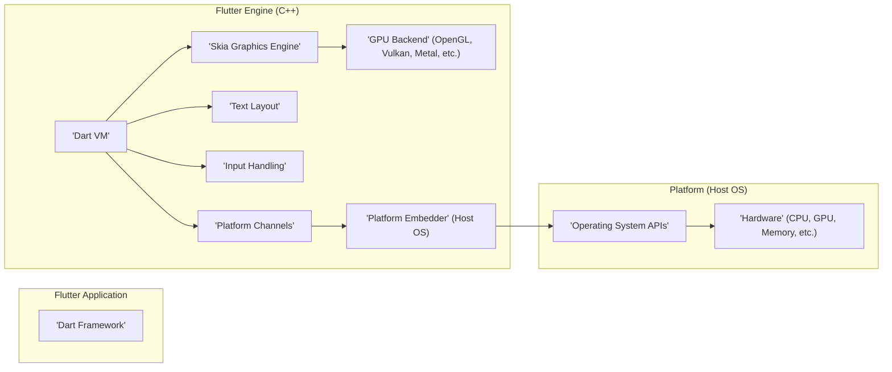
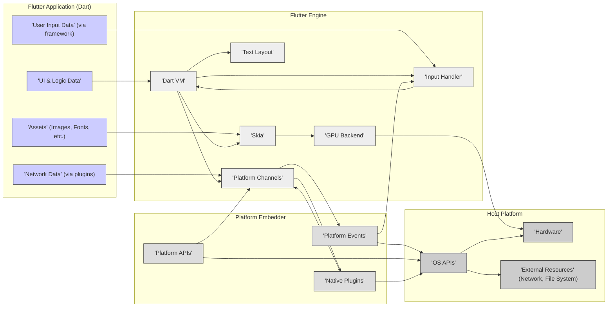

# Flutter Engine Project Design Document for Threat Modeling

**Version:** 1.1
**Date:** October 26, 2023
**Author:** AI Software Architecture Expert

## 1. Introduction

This document provides a refined and enhanced design overview of the Flutter Engine project ([https://github.com/flutter/engine](https://github.com/flutter/engine)), specifically tailored for threat modeling activities. Building upon the previous version, this document aims for greater clarity, conciseness, and a stronger focus on security-relevant aspects of the system. It outlines the system's architecture, key components, data flow, and technologies, emphasizing elements critical for identifying potential vulnerabilities and designing effective security mitigations.

Flutter Engine remains the foundational runtime environment for Flutter applications, responsible for core functionalities like graphics rendering, user input processing, Dart VM management, and platform integration. A deep understanding of its architecture, as presented in this document, is paramount for proactive security analysis and risk management.

## 2. Goals and Objectives

The core goals of the Flutter Engine, with a security lens, are:

* **Secure High-Performance Rendering:**  To deliver a rendering pipeline that is not only performant but also resilient to rendering-related attacks (e.g., shader exploits, resource exhaustion).
* **Secure Cross-Platform Compatibility:** To ensure consistent and secure execution of Flutter applications across diverse platforms, minimizing platform-specific security vulnerabilities.
* **Efficient and Secure Resource Management:** To optimize resource utilization while preventing resource-based denial-of-service attacks and ensuring secure memory handling.
* **Secure Extensibility and Embeddability:** To facilitate embedding in various host environments without compromising security, and to manage plugin security effectively.
* **Robust Security Posture:** To provide a secure execution environment for Flutter applications, actively protecting user data, system integrity, and preventing common attack vectors. This document is explicitly designed to facilitate threat modeling to achieve this goal.

## 3. System Architecture

The Flutter Engine's architecture is structured in layers, each with distinct responsibilities and security implications.

### 3.1. High-Level Architecture

**Description (Security Focused):**

* **Flutter Application ('Dart Framework'):**  The Dart codebase, while primarily application logic, can introduce vulnerabilities if it interacts insecurely with platform channels or handles sensitive data improperly. Input validation and secure coding practices in Dart are crucial.
* **Flutter Engine ('Dart VM', 'Skia Graphics Engine', etc.):** This C++ core is the primary focus for threat modeling. Each component within the engine has its own security surface:
    * **'Dart VM':**  Responsible for secure code execution, memory management, and isolation. VM vulnerabilities can have severe consequences.
    * **'Skia Graphics Engine':**  Handles untrusted image data, shaders, and rendering commands. Vulnerabilities here can lead to rendering exploits or denial of service.
    * **'Text Layout':** Processes potentially malicious font files and complex text input. Font parsing and Unicode handling are security-sensitive.
    * **'Input Handling':**  Receives and sanitizes user input from various sources. Input validation and preventing injection attacks are key concerns.
    * **'Platform Channels':**  The communication bridge to native code. Secure serialization, deserialization, and message handling are vital to prevent exploits.
    * **'GPU Backend':** Interacts with GPU drivers and executes shaders. GPU driver vulnerabilities and shader exploits are potential risks.
* **Platform ('Platform Embedder', 'Operating System APIs', 'Hardware'):** The host platform provides the execution environment.
    * **'Platform Embedder':**  Bridges the engine to the OS, managing platform API access and plugins. Embedder vulnerabilities can expose platform APIs insecurely.
    * **'Operating System APIs':**  Underlying OS APIs can have vulnerabilities that the engine might indirectly expose or be affected by.
    * **'Hardware':** Hardware vulnerabilities (though less directly controlled by Flutter Engine code) can still impact overall system security.

### 3.2. Detailed Component Breakdown (Security Perspective)

This section elaborates on the security-relevant aspects of each key component.

#### 3.2.1. 'Dart Virtual Machine' (VM)

* **Security Relevance:** **High**. The Dart VM is the execution engine and a critical security boundary.
    * **Threats:**
        * **JIT/AOT Vulnerabilities:** Exploits in the Just-In-Time (JIT) or Ahead-Of-Time (AOT) compilation processes could lead to arbitrary code execution.
        * **Memory Corruption:** Buffer overflows, use-after-free, and other memory management errors in the VM can be exploited for code injection or denial of service.
        * **Isolate Breakouts:**  If isolate boundaries are compromised, attackers could gain access to data or resources in other isolates, breaking the intended isolation model.
        * **Sandbox Escapes:** In sandboxed environments (e.g., web), VM vulnerabilities could allow escaping the sandbox.

#### 3.2.2. 'Skia Graphics Engine'

* **Security Relevance:** **Medium to High**. Skia processes untrusted data (images, shaders) and interacts with the GPU.
    * **Threats:**
        * **Image Processing Exploits:** Maliciously crafted images (PNG, JPEG, etc.) could exploit vulnerabilities in image decoding libraries within Skia, leading to buffer overflows, denial of service, or even code execution.
        * **Shader Vulnerabilities:**  Custom shaders, if allowed, could contain malicious code or exploit GPU driver vulnerabilities, potentially causing crashes, information leaks, or denial of service.
        * **Canvas API Abuse:**  Unexpected or excessive use of Canvas drawing operations could lead to resource exhaustion and denial of service.
        * **Dependency Vulnerabilities:** Skia relies on external libraries (e.g., for image codecs). Vulnerabilities in these dependencies are inherited by Skia.

#### 3.2.3. 'Text Layout'

* **Security Relevance:** **Low to Medium**. Text layout handles potentially complex and untrusted text input and font files.
    * **Threats:**
        * **Font Parsing Exploits:** Maliciously crafted font files (e.g., TrueType, OpenType) could exploit vulnerabilities in font parsing libraries, leading to code execution or denial of service.
        * **Unicode Exploits:**  Complexities in Unicode and bidirectional text rendering could be exploited to create visually misleading text or trigger vulnerabilities in text processing logic.
        * **Resource Exhaustion (Text Bomb):**  Processing extremely large or complex text inputs could lead to excessive resource consumption and denial of service.

#### 3.2.4. 'Input Handling'

* **Security Relevance:** **Medium**. Input handling receives user input, which can be a source of various attacks.
    * **Threats:**
        * **Input Injection:**  Lack of proper input sanitization could allow injection attacks (e.g., if input is used to construct commands or queries).
        * **Event Spoofing/Manipulation:**  Malicious actors might attempt to spoof or manipulate input events to bypass security checks or trigger unintended application behavior.
        * **Denial of Service (Input Flooding):**  Flooding the engine with excessive input events could lead to resource exhaustion and denial of service.

#### 3.2.5. 'Platform Channels'

* **Security Relevance:** **High**. Platform channels are the primary interface for communication with native code and platform APIs, representing a significant security boundary.
    * **Threats:**
        * **Serialization/Deserialization Vulnerabilities:** Exploits in the serialization or deserialization of data exchanged over platform channels (e.g., buffer overflows, type confusion) could lead to code execution or data corruption.
        * **Message Handling Vulnerabilities:**  Improper validation or handling of messages received from native code could lead to vulnerabilities in the Dart side or vice versa.
        * **Privilege Escalation:**  Platform channels could be misused to access privileged platform APIs if access control is not properly enforced, leading to privilege escalation.
        * **Cross-Language Attack Surface:** Communication between Dart and native code introduces complexities and potential vulnerabilities arising from language interoperability issues.

#### 3.2.6. 'Platform Embedder'

* **Security Relevance:** **Medium to High**. The platform embedder controls access to platform APIs and manages plugins, making it a critical component for platform security integration.
    * **Threats:**
        * **Insecure Platform API Exposure:**  Vulnerabilities in the embedder could expose native platform APIs in an insecure manner, allowing unauthorized access or misuse.
        * **Plugin Security Risks:**  Malicious or vulnerable plugins can be loaded through the embedder. Insecure plugin management (e.g., lack of sandboxing, insufficient permission controls) can introduce significant security risks.
        * **Resource Management Issues:**  Resource leaks or exhaustion in the embedder (e.g., memory leaks, handle leaks) could lead to denial of service or system instability.
        * **IPC Vulnerabilities (Web Embedder):** In web embeddings, vulnerabilities in inter-process communication mechanisms used by the embedder could be exploited.

#### 3.2.7. 'GPU Backend'

* **Security Relevance:** **Low to Medium**. The GPU backend interacts with GPU drivers and hardware, which can have their own security issues.
    * **Threats:**
        * **GPU Driver Vulnerabilities:**  Flutter Engine relies on GPU drivers, which are complex and can contain vulnerabilities. Exploiting driver vulnerabilities is generally outside the engine's direct control but can impact its security.
        * **Shader Exploits (Indirect):** While less direct, vulnerabilities in shader compilers or GPU hardware could potentially be triggered by specific shader code generated by Skia, indirectly impacting the engine.
        * **Resource Exhaustion (GPU Memory):**  Excessive GPU memory allocation or rendering operations could lead to GPU resource exhaustion and denial of service.

## 4. Data Flow (Security Focused)

This data flow diagram highlights data paths relevant to security, emphasizing points where data enters or leaves security boundaries.

**Security Data Flow Description:**

1. **Untrusted Data Ingress:**
    * **'Assets' (DB):** Images, fonts, and other assets loaded from application bundles or potentially downloaded from the network are untrusted data sources that are processed by 'Skia' (EB) and 'Text Layout' (EC).
    * **'Network Data' (DC):** Data received from network requests (via plugins and platform channels) is inherently untrusted and enters the engine through 'Platform Channels' (EE).
    * **'User Input Data' (DD):** User input from various sources (touches, keyboard, etc.) is untrusted and is processed by the 'Input Handler' (ED).

2. **Engine Internal Data Flow:**
    * **'Dart VM' (EA) as Central Hub:** The 'Dart VM' is the central component, processing application logic and interacting with other engine components. Data flows through the VM to 'Skia', 'Text Layout', 'Input Handler', and 'Platform Channels'.
    * **Rendering Pipeline ('Skia' -> 'GPU Backend'):** UI data flows from the 'Dart VM' to 'Skia' (EB) for rendering, and then to the 'GPU Backend' (EF) for GPU processing and display. This pipeline handles potentially complex and untrusted rendering commands.
    * **Input Event Handling ('Platform Events' -> 'Input Handler' -> 'Dart VM'):** Platform events (FA) are translated and processed by the 'Input Handler' (ED) and then passed to the 'Dart VM' (EA) for application logic to react to.

3. **Platform Interaction (Security Boundaries):**
    * **'Platform Channels' (EE) as Security Gateway:** 'Platform Channels' are the primary interface for communication with the 'Platform Embedder' (FA, FB, FC) and native code. This is a critical security boundary where data is serialized, deserialized, and exchanged between Dart and native environments.
    * **'Native Plugins' (FC):** Native plugins, accessed via 'Platform Channels', can introduce external code and dependencies, expanding the attack surface. Their security is crucial.
    * **'Platform APIs' (FB, GA):** Access to platform APIs through 'Platform Channels' and the 'Platform Embedder' must be carefully controlled to prevent unauthorized access or misuse.

4. **Data Egress (Less Direct Security Impact, but relevant for data leaks):**
    * **'GPU Backend' -> 'Hardware':** Rendered output is sent to the GPU and displayed. While less directly related to code execution vulnerabilities, unauthorized access to rendered output could be a security concern in certain contexts.
    * **'Platform Channels' -> 'External Resources':** Data might be sent out to external resources (network, file system) via platform channels and native plugins. Secure handling of data egress is important to prevent data leaks.

## 5. Technologies Used

*(No significant changes from v1.0, but reiterated for completeness)*

* **Programming Languages:**
    * **C++:** Core Flutter Engine.
    * **Dart:** Flutter Framework and application code.
    * **Platform-Specific Languages:** Objective-C/Swift (iOS), Java/Kotlin (Android), JavaScript/HTML/CSS (Web), C/C++/Objective-C/Swift/Java/Kotlin (Desktop).
* **Graphics Libraries:**
    * **Skia:** 2D graphics engine.
    * **OpenGL, Vulkan, Metal, Direct3D:** GPU APIs (platform-dependent).
* **Virtual Machine:**
    * **Dart VM:** Custom VM for Dart.
* **Build System:**
    * **GN (Generate Ninja), Ninja.**
* **Inter-Process Communication (IPC):** (Web, Desktop embeddings).
* **Platform-Specific SDKs/APIs:** iOS SDK, Android SDK, Web APIs, Desktop OS APIs.

## 6. Security Considerations (Actionable Threat Areas)

This section categorizes security considerations into actionable threat areas, aligned with the components and data flows described above, to facilitate threat modeling exercises.

**6.1. Dart VM Threats:**

* **Code Execution via VM Exploits:**
    * **JIT/AOT Compiler Vulnerabilities:** Target compiler bugs to inject malicious code during compilation.
    * **Memory Corruption in VM Runtime:** Exploit memory management errors (buffer overflows, use-after-free) to gain control of execution flow.
* **Isolate Isolation Failures:**
    * **Cross-Isolate Attacks:** Attempt to break out of isolate boundaries to access data or resources in other isolates.
* **Sandbox Escape (Web):**
    * **VM Vulnerabilities leading to Sandbox Escape:** Exploit VM bugs to bypass web browser sandbox restrictions.

**6.2. Skia Graphics Engine Threats:**

* **Rendering Pipeline Exploits:**
    * **Image Processing Vulnerabilities:**  Supply malicious images to trigger vulnerabilities in image decoding (buffer overflows, etc.).
    * **Shader Exploits:**  If custom shaders are allowed, inject malicious shader code to exploit GPU drivers or hardware.
    * **Canvas API Abuse (DoS):**  Craft rendering commands to cause excessive resource consumption and denial of service.
* **Dependency Vulnerabilities (Skia Libraries):**
    * **Exploit Known Vulnerabilities:** Target known vulnerabilities in Skia's third-party dependencies (image codecs, etc.).

**6.3. Text Layout Threats:**

* **Font Parsing Exploits:**
    * **Malicious Font Files:** Provide crafted font files to exploit vulnerabilities in font parsing libraries.
* **Unicode/Text Processing Exploits:**
    * **Unicode Attacks:**  Use complex Unicode sequences to trigger vulnerabilities in text rendering or processing logic.
* **Text Bomb (DoS):**
    * **Large/Complex Text Input:**  Provide extremely large or complex text inputs to cause resource exhaustion.

**6.4. Input Handling Threats:**

* **Input Injection Attacks:**
    * **Lack of Input Sanitization:**  Exploit insufficient input validation to inject commands or malicious data.
* **Event Spoofing/Manipulation:**
    * **Spoofed Input Events:**  Send fabricated input events to manipulate application behavior.
* **Input Flooding (DoS):**
    * **Excessive Input Events:**  Flood the engine with input events to cause resource exhaustion.

**6.5. Platform Channel Threats:**

* **Serialization/Deserialization Exploits:**
    * **Data Format Vulnerabilities:**  Exploit vulnerabilities in serialization/deserialization libraries or processes (buffer overflows, type confusion).
* **Message Handling Vulnerabilities:**
    * **Malformed Messages:**  Send crafted messages from native code to exploit vulnerabilities in Dart message handling logic.
    * **Unvalidated Messages:**  Exploit lack of validation of messages received from native code.
* **Privilege Escalation via Platform Channels:**
    * **Unauthorized API Access:**  Misuse platform channels to gain access to privileged platform APIs without proper authorization.

**6.6. Platform Embedder Threats:**

* **Platform API Security Issues:**
    * **Insecure API Exposure:**  Embedder vulnerabilities leading to insecure access to platform APIs.
* **Plugin Security Risks:**
    * **Malicious Plugins:**  Load and execute malicious plugins.
    * **Vulnerable Plugins:**  Exploit vulnerabilities in third-party plugins.
    * **Insecure Plugin Management:**  Exploit weaknesses in plugin loading, isolation, or permission management.
* **Embedder Resource Management Issues (DoS):**
    * **Resource Leaks/Exhaustion:**  Cause resource leaks or exhaustion in the embedder to lead to denial of service.

**6.7. GPU Backend Threats:**

* **GPU Driver Vulnerabilities (Indirect):**
    * **Trigger Driver Bugs:**  Craft rendering commands or shaders to trigger known or unknown vulnerabilities in GPU drivers.
* **GPU Resource Exhaustion (DoS):**
    * **Excessive GPU Usage:**  Cause excessive GPU memory allocation or rendering operations to lead to denial of service.

**6.8. Dependency Threats (General):**

* **Third-Party Library Vulnerabilities:**
    * **Exploit Known Vulnerabilities:** Target known vulnerabilities in any third-party libraries used by the Flutter Engine (beyond Skia dependencies).

**6.9. Web Embedding Specific Threats:**

* **Web Security Context Exploits:**
    * **Cross-Site Scripting (XSS):**  If Flutter web apps are not properly secured, XSS vulnerabilities could be introduced.
    * **CORS Bypass/Exploits:**  Attempt to bypass or exploit Cross-Origin Resource Sharing (CORS) policies.
    * **JavaScript Interop Vulnerabilities:**  Exploit vulnerabilities arising from interoperability between Dart/Flutter and JavaScript in web environments.

## 7. Deployment Model

*(No significant changes from v1.0, but reiterated for context)*

Flutter Engine deployment models remain the same, with security implications varying by platform (Mobile, Web, Desktop, Embedded). Web deployments introduce web-specific threats, while mobile and desktop deployments have different local security considerations.

## 8. Future Considerations (Security Hardening)

*(Expanded for proactive security measures)*

* **Proactive Security Measures:**
    * **Regular Security Audits & Penetration Testing:**  Mandatory and frequent security assessments by internal and external experts.
    * **Automated Fuzzing & Vulnerability Scanning:**  Integrate fuzzing and static/dynamic analysis tools into the CI/CD pipeline.
    * **Secure Development Lifecycle (SDL):**  Implement a robust SDL with security gates at each stage of development.
    * **Security-Focused Code Reviews:**  Mandatory security reviews for all code changes, focusing on identified threat areas.
    * **Dependency Vulnerability Management:**  Automated tracking and patching of vulnerabilities in all dependencies.
* **Architectural Security Enhancements:**
    * **Strengthened Isolate Security:**  Continuous improvement of Dart isolate security and isolation mechanisms.
    * **Sandboxing & Privilege Separation:**  Explore and implement sandboxing techniques and privilege separation within the engine to limit the impact of vulnerabilities.
    * **Memory Safety Improvements:**  Investigate and adopt memory-safe programming practices and tools to mitigate memory corruption vulnerabilities.
    * **Runtime Security Monitoring:**  Implement runtime security monitoring and anomaly detection to identify and respond to potential attacks.
* **Community Engagement & Bug Bounty:**
    * **Public Bug Bounty Program:**  Establish a public bug bounty program to incentivize external security researchers to find and report vulnerabilities.
    * **Security Community Collaboration:**  Actively engage with the security community to share knowledge and best practices.

This improved document provides a more refined and actionable foundation for threat modeling the Flutter Engine. The enhanced security considerations and threat categorization should facilitate a more focused and effective threat modeling process. Remember to tailor the threat modeling exercise to the specific deployment context and platform.