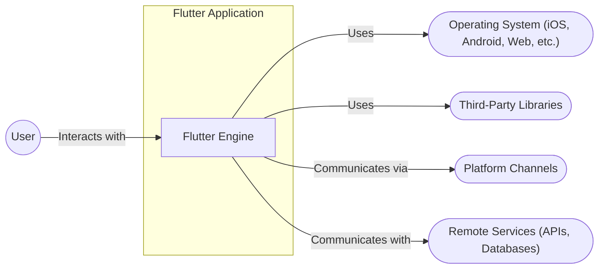
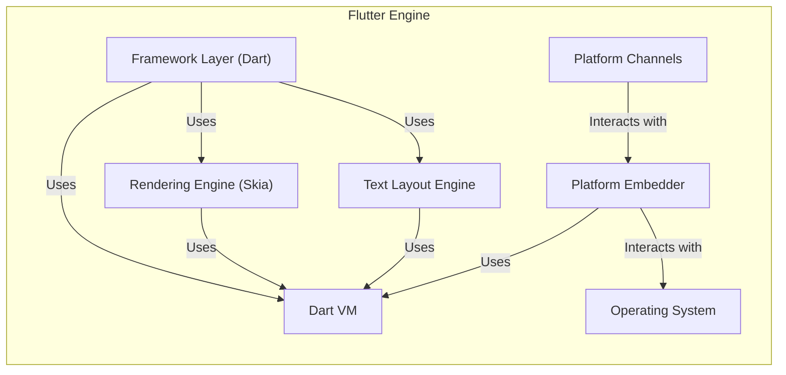
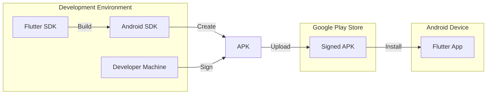

Okay, let's create a design document for the Flutter Engine, keeping in mind its purpose and potential security considerations.

# BUSINESS POSTURE

The Flutter Engine is the core of the Flutter framework, responsible for rendering, compositing, and managing the low-level interactions with the underlying operating system.  It's a critical component for any Flutter application.

Priorities and Goals:

*   Performance:  Provide a fast and smooth user experience, aiming for 60/120 frames per second rendering.
*   Cross-Platform Compatibility:  Support a wide range of platforms (iOS, Android, Web, Windows, macOS, Linux, embedded) with a single codebase.
*   Extensibility: Allow developers to extend the engine's functionality through plugins and custom platform-specific code.
*   Reliability:  Ensure stability and prevent crashes or unexpected behavior.
*   Developer Experience: Provide a good developer experience, with tools for debugging, profiling, and hot reload.

Business Risks:

*   Performance Degradation:  Slow rendering or janky animations would severely impact the user experience, making Flutter applications unusable.
*   Platform Incompatibilities:  Bugs or limitations on specific platforms could fragment the Flutter ecosystem and limit its reach.
*   Security Vulnerabilities:  Exploitable vulnerabilities in the engine could compromise user data or device security, especially given its low-level access.
*   Third-Party Code Risks:  Reliance on third-party libraries and plugins introduces the risk of supply chain attacks or vulnerabilities in those dependencies.
*   Lack of Adoption: If the engine is too complex, difficult to use, or lacks essential features, it may fail to gain widespread adoption.

# SECURITY POSTURE

Existing Security Controls:

*   security control: Sandboxing: Flutter applications, and by extension the engine, run within the operating system's sandboxing mechanisms (e.g., App Sandbox on macOS, SELinux on Android). This limits the engine's access to system resources and other applications. (Described in platform documentation and Flutter security guidelines).
*   security control: Code Signing: Flutter applications are typically code-signed, ensuring that the code hasn't been tampered with. (Described in platform-specific deployment guides).
*   security control: Memory Safety: The engine is primarily written in C++, but uses Dart for much of the framework layer. Dart is a memory-safe language, reducing the risk of memory corruption vulnerabilities. (Described in Dart language documentation).
*   security control: Regular Updates: The Flutter team regularly releases updates and security patches to address known vulnerabilities. (Described in Flutter release notes).
*   security control: Fuzzing: The Flutter engine uses fuzzing to test for vulnerabilities. (Described in Flutter's fuzzing documentation and continuous integration setup).
*   security control: Static Analysis: Static analysis tools are used to identify potential security issues during development. (Described in Flutter's continuous integration setup).
*   security control: Dependency Management: The Flutter build system manages dependencies, helping to ensure that known vulnerable libraries are not used. (Described in Flutter's build system documentation).

Accepted Risks:

*   accepted risk: Third-Party Plugin Vulnerabilities: Flutter's plugin architecture allows developers to use third-party code, which may introduce security vulnerabilities that are outside the control of the Flutter team.
*   accepted risk: Platform-Specific Vulnerabilities: The engine relies on the underlying operating system's APIs, and vulnerabilities in those APIs could impact Flutter applications.
*   accepted risk: Zero-Day Exploits:  Like any complex software, the Flutter engine may contain unknown vulnerabilities that could be exploited by attackers.

Recommended Security Controls:

*   security control: Content Security Policy (CSP): Implement CSP for web builds to mitigate XSS attacks.
*   security control: Network Security Configuration: Utilize platform-specific network security configurations (e.g., Android's Network Security Configuration) to enforce secure network communication.
*   security control: Enhanced Fuzzing: Expand fuzzing efforts to cover more of the engine's codebase and edge cases.
*   security control: Supply Chain Security: Implement measures to verify the integrity of third-party dependencies and plugins, such as software bill of materials (SBOM) and code signing verification.

Security Requirements:

*   Authentication: Not directly applicable to the engine itself, as authentication is typically handled at the application level. However, the engine should provide secure channels for communicating authentication tokens between the Dart code and platform-specific code.
*   Authorization: The engine should respect the operating system's permission model and only access resources that the application has been granted permission to use.
*   Input Validation: The engine should carefully validate all input received from external sources, such as user input, network data, and platform channels, to prevent injection attacks and other vulnerabilities.
*   Cryptography: The engine should use strong, well-vetted cryptographic libraries for any security-sensitive operations, such as secure communication or data encryption. It should adhere to best practices for key management and algorithm selection.

# DESIGN

## C4 CONTEXT



Element Descriptions:

*   Element:
    *   Name: User
    *   Type: Person
    *   Description: The end-user interacting with the Flutter application.
    *   Responsibilities: Interacting with the UI, providing input, and receiving output.
    *   Security controls: N/A (User is external to the system).

*   Element:
    *   Name: Flutter Engine
    *   Type: Software System
    *   Description: The core runtime and rendering engine for Flutter applications.
    *   Responsibilities: Rendering UI, handling user input, managing application lifecycle, communicating with the operating system and platform-specific code.
    *   Security controls: Sandboxing, Code Signing, Memory Safety (Dart), Regular Updates, Fuzzing, Static Analysis, Dependency Management.

*   Element:
    *   Name: Operating System (iOS, Android, Web, etc.)
    *   Type: Software System
    *   Description: The underlying operating system on which the Flutter application runs.
    *   Responsibilities: Providing system resources, managing processes, enforcing security policies.
    *   Security controls: OS-level security features (e.g., sandboxing, permissions, ASLR).

*   Element:
    *   Name: Third-Party Libraries
    *   Type: Software System
    *   Description: External libraries used by the Flutter engine or the Flutter application.
    *   Responsibilities: Providing specific functionality (e.g., networking, image processing).
    *   Security controls: Dependency Management, Regular Updates (of the libraries).

*   Element:
    *   Name: Platform Channels
    *   Type: Communication Channel
    *   Description: A mechanism for communicating between the Flutter (Dart) code and platform-specific (native) code.
    *   Responsibilities: Passing messages and data between the Flutter engine and native code.
    *   Security controls: Input Validation, Secure Communication (if applicable).

*   Element:
    *   Name: Remote Services (APIs, Databases)
    *   Type: Software System
    *   Description: External services that the Flutter application interacts with.
    *   Responsibilities: Providing data and functionality to the application.
    *   Security controls: Authentication, Authorization, Secure Communication (HTTPS), Input Validation.

## C4 CONTAINER



Element Descriptions:

*   Element:
    *   Name: Rendering Engine (Skia)
    *   Type: Component
    *   Description: The graphics rendering engine responsible for drawing the UI.
    *   Responsibilities: Drawing widgets, handling animations, compositing layers.
    *   Security controls: Input Validation (of rendering data), Regular Updates (of Skia).

*   Element:
    *   Name: Dart VM
    *   Type: Component
    *   Description: The virtual machine that executes the Dart code.
    *   Responsibilities: Running Dart code, managing memory, providing garbage collection.
    *   Security controls: Memory Safety, Regular Updates (of the Dart VM).

*   Element:
    *   Name: Framework Layer (Dart)
    *   Type: Component
    *   Description: The Dart-based framework that provides the core Flutter widgets and functionality.
    *   Responsibilities: Providing widgets, managing state, handling events.
    *   Security controls: Memory Safety, Input Validation, Regular Updates.

*   Element:
    *   Name: Platform Embedder
    *   Type: Component
    *   Description: The platform-specific code that integrates the Flutter engine with the operating system.
    *   Responsibilities: Handling window creation, managing input events, interacting with platform APIs.
    *   Security controls: Sandboxing, OS-level security features.

*   Element:
    *   Name: Text Layout Engine
    *   Type: Component
    *   Description: Responsible for layout and rendering of text.
    *   Responsibilities: Shaping text, handling different fonts and languages.
    *   Security controls: Input Validation (of text data), Regular Updates.

*   Element:
    *   Name: Operating System
    *   Type: Software System
    *   Description: The underlying operating system.
    *   Responsibilities: Providing system resources.
    *   Security controls: OS-level security features.

*   Element:
    *   Name: Platform Channels
    *   Type: Communication Channel
    *   Description: Mechanism for communication between Dart and native code.
    *   Responsibilities: Passing messages and data.
    *   Security controls: Input Validation, Secure Communication.

## DEPLOYMENT

Possible Deployment Solutions:

1.  **Mobile (iOS/Android):**  Packaged as a native application (IPA for iOS, APK for Android) and deployed through the respective app stores.
2.  **Web:** Compiled to JavaScript, HTML, and CSS, and deployed to a web server.
3.  **Desktop (Windows, macOS, Linux):** Packaged as a native executable and distributed through various channels (e.g., installers, package managers).
4.  **Embedded:**  Deployed to an embedded device, often with a custom build process.

Chosen Solution (Mobile - Android):



Element Descriptions:

*   Element:
    *   Name: Flutter SDK
    *   Type: Tool
    *   Description: The Flutter Software Development Kit.
    *   Responsibilities: Providing tools for building, testing, and deploying Flutter applications.
    *   Security controls: Regular Updates, Code Signing (of the SDK itself).

*   Element:
    *   Name: Android SDK
    *   Type: Tool
    *   Description: The Android Software Development Kit.
    *   Responsibilities: Providing tools for building and packaging Android applications.
    *   Security controls: Regular Updates, Code Signing (of the SDK itself).

*   Element:
    *   Name: Developer Machine
    *   Type: Infrastructure
    *   Description: The developer's computer.
    *   Responsibilities: Running the build process, signing the application.
    *   Security controls: OS-level security features, Secure Development Environment.

*   Element:
    *   Name: APK
    *   Type: Artifact
    *   Description: The Android Package Kit, the file format for Android applications.
    *   Responsibilities: Containing the compiled Flutter code and resources.
    *   Security controls: Code Signing.

*   Element:
    *   Name: Signed APK
    *   Type: Artifact
    *   Description: The APK file, signed with the developer's certificate.
    *   Responsibilities: Ensuring the integrity and authenticity of the application.
    *   Security controls: Code Signing.

*   Element:
    *   Name: Google Play Store
    *   Type: Platform
    *   Description: The official app store for Android applications.
    *   Responsibilities: Distributing applications to users.
    *   Security controls: Google Play Protect (malware scanning).

*   Element:
    *   Name: Flutter App
    *   Type: Application
    *   Description: The running Flutter application on the Android device.
    *   Responsibilities: Providing the user interface and functionality.
    *   Security controls: Sandboxing, OS-level security features.

*   Element:
    *   Name: Android Device
    *   Type: Infrastructure
    *   Description: Physical device running Android OS.
    *   Responsibilities: Running Flutter applications.
    *   Security controls: Sandboxing, OS-level security features.

## BUILD

```mermaid
graph LR
    subgraph Development
        Developer["Developer"]
        CodeRepository["Code Repository (GitHub)"]
    end

    subgraph CI/CD (GitHub Actions)
        BuildEnvironment["Build Environment"]
        SAST["SAST (Static Analysis)"]
        Linters["Linters"]
        Fuzzing["Fuzzing"]
        DependencyCheck["Dependency Check"]
        BuildArtifacts["Build Artifacts (APK, IPA, etc.)"]
    end
    Developer -- Push --> CodeRepository
    CodeRepository -- Trigger --> BuildEnvironment
    BuildEnvironment -- Run --> SAST
    BuildEnvironment -- Run --> Linters
    BuildEnvironment -- Run --> Fuzzing
    BuildEnvironment -- Run --> DependencyCheck
    SAST -- Report --> BuildEnvironment
    Linters -- Report --> BuildEnvironment
    Fuzzing -- Report --> BuildEnvironment
    DependencyCheck -- Report --> BuildEnvironment

    BuildEnvironment -- Produce --> BuildArtifacts
```

Build Process Description:

1.  **Code Commit:** Developers write code and commit it to a code repository (e.g., GitHub).
2.  **CI/CD Trigger:** A commit to the repository triggers a CI/CD pipeline (e.g., GitHub Actions).
3.  **Build Environment:** The CI/CD pipeline sets up a build environment with the necessary tools (Flutter SDK, platform SDKs).
4.  **Static Analysis (SAST):** Static analysis tools scan the codebase for potential security vulnerabilities and coding errors.
5.  **Linters:** Linters check the code for style and formatting issues.
6.  **Fuzzing:** Fuzzing tools generate random inputs to test the engine for crashes and vulnerabilities.
7.  **Dependency Check:** The build system checks for known vulnerabilities in third-party dependencies.
8.  **Build Artifacts:** If all checks pass, the build process generates the build artifacts (e.g., APK, IPA, web build).

Security Controls:

*   security control: SAST: Identifies potential security vulnerabilities in the code.
*   security control: Linters: Enforce coding standards and prevent common errors.
*   security control: Fuzzing: Tests the engine for robustness and vulnerabilities.
*   security control: Dependency Check: Identifies known vulnerable dependencies.
*   security control: CI/CD Automation: Ensures that security checks are consistently applied.
*   security control: Code Review: All code changes should be reviewed by another developer before being merged.

# RISK ASSESSMENT

Critical Business Processes:

*   Application Rendering: The core process of displaying the user interface and handling user interactions.
*   Cross-Platform Functionality: Ensuring consistent behavior and appearance across different platforms.
*   Application Updates: Delivering updates and security patches to users.

Data Sensitivity:

*   User Input:  Potentially sensitive data entered by the user (e.g., text, passwords, location data).  Sensitivity varies depending on the application.
*   Application Data: Data stored or processed by the application, which may include personal information, financial data, or other sensitive content. Sensitivity varies depending on the application.
*   Platform Data: Data accessed through platform channels, which may include device identifiers, sensor data, or other platform-specific information. Sensitivity varies.

# QUESTIONS & ASSUMPTIONS

Questions:

*   What specific third-party libraries are used by the Flutter engine, and what is their security posture?
*   What is the process for handling security vulnerabilities reported by external researchers?
*   Are there any specific security certifications or compliance requirements that the Flutter engine needs to meet?
*   What are the specific mechanisms used for inter-process communication (IPC) between the Flutter engine and other processes?
*   How are platform channels secured, and what data validation is performed on messages passed through them?

Assumptions:

*   BUSINESS POSTURE: The Flutter team prioritizes security and follows secure development practices.
*   BUSINESS POSTURE: The Flutter team has a process for responding to security vulnerabilities.
*   SECURITY POSTURE: The underlying operating systems provide a reasonable level of security.
*   SECURITY POSTURE: Developers using Flutter are aware of basic security principles and follow best practices.
*   DESIGN: The Flutter engine's architecture is modular and well-defined.
*   DESIGN: The build process includes automated security checks.
*   DESIGN: The deployment process follows platform-specific security guidelines.