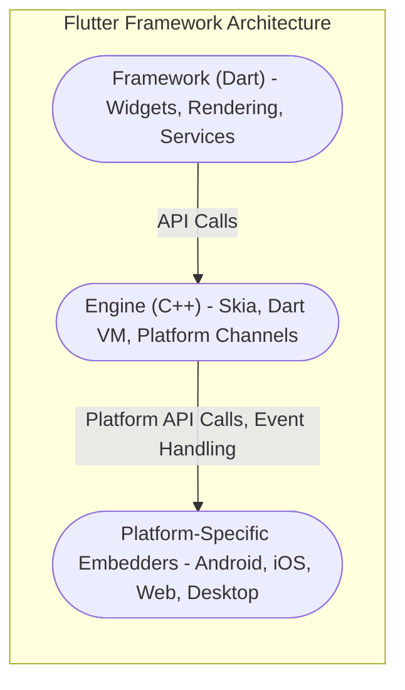
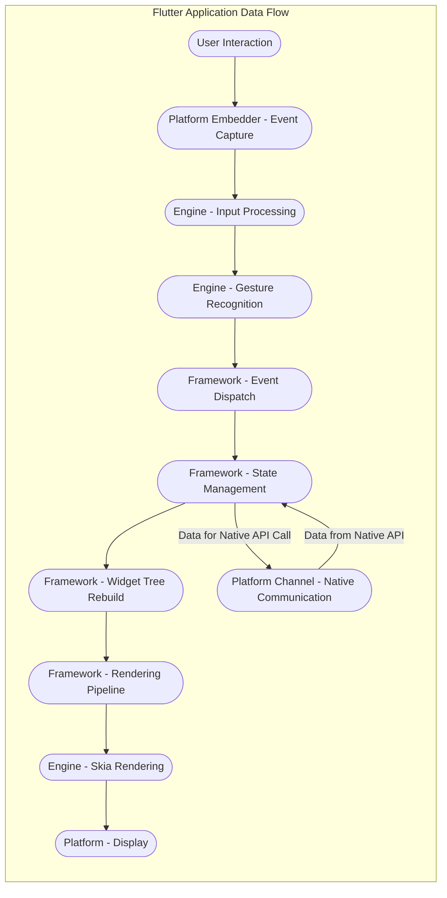

## Project Design Document: Flutter Framework (Improved)

**Version:** 1.1
**Date:** October 26, 2023
**Author:** AI Software Architect

**1. Introduction**

This document provides a detailed architectural overview of the Flutter framework, specifically tailored for threat modeling activities. It aims to clearly articulate the system's components, their interactions, and the flow of data, enabling security professionals to identify potential vulnerabilities and design effective mitigation strategies. This design is based on the publicly available information about the Flutter project hosted at [https://github.com/flutter/flutter](https://github.com/flutter/flutter). The information presented here is intended to facilitate a comprehensive security analysis of the framework itself.

**2. Goals**

* Provide a clear, concise, and security-focused architectural overview of the Flutter framework.
* Identify key components and their responsibilities, highlighting potential security implications.
* Describe the data flow within the framework, pinpointing sensitive data paths and transformation points.
* Serve as a foundational document for subsequent threat modeling exercises, including STRIDE analysis.

**3. Scope**

This document focuses on the core architectural elements of the Flutter framework that are relevant to security. This includes:

* The layered architecture of the Flutter framework (Framework, Engine, Embedder) and the interactions between these layers.
* Key components within each layer, focusing on their functionality and potential security vulnerabilities.
* The lifecycle of a Flutter application from code execution to rendering and interaction with the underlying platform.
* Communication channels and data exchange mechanisms within the framework and with external systems.

This document does *not* cover:

* The specifics of individual widgets or the vast library of packages available for Flutter development.
* A detailed explanation of the Dart programming language syntax and semantics.
* The intricacies of application development best practices using Flutter.
* Low-level implementation details of the Flutter Engine's internal algorithms.

**4. Architectural Overview**

Flutter employs a layered architecture to achieve platform independence and high performance. The core layers are:

* **Framework (Dart):**  This layer provides the high-level API that developers use to build Flutter applications. It's primarily written in Dart and includes widgets, rendering logic, and platform services abstractions.
* **Engine (C++):** The heart of Flutter, responsible for rendering, managing the Dart runtime, and handling platform interactions. It's written in C++ for performance and portability.
* **Platform-Specific Embedders:** These provide the entry point for Flutter applications on different target platforms. They handle platform-specific setup, event loops, and interaction with the operating system.

**5. Key Components**

This section details the key components within each layer, highlighting their responsibilities and potential security considerations.

**5.1. Framework (Dart)**

* **Widgets:**  The building blocks of the UI. Potential security concerns include vulnerabilities in custom widget implementations leading to unexpected behavior or data exposure.
* **Rendering Layer:** Manages the rendering pipeline. Security considerations involve ensuring that rendering logic doesn't introduce vulnerabilities like buffer overflows or information leaks.
* **Animation and Painting:**  Handles animations and custom drawing. Potential risks include resource exhaustion or vulnerabilities in custom painting logic.
* **Gestures:**  Manages user input. Security concerns involve ensuring proper input sanitization and preventing injection attacks through gesture handling.
* **Foundation Library:** Provides core utilities. Security considerations involve ensuring the robustness and security of these fundamental utilities.
* **Material and Cupertino Libraries:** Implement design language specific widgets. Potential risks involve vulnerabilities within these pre-built components.
* **Services Layer:** Provides access to platform services. Security concerns are related to the secure implementation of these service interfaces and proper permission handling.
* **Dart VM:** Executes Dart code. Security considerations include potential vulnerabilities within the VM itself, such as JIT compilation flaws.
* **Package Manager (Pub):** Manages dependencies. A significant security concern is the risk of using packages with known vulnerabilities or malicious code.

**5.2. Engine (C++)**

* **Skia Graphics Engine:** Renders UI elements. Security considerations involve potential vulnerabilities within the Skia library that could lead to rendering issues or even code execution.
* **Dart Runtime:**  The execution environment for Dart code within the Engine. Security concerns include vulnerabilities in the runtime environment that could be exploited.
* **Text Layout:** Handles text rendering. Potential risks include vulnerabilities in text rendering libraries leading to crashes or unexpected behavior.
* **Platform Channels:** The primary communication bridge between Dart and native platform code. This is a critical area for security, as vulnerabilities here could allow malicious Dart code to execute arbitrary native code or access sensitive platform resources.
* **Input Handling:** Processes raw input events. Security considerations involve ensuring proper sanitization and validation of input data to prevent injection attacks.
* **Isolates:** Dart's concurrency model. Security considerations involve ensuring proper isolation between isolates to prevent data leakage or interference.

**5.3. Platform-Specific Embedders**

* **Android Embedder (Java/Kotlin):**  Integrates with the Android OS. Security considerations involve adhering to Android security best practices and protecting against Android-specific vulnerabilities.
* **iOS Embedder (Objective-C/Swift):** Integrates with the iOS. Security considerations involve adhering to iOS security best practices and protecting against iOS-specific vulnerabilities.
* **Web Embedder (JavaScript/HTML/CSS):** Renders Flutter UI in a browser. Security considerations are paramount here, encompassing standard web security practices like preventing XSS, CSRF, and ensuring secure communication.
* **Desktop Embedders (C++/Platform-Specific APIs):** Integrate with desktop operating systems. Security considerations involve adhering to platform-specific security guidelines and protecting against desktop-specific threats.

**6. Data Flow**

Understanding the data flow within a Flutter application is crucial for identifying potential points of vulnerability. The following outlines a typical data flow:

* **User Interaction:** User input (touch, mouse, keyboard) generates events.
* **Platform Event Handling:** The platform-specific embedder captures these raw events.
* **Engine Input Processing:** The Engine receives these events and processes them.
* **Gesture Recognition:** The Engine identifies specific gestures from the input stream.
* **Framework Event Dispatch:**  Gesture events are dispatched within the Dart framework.
* **State Management:** Application state is updated based on the event.
* **Widget Tree Rebuild:** Changes in state trigger a rebuild of the widget tree.
* **Rendering Pipeline:** The framework translates the widget tree into rendering commands.
* **Skia Rendering:** The Engine's Skia component executes these commands to draw the UI.
* **Platform Display:** The rendered output is sent to the platform for display.
* **Platform API Communication:**  The application may need to interact with platform-specific APIs (e.g., network requests, accessing sensors). This communication occurs through Platform Channels, involving serialization and deserialization of data.

**7. External Dependencies**

Flutter relies on various external components and systems, each introducing potential security considerations:

* **Operating System APIs:**
    * **Description:**  Flutter applications interact with OS APIs for core functionalities.
    * **Security Risks:**  Vulnerabilities in OS APIs or improper usage can lead to security breaches.
* **Build Tools (Gradle, Xcode, etc.):**
    * **Description:** Used to compile and package Flutter applications for different platforms.
    * **Security Risks:** Compromised build tools can inject malicious code into the application.
* **Package Repositories (Pub):**
    * **Description:** Hosts third-party packages used in Flutter projects.
    * **Security Risks:**  Malicious or vulnerable packages can be included in the application. Supply chain attacks are a significant concern.
* **Integrated Development Environments (IDEs):**
    * **Description:** Tools used by developers to write Flutter code.
    * **Security Risks:** Vulnerabilities in IDEs or their plugins could expose developer machines or project code.
* **Native Libraries (via Platform Channels or FFI):**
    * **Description:**  Allows Flutter applications to interact with native code.
    * **Security Risks:**  Vulnerabilities in native libraries can be exploited by Flutter code. Insecure communication through platform channels can also be a risk.

**8. Security Considerations (Detailed)**

This section expands on the high-level security considerations, linking them to specific architectural components and data flows:

* **Platform Channel Security:**
    * **Threat:**  Malicious Dart code exploiting vulnerabilities in platform channel implementations to execute arbitrary native code or access sensitive platform resources.
    * **Related Components:** Platform Channels, Dart VM, Platform-Specific Embedders.
    * **Mitigation:** Secure coding practices in platform channel implementations, input validation, proper authorization checks.
* **Dependency Management (Pub):**
    * **Threat:**  Including third-party packages with known vulnerabilities or malicious code.
    * **Related Components:** Package Manager (Pub), Framework.
    * **Mitigation:** Regularly auditing dependencies, using dependency scanning tools, verifying package integrity.
* **Code Injection:**
    * **Threat:**  Improper handling of user input or data from external sources leading to the execution of unintended code (e.g., JavaScript injection in the web embedder).
    * **Related Components:** Widgets, Rendering Layer, Platform-Specific Embedders (Web).
    * **Mitigation:** Input sanitization, output encoding, using secure coding practices.
* **Data Storage:**
    * **Threat:**  Sensitive data stored insecurely on the device or in the cloud.
    * **Related Components:** Services Layer, Platform-Specific Embedders.
    * **Mitigation:** Using secure storage mechanisms provided by the platform, encryption of sensitive data.
* **Network Security:**
    * **Threat:**  Man-in-the-middle attacks, eavesdropping, data breaches during network communication.
    * **Related Components:** Services Layer, Platform Channels.
    * **Mitigation:** Using HTTPS for all network communication, implementing certificate pinning, proper handling of network credentials.
* **Build Process Security:**
    * **Threat:**  Compromised build tools or processes leading to the introduction of malicious code.
    * **Related Components:** Build Tools.
    * **Mitigation:** Secure build pipelines, code signing, regular security audits of the build environment.
* **Web Embedder Security:**
    * **Threats:**  Standard web security vulnerabilities like XSS, CSRF, and clickjacking.
    * **Related Components:** Web Embedder, Rendering Layer.
    * **Mitigation:** Implementing standard web security best practices, using Content Security Policy (CSP), proper handling of user input and output.
* **Dart VM Security:**
    * **Threat:**  Vulnerabilities within the Dart VM itself that could be exploited.
    * **Related Components:** Dart VM, Engine.
    * **Mitigation:** Relying on the security measures implemented by the Dart team, keeping the Flutter SDK updated.
* **Skia Security:**
    * **Threat:**  Vulnerabilities in the Skia rendering engine leading to rendering issues or potential code execution.
    * **Related Components:** Skia Graphics Engine, Engine.
    * **Mitigation:** Relying on the security measures implemented by the Skia team, keeping the Flutter SDK updated.

**9. Deployment Model**

The deployment model significantly influences the threat landscape:

* **Mobile (Android and iOS):**
    * **Security Considerations:** App store security reviews, device security features, secure storage, handling of permissions.
* **Web:**
    * **Security Considerations:** Standard web security practices (XSS, CSRF), browser security features, secure communication.
* **Desktop (Windows, macOS, Linux):**
    * **Security Considerations:** Operating system security features, protection against malware, secure installation and updates.
* **Embedded Systems:**
    * **Security Considerations:** Device hardening, secure boot processes, limited resources, physical security.

**10. Conclusion**

This document provides a comprehensive architectural overview of the Flutter framework, specifically designed to facilitate threat modeling. By understanding the key components, their interactions, and the flow of data, security professionals can effectively identify potential vulnerabilities and develop appropriate mitigation strategies. This document serves as a crucial starting point for a deeper security analysis of the Flutter ecosystem. The identified security considerations should be further explored and analyzed in subsequent threat modeling sessions.