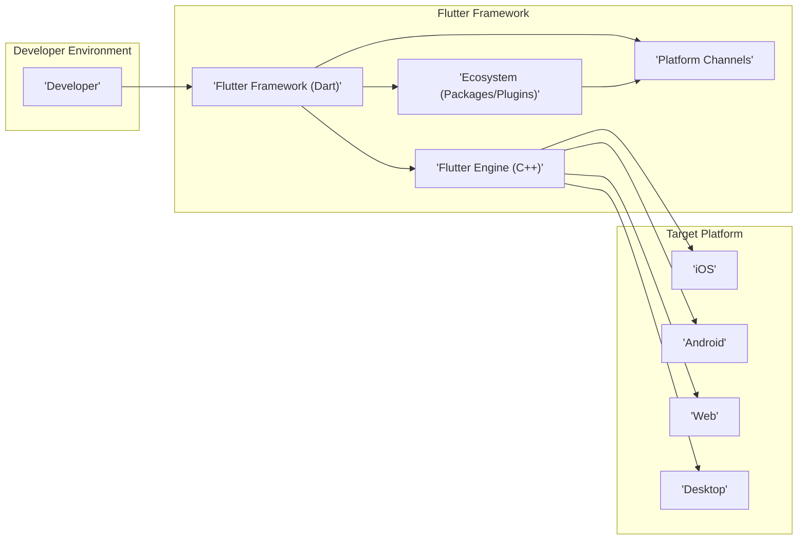
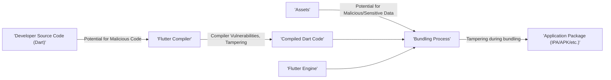
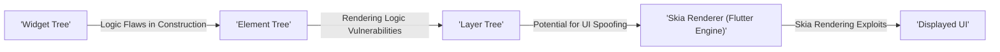
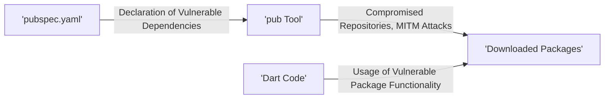

## Project Design Document: Flutter Framework (Improved)

**Document Version:** 1.1
**Date:** October 26, 2023
**Author:** Gemini (AI Language Model)

### 1. Introduction

This document provides an enhanced architectural overview of the Flutter framework, based on the project hosted at [https://github.com/flutter/flutter](https://github.com/flutter/flutter). This improved design document is specifically tailored to facilitate comprehensive threat modeling activities. It details the key components, their interactions, and data flows within the Flutter ecosystem, with a stronger emphasis on security-relevant aspects.

### 2. Goals and Objectives

The primary goal remains to provide a clear and concise description of the Flutter framework's architecture to enable effective threat modeling. The enhanced objectives are to:

* Clearly identify the major components of the Flutter framework and their security responsibilities.
* Describe the interactions between these components, highlighting potential security implications of these interactions.
* Illustrate the key data flows within the system, with a focus on sensitive data and potential points of compromise.
* Explicitly highlight potential threat areas and attack vectors based on the architecture.

### 3. High-Level Architecture

The Flutter framework's architecture can be visualized as a layered system:

* **Developer Environment:** Where developers create and manage Flutter projects.
* **Flutter Framework (Dart):** Provides high-level APIs and the widget system.
* **Flutter Engine (C++):** The core runtime handling graphics, the Dart VM, and platform integration.
* **Platform Channels:** The bridge for communication with native platform code.
* **Ecosystem (Packages/Plugins):**  External code extending Flutter's capabilities.
* **Target Platforms:** The operating systems where Flutter applications run.

### 4. Component Breakdown (Enhanced)

This section provides a more detailed breakdown of the key components, emphasizing their security relevance.

* **Flutter Engine (C++)**:
    * **Purpose:** The foundational layer responsible for core functionalities and platform interactions.
    * **Key Functionalities and Security Relevance:**
        * **Skia Graphics Engine:** Renders the UI. Vulnerabilities in Skia could lead to rendering exploits.
        * **Dart Virtual Machine (VM):** Executes Dart code. Security of the VM is crucial to prevent code execution vulnerabilities.
        * **Text Layout:** Handles text rendering. Complex text rendering can be a source of vulnerabilities.
        * **Platform Integration:** Provides access to underlying platform APIs. Improper access control or insecure API usage can be a risk.
        * **Native Plugin Host:** Facilitates communication with native code. This is a critical trust boundary and a potential injection point.
    * **Location in Repository:** `/engine` directory.

* **Flutter Framework (Dart)**:
    * **Purpose:** Provides the high-level tools and APIs for building Flutter applications.
    * **Key Functionalities and Security Relevance:**
        * **Widget Library:** UI building blocks. While generally safe, custom widgets or improper usage could introduce UI-related vulnerabilities (e.g., information disclosure).
        * **Rendering Layer:** Manages the widget tree. Logic errors in the rendering process could potentially be exploited.
        * **Animation Framework:** Tools for creating animations. Complex animations might have performance implications that could be abused.
        * **Gesture Recognition:** Handles user input. Input validation and sanitization are important here to prevent injection attacks.
        * **State Management:** Mechanisms for managing application state. Improper state management can lead to data leaks or inconsistent application behavior.
    * **Location in Repository:** `/packages/flutter` directory.

* **Developer Tools**:
    * **Purpose:** Aid developers in building and debugging Flutter applications.
    * **Key Functionalities and Security Relevance:**
        * **Flutter CLI:** Command-line interface. Vulnerabilities in the CLI could compromise the development environment.
        * **DevTools:** Debugging and profiling tools. Care should be taken when using DevTools in production environments as it can expose internal application data.
        * **Hot Reload/Restart:** While convenient, the mechanisms behind hot reload should not introduce vulnerabilities in the final application.
    * **Location in Repository:** Various directories, including `/packages/flutter_tools`.

* **Platform Channels**:
    * **Purpose:** Enable communication between Dart and native platform code. This is a significant area for security considerations.
    * **Key Functionalities and Security Relevance:**
        * **Method Channels:** Invoking specific methods on the native side. Input validation and proper authorization on the native side are critical. Data serialization/deserialization must be handled securely to prevent injection attacks.
        * **Event Channels:** Streaming data from native to Flutter. Ensure the integrity and source of the streamed data.
        * **BasicMessageChannels:** Sending asynchronous messages. Similar security concerns as method channels regarding data integrity and validation.
    * **Location in Repository:** Part of the `Flutter Engine` and `Flutter Framework`.

* **Ecosystem (Packages/Plugins)**:
    * **Purpose:** Extend Flutter's functionality. This introduces a supply chain security aspect.
    * **Key Functionalities and Security Relevance:**
        * **Pub Package Manager:** Manages dependencies. Vulnerabilities in dependencies are a significant risk. Ensure proper vetting and security scanning of packages.
        * **Plugin Architecture:** Allows access to platform-specific features. Plugins can introduce vulnerabilities if they have insecure native code or bridge implementations.
    * **Location in Repository:** `/packages` directory and external repositories on `pub.dev`.

* **Target Platforms (iOS, Android, Web, Desktop)**:
    * **Purpose:** The execution environment for Flutter applications. Security depends on the underlying platform's security mechanisms.
    * **Key Functionalities and Security Relevance:**
        * **Operating System APIs:** Flutter relies on these. Vulnerabilities in OS APIs can affect Flutter applications.
        * **Rendering Context:** The surface for rendering. Security of the rendering pipeline is important.
        * **Input Mechanisms:** How user interactions are handled. Platform-level input handling vulnerabilities could impact Flutter apps.

### 5. Data Flow (Enhanced with Security Focus)

This section details key data flows, highlighting potential security vulnerabilities at each stage.

* **Source Code to Application (Security Perspective)**:
    * Developer writes Dart code. **Threat:** Malicious code introduced by a compromised developer account or insecure development practices.
    * Flutter CLI compiles the code. **Threat:** Vulnerabilities in the compiler could lead to the introduction of unintended code or bypass security checks. Tampering with the compiler itself is a risk.
    * Assets are packaged. **Threat:** Inclusion of malicious or sensitive data within the application package.
    * Flutter Engine and compiled code are bundled. **Threat:**  Tampering with the engine or compiled code during the bundling process. Insecure storage of intermediate build artifacts.

* **Widget Rendering (Security Perspective)**:
    * Flutter Framework builds the widget tree. **Threat:** Logic flaws in widget construction could lead to unexpected UI behavior or information disclosure.
    * Rendering layer creates the element tree. **Threat:** Vulnerabilities in the rendering logic could be exploited to cause crashes or display misleading information.
    * Element tree generates the layer tree. **Threat:** Manipulation of the layer tree could lead to UI spoofing.
    * Skia renderer draws the UI. **Threat:** Vulnerabilities in Skia could lead to rendering exploits, potentially allowing code execution.

* **Platform Channel Communication (Security Perspective)**:
    * Dart code invokes a method. **Threat:** Passing unsanitized or malicious data to the native side.
    * Flutter Engine marshals the call. **Threat:** Vulnerabilities in the marshalling process could lead to data corruption or injection.
    * Platform-specific implementation receives the call. **Threat:** Insecure handling of data on the native side, lack of proper authorization checks.
    * Native code executes. **Threat:** Vulnerabilities in the native code itself.
    * Result is marshalled back. **Threat:**  Tampering with the result during marshalling.
    * Dart code receives the result. **Threat:** Improper handling of the received data on the Dart side.

```mermaid
graph LR
    A["'Dart Code'"] -- "Unsanitized Input" --> B["'Platform Channel (Dart Side)'"];
    B -- "Marshalling Vulnerabilities" --> C["'Flutter Engine (Marshalling)'"];
    C --> D["'Platform Channel (Native Side)'"];
    D -- "Insecure Native Handling, Lack of Authorization" --> E["'Native Code'"];
    E --> F["'Platform Channel (Native Side)'"];
    F -- "Tampering during Marshalling" --> G["'Flutter Engine (Marshalling)'"];
    G --> H["'Dart Code'"];
```

* **Package/Plugin Usage (Security Perspective)**:
    * Developer declares dependencies. **Threat:** Including vulnerable or malicious packages.
    * `pub` tool downloads packages. **Threat:**  Compromised package repositories or man-in-the-middle attacks during download.
    * Dart code uses package functionalities. **Threat:**  Vulnerabilities within the imported packages.

### 6. Security Considerations (Detailed)

This section expands on the preliminary security considerations, linking them directly to the architectural components and data flows.

* **Dependency Management:**
    * **Threat:** Use of packages with known vulnerabilities, malicious packages designed to exfiltrate data or compromise the application.
    * **Mitigation:** Regularly audit dependencies using vulnerability scanning tools, enforce code review for package usage, consider using private package repositories.
* **Platform Channel Security:**
    * **Threat:** Injection attacks through manipulated data passed via platform channels, unauthorized access to native functionalities.
    * **Mitigation:** Implement strict input validation and sanitization on both Dart and native sides, use secure serialization/deserialization techniques, enforce proper authorization checks on the native side.
* **Native Code Vulnerabilities:**
    * **Threat:** Security flaws in custom native plugins or platform-specific integrations that can be exploited.
    * **Mitigation:** Conduct thorough security reviews and penetration testing of native code, follow secure coding practices for native development.
* **Code Injection:**
    * **Threat:**  Execution of arbitrary code within the application, potentially through vulnerabilities in string handling, web views, or dynamic code loading.
    * **Mitigation:** Avoid dynamic code execution where possible, sanitize user inputs rigorously, use secure coding practices to prevent common injection vulnerabilities.
* **Data Storage:**
    * **Threat:**  Exposure of sensitive data stored insecurely on the device or in cloud storage accessed by the application.
    * **Mitigation:** Utilize platform-provided secure storage mechanisms, encrypt sensitive data at rest and in transit, follow best practices for key management.
* **Network Communication:**
    * **Threat:**  Man-in-the-middle attacks, eavesdropping on network traffic, insecure APIs.
    * **Mitigation:** Use HTTPS for all network communication, implement certificate pinning, validate server-side certificates, follow secure API design principles.
* **Build Process Integrity:**
    * **Threat:**  Compromise of the build environment, leading to the injection of malicious code into the final application.
    * **Mitigation:** Secure the build environment, implement integrity checks for build artifacts, use code signing to verify the authenticity of the application.
* **Security of Generated Code:**
    * **Threat:** Vulnerabilities introduced during the compilation or code generation process by the Flutter framework itself.
    * **Mitigation:**  Rely on the Flutter team's security practices and regular updates to address potential vulnerabilities in the framework. Stay updated with Flutter releases and security advisories.

### 7. Assumptions and Constraints

* This document focuses on the architectural aspects relevant to security and assumes a basic understanding of software security principles.
* The threat model derived from this document will be specific to the core Flutter framework and its immediate dependencies. Application-specific security considerations are outside the scope of this document.
* The architecture is subject to change, and this document reflects the current understanding of the system.
* We assume developers using the framework follow general secure development practices.

### 8. Future Considerations

* Further analysis of the security implications of specific Dart language features.
* Detailed examination of the security architecture of the Dart Native extensions.
* Assessment of the security implications of different state management solutions commonly used in Flutter.
* Investigation of potential security vulnerabilities related to Flutter's web rendering capabilities.

This improved design document provides a more robust foundation for threat modeling the Flutter framework. By explicitly highlighting security considerations within each component and data flow, it facilitates a deeper understanding of potential attack surfaces and vulnerabilities.