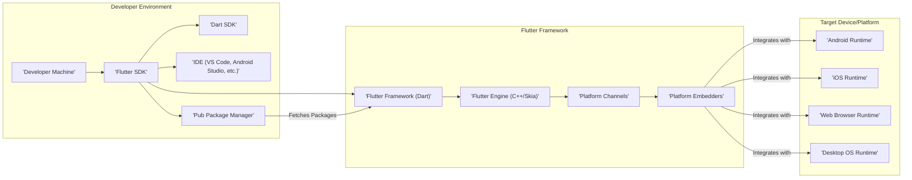
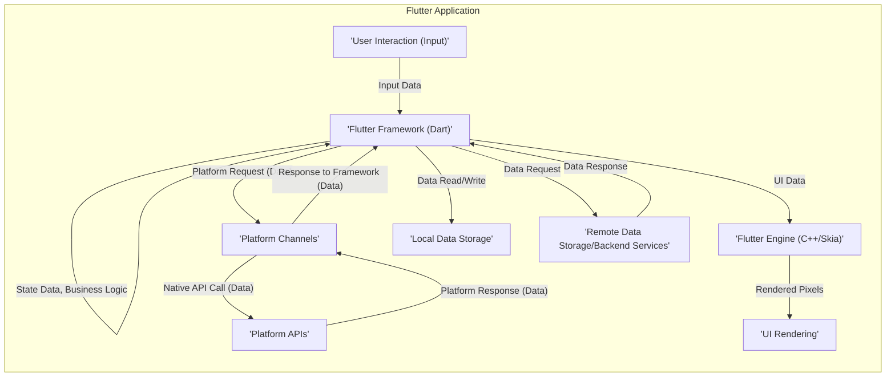

## Project Design Document: Flutter Framework for Threat Modeling

**Project Name:** Flutter Framework

**Project Repository:** https://github.com/flutter/flutter

**Document Version:** 1.1

**Date:** October 26, 2023

**Author:** AI Software Architect

**1. Introduction**

This document provides a detailed architectural overview of the Flutter framework, specifically tailored for threat modeling activities. It aims to clearly delineate the key components, data flows, and external interactions within the Flutter ecosystem to facilitate the identification of potential security vulnerabilities and the design of appropriate mitigation strategies. This document serves as a foundational resource for security assessments and discussions.

**2. System Overview**

Flutter is a comprehensive, open-source UI software development kit engineered by Google. Its primary purpose is to enable the creation of natively compiled applications for mobile (Android and iOS), web, desktop (Linux, macOS, Windows), and embedded devices from a single codebase. The architecture of Flutter is layered, with the core comprising the Flutter Engine, the Flutter Framework, and associated development Tools.

**3. Key Components**

*   **Flutter SDK:**
    *   A collection of command-line tools (Flutter CLI) and libraries essential for building Flutter applications.
    *   Manages the versions of the Flutter Engine and Framework.
    *   Security Relevance:  Potential vulnerabilities in the CLI tools or SDK itself could compromise the development process.
*   **Dart SDK:**
    *   Provides the Dart virtual machine (Dart VM) for just-in-time (JIT) compilation during development and ahead-of-time (AOT) compilation for release builds.
    *   Includes the `dart2js` compiler for web deployments.
    *   Security Relevance: Vulnerabilities in the Dart VM or compilers could lead to code execution issues.
*   **Flutter Framework (Dart):**
    *   A comprehensive set of UI widgets, layout algorithms, and state management solutions implemented in Dart.
    *   Provides the reactive programming model for UI updates.
    *   Security Relevance:  Logic flaws or vulnerabilities in framework widgets could be exploited. Improper use of state management could lead to data leaks.
*   **Flutter Engine (C++/Skia):**
    *   The core runtime environment written in C++, responsible for graphics rendering (using the Skia graphics library), input handling, and the Dart VM's execution.
    *   Provides platform channels for intercommunication with the underlying operating system.
    *   Security Relevance:  Being a native component, vulnerabilities here could have significant impact. Improper handling of platform channel messages could be exploited.
*   **Platform Channels:**
    *   The bidirectional communication bridge between Dart code and native platform code (Java/Kotlin for Android, Objective-C/Swift for iOS, JavaScript for Web, C++ for Desktop).
    *   Used to access platform-specific APIs and functionalities not directly available in Dart.
    *   Security Relevance: This is a critical boundary. Insecure serialization/deserialization, lack of input validation, or improper authorization checks on either side can introduce vulnerabilities.
*   **Platform Embedders:**
    *   Platform-specific code that integrates the Flutter Engine with the host operating system. Examples include the Android embedder, iOS embedder, and web engine.
    *   Handles tasks like window management, event loop integration, and accessibility.
    *   Security Relevance: Vulnerabilities in the embedder could allow attackers to bypass Flutter's security measures and interact directly with the OS.
*   **Pub Package Manager:**
    *   The package manager for the Dart ecosystem, used to manage dependencies for Flutter projects.
    *   Security Relevance:  A significant attack surface. Malicious or vulnerable packages can be introduced into projects, leading to various security issues.
*   **IDE Integration (VS Code, Android Studio, etc.):**
    *   Development environments that provide tools for coding, debugging, and project management.
    *   Often include Flutter-specific extensions and plugins.
    *   Security Relevance: Vulnerabilities in IDE extensions or the IDE itself could compromise the developer's machine and project.
*   **Target Platforms (Android, iOS, Web, Desktop):**
    *   The diverse operating systems and environments where Flutter applications are deployed and executed. Each platform has its own security model and potential vulnerabilities.
    *   Security Relevance: Flutter applications inherit the security posture of the underlying platform. Understanding platform-specific vulnerabilities is crucial.

**4. Data Flow**

The flow of data within a Flutter application can be analyzed across development and runtime phases, with a particular focus on sensitive data.

*   **Development Time Data Flow:**
    *   **Code Creation and Modification:** Developer writes Dart code, potentially including sensitive information (API keys, secrets - *Security Concern: Accidental inclusion of secrets in code*).
    *   **Dependency Management:** Flutter CLI interacts with Pub to download package code (*Security Concern: Risk of malicious or vulnerable packages*).
    *   **Asset Management:** Developers include assets (images, fonts, configuration files) which might contain sensitive data or be targets for manipulation (*Security Concern: Exposure of sensitive data in assets, asset tampering*).
    *   **Compilation and Building:** Dart code is compiled and packaged for the target platform (*Security Concern: Potential for vulnerabilities in the compilation process*).

*   **Runtime Data Flow:**

*   **Detailed Runtime Data Flow with Security Focus:**
    1. **User Interaction:** User provides input, which might include sensitive data (passwords, personal information). *Security Concern: Input validation and sanitization are crucial here.*
    2. **Event Handling and State Management:** The Flutter Framework processes the input, potentially storing it in application state. *Security Concern: Secure storage and handling of sensitive data in state.*
    3. **Platform Channel Communication (Sensitive Data):** If the application needs to access platform features involving sensitive data (e.g., accessing contacts, location), data is passed through platform channels. *Security Concern: Secure serialization, transport, and handling of sensitive data across the Dart/native boundary.*
    4. **Platform API Interaction (Sensitive Data):** Native platform code interacts with OS APIs, potentially handling sensitive user data. *Security Concern: Platform-specific security measures and permissions are critical.*
    5. **Local Data Storage:** Applications might store data locally using mechanisms like `shared_preferences` or SQLite. *Security Concern: Encryption and secure storage practices are essential for sensitive data.*
    6. **Remote Data Storage/Backend Communication:** Applications frequently communicate with backend services, transmitting data over the network. *Security Concern: Secure communication protocols (HTTPS), proper authentication and authorization, and secure API design are vital.*

**5. External Interactions**

Flutter applications interact with a range of external entities, each presenting potential security considerations:

*   **Operating System APIs:** Interaction through platform channels to access device features (camera, GPS, sensors). *Security Concern: Improper permission handling, data leaks through insecure APIs.*
*   **Third-Party Libraries and Packages (via Pub):** Integration of external code for various functionalities. *Security Concern: Vulnerabilities in dependencies, malicious code injection.*
*   **Backend Services (APIs):** Communication with remote servers for data exchange and business logic. *Security Concern: API vulnerabilities, insecure authentication, data breaches during transit.*
*   **Cloud Services (Firebase, AWS, Azure, etc.):** Utilization of cloud platforms for storage, authentication, push notifications, and other services. *Security Concern: Misconfigured cloud resources, insecure access controls, data breaches.*
*   **User Devices:** The execution environment, with its own security configurations and potential vulnerabilities. *Security Concern: Exploitation of device vulnerabilities to compromise the application.*
*   **Developer Environment:** The tools and systems used for development. *Security Concern: Compromised development machines, exposure of credentials or signing keys.*
*   **Build and Deployment Pipelines:** The automated processes for building and distributing the application. *Security Concern: Insecure build processes, compromised signing keys, vulnerabilities in distribution channels.*
*   **Deep Links and App Links:** Mechanisms for navigating to specific content within the app from external sources. *Security Concern: Potential for malicious deep links to trigger unintended actions or access sensitive data.*

**6. Security Considerations (Detailed)**

This section expands on potential security vulnerabilities, categorized for clarity:

*   **Dependency Management Vulnerabilities:**
    *   **Known Vulnerabilities:** Using packages with publicly disclosed security flaws.
    *   **Malicious Packages:** Introduction of packages containing malware or backdoors.
    *   **Supply Chain Attacks:** Compromise of package repositories or developer accounts.
    *   **Outdated Dependencies:** Using older versions of packages with known vulnerabilities that have been patched in newer releases.
*   **Platform Channel Security Risks:**
    *   **Insecure Data Serialization:** Using insecure methods to serialize data passed between Dart and native code, potentially leading to information disclosure or code execution.
    *   **Lack of Input Validation:** Failure to validate data received from the native side, potentially leading to injection vulnerabilities in Dart code.
    *   **Improper Authorization:** Lack of proper checks on the native side before performing actions requested by the Dart code, leading to privilege escalation.
    *   **Information Disclosure:** Exposing sensitive information through platform channel communication.
*   **Local Data Storage Vulnerabilities:**
    *   **Unencrypted Storage:** Storing sensitive data in plain text, making it easily accessible if the device is compromised.
    *   **Insecure File Permissions:** Setting overly permissive file permissions, allowing other applications to access sensitive data.
    *   **Data Leaks through Backup:** Sensitive data being backed up to insecure locations.
*   **Network Communication Vulnerabilities:**
    *   **Man-in-the-Middle (MITM) Attacks:** Lack of HTTPS, allowing attackers to intercept and modify network traffic.
    *   **Insecure API Key Management:** Hardcoding API keys or storing them insecurely.
    *   **Backend API Vulnerabilities:** Exploiting vulnerabilities in the backend services the app communicates with.
    *   **Data Breaches in Transit:** Sensitive data being transmitted without encryption.
*   **Authentication and Authorization Flaws:**
    *   **Weak Authentication Mechanisms:** Using easily guessable passwords or insecure authentication protocols.
    *   **Insecure Credential Storage:** Storing passwords or tokens locally without proper encryption.
    *   **Insufficient Authorization Checks:** Allowing users to access resources or perform actions they are not authorized for.
    *   **Session Management Issues:** Vulnerabilities in how user sessions are managed, potentially leading to session hijacking.
*   **Input Validation Issues:**
    *   **Injection Attacks:** Lack of proper input sanitization, leading to SQL injection (if using local databases), command injection, or cross-site scripting (for Flutter Web).
    *   **Buffer Overflows (Less Common in Dart):** While less common due to Dart's memory management, potential vulnerabilities in native code accessed through platform channels.
    *   **Denial of Service (DoS):** Malicious input designed to crash the application.
*   **Code Security Vulnerabilities:**
    *   **Logic Flaws:** Errors in the application's logic that can be exploited.
    *   **Exposure of Sensitive Information:** Accidentally including API keys, secrets, or other sensitive data in the application code.
    *   **Reverse Engineering Risks:** Attackers decompiling the application to understand its logic and find vulnerabilities.
*   **Build and Deployment Pipeline Risks:**
    *   **Compromised Build Servers:** Attackers gaining access to build systems and injecting malicious code.
    *   **Exposure of Signing Keys:** Unauthorized access to signing keys, allowing attackers to sign malicious updates.
    *   **Insecure Distribution Channels:** Distributing the application through unofficial or compromised app stores.
*   **Permissions and Privacy Concerns:**
    *   **Over-Permissioning:** Requesting more permissions than necessary, increasing the attack surface.
    *   **Data Privacy Violations:** Improper handling of user data, violating privacy regulations.
    *   **Lack of Transparency:** Not clearly communicating data usage to users.
*   **Web-Specific Vulnerabilities (Flutter Web):**
    *   **Cross-Site Scripting (XSS):** Allowing attackers to inject malicious scripts into web pages viewed by other users.
    *   **Cross-Site Request Forgery (CSRF):** Enabling attackers to perform actions on behalf of authenticated users without their knowledge.
    *   **Insecure Content Security Policy (CSP):** A misconfigured CSP can allow malicious scripts to execute.

**7. Assumptions and Limitations**

*   This document provides a generalized architectural overview of the Flutter framework. Specific implementations and customizations in individual Flutter applications may introduce additional security considerations.
*   The security considerations outlined are not exhaustive and should be used as a starting point for a more in-depth threat modeling exercise.
*   The document assumes a basic understanding of software security principles and common attack vectors.
*   The focus is primarily on the security of the Flutter framework itself and its immediate interactions with the underlying platforms and external services. Security aspects of the underlying operating systems or third-party services are not covered in detail.
*   The document reflects the current understanding of the Flutter architecture and may need updates as the framework evolves.

**8. Future Considerations**

*   Detailed threat modeling diagrams using methodologies like STRIDE or PASTA.
*   Analysis of specific security features and best practices within the Flutter framework (e.g., secure coding guidelines, data protection APIs).
*   Integration with security testing methodologies and tools.
*   Regular review and updates to this document to reflect changes in the Flutter framework and emerging security threats.
*   Development of specific threat models for common Flutter application patterns and use cases.