# Project Design Document: Flutter Framework for Threat Modeling - Improved Version

**Project Name:** Flutter Framework

**Project Repository:** [https://github.com/flutter/flutter](https://github.com/flutter/flutter)

**Document Version:** 1.1
**Date:** October 26, 2023
**Author:** Gemini (AI Expert in Software, Cloud and Cybersecurity Architecture)

## 1. Introduction

This document provides an enhanced high-level design overview of the Flutter framework, specifically tailored for security threat modeling. Building upon version 1.0, this iteration offers more granular detail and explicitly highlights security considerations within each architectural layer and component. The goal remains to provide a robust foundation for threat modeling activities, enabling security professionals to proactively identify and mitigate potential vulnerabilities in Flutter applications and the framework itself. This document emphasizes data flows, component interactions, and potential attack surfaces, focusing on aspects critical for a comprehensive security analysis.

## 2. Project Overview

Flutter, an open-source UI toolkit by Google, facilitates cross-platform application development from a single codebase. Its key features, while enabling rapid development and broad reach, introduce unique security challenges that must be addressed.

**Key Features and Security Implications:**

*   **Cross-platform Development:**  While efficient, it necessitates managing diverse platform security models and potential inconsistencies in security implementations across platforms. *Security Implication: Increased complexity in ensuring consistent security posture across all target platforms.*
*   **Native Compilation:** Compilation to native code (ARM, Intel, JavaScript) offers performance benefits but inherits platform-specific vulnerabilities and exposes applications to native code exploitation techniques. *Security Implication: Potential for native code vulnerabilities like buffer overflows, memory corruption, and platform-specific exploits.*
*   **Rich Widget Library & Custom Widgets:** The extensive widget library simplifies UI creation, but custom widgets or complex widget compositions can introduce vulnerabilities if not designed with security in mind (e.g., improper input handling within custom widgets). *Security Implication: Risk of UI-related vulnerabilities, especially in custom widget implementations and complex UI interactions.*
*   **Plugin Ecosystem:**  Plugins extend Flutter's capabilities, but introduce third-party code dependencies, increasing the attack surface and potential for supply chain vulnerabilities. *Security Implication: Dependency on external code with varying security quality, potential for malicious plugins, and supply chain risks.*
*   **Open Source Nature:** Transparency aids in community-driven security audits and vulnerability discovery, but also provides attackers with detailed codebase knowledge for vulnerability research and exploitation. *Security Implication: Publicly available codebase can be studied by attackers to identify vulnerabilities, requiring proactive security measures and rapid patching.*

## 3. Architectural Overview - Security Focused

Flutter's layered architecture, while promoting modularity, also creates distinct security boundaries and communication pathways that need careful examination.

```mermaid
graph LR
    subgraph "Flutter Application Layer - Dart Code (Highest Level)"
        A["'Flutter App (Dart Code)'\n(Business Logic, UI, Data Handling)"]
    end
    subgraph "Flutter Framework Layer - Dart (Core Functionality)"
        B["'Framework (Widgets, Rendering, Gestures, Platform Channels - Dart Side)'\n(UI Framework, Core Logic, Communication Interface)"]
    end
    subgraph "Flutter Engine Layer - C++/Dart/Skia (Core Engine)"
        C["'Engine (Skia Graphics, Platform Channels - Native Side, Dart VM)'\n(Rendering Engine, Platform Bridge, Execution Environment)"]
    end
    subgraph "Platform Embedder Layer - Platform Specific (OS Interface)"
        D["'Platform Embedder (iOS, Android, Web, Desktop)'\n(OS Integration, Input/Output, Platform API Access)"]
    end
    subgraph "Operating System / Hardware Layer (Lowest Level)"
        E["'Operating System (iOS, Android, Web Browser, Desktop OS)'\n(System Security, Kernel, OS Services)"]
        F["'Hardware (Device, Browser Environment)'\n(Hardware Security Features, Execution Environment)"]
    end

    A --> B
    B --> C
    C --> D
    D --> E
    E --> F

    style A fill:#f9f,stroke:#333,stroke-width:2px, title:#f9f
    style B fill:#ccf,stroke:#333,stroke-width:2px, title:#ccf
    style C fill:#aaf,stroke:#333,stroke-width:2px, title:#aaf
    style D fill:#cff,stroke:#333,stroke-width:2px, title:#cff
    style E fill:#eee,stroke:#333,stroke-width:2px, title:#eee
    style F fill:#eee,stroke:#333,stroke-width:2px, title:#eee
```



**Layered Security Considerations:**

*   **Flutter Application Layer:**  Primary focus for application-level vulnerabilities:
    *   **Insecure Data Handling:**  Vulnerable data storage, transmission, and processing within the application logic.
    *   **Business Logic Flaws:**  Vulnerabilities in the application's core logic leading to unauthorized access or actions.
    *   **UI/UX Security Issues:**  Clickjacking, UI redressing, and other UI-related attacks.
*   **Flutter Framework Layer:** Security of core framework components:
    *   **Framework Logic Vulnerabilities:** Bugs in widget rendering, gesture handling, or other framework functionalities.
    *   **Input Validation within Framework:**  Improper sanitization of user input processed by the framework.
    *   **Platform Channel Security (Dart Side):** Vulnerabilities in the Dart-side implementation of platform channels, potentially leading to insecure communication with native code.
*   **Flutter Engine Layer:** Critical for overall security due to native code and core functionalities:
    *   **Dart VM Vulnerabilities:**  Exploits targeting the Dart Virtual Machine, potentially leading to code execution or denial of service.
    *   **Skia Graphics Engine Vulnerabilities:**  Bugs in the Skia rendering engine, potentially exploitable through crafted graphics or rendering commands.
    *   **Platform Channel Security (Native Side):** Vulnerabilities in the native-side implementation of platform channels, potentially allowing unauthorized access to platform APIs or data.
    *   **Memory Safety Issues (C++ Engine):** Buffer overflows, memory corruption, and other memory-related vulnerabilities in the C++ engine code.
*   **Platform Embedder Layer:** Platform-specific security considerations:
    *   **Platform API Security:**  Vulnerabilities arising from the use of platform-specific APIs, especially if not handled securely by the embedder.
    *   **Input Handling Security (Platform Side):**  Improper handling of OS input events by the embedder, potentially leading to injection attacks or denial of service.
    *   **Inter-Process Communication (IPC) Security:**  If the embedder uses IPC for communication, vulnerabilities in IPC mechanisms could be exploited.
*   **Operating System / Hardware Layer:** Inherited platform security posture:
    *   **OS Vulnerabilities:**  Underlying OS vulnerabilities directly impact Flutter applications.
    *   **Hardware Security Features:**  Leveraging hardware security features (e.g., secure enclave, hardware-backed keystore) is crucial for robust security.
    *   **Execution Environment Security:**  Security of the environment in which the application runs (e.g., browser sandbox, mobile OS security model).

## 4. Key Components and Data Flow - Security Perspective

### 4.1. Security-Focused Data Flow Diagram

This diagram highlights data flow paths that are particularly relevant for security analysis, emphasizing user input, data persistence, and platform interactions.

```mermaid
graph LR
    subgraph "Flutter Application"
        UA["'User Input (Gestures, Text, Sensitive Data)'\n(Potential Injection Vector)"]
        AL["'App Logic (Dart)'\n(Data Processing, Business Rules)"]
        AD["'App Data (State, Local Storage, Network Data, Credentials)'\n(Sensitive Data Storage, Transmission)"]
    end
    subgraph "Flutter Framework"
        WH["'Widget Hierarchy (Dart)'\n(UI Structure, Input Handling)"]
        RH["'Render Tree (Dart)'\n(Rendering Instructions)"]
        PC_Dart["'Platform Channels (Dart)'\n(Communication Bridge - Dart Side)']
    end
    subgraph "Flutter Engine"
        RE["'Renderer (Skia)'\n(Graphics Rendering, Potential Rendering Bugs)"]
        PC_Native["'Platform Channels (Native)'\n(Communication Bridge - Native Side, Platform API Access)']
        DV["'Dart VM'\n(Code Execution Environment, VM Security)']
    end
    subgraph "Platform Embedder"
        PA["'Platform APIs (iOS, Android, Web, Desktop)'\n(OS Features, Security Context)']
        OS_Input["'OS Input Events'\n(Raw Input from OS)"]
        OS_Display["'OS Display Surface'\n(UI Output)']
        LS["'Local Storage (Platform Specific)'\n(Data Persistence, Storage Security)']
        NC["'Network Communication (Platform APIs)'\n(Data Transmission, Network Security)']
    end

    UA --> AL --> AD
    AL --> WH --> RH --> RE
    RH --> PC_Dart
    PC_Dart --> PC_Native
    PC_Native --> PA
    PA --> OS_Display
    OS_Input --> D --> PC_Native --> PC_Dart --> WH --> AL
    AD --> LS
    AD --> NC

    style UA fill:#f9f,stroke:#333,stroke-width:1px, title:#f9f
    style AL fill:#f9f,stroke:#333,stroke-width:1px, title:#f9f
    style AD fill:#f9f,stroke:#333,stroke-width:1px, title:#f9f
    style WH fill:#ccf,stroke:#333,stroke-width:1px, title:#ccf
    style RH fill:#ccf,stroke:#333,stroke-width:1px, title:#ccf
    style PC_Dart fill:#ccf,stroke:#333,stroke-width:1px, title:#ccf
    style RE fill:#aaf,stroke:#333,stroke-width:1px, title:#aaf
    style PC_Native fill:#aaf,stroke:#333,stroke-width:1px, title:#aaf
    style DV fill:#aaf,stroke:#333,stroke-width:1px, title:#aaf
    style PA fill:#cff,stroke:#333,stroke-width:1px, title:#cff
    style OS_Input fill:#cff,stroke:#333,stroke-width:1px, title:#cff
    style OS_Display fill:#cff,stroke:#333,stroke-width:1px, title:#cff
    style LS fill:#cff,stroke:#333,stroke-width:1px, title:#cff
    style NC fill:#cff,stroke:#333,stroke-width:1px, title:#cff

    linkStyle 0,1,2,3,4,5,6,7,8,9,10,11,12,13,14 stroke:#333,stroke-width:1px;
```

**Security Data Flow Highlights:**

*   **User Input as Attack Vector:** User input (UA) is a primary entry point for attacks. Input validation and sanitization are crucial at the Application Layer (AL) and potentially within the Framework (WH).
*   **Sensitive Data Handling:** App Data (AD) often contains sensitive information. Secure storage (LS), secure network communication (NC), and proper data processing within App Logic (AL) are vital.
*   **Platform Channel as Security Boundary:** Platform Channels (PC\_Dart, PC\_Native) represent a critical communication bridge and a potential security boundary. Secure communication protocols and authorization mechanisms are necessary.
*   **Platform API Access:** Platform APIs (PA) provide access to OS functionalities but can also introduce security risks if misused or if the APIs themselves have vulnerabilities.
*   **Rendering Engine Security:** The Renderer (RE) processes rendering instructions. Vulnerabilities in the rendering engine could be exploited through crafted content.

### 4.2. Component-Specific Security Deep Dive

*   **Dart VM:**
    *   **Threats:** VM exploits (code execution, DoS), JIT vulnerabilities, memory safety issues.
    *   **Mitigations:** Regular security updates, sandboxing (where applicable), memory safety checks, exploit mitigation techniques in the VM.
*   **Skia Graphics Engine:**
    *   **Threats:** Rendering vulnerabilities (crashes, unexpected behavior), image processing vulnerabilities (exploits through crafted images).
    *   **Mitigations:** Regular security updates, input validation for rendering commands and image data, fuzzing and security testing of Skia.
*   **Platform Channels:**
    *   **Threats:** Serialization/Deserialization vulnerabilities (code execution, data corruption), message injection/tampering, privilege escalation through insecure API access.
    *   **Mitigations:** Secure serialization protocols, message authentication and integrity checks, principle of least privilege for platform channel APIs, input validation and sanitization for data exchanged over channels.
*   **Plugins:**
    *   **Threats:** Third-party code vulnerabilities, dependency vulnerabilities, malicious plugins, supply chain attacks.
    *   **Mitigations:** Plugin vetting process, dependency scanning and vulnerability analysis, secure plugin update mechanisms, code signing for plugins, developer education on plugin security best practices.
*   **Build Process and Tooling:**
    *   **Threats:** Supply chain attacks (compromised tools, dependencies), insecure build configurations, insecure code signing and distribution.
    *   **Mitigations:** Secure build environments, dependency integrity checks, code signing and verification, secure distribution channels, regular security audits of build tools and processes.
*   **Local Storage (Platform Specific):**
    *   **Threats:** Insecure data storage, data leaks, unauthorized access to local data.
    *   **Mitigations:** Secure storage mechanisms provided by the platform (e.g., encrypted storage), proper access control to local storage, developer guidance on secure local data storage practices.
*   **Network Communication (Platform APIs):**
    *   **Threats:** Man-in-the-middle attacks, eavesdropping, data breaches, insecure network protocols.
    *   **Mitigations:** Use of secure network protocols (HTTPS, TLS), certificate pinning, proper handling of network credentials, developer guidance on secure network communication practices.

## 5. Technology Stack - Security Relevant Details

*   **Programming Languages:** Dart (Framework, Application - *Memory safety considerations within Dart code*), C++ (Engine, Skia - *Memory safety critical, potential for native vulnerabilities*), Platform-specific languages (Objective-C/Swift, Java/Kotlin, JavaScript - *Platform-specific security models and vulnerabilities*).
*   **Graphics Library:** Skia Graphics Library (C++ - *Security of C++ codebase and image processing libraries*).
*   **Virtual Machine:** Dart VM (C++ - *Security of VM execution environment, JIT security*).
*   **Build System:** `flutter` CLI tool (*Security of the CLI tool and its dependencies*), Gradle (Android - *Gradle plugin security, dependency management security*), Xcode Build System (iOS - *Xcode project security, code signing security*), Webpack (Web - *Webpack plugin security, build configuration security*).
*   **Package Management:** `pub` (Dart package manager - *Security of package repository, dependency resolution security*).
*   **Platform SDKs:** iOS SDK, Android SDK, Web APIs, Desktop platform SDKs (*Security of platform APIs, potential for API misuse*).

## 6. Security Considerations and Potential Threat Areas - Prioritized

This section prioritizes threat areas based on potential impact and likelihood:

1.  **Platform Channel Security:** *High Priority*. Critical communication bridge, vulnerabilities here can have wide-ranging impact.
2.  **Plugin Ecosystem Security:** *High Priority*. Third-party code introduces significant risk, especially supply chain vulnerabilities.
3.  **Dart VM Security:** *High Priority*. Core execution environment, VM vulnerabilities are severe.
4.  **Skia Security:** *Medium-High Priority*. Rendering engine vulnerabilities can lead to crashes and potentially more.
5.  **Application-Level Security (Data Handling, Business Logic):** *High Priority*. Application-specific vulnerabilities are the most common attack vector.
6.  **Build Pipeline Security:** *Medium Priority*. Supply chain attacks are a growing threat.
7.  **Web Platform Security (for Flutter Web):** *Medium-High Priority*. Web-specific threats require dedicated attention for web deployments.
8.  **Local Storage Security:** *Medium Priority*. Secure storage of sensitive data is crucial.
9.  **Network Communication Security:** *Medium Priority*. Secure data transmission is essential.
10. **Desktop Platform Security (for Flutter Desktop):** *Medium Priority*. Desktop-specific security considerations need to be addressed for desktop applications.
11. **Memory Safety (C++/Skia/Engine):** *Medium Priority*. Memory safety issues can lead to serious vulnerabilities.
12. **Dependency Management (Dart & Native):** *Medium Priority*. Vulnerable dependencies are a common source of vulnerabilities.

## 7. Threat Modeling Focus Areas - Actionable Steps

For effective threat modeling, focus on these actionable steps:

1.  **Platform Channel API Review:**  *Action:* Conduct a detailed security review of all platform channel APIs, focusing on input validation, authorization, and data serialization/deserialization. Use techniques like API fuzzing and code review.
2.  **Plugin Security Assessment Framework:** *Action:* Develop a framework for assessing plugin security, including automated vulnerability scanning, dependency analysis, and code review guidelines for plugin submissions.
3.  **Dart VM Security Hardening:** *Action:* Investigate and implement security hardening measures for the Dart VM execution environment within Flutter applications. Explore sandboxing options and exploit mitigation techniques.
4.  **Skia Rendering Pipeline Fuzzing:** *Action:* Implement continuous fuzzing of the Skia rendering pipeline with various input types (images, rendering commands) to identify potential rendering vulnerabilities.
5.  **Secure Data Handling Guidelines for Developers:** *Action:* Create comprehensive guidelines and best practices for Flutter developers on secure data handling, including secure storage, secure network communication, and input validation techniques. Provide code examples and security checklists.
6.  **Build Pipeline Security Audit:** *Action:* Conduct a thorough security audit of the Flutter build pipeline, including tools, dependencies, and code signing processes. Implement measures to prevent supply chain attacks and ensure build integrity.
7.  **Web Security Best Practices for Flutter Web:** *Action:* Develop and promote web security best practices specifically for Flutter Web applications, addressing XSS, CSRF, CSP, and other web-specific threats. Provide guidance on secure web development with Flutter.
8.  **Automated Dependency Vulnerability Scanning:** *Action:* Integrate automated dependency vulnerability scanning into the Flutter development and build process for both Dart packages and native dependencies.
9.  **Security Training for Flutter Developers:** *Action:* Provide security training and awareness programs for Flutter developers, covering common vulnerabilities, secure coding practices, and threat modeling principles.

## 8. Conclusion

This improved design document provides a more detailed and security-focused architectural overview of the Flutter framework. By emphasizing security implications within each layer and component, and by outlining actionable threat modeling focus areas, this document aims to be a more effective resource for security professionals. Continuous updates and refinements are crucial as the Flutter framework evolves and new security challenges emerge. This document serves as a starting point for a proactive and ongoing security effort for the Flutter ecosystem.